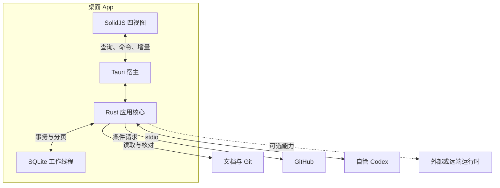
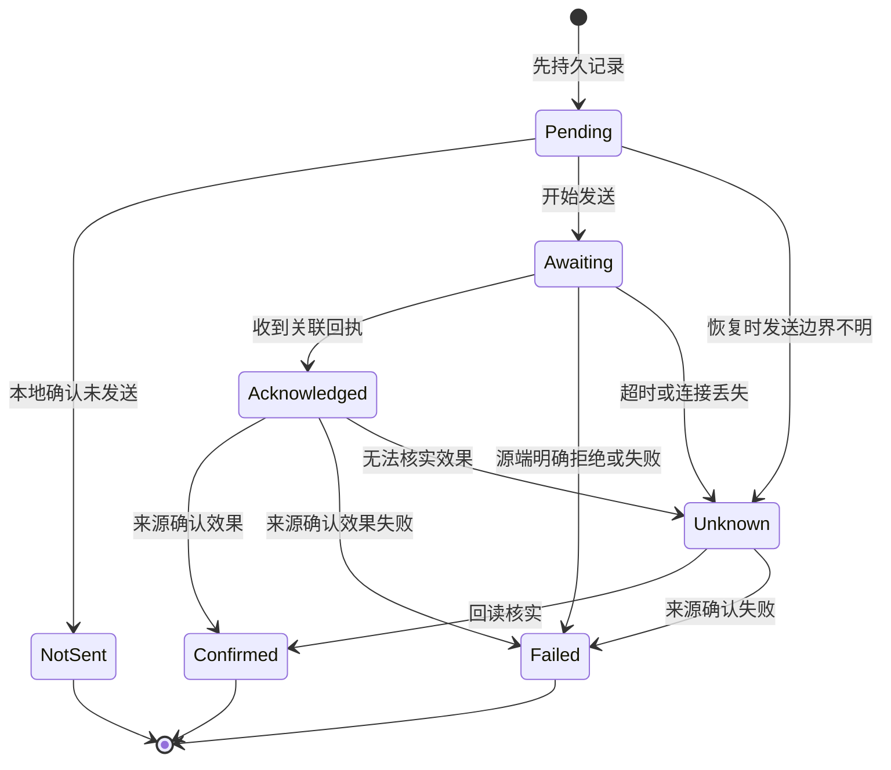

# 指挥客户端系统设计

- 文档 ID：`DESIGN-ENGINEERING-COMMAND-CENTER`
- 状态：`draft`；目标架构，尚未实现或完成运行验收
- owner_role：`runtime_engineer`；产品归 `producer_system_designer`，Codex 接入归 `agent_engineer`
- module：`engineering`
- 上游：[指挥客户端产品设计](command-center.prd.md)、[PRD-ENGINEERING-034](../prd.md#PRD-ENGINEERING-034)
- 设计基线：`main@7039bc376882ab8f84f88ca014f6d7ce642539a8`；既有方案 `56a33562436ffa4b65a66d05e61f26a849b16728`
- last_reviewed_at：2026-10-10
- 文档交付与评审入口：[PR #4518](https://github.com/eng-cc/oasis7/pull/4518)

本文把客户端形态、Rust 技术调研和架构方案收敛为一份系统设计。产品行为和验收由配对 PRD 主责；本文定义如何承接，不把目标状态写成已交付事实。通用授权、开发、验证和交付仍由 [workflow/source-of-truth](../workflow/source-of-truth.md) 主责，客户端内部状态不增加上游任务准入或审批门禁。

## 1. 问题、目标与非目标

客户端需要把分散的项目目标、规范理由、Git/PR/CI 和 Codex 开发现场放到同一可追溯上下文，解决负责人难以判断方向、回忆决定和管理并行执行的问题。系统最重要的性质是来源与操作正确性：部分读取不能变成“没有工作”，会话结束不能变成“目标完成”，重连不能重复发出模型输入。

采用 **Tauri 2 + 独立 Rust 核心 + SolidJS / TypeScript strict / Vite + SQLite**。Rust 拥有领域、来源、持久化、索引、操作与运行时；TypeScript 负责呈现、输入和界面状态。生产形态为 macOS App，静态界面随包发布，Core 驻留 App；不需要用户在终端启动看板服务。[Tauri 进程模型](https://v2.tauri.app/concept/process-model/)支持这种系统 WebView 与 Rust Core 分工。

首版保留本地使用、可选 GitHub、支持版本的 Codex 与未来远端边界。完整 IDE、游戏 Viewer、游戏内 Agent 调度、公共网站、多租户平台、全机任务接管和无人值守执行宿主均不属于当前产品承诺。性能、系统版本范围和真实协议兼容性须由后续实现证据确认。

## 2. 上游约束与相关角色

产品负责人维护用户承诺及范围；系统实现维护领域、存储和生命周期；接入实现维护 GitHub/Codex 的版本与能力；验证工作覆盖对应条款的真实环境与故障情形。角色描述用于定位专业责任，不新建强制串行交接。

已有仓库与外部来源保持事实所有权。工程工具沿 engineering 专业域组织，产品四域、现行规范主责、Issue 可选和实际 PR/CI 交付方式不变。

### 2.1 需求承接与分配表

| 上游条款 | 独立义务与适用条件 | 本设计条款 | 外部 owner / dependency | 明确排除或未覆盖 |
| --- | --- | --- | --- | --- |
| [REQ-CC-001](command-center.prd.md#REQ-CC-001) | App 独立启动，打开正确项目和工作树，恢复个人上下文 | [DES-CC-001](#DES-CC-001) | runtime_engineer；Tauri / 系统 Git | 不以游戏栈或终端后端为前提 |
| [REQ-CC-002](command-center.prd.md#REQ-CC-002) | 来源、版本、覆盖与失败分别保留；局部可用 | [DES-CC-002](#DES-CC-002) | 各 adapter；上游查询能力 | 不推定完整全局快照 |
| [REQ-CC-003](command-center.prd.md#REQ-CC-003) | 当前与长期目标关联到适用验收，进度有可核实分母 | [DES-CC-003](#DES-CC-003) | producer_system_designer；core PRD / 交付事实 | 不按提交数或活动量计算完成率 |
| [REQ-CC-004](command-center.prd.md#REQ-CC-004) | 规范效力、历史理由、个人决定与正式回写可区分 | [DES-CC-004](#DES-CC-004) | 文档主责；显式替代与源版本 | 不另建通用决策登记系统 |
| [REQ-CC-005](command-center.prd.md#REQ-CC-005) | 工作目的、PR/CI、持久会话与运行实例分别关联 | [DES-CC-005](#DES-CC-005) | agent_engineer；GitHub / Codex | 不将新连接当全机控制权 |
| [REQ-CC-006](command-center.prd.md#REQ-CC-006) | 聚合真实问题，运行时请求使用原始身份 | [DES-CC-006](#DES-CC-006) | 真实请求方；已有授权 | 不将普通实现转为待批准 |
| [REQ-CC-007](command-center.prd.md#REQ-CC-007) | 动作受实际能力、环境和目标约束，回执说明结果 | [DES-CC-007](#DES-CC-007) | agent_engineer；支持版本协议 | 读取历史不赋予控制能力 |
| [REQ-CC-008](command-center.prd.md#REQ-CC-008) | 不确定副作用持久保留，恢复不自动重发 | [DES-CC-008](#DES-CC-008) | runtime_engineer；源端可核实事实 | 不承诺上游幂等或完整事件重放 |
| [REQ-CC-009](command-center.prd.md#REQ-CC-009) | 关窗留后台，完整退出明确处理自管活跃或未知工作 | [DES-CC-009](#DES-CC-009) | runtime_engineer；进程所有权 | 不保证崩溃、强退、重启后继续 |
| [REQ-CC-010](command-center.prd.md#REQ-CC-010) | 中文短查询、IME、键盘、读屏和有界长列表可用 | [DES-CC-010](#DES-CC-010) | UI 实现 / qa_engineer；真实 macOS | 浏览器模拟不证明系统体验 |
| [REQ-CC-011](command-center.prd.md#REQ-CC-011) | 缓存重建保留个人与未决数据，凭据和展示内容有边界 | [DES-CC-011](#DES-CC-011) | runtime_engineer；SQLite / Keychain | 不默认记录或上传完整会话 |
| [REQ-CC-012](command-center.prd.md#REQ-CC-012) | 本地先行、连接独立降级，扩展按明确需求进行 | [DES-CC-012](#DES-CC-012) | 产品负责人；环境和协议能力 | 不预建第二 UI 或中心平台 |

## 3. 当前状态、目标状态与差距

| 领域 | 当前已核实状态 | 目标状态与差距 |
| --- | --- | --- |
| 方案与使用入口 | 仓库已有指挥看板 Skill；本 PR 收敛设计正文 | 尚无本方案的桌面程序、数据库或接口实现 |
| 工具链 | 基线 [rust-toolchain.toml](https://github.com/eng-cc/oasis7/blob/7039bc376882ab8f84f88ca014f6d7ce642539a8/rust-toolchain.toml) 为 Rust 1.96.0 | 应用对齐现有工具链，锁定真实验证的依赖组合 |
| 前端经验 | 基线 [Viewer package](https://github.com/eng-cc/oasis7/blob/7039bc376882ab8f84f88ca014f6d7ce642539a8/crates/oasis7_viewer/package.json) 已声明 Solid、Vite、Vitest | 复用开发经验，建立独立应用入口与状态 |
| 项目事实 | 目标与规范在文档；交付在 Git/PR/CI；运行状态在具体会话来源 | 需要来源适配、关联和不确定性投影，不能从一处推导全部状态 |
| 桌面与协议 | 本次已完成一手资料调研 | 未完成依赖切片、真实 macOS 体验、Codex 版本契约或性能测量 |

此处当前状态固定到设计基线。运行时应读取实际选定来源，不永久冻结为这次调研的阶段、包版本或工作列表。

## 4. 边界与结构

### 4.1 App、核心与外部来源

Tauri 宿主负责窗口、菜单栏、来源选择、系统通知、IPC 转接和退出协调。Rust 核心中的 `application` 编排打开项目、四视图查询和明确操作；`domain` 维护模型与关联；`adapters` 解码来源；`store` 管理三类本地数据；`runtime` 持有连接和自管子进程。领域不依赖 Tauri 类型、SQL 行或 Solid store，先用一个核心 crate 的模块边界。

项目通过登记 ID、可取得的 repository ID、环境、规范化工作树及 Git 公共目录识别；分支是属性，不是身份。首次选择验证真实仓库，路径失效后允许重新定位且核对项目身份；恢复时读取偏好与位置。多项目可切换，首版不做跨项目组织平台。

### 4.2 计划代码落点

以下是后续实现路径，本 PR 不创建程序骨架。

| 计划路径 | 职责 |
| --- | --- |
| `tools/oasis7-command-center/Cargo.toml`、`Cargo.lock` | 小型独立 workspace，成员 `core` 与 `src-tauri` |
| `tools/oasis7-command-center/core/src/` | 领域、应用、适配器、存储、运行时 |
| `tools/oasis7-command-center/src-tauri/` | 薄宿主、配置、production capabilities、打包 |
| `tools/oasis7-command-center/ui/` | 独立前端包、生成 DTO、有限 bridge、界面测试和 lockfile |
| `tools/oasis7-command-center/tests/fixtures/` | 文档、GitHub、Codex 和故障回放样本 |

实现时在根 workspace 明确排除应用路径，按 [Cargo workspace](https://doc.rust-lang.org/cargo/reference/workspaces.html) 规则维护独立锁文件。沿用仓库 Rust 与 Cargo/sccache 缓存策略，不改写 `CARGO_TARGET_DIR` 或为每项任务建新缓存；不依赖模拟器、游戏 Agent 协议或 Viewer 启动。

### 4.3 具体技术栈

| 层 | 选择 | 所有权与取舍 |
| --- | --- | --- |
| 桌面 | Tauri 2 受支持稳定补丁 | macOS 系统 WebView；生产静态资源，无常驻 HTTP / Node 后端 |
| UI | SolidJS、TypeScript strict、Vite | 四视图、输入、键盘、焦点、路由与显示状态 |
| 控件 | Kobalte、TanStack Solid Table / Virtual、CSS 变量 | 语义控件与按需虚拟化；简单列表不强加复杂组件 |
| 异步与错误 | Tokio、tokio-util、thiserror | 共享 I/O runtime、有界通路、取消与清晰错误 |
| DTO | serde / serde_json、ts-rs | Rust 定义；TS 类型生成、有限 bridge 和真实 JSON 契约各负其责 |
| 持久化 | SQLite、rusqlite bundled | 专用数据库线程独占连接；避免同步查询阻塞 UI 或协议 I/O |
| 文档与变化 | pulldown-cmark、notify | 结构化章节、受限渲染；事件提示配合重新读取 |
| 来源访问 | 系统 Git CLI、reqwest + rustls | 参数数组、机器输出；HTTP 超时、分页、条件请求和限额 |
| 凭据与诊断 | Keychain；keyring-core + apple-native-keyring-store；tracing | 明确平台 provider，凭据只在 Rust；诊断限量脱敏 |
| 验证与分发 | Rust tests、Vitest、WebdriverIO Tauri service；Tauri bundler / updater | 分层验证、macOS 安装包；更新按需加入 |

[Solid](https://docs.solidjs.com/concepts/intro-to-reactivity)、[Kobalte](https://kobalte.dev/docs/core/overview/introduction)、[TanStack Table](https://tanstack.com/table/latest/docs/framework) / [Virtual](https://tanstack.com/virtual/latest/docs/framework) 支持当前交互组合；选 Solid 的理由是适配工作负载和已有工程经验，未声称比 React 更快。[ts-rs](https://github.com/Aleph-Alpha/ts-rs) 只承担类型生成，不生成完整命令客户端或运行时校验。[rusqlite](https://github.com/rusqlite/rusqlite) bundled 统一 SQLite 构建，数据库线程、队列与事务公平性由应用实现。

具体 patch、MSRV、Cargo feature、插件兼容性和许可证组合在实现锁定时核对，不能把 `latest` 或 Viewer 声明范围当作已验证锁定组合。当前不引入 ORM/数据库池、向量库、SSR、生产 Vite 服务或通用插件框架。

## 5. 关键运行流程

### 5.1 打开项目、索引规范与记录决定

打开项目后，按 [项目地图](../../../skills/oasis7-command-center/references/project-map.md) 找到当前主责入口与显式引用；目标读取 core PRD 当前阶段章节，规范效力读取主责身份、范围和替代关系，不按 mtime 排序。已提交基线和 dirty 工作树分别索引与展示，切分支或修订变化使相关投影失效。

[pulldown-cmark](https://docs.rs/pulldown-cmark/latest/pulldown_cmark/) 产生可定位的标题、段落、表格、代码与链接块；解析语法不自动决定条款效力。已有条款 ID 优先，标题定位须处理重复；行号只辅助跳转。保存原版本引用与可取得内容，历史工作可回到当时条款并找到明确后继。

按真实阅读版本计算“自上次查看变化”；没有历史内容或明确阅读记录时说明缺口。用户决定草稿、已明确决定、正式条款更新、实现同步分别记录。首版通过原文编辑入口或明确的 Codex 工作回写主责文档，只以实际结果更新来源；保存草稿不改规范效力，也不创建另一个通用决策 registry。

[notify](https://docs.rs/notify/latest/notify/) 事件只提示失效，合并去抖后重读。初次载入、唤醒、重新聚焦、手动刷新和检测到遗漏时校准；必要时受限轮询。不索引 `target`、`node_modules` 或 Git objects，不能把全目录递归监听当作一致性保证。

### 5.2 Git、GitHub 与刷新发布

Git 采用 [status](https://git-scm.com/docs/git-status) 的 `--porcelain=v2 -z --branch`、[worktree](https://git-scm.com/docs/git-worktree) 的 `list --porcelain -z` 等机器输出。Rust 用参数数组、明确 cwd、超时和输出上限调用，处理空格/换行路径与 detached HEAD。读取不隐含 fetch、切分支、reset、提交或清理；本地远端引用只是最近所知状态。

GitHub 由共享 reqwest Client 按 host/account 访问 REST，遵循[条件请求、分页和退避建议](https://docs.github.com/en/rest/using-the-rest-api/best-practices-for-using-the-rest-api)。桌面首版没有公网 webhook 接收服务，使用克制轮询，优先当前可见与关联的 PR/检查；Issue/Project 按需。

一次刷新按“读取候选 → 核对版本/范围 → 事务应用 → 发布 view revision”处理。慢 generation 不能覆盖新快照。分页记录时间范围与完整度；即使页已读完，也不宣称各字段属于同一瞬间。403、404、限额、超时、部分页和成功空结果分别处理，失败保留最近成功数据。

### 5.3 工作操作与待处理请求

用户从目标或工作选择明确范围、依据版本、环境与连接能力，应用准备相应操作；真正启动、输入或中断由受支持的 Codex 接口执行，看板不复制 Agent 执行循环，也不自动分发所有未完成目标。

运行时反向请求按真实 runtime/request/thread/turn 身份登记，包含背景、可选输入及影响；重复投影同一问题可以聚合，多次独立请求不能因文字相同而合并。展示普通提醒与真实阻塞的区别；已授权实现继续按既有授权推进，不加看板总审批。处理结果由回执与来源确认，刷新不重复回复。

### 5.4 关闭、完整退出与恢复

| 事件 | 本 App 自管运行时 | 外部运行时 |
| --- | --- | --- |
| 关闭主窗口 | 保留菜单栏入口和必要连接，任务继续；可降低只读轮询频率 | 只改变观察，不发送停止 |
| 完整退出且确认没有活跃工作 | 停止接收新动作，保存状态，结束空闲自管服务并回收子进程 | 断开本客户端连接 |
| 完整退出且有活跃或未知工作 | 留后台、等待结束后退出、明确停止后退出；默认不停止 | 所有权仍在外部，不随退出发送停止 |
| 明确停止目标 | 请求正确实例/目标，核对实际停止结果 | 仅在目标确实可控且已授权时执行 |
| 崩溃、强退、系统重启 | 不保证继续；恢复事实与未决操作，不重跑 | 外部宿主负责执行；重连核对实际状态 |

活跃范围含生成、等待输入/批准及可核实的后台命令；`turn/completed` 不证明所有后台工作结束。无法观察后台范围即保留未知；中断已接受也不证明结束。等待退出期间不再接收新副作用，仍处理既有协议控制与状态。停止失败或未知时恢复可操作说明，不显示“已安全结束”。

退出协调属于 runtime/application，组件卸载、路由变化和取消订阅不能触发它。遵循 [Tokio 关闭协调](https://tokio.rs/tokio/topics/shutdown)，对子进程显式关闭并 wait/reap；[Child drop](https://docs.rs/tokio/latest/tokio/process/struct.Command.html) 不是任务持久性策略。App 更新重启使用同一退出机制。

## 6. 接口与数据合同

### 6.1 来源合同与错误

关键对象包含 `SourceRef`：来源类别、主机/账号/环境、对象身份、可得 revision、观测时间、事实性质与 coverage。事实性质区分源事实、Agent 汇报、模型归纳和待核实关联。未取得的字段保留未知，不生成伪造时间或身份。

每个来源记录 `last_attempt`、`last_success`、`source_revision`、`generation`、覆盖范围、错误和能力。加载、成功空、部分、过期、错误、未接入分别可见。错误 DTO 包含类别、来源、必要诊断引用及是否适合重读；是否重发副作用由操作语义决定，不能仅凭 `retryable` 自动重发输入。

ID、Git OID、外部节点和本地 cursor 用明确字符串表示；可能超出 JavaScript 安全整数的值使用约定字符串等 JSON 编码。ts-rs 的 TypeScript `bigint` 不代表 JSON 自动转换。Rust 在实际协议入口解码，bridge 验证命令/参数/错误与 DTO 的 JSON 往返。

### 6.2 目标、规范与交付关联

| 对象 | 身份与关联规则 |
| --- | --- |
| Goal / Milestone | 来自当前主责条款与明确关系；长期方向和当前阶段分别建模 |
| Rule / DocumentSection | 路径、条款 ID 或稳定章节定位、revision/content hash、适用范围及后继 |
| WorkItem | PR URL/稳定身份可独立成立；已有 Issue 或明确开发会话可关联；分支不是主键 |
| EvidenceLink | 指向真实源版本、适用 AC 和结果；来源事实、用户确认、建议关联分开 |
| DecisionRecord | 草稿或明确用户意图；保存内容、理由、范围和真实确认信息，正式规范与实现同步状态另列 |

同一工作可服务多个目标；建议依赖不自动成为阻塞。仅当适用验收集合、分母与结果均可核实时显示验证比例，未核实部分单列。文档 active、PR merged、CI passed、turn completed、部署和目标验收各说明自身事实，互不代替。

PR source HEAD、实际测试 SHA、main 前进和验收分别关联：旧 SHA 绿灯不覆盖新提交；main 前进也不自动否定同一 source HEAD 的适用 CI，解释服从当前流程主责。

### 6.3 会话身份、运行绑定与 Codex 边界

持久 `SessionKey` 由来源存储/配置命名空间、环境及 thread/session ID 构成；同一会话可以有多个运行绑定。活跃状态按 `runtime instance + thread + turn` 保存，分支或会话标题不能用于去重；一个实例 idle 不覆盖另一个实例 active。

连接分别声明历史可读、实时可观察、可控制及具体范围。新 app-server 的已加载状态不能证明其他 App/CLI/IDE 的运行状态；读取历史不自动 resume/fork 或获取控制。外部连接按实际支持复用，不以私有数据库/JSONL 解析作为默认协议。

首版选实际支持版本的 [Codex app-server](https://learn.chatgpt.com/docs/app-server) stdio 与非实验 API。官方资料对 TCP WebSocket、远端 Code Mode host 的命令和传输有专门支持边界，不能据此承诺所有远端协议均为生产稳定能力。记录实际版本、初始化结果与 capability；开发时从支持版本生成 schema，用于契约回放，接口变更限制在 adapter。

Rust runtime 持有自管 child、stdin writer、stdout reader、限量 stderr 与 request map，正确处理双向请求/响应/通知。沿用所选环境已有官方登录态，缺失时走该版本支持的官方认证；客户端不另存 ChatGPT 密码。必要字段不兼容时局部报错，未知非关键字段可容忍，其他来源继续工作。

### 6.4 应用 IPC 与能力校验

下列是本应用计划的命令族，不是声称 Codex 存在同名方法。

| 命令族 | 示例 | 合同 |
| --- | --- | --- |
| 项目与查询 | `open_project`、`query_view`、`search_rules`、`read_source` | 返回范围、revision、分页与来源 |
| 刷新和订阅 | `refresh_source`、`subscribe_view`、`ack_batch`、`unsubscribe` | 只读或观察；刷新不启动模型或修改 Git |
| 执行 | `start_work`、`send_input`、`interrupt_turn`、`answer_runtime_request` | 验证授权、能力、环境、原运行目标；返回 operation ID |
| 个人数据 | `save_preference`、`save_decision_draft`、`confirm_link` | 保存用户明确动作；不改写源端交付状态 |
| 导航 | `open_source_target` | Rust 校验项目范围、规范化路径和 URL 协议 |

Rust 边界不能信任前端提供的“已授权”“可控制”布尔值，应核对已有授权事实、连接能力和目标。副作用与请求回复绑定原 runtime instance 及上游对象；重连先核实绑定，不因持久 thread ID 相同自动移交控制。

查询使用 command，有序增量使用 Channel，Event 仅作少量失效/状态提示；[Tauri 文档](https://v2.tauri.app/develop/calling-frontend/)明确区分这些用途。先发带 revision 的快照，再发 subscription ID、本地序号与范围的批次；这些游标仅服务 UI，不是上游重放保证。

## 7. 状态、事务与持久化

### 7.1 三类本地数据与事务边界

| 数据组 | 内容 | 清理与恢复 |
| --- | --- | --- |
| 可重建快照 | 章节、FTS、PR/CI 投影、已读取会话摘要 | 可分来源重建；保留最近成功时间与范围 |
| 个人持久数据 | 布局、筛选、阅读版本/位置、手工关联、草稿及已确认未回写的 DecisionRecord | 独立备份与迁移，索引清理不得删除 |
| 操作记录 | operation、原目标、上游回执、未知结果、待协调关联 | 重开仍保留，已协调后才按保留策略清理 |

首版一个 SQLite 文件分表，递增 schema version 与事务迁移。单写者、短事务、明确 busy timeout；按实际读取并发启用 WAL，不把 WAL 当多写者保证。数据库线程独占 rusqlite 连接，经有界请求/oneshot 通路服务，索引小批事务让交互查询在批次间执行。长解析与同步系统调用进入受限阻塞池。

快照替换和对应 source 元数据在同一事务提交后发布 view revision；查询不能看到半批更新。缓存重建只作用目标表组，不能删整个库修一个索引。决定从草稿变为用户已确认时仍属个人持久数据，内容、理由、范围与真实确认信息不能降为可重建缓存；重启和索引重建均保留。凭据、敏感展示及诊断边界见 §8。

### 7.2 流量控制与故障隔离

UI 投递设置按条数/字节的批次、有界队列、有限在途数和 ACK。切换项目或取消订阅回收该流，不能向所有窗口广播敏感内容。可替代进度合并；日志以有限窗口保留，截断显示 gap，只在来源支持历史读取时补取。

协议 reader 与 UI/DB 投递分离，不等待 UI ACK 或数据库队列腾空。响应、反向请求与运行终态走独立的有限控制通路，由协调任务持久登记。容量或存储故障时不无限等待、不静默丢弃关键请求：停止接受新副作用，标记连接降级和未决结果，按来源能力重新核对；这不等于停止外部任务。

每次连接 epoch 与源版本明确。上游有稳定事件身份才据此去重，无身份文字 delta 不用内容 hash 去重，以保留合法重复文本。晚到旧连接事件不能覆盖新连接的运行绑定或已发布快照。

### 7.3 操作记录与不确定结果

这是客户端操作状态，不是开发任务状态机。`pending` 在写入网络/stdio 前持久保存 operation ID、原目标、请求指纹和已有上游 ID，UI 抑制重复点击；持久保存失败则该新动作不发送。崩溃恢复发现发送边界不明的 pending 时也视为结果未知，不能假定未执行。

JSON-RPC request ID 仅关联响应，不是上游幂等键。传输失败、超时或回执丢失不能自动重发启动、输入、批准回复或其他写入。恢复先读已有事实、核对原 instance/thread/turn 与可取得回执；无法确认时保留具体不确定项供用户处理。已确定未发送与已确定远端失败可提供新的明确重试动作，不与未知结果混同。

`Acknowledged` 只表示上游接受/回复，`Confirmed` 表示该操作的预期效果已被核实；启动一轮的效果确认不代表整轮成功，更不代表产品目标达成。中断请求接受与实际停止分别记录。断开观察不把运行状态改为空闲、失败或完成；协调不会把旧请求答复投给新实例。

## 8. 部署、安全与运行约束

生产 WebView 仅载入打包静态资源，Node/npm 只用于构建测试。浏览器开发预览用同一 DTO 的 fixture/replay provider；真实系统能力在 Tauri 路径验证，不为预览额外建设常驻 HTTP 服务。

GitHub 可复用用户选定的已登录 gh 账号，通过官方 [gh auth token](https://cli.github.com/manual/gh_auth_token) 在 Rust 短期使用；gh 缺失不影响本地能力。可另选具有实际所需仓库权限的 token；长期保存走 Keychain，数据库仅留引用。

采用 [keyring-core](https://docs.rs/keyring-core/latest/keyring_core/) 与 [apple-native-keyring-store](https://docs.rs/apple-native-keyring-store/latest/apple_native_keyring_store/) 的 `keychain` feature，显式安装真实平台 provider。mock/sample store 不进生产；系统存储失败时可明确退为会话内使用，不能静默落明文。切换账号、主机或环境重新识别来源，展示身份及读取范围。

依据 [Tauri capabilities](https://v2.tauri.app/security/capabilities/) 与 [CSP](https://v2.tauri.app/security/csp/) 设置生产窗口权限，把 app commands 纳入 `AppManifest::commands`，使用含已知安全修复的受支持稳定补丁。Rust 再次校验路径/身份/能力，不暴露任意 shell、SQL、全磁盘读写、任意 URL 代理或协议方法透传。

仓库文档、PR 内容和日志仅为展示数据；Markdown 原始 HTML 禁用，代码与高亮转义，默认不自动请求远程图片，外链经协议校验由系统浏览器打开。来源文字不触发本机指令。tracing 诊断按容量轮转，只记必要来源、operation ID、类别与耗时，过滤 token/敏感参数，不默认保存完整提示词或 transcript，不自动上传。

从 Finder 启动不假定继承交互 shell 的 PATH、代理或 SSH agent。显示 Git/Codex/gh 的实际路径与版本，允许明确选择路径；不执行用户 shell 初始化脚本来修复环境。

macOS 产物为 `.app` / `.dmg`，按实际目标硬件验证 arm64 和需要支持的 x86_64。对外分发采用 [Developer ID 签名、公证与 stapling](https://v2.tauri.app/distribute/sign/macos/)，不假定本次已有证书或发布凭据。首版可手动安装；需要自动更新时用 [Tauri updater](https://v2.tauri.app/plugin/updater/) 与静态 manifest，更新包签名和 Apple 代码签名分别验证，重启遵守 §5.4。

## 9. 质量与容量

### 9.1 中文、可访问性与信息密度

界面以紧凑列表、表格和按需详情承载四视图，保留筛选与返回位置。Solid 只拥有选择、展开、输入草稿和显示缓存；Rust 投影负责事实与进度。显示来源和读取范围，状态配文字，键盘路径有焦点和可读名称，虚拟列表保持辅助技术可理解的上下文。

中文文档采用 [SQLite FTS5 trigram](https://sqlite.org/fts5.html#the_trigram_tokenizer) 子串索引，标题、路径与已有条款 ID 优先；少于三个 Unicode 字符的“规范”“合入”等查询回退到选定范围内的参数化子串查询，限制结果、支持取消与去抖。unicode61 不被当作完整中文分词，trigram 也不被当成覆盖两字搜索。

IME composition 期间 Enter 只用于候选操作，不能误提交搜索/发送；真实 macOS 验证选词、撤销、焦点、文本选择和 VoiceOver。长文档、排序筛选表、持续日志及来源跳转作为同一代表性切片，浏览器 mock 不替代系统体验。

### 9.2 容量预算与可观测性

实现必须为来源分页、解析池、DB 请求、协议帧、控制队列、日志窗口、UI 在途批次、诊断与缓存设显式容量/时间界限；异常大输入产生可解释错误或截断范围，不无限占用。关键控制通路溢出按 §7.2 降级，不静默抹掉真实请求。

验证记录机器、系统、构建模式、数据规模、持续时间、冷启动/检索时延、滚动阻塞和整个 App 进程树资源；在首个切片中确定实际阈值并记录证据。当前没有包体、内存或帧率实测，不能宣称某框架已优于另一框架。容量优化先定位解析、I/O、DB、投递或渲染瓶颈，再决定局部调整。

## 10. 兼容、迁移与回滚

### 10.1 渐进交付与连接兼容

| 增量 | 实现重点 | 可用与降级合同 |
| --- | --- | --- |
| 桌面基础 | 打包启动、打开项目、真实文档/Git、中文搜索、位置恢复 | GitHub/Codex 可以未接入，不阻塞本地 |
| 四视图闭环 | PR/CI、目标与证据、规范理由/历史、待处理、离线/部分读取 | 一个来源失败保留其他来源和最近成功事实 |
| 开发执行闭环 | 受支持本地 Codex、双向请求、明确操作、未知恢复、退出 | 只开放核实能力，其他实例和环境范围明确 |
| 后续按需 | 个人云端、更新分发、其他桌面系统 | 产品承诺变化同步 PRD 与系统设计 |

Codex 连接记录支持版本与 schema，兼容失败关闭受影响能力而不破坏全应用。UI/核心 DTO 随同一安装包升级，仍以契约检查避免命令漂移。旧安装包打开更新 schema 前检查可读范围，不自动执行破坏性降级迁移。

远端保留 EnvironmentId 与传输接口，优先复用既有 [OpenSSH](https://man.openbsd.org/ssh) 配置及独立托管运行时。转发只提供连接，直接 SSH 启动 stdio 也不保证跨断线持久。首版不自动安装/暴露公网 app-server。只有明确需要完整退出后继续、多客户端共享现场或重启后无人值守恢复时，再提取独立 Rust supervisor；本机可用 Unix socket，真正有网络 API 需求时再评估 axum。

### 10.2 数据迁移与版本回退

本次没有旧客户端 schema 需要迁移。实施后每次迁移先验证备份可恢复、版本兼容及事务边界；失败保留原文件和可解释诊断，禁止通过清空个人/操作数据恢复启动。可重建索引单独重建。

回退应用先检查旧版本是否理解现有 schema；不支持时使用匹配备份或修复版本，不能把新数据库直接交旧代码试写。恢复备份时保留升级后新增的个人数据与未决操作副本并核对，不能用陈旧快照重放动作。协议连接重新建立后恢复事实，任何版本切换都不自动再发未知副作用。

## 11. 验证设计与可追溯性

当前提交是两份设计和入口收敛，验证文档结构、链接、需求关系与 corpus 派生记录。下表运行验收均为尚待实现的义务；N/A 表示本次没有可执行客户端及精确测试入口，不表示需求不适用或已经通过。首次实现对应行为时，将该行替换为真实 repository-owned test/manual 来源，记录适用构建、环境与实际结果。

### 11.1 验证映射表

| 上游条款 | 本设计条款 | 独立义务与适用条件 | 验证方法与当前入口 | evidence target | 未证明范围 |
| --- | --- | --- | --- | --- | --- |
| [REQ-CC-001](command-center.prd.md#REQ-CC-001) | [DES-CC-001](#DES-CC-001) | AC-CC-001；真实 App 打开与恢复正确仓库 | N/A: reason=本PR为目标设计且客户端测试入口尚未实现；scope=DES-CC-001运行验收；owner_role=qa_engineer；evidence_ref=command-center.prd.md#AC-CC-001；re-evaluate=首次实现时补macOS安装包与项目恢复的精确测试入口并执行 | 实现 PR 的构建、机器与恢复结果 | 未证明安装、平台与路径行为 |
| [REQ-CC-002](command-center.prd.md#REQ-CC-002) | [DES-CC-002](#DES-CC-002) | AC-CC-002；错误、部分页、空结果和慢刷新不混同 | N/A: reason=本PR为目标设计且连接器测试入口尚未实现；scope=DES-CC-002运行验收；owner_role=qa_engineer；evidence_ref=command-center.prd.md#AC-CC-002；re-evaluate=首次实现时补分页故障与乱序响应的精确回放入口并执行 | 实现 PR 的故障样本、源 revision 与投影断言 | 未证明真实 API 覆盖 |
| [REQ-CC-003](command-center.prd.md#REQ-CC-003) | [DES-CC-003](#DES-CC-003) | AC-CC-003；PR无Issue、多目标、未知分母不伪造进度 | N/A: reason=本PR为目标设计且领域测试入口尚未实现；scope=DES-CC-003运行验收；owner_role=qa_engineer；evidence_ref=command-center.prd.md#AC-CC-003；re-evaluate=首次实现时补目标关联与验收集合的精确测试入口并执行 | 实现 PR 的真实来源样本与关联结果 | 未证明项目实际完成度 |
| [REQ-CC-004](command-center.prd.md#REQ-CC-004) | [DES-CC-004](#DES-CC-004) | AC-CC-004；替代、历史、草稿和正式回写分别解释 | N/A: reason=本PR为目标设计且规范索引测试入口尚未实现；scope=DES-CC-004运行验收；owner_role=qa_engineer；evidence_ref=command-center.prd.md#AC-CC-004；re-evaluate=首次实现时补规范版本与草稿回写的精确测试入口并执行 | 实现 PR 的条款定位、后继与写入事实 | 未证明规范实现已符合 |
| [REQ-CC-005](command-center.prd.md#REQ-CC-005) | [DES-CC-005](#DES-CC-005) | AC-CC-005；同分支多会话与同会话多实例不覆盖 | N/A: reason=本PR为目标设计且会话测试入口尚未实现；scope=DES-CC-005运行验收；owner_role=qa_engineer；evidence_ref=command-center.prd.md#AC-CC-005；re-evaluate=首次实现时补多实例状态隔离的精确测试入口并执行 | 实现 PR 的环境、schema 与绑定回放 | 未证明全机会话可观察 |
| [REQ-CC-006](command-center.prd.md#REQ-CC-006) | [DES-CC-006](#DES-CC-006) | AC-CC-006；真实请求身份、已处理恢复与授权边界 | N/A: reason=本PR为目标设计且反向请求测试入口尚未实现；scope=DES-CC-006运行验收；owner_role=qa_engineer；evidence_ref=command-center.prd.md#AC-CC-006；re-evaluate=首次实现时补请求去重与回复目标的精确测试入口并执行 | 实现 PR 的请求身份与回复回执 | 未证明外部运行时所有请求可用 |
| [REQ-CC-007](command-center.prd.md#REQ-CC-007) | [DES-CC-007](#DES-CC-007) | AC-CC-007；只读不控制，刷新不运行，动作绑定原环境 | N/A: reason=本PR为目标设计且IPC测试入口尚未实现；scope=DES-CC-007运行验收；owner_role=qa_engineer；evidence_ref=command-center.prd.md#AC-CC-007；re-evaluate=首次实现时补能力拒绝与真实IPC的精确测试入口并执行 | 实现 PR 的能力矩阵与命令契约结果 | 未证明模型任务成功 |
| [REQ-CC-008](command-center.prd.md#REQ-CC-008) | [DES-CC-008](#DES-CC-008) | AC-CC-008；发送后丢回执、崩溃重开不重发 | N/A: reason=本PR为目标设计且恢复测试入口尚未实现；scope=DES-CC-008运行验收；owner_role=qa_engineer；evidence_ref=command-center.prd.md#AC-CC-008；re-evaluate=首次实现时补发送边界故障与恢复的精确测试入口并执行 | 实现 PR 的持久操作、故障点与协调结果 | 未证明上游幂等或重放 |
| [REQ-CC-009](command-center.prd.md#REQ-CC-009) | [DES-CC-009](#DES-CC-009) | AC-CC-009；关窗、活跃/未知退出、外部所有权 | N/A: reason=本PR为目标设计且生命周期测试入口尚未实现；scope=DES-CC-009运行验收；owner_role=qa_engineer；evidence_ref=command-center.prd.md#AC-CC-009；re-evaluate=首次实现时补真实菜单栏和子进程退出的精确测试入口并执行 | 实现 PR 的进程树、事件与退出结果 | 未证明强退或重启后继续 |
| [REQ-CC-010](command-center.prd.md#REQ-CC-010) | [DES-CC-010](#DES-CC-010) | AC-CC-010；两字搜索、IME、读屏、慢消费者有界 | N/A: reason=本PR为目标设计且系统体验测试入口尚未实现；scope=DES-CC-010运行验收；owner_role=qa_engineer；evidence_ref=command-center.prd.md#AC-CC-010；re-evaluate=首次实现时补真实macOS输入和负载的精确手册入口并执行 | 实现 PR 的机器、样本、交互与测量记录 | 未证明性能或辅助技术达标 |
| [REQ-CC-011](command-center.prd.md#REQ-CC-011) | [DES-CC-011](#DES-CC-011) | AC-CC-011；清缓存保留个人/未决数据，凭据和内容隔离 | N/A: reason=本PR为目标设计且存储安全测试入口尚未实现；scope=DES-CC-011运行验收；owner_role=qa_engineer；evidence_ref=command-center.prd.md#AC-CC-011；re-evaluate=首次实现时补缓存重建和发布权限的精确测试入口并执行 | 实现 PR 的迁移、内容样本、生产配置核对 | 未证明完整安全审计 |
| [REQ-CC-012](command-center.prd.md#REQ-CC-012) | [DES-CC-012](#DES-CC-012) | AC-CC-012；连接独立降级、跨环境身份不混同 | N/A: reason=本PR为目标设计且接入兼容测试入口尚未实现；scope=DES-CC-012运行验收；owner_role=qa_engineer；evidence_ref=command-center.prd.md#AC-CC-012；re-evaluate=首次实现时补缺失连接和环境切换的精确测试入口并执行 | 实现 PR 的连接范围与降级场景结果 | 未证明远端或跨平台能力 |

### 11.2 实施时的验证层与关键反例

| 层 | 针对风险的验证设计 |
| --- | --- |
| Rust 核心 | 替代关系、未知分母、source HEAD/CI、慢 generation、缓存重建与事务失败 |
| 来源契约 | 临时 Git worktree、假 GitHub、fake app-server；分页、反向请求、断线、重复文本、旧实例晚到事件、回执丢失 |
| UI 与 JSON | Vitest / Solid Testing Library；类型与 JSON 往返、状态区分、来源跳转、请求身份与重复点击 |
| 真实桌面 | WebdriverIO + Tauri service embedded provider；真实 IPC、Channel、来源读取、菜单栏、退出与子进程 |
| 系统与包 | 中文组合输入、候选 Enter、撤销、VoiceOver、长日志、签名包启动、生产权限与测试代码隔离 |

当前 [Tauri WebDriver 文档](https://v2.tauri.app/develop/tests/webdriver/)提供 macOS embedded provider 路径；传统直接 `tauri-driver` 路径仍受平台限制。[WDIO 测试插件](https://webdriver.io/docs/desktop-testing/tauri/plugin-setup)仅在专用测试 feature/config 启用，生产排除插件、capability 和监听端口。

关键恢复场景同时注入 UI 慢、DB 队列满、存储失败、协议控制消息到达和 App 退出，观察有限资源、明确降级及未决记录；不能只验证 UI 顺畅或成功路径。fixture/replay 不消费模型额度；真实模型运行仅在任务已授权且该验证需要时进行。按实际改动与仓库现行 CI 检查，不把完整游戏栈作为客户端文档或局部验证的前提。

## 12. 决策、长期风险与未决问题

### 12.1 技术路线比较与决定

以下是 2026-10-10 一手资料基础上的工程判断，不是实测排名。选择主要服务中文文档、diff、日志、多列表和可持续桌面分发。

| 路线 | 已有能力与成本 | 本次决定 |
| --- | --- | --- |
| Tauri 2 + Rust + Solid/TS | Rust 核心、系统 WebView、桌面权限和发布路径；须管理 Rust/TS 契约与 WebKit 差异 | 主路线；匹配文本工作负载和既有经验 |
| [GPUI + GPUI Kit](https://gpui-kit.com/docs/) | 原生 Rust UI，已有表格/列表、Markdown、代码编辑、Dock、AccessKit 等；[GPUI 上游](https://github.com/zed-industries/zed/blob/main/crates/gpui/README.md)仍需控制升级，安装更新仍需应用装配 | UI 必须 Rust 且禁止 WebView 时的主要备选 |
| [Dioxus Desktop](https://dioxuslabs.com/learn/0.7/guides/platforms/desktop/) | Rust UI 与业务，桌面仍为系统 WebView；需要评估成熟 JS 控件互操作 | 接受 WebView 且要求 Rust UI 时的备选 |
| [egui / eframe](https://github.com/emilk/egui) | 立即模式 UI、输入、虚拟化与辅助技术入口；长文档和复杂工作台需要装配 | 可用于精简诊断工具，本次不作为主界面 |
| [iced](https://github.com/iced-rs/iced/releases) | 已有 IME、表格/布局、Markdown 与测试能力；复杂文本和桌面集成仍需切片验证 | 可行，但本次组合成本不占优 |
| [Slint](https://docs.slint.dev/latest/docs/slint/reference/elements/styledtext/) | Rust 业务加声明式 UI；文档呈现范围和[分发许可](https://github.com/slint-ui/slint/blob/master/LICENSES/LicenseRef-Slint-Royalty-free-2.0.md)需与实际用途匹配 | 当前长文档工作负载带来额外装配 |
| [Electron + Rust](https://www.electronjs.org/docs/latest/tutorial/process-model) | 可固定 Chromium，有桌面 Web 生态；新增 Node 主进程及 Rust 通信边界 | 强依赖 Electron 控件或固定 Chromium 时再评估 |

原生 Rust 路线已有有用工作台组件，不能用“没有 Markdown/表格/可访问性”排除。GPUI Kit 若进入实施须固定成套版本并核对[打包](https://gpui-kit.com/docs/packaging/)与[更新](https://gpui-kit.com/docs/auto-update/)职责。选择 Tauri 是当前范围的组合成本判断；不同时开发第二套 UI。

Rust 核心 + Solid满足本次“Rust 优先”偏好；UI 全 Rust 尚不是硬要求。React 仅在关键组件或维护者实际经验带来明确收益时替换 Solid，领域与来源不随之更换。默认 ts-rs 生成 DTO，只有类型工具的发布稳定性和维护收益已明确时才重评完整桥接生成方案。

### 12.2 重新决策条件与未决事项

| 条件或尚待确认事项 | 处理与责任 | 需要的依据 |
| --- | --- | --- |
| UI 必须全 Rust / 禁止 WebView | 产品明确约束后评估 GPUI Kit；接受 WebView 时也评估 Dioxus | 真实中文文档、IME、VoiceOver、日志与分发切片 |
| WKWebView 关键交互无法合理修复 | UI 实现定位后评估原生或固定 Chromium | 可复现系统/构建、影响与替代切片 |
| 性能不达实际目标 | 先定位 I/O、DB、投递、渲染，再调整对应层 | 机器、负载、阶段耗时与整个进程树资源 |
| 完整退出后持续执行或多客户端共享 | 产品同步新承诺后提取独立 Rust supervisor | 生命周期、认证、连接与恢复需求 |
| 首版 macOS 最低版本与 CPU 范围 | 根据实际设备、Tauri/WebKit 和依赖验证锁定 | 可运行签名包与代表性系统体验 |
| Codex 支持版本与会话覆盖 | agent_engineer 锁 schema 与能力；不兼容局部降级 | 双向请求、故障回放和真实环境记录 |
| 依赖版本、容量阈值、数据保留及备份策略 | 实施首个相关切片时确定，维护者可理解且可调整 | 兼容锁文件、资源测量、恢复演练 |
| 分发账号、证书与自动更新时机 | 实际开始分发时沿现有授权配置 | 签名公证产物和更新退出/迁移验证 |

本设计的外部事实均附官方或维护者链接；项目事实固定到基线提交。模块、命令、数据和状态属于本次设计决定。后续实现结果写回相应条款及真实 PR/CI 记录，Skill 只作为方法与导航入口，避免产生第二套架构主责。
