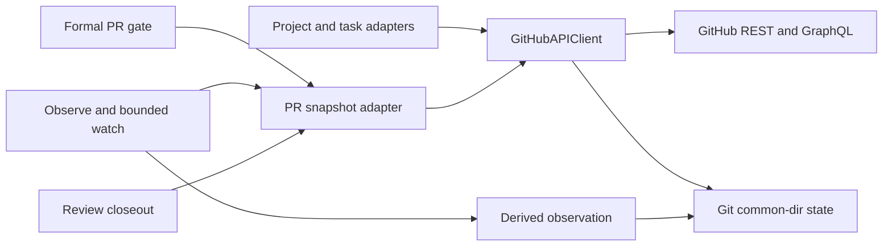

# GitHub API 请求预算与派生观察系统设计

文档类型：工程工作流系统设计

Owner role：`repository_health_engineer`；相关专业审读：`producer_system_designer`、`qa_engineer`

适用范围：本地工作流中已迁移到共享客户端的 GitHub REST/GraphQL 读取、限流状态、PR 观察、Review closeout 与 Project 适配。

规范 authority：[workflow source of truth](./source-of-truth.md#github-query-budget-and-terminal-defaults)。本文解释组件间的实现合同与可测请求预算，不创建第二套门禁、task truth 或 API 权限策略。

## 1. 问题、目标与非目标

### 1.1 问题与目标

工作流热路径过去会为同一 PR 分别读取 PR、仓库和审核面；watcher 的节流状态限于单个进程；不同脚本还可能各自重试或重复探测额度。结果是本地进程重启或并发调用可能再次读取，源码里的 CLI 次数也无法代表真正发出的 HTTP 请求。

本设计的目标是让已迁移路径使用一个可注入、可计量的 HTTP transport，将完整 PR 观察合并为有界查询，并在同一 Git common-dir 内共享派生观察和限流暂停。请求次数按真实 transport send 计数，缓存命中和本地暂停另记为诊断事件。所有现有准入、Project 状态迁移、权限和写后审计仍由原有 workflow authority 与消费者负责。

### 1.2 非目标

本文不承诺控制整个 GitHub 帐号、其他 clone、浏览器或尚未迁移脚本的 API 使用；不预测未知的 GraphQL cost；不引入常驻服务、Webhook、数据库、跨机器协调、token 轮换、额度审批或新的 lifecycle receipt；不改变 branch protection、required checks、merge 权限或历史 evidence。

## 2. 上游约束与相关角色

这是纯工程工作流变更，不改变玩家价值、产品范围或游戏内规则，因此不消费产品 AC。工程规则由 workflow source of truth 承载；实现和测试仍由工程实现、QA 与现行 workflow review 负责。跨系统 authority 边界由 producer/system review 检查，TPM 维护 task truth、派工和集成记录。

### 2.1 需求承接与分配表

| 上游 requirement / professional acceptance（path#fragment） | 具体 obligation 与适用条件 | 本设计条款（path#anchor） | 外部 owner / dependency | 明确排除或未覆盖范围 |
| --- | --- | --- | --- | --- |
| [选定任务和 broad-read 预算合同](./source-of-truth.md#github-query-budget-and-terminal-defaults) | 每个操作先解析已有任务/PR 选择器；广域读取沿用现有额度 guard；缓存和诊断不得提供准入事实。 | [DES-GAB-01](github-api-budget.design.md#des-gab-01) | TPM 维护任务身份；`pr-lifecycle-gate.py` 维护正式准入。 | 不新增 task selector、Project 授权或额度豁免。 |
| [共享 transport 与限流合同](./source-of-truth.md#github-query-budget-and-terminal-defaults) | 已迁移读取统一处理 response、重试和持久化暂停；不确定写入不得自动重放。 | [DES-GAB-02](github-api-budget.design.md#des-gab-02) | `github_api.py`、跨平台锁；QA 注入 HTTP 响应验证。 | 未迁移路径不纳入总量控制。 |
| [PR 快照与 Review readback 合同](./source-of-truth.md#github-query-budget-and-terminal-defaults) | PR 元信息、审核面和 checks 在一个有界快照内严格解码；正式准入最终身份读取和 Review 写后读取保持独立 fresh。 | [DES-GAB-03](github-api-budget.design.md#des-gab-03) | `github_pr_snapshot.py` 和 gate/review consumers。 | 不扩展现有分页上限或改写线程解决权限。 |
| [观察与正式准入隔离合同](./source-of-truth.md#github-query-budget-and-terminal-defaults) | 本地缓存只供 observe/watch 使用；正式 gate fresh 读取自己的权威输入，末尾重新读取身份。 | [DES-GAB-04](github-api-budget.design.md#des-gab-04) | `github_observation.py`、`pr-lifecycle-gate.py`；candidate 评价仍使用现有 gate 逻辑。 | observation 不产生 receipt，不向 claim/merge 提供 positive evidence。 |
| [Project selected-read 和批量更新合同](./source-of-truth.md#github-query-budget-and-terminal-defaults) | 单任务读取继续限于选定任务；批量更新和 unchanged 判断保留；unknown 值不被当作 unchanged。 | [DES-GAB-05](github-api-budget.design.md#des-gab-05) | Project adapters；QA 验证读取和 mutation。 | 不重构生命周期，不以 Issue 单写替代已有 Project 后置条件。 |
| [选定任务 audit 合同](./source-of-truth.md#github-query-budget-and-terminal-defaults) | 任何写操作前后需要的 selected audit 都保留，分别读取写前和写后状态。 | [DES-GAB-06](github-api-budget.design.md#des-gab-06) | Project adapters 与 task-closeout；QA 验证 audit 顺序。 | 不把一次 audit 当成底层 HTTP 请求数承诺。 |
| [预算与脱敏诊断合同](./source-of-truth.md#github-query-budget-and-terminal-defaults) | 每次真实发送分别计数；unknown cost 保持 unknown；诊断不宣称全账号覆盖，敏感请求内容不进入日志。 | [DES-GAB-07](github-api-budget.design.md#des-gab-07) | `github_api.py` 本地状态与 JSONL telemetry。 | 不作全账号点数、长期下降比例或限流发生率承诺。 |
| [系统设计需求分配和验证标准](../doc-governance/system-design-writing-standard.design.md#21-需求承接与分配表) | 每项上游需求有准确本地条款和一条精确验证关系；结构检查只证明追踪完整，不替代语义审读或运行验收。 | [DES-GAB-08](github-api-budget.design.md#des-gab-08) | 系统设计 checker、文档治理入口和专业 review。 | 不把本设计当 task ledger、测试报告或发布证明。 |

### 2.2 相关 owner 和 authority

`repository_health_engineer` owns workflow-client implementation and source projections; `qa_engineer` owns independent behavior and regression findings; `producer_system_designer` reviews cross-module contract meaning; TPM remains the sole coordinator for task truth and integration. GitHub Issue/Project is remote task truth. Local budget, lock, observation and telemetry files are disposable derived state. The source-of-truth remains the only normative lifecycle authority.

## 3. 当前状态、目标状态与差距

| 对象 | 当前状态 | 目标状态 | 差距与证据边界 |
| --- | --- | --- | --- |
| HTTP access | `GitHubAPIClient` owns an injectable transport, REST/GraphQL send path, typed errors, retry classification, budget state and local request accounting. | Every migrated API JSON path enters that client once, without a nested transport retry. | Other command paths remain outside its measured coverage; inventory and migration claims belong in task evidence. |
| PR read | `github_pr_snapshot.py` builds a named full or summary query, validates requested fields/page metadata and offers a separate identity query. | A resolved PR observation uses one complete snapshot; formal gate's final identity read remains independent. | A source/test presence does not itself prove the combined candidate passed or that GitHub behavior is released. |
| Observation | `github_observation.py` persists a query-versioned derived result, next-read time and business digest behind a cross-process lock. | Same-key callers reuse a still-valid derived result or elect one bounded reader. | Coverage is one local Git common-dir and only effective migrated helper/policy logic. |
| Formal authority | `pr-lifecycle-gate.py` calls the fresh snapshot path, resolves live policy separately and uses a distinct end-identity read on the formal path. | Readiness continues to depend on existing live Issue, policy, permission, CI, hold and identity checks. | Integration, independent review, hosted checks and readback are reported by task/PR evidence, not this design. |

## 4. 边界与结构

`GitHubAPIClient` owns transport, response classification, rate-limit/budget state, transport attempt telemetry and local stats/status. `github_pr_snapshot.py` owns PR selector resolution, query definitions, response completeness and Review readback. `github_observation.py` owns only derived observation, next-read scheduling and watch bounds. Gate, Review, Project, task audit and workflow-next remain adapters that retain their existing domain decisions.

The only shared files are local diagnostics under `<git-common-dir>/oasis7/github-api-v1/`: budget state, derived observations, locks and telemetry. A Git common-dir is used because linked worktrees may not have a `.git` directory. It is not a task authority store. The lock scope is narrowed by operation key; no network request or sleep holds the global budget lock.

## 5. 关键运行流程

### 5.1 正式 PR gate

1. Validate task UID, effective root, local binding and selector inputs before constructing a client or sending HTTP. Known number, URL and repository-number selectors resolve locally; branch resolution may send one scoped GraphQL lookup and is counted separately from the resolved hot path.
2. Fetch one fresh, complete PR snapshot through `load_live`; retain all requested fields and page-completeness metadata. Resolve live branch protection/policy and other existing gate evidence through their own bounded consumers.
3. Evaluate the existing live admission decision. If it reaches the formal end check, issue a second, distinct fresh identity query. A snapshot, cache entry, process statistic or candidate observation cannot replace that read.
4. Return the existing typed gate result. A rate-limit pause exits as resumable `external_wait`; no readiness or merge claim follows from a paused/incomplete query.

### 5.2 Observation and watch

1. Construct the observation key from host, repository, PR number, credential fingerprint, snapshot version, task binding and effective hold/policy/helper context.
2. Check persisted rate-limit pause. Then acquire the PR/key single-flight lock for at most two seconds and re-read state after lock acquisition.
3. If `next_read_at` has not arrived, return the last derived candidate or wait result with zero transport sends. Otherwise fetch one bounded complete snapshot, calculate the decision-relevant business projection, and atomically write its digest, observation, next-read time and poll counters.
4. Return `evidence_mode=observation`, `ready_for_merge=false`, `requires_live_gate=true`. Watch remains bounded and emits the formal gate command when the candidate merits a live check; it does not start an unattended process.

Observation evaluates the PR snapshot against the already-bound local task/hold context. It does not fetch live Issue evidence or branch-protection policy. The business digest includes PR identity/state, draft flag, body digest, comments/reviews content or state digests, thread resolution state, check identity/status, and the effective local policy/hold/helper context bound to that observation. It excludes timestamps, rate-limit cost/remaining, latency, log IDs and cache-hit counters so transport noise cannot reset the business backoff.

### 5.3 Review and Project adaptations

Review summary is opt-in and omits body fields from the query; default detail output remains intact. Conditional HTTP validators are not used to reuse a response; a 304 cannot satisfy a fresh snapshot. Resolving `N > 0` selected threads requires one fresh complete pre-read, `N` single-attempt mutations and one fresh complete post-read. Each uncertain mutation may add one readback for that same thread identity; the mutation itself is never replayed. An empty selection returns the complete pre-read without a post-read.

Project reads remain scoped to the selected task. A command reuses its already-read Project/schema context, including selected-item recovery, preserves batch field mutation and skips only values proven unchanged by a valid current snapshot. A transition that requires pre- and post-write selected audits keeps both reads on their respective sides of the mutation; each audit is evaluated independently. Broad Project or issue traversal still follows the existing live budget guard.

## 6. 接口与数据合同

| Interface | Producer → consumer | Identity and behavior | Failure/compatibility |
| --- | --- | --- | --- |
| `GitHubAPIClient.from_gh()` | existing environment/`gh` credential source → migrated adapters | Resolves one effective token for the command. Explicitly injected tokens stay effective. Raw credentials remain process memory only. | Missing credentials fail before send; requests are limited to the supported GitHub API host. |
| `graphql(query, variables, operation, mutation, context)` | snapshot/Project adapters → client | Named operation and safe correlation context accompany one logical query or mutation. GraphQL query POSTs are retryable reads; mutation is explicit and single-attempt. | Query and REST-read attempts are capped at three total; malformed or partial GraphQL envelopes fail closed. |
| `rest(method, path, payload, operation, mutation, context)` | Project/task adapters → client | Relative REST path on the approved API host; method or explicit mutation flag determines replay safety. | Invalid host/path is rejected. Writes are not automatically replayed after uncertain delivery. |
| `fetch_pr_snapshot(client, repository, number, include_comment_bodies)` | gate/review → strict snapshot | Returns repository/PR identity, requested connections, viewer/rate observation and versioned completeness metadata. Local selector lookup is separate from this resolved snapshot. | Missing/null/malformed fields and incomplete connections do not become empty success. Existing connection-size/stop behavior remains. |
| `fetch_pr_identity(client, repository, number)` | formal gate → final identity read | Separate uncached read of repository, PR identity, state, body, head and base values. | Failure, missing identity or identity drift preserves the existing block. |
| `APIError` and workflow result | client → shell/Python adapters | Exposes typed reason, HTTP status when known, retry delay, uncertain and mutation-started facts. Limit pauses route as `external_wait` with exit 75. | Ordinary authentication/permission failures remain capability-blocked. Uncertain mutation is not success and not safe to resend. |

GraphQL success requires a valid object response and object `data`, with no GraphQL errors. A malformed `errors` envelope or partial mutation data is not converted into empty fields. Connection decoding requires both `nodes` and `pageInfo`; known-empty is valid only when the required structure is present. Unrequested body fields in summary mode stay absent, not empty strings.

## 7. 状态、事务与持久化

| State | Key contents | Write/recovery rule | Authority limit |
| --- | --- | --- | --- |
| Budget and pause | credential fingerprint; after valid viewer identity is observed, a hashed account-scope key may coordinate a confirmed same-account pause. | Atomic JSON updates under a short lock. A pause persists across processes. When recovery is due, only one bounded probe proceeds; response evidence, not a timer, restores observed capacity. | An absent, stale or unreadable value is never positive proof of available capacity. A corrupt critical throttle record blocks the send path. |
| PR observation | host, repository, PR, credential fingerprint, query version, task UID and effective gate/hold/helper context. | Atomic replacement after a complete fresh observation. Corrupt or stale-version cache gets one bounded fresh non-authorizing read. Same-key callers recheck after lock acquisition. | No issue evidence, receipt, task field or live-gate result is persisted here. |
| Lock | hashed operation/scope key in the shared local state root. | OS-backed portable lock; timeout returns a bounded wait instead of spinning. Process death releases ownership; lock files are not unlinked while possibly held. | A local lock coordinates only processes sharing this state root. |
| Telemetry | date/process JSONL shards and sanitized operation context. | Each actual HTTP attempt is one record; cache hits and local blocks are separate events. Old logs are pruned by age/total-size policy. A logging failure warns without becoming a business approval gate. | Missing or incomplete logs do not prove zero requests or account-wide totals. |

The observation digest is recomputed from a stable field allowlist. `snapshot_metadata`, `rateLimit`, request cost, timestamps and transport status do not enter it. A candidate/cache schema or effective helper change produces a distinct key; it cannot reuse stale candidate logic.

## 8. 安全与运行约束

The raw token, Authorization header, full GraphQL query/variables, and Issue/PR/comment bodies are never written to telemetry or local state. Telemetry may carry a credential-scope digest, bounded operation names, task/PR scope when syntactically valid, attempt number, HTTP status, observed rate-limit/cost fields, error kind, duration and cache outcome. The digest is an isolation key, not a display identity or an assertion that each token owns an independent GitHub quota. Telemetry retention is bounded to seven days and a fifty MiB directory ceiling.

Primary and secondary rate limits and explicit 429 responses become resumable waits. Secondary limits honor `Retry-After` and retain a minimum cooldown when the header is absent. An ordinary 403 remains a permission error. A query or REST GET may retry transient transport/server errors within the three-attempt cap; mutations are sent once and uncertain results use same-object readback where the existing operation defines one. A child exit 75 remains an `external_wait` at the root and cannot trigger generic immediate retry or CI rerun.

Local stats/status reads do not call GitHub. They report only instrumented paths, actual sends, server-reported costs when present, unknown-cost counts, retries, waits and cache outcomes. They do not add an acceptance gate or claim a full account ledger.

## 9. 质量与容量

The following are transport-attempt budgets for named operations, not whole-command HTTP totals or GraphQL point guarantees.

| Operation | Expected attempts/reads | Counting boundary and exception |
| --- | --- | --- |
| Resolved PR snapshot for one observe poll | 1 GraphQL read on a cache miss. | Branch/omitted-selector resolution is a separate cold lookup. A retryable failed query may use up to three transport attempts. |
| Same observation key before `next_read_at` | 0 HTTP sends. | Returns only the existing derived observation/wait. |
| Eight concurrent same-key observers sharing a local state root | 1 network snapshot total; other processes reuse or return bounded wait. | Applies only to the covered helper version, task/policy context and credential scope. |
| Formal `load_live()` PR surfaces | 1 fresh GraphQL snapshot. | Live policy, evidence, permission and CI reads are separate and remain required. |
| Formal end identity check | +1 separate fresh GraphQL read after the formal decision path reaches it. | Total gate work is not described as one or two calls; all downstream authority reads remain separately counted. |
| Review summary/detail preview for resolved identity | 1 GraphQL snapshot. | Summary omits bodies; default detail retains them. |
| Normal resolution of `N > 0` Review threads | `N + 2` GraphQL operations. | One pre-read, `N` mutations, one post-read. Each uncertain mutation may add one same-thread readback; no write replay. An empty selection uses only the pre-read. |
| One-task Project refresh | At most 1 Project GraphQL data read for the selected task, including missing-item recovery. | Cold selector/schema discovery is counted separately; no whole-Project traversal. |
| Selected-task transition | One required pre-write audit and one required post-write audit. | These are audit operations, not a promise that each audit maps to one HTTP request. |
| Requests during active persisted rate-limit pause | 0 HTTP sends. | Recovery election permits one bounded probe; no fan-out retry. |
| Local `stats` / `status` | 0 HTTP sends. | Reads local telemetry and budget state only. |

Request counters are determined by the injected transport boundary, including every retry attempt. GraphQL cost is reported only if GitHub returned it; it is not inferred from request count or account-level used deltas. The only reduction claim supported by these targets is removal of specific duplicate reads inside instrumented paths. No fixed percentage, point saving or “never rate limited” result follows.

## 10. 兼容、迁移与回滚

The client, snapshot, observation helpers and their effective consumers are one compatible implementation set. A consumer loads the matching helper closure; it must not combine an old gate with a new selector or accept observation-only arguments from a stale helper. The existing public shell entrypoints and default Review detail output remain compatible; `--observe`, `--watch` and `--summary` are explicit modes.

No remote schema, task field, receipt or existing CI identity is migrated. Local files carry versioned schemas and old code can ignore them. If observation sharing is disabled or unavailable, it cannot affect formal gate behavior. If a candidate fails acceptance or later regresses, normal source/implementation rollback restores the prior code while leaving harmless derived files unused. A rollback cannot turn cache contents into authorization or weaken rate-limit classification.

Acceptance is verified by the existing focused helper suites, system-design traceability check and document-governance entrypoint. This slice adds no CI workflow or required check; the integrated task/PR uses the repository's existing local review, CI and lifecycle gates.

## 11. 验证设计与可追溯性

### 11.1 验证映射表

| 上游 requirement / professional acceptance（path#fragment） | 本设计条款（path#anchor） | 独立义务与适用条件 | 准确验证方法、test/manual source、scenario/layer、candidate/environment | evidence target | 未证明范围 |
| --- | --- | --- | --- | --- | --- |
| [选定任务和 broad-read 预算合同](./source-of-truth.md#github-query-budget-and-terminal-defaults) | [DES-GAB-01](github-api-budget.design.md#des-gab-01) | task/root/selector 缺失或不匹配时先拒绝；正式 gate fresh 读取，观察 cache 不替代 gate。 | `python3 scripts/pm/graphql-budget-red.test.py`：[`graphql-budget-red.test.py`](../../../scripts/pm/graphql-budget-red.test.py)，`test_actual_load_live_batches_all_pr_surfaces_and_policy_reads`、`test_formal_end_identity_is_a_second_fresh_graphql_read`、`test_formal_load_ignores_a_seeded_observation_cache_entry`、`test_missing_task_uid_is_rejected_before_client_creation_or_http`；fake transport 计数。 | 当前任务 Issue evidence 中的命令输出、退出码和 artifact digest；最终 CI/review 仍绑定同一集成候选。 | Fake GitHub 不证明 hosted checks、permission endpoint 或真实合并资格。 |
| [共享 transport 与限流合同](./source-of-truth.md#github-query-budget-and-terminal-defaults) | [DES-GAB-02](github-api-budget.design.md#des-gab-02) | response based rate limit/403 分类、persisted pause、read 上限和 mutation 单发/不确定性。 | `python3 scripts/pm/github-api.test.py`：[`github-api.test.py`](../../../scripts/pm/github-api.test.py)，`test_secondary_rate_limit_403_without_retry_after_is_external_wait`、`test_ordinary_403_is_permission_failure_even_with_retry_after`、`test_query_server_failures_make_at_most_three_total_sends`、`test_mutation_server_failure_is_uncertain_and_never_replayed`、`test_corrupt_shared_throttle_state_fails_closed`。 | 同上；需要真实客户端的只读 smoke 时单独记录环境、总发送上限和响应。 | 未覆盖路径的真实请求量和 GitHub 长窗口计费不在 fake transport 证明范围。 |
| [PR 快照与 Review readback 合同](./source-of-truth.md#github-query-budget-and-terminal-defaults) | [DES-GAB-03](github-api-budget.design.md#des-gab-03) | 严格完整快照、summary omission、fresh identity、resolve N threads 的 N+2 正常预算和不确定 mutation readback。 | `python3 scripts/pm/github_pr_snapshot.test.py`：[`github_pr_snapshot.test.py`](../../../scripts/pm/github_pr_snapshot.test.py)，`test_flat_projection_is_strict_and_summary_omits_comment_body_fields`、`test_null_required_connection_fails_but_known_empty_connection_is_valid`、`test_closeout_sends_one_pre_read_n_mutations_and_one_post_read`、`test_uncertain_mutation_is_read_back_once_and_never_replayed`、`test_identity_read_is_a_distinct_uncached_request`。 | 同上；运行时每次 send 由 transport call list 断言。 | 当前 connection 上限内的快照测试不证明超限结果可授权；超限仍按 incomplete 停止。 |
| [观察与正式准入隔离合同](./source-of-truth.md#github-query-budget-and-terminal-defaults) | [DES-GAB-04](github-api-budget.design.md#des-gab-04) | cache 只在同 key/版本/上下文生效；8 个进程最多一份网络观察；损坏/旧版本结果不假就绪。 | `python3 scripts/pm/github-observation.test.py`：[`github-observation.test.py`](../../../scripts/pm/github-observation.test.py)，`test_fresh_observation_cache_avoids_transport_and_tracks_context_isolation`、`test_corrupt_observation_cache_falls_back_to_one_fresh_non_authorizing_read`、`test_eight_subprocess_observers_share_one_network_snapshot`、`test_watch_preserves_bounded_unchanged_policy`。 | 同上；本地多进程计数文件和 observe JSON 是 fixture 产物，不是正式 receipt。 | 只证明同机同 common-dir 的本地并发；不证明跨 clone 或跨机器去重。 |
| [Project selected-read 和批量更新合同](./source-of-truth.md#github-query-budget-and-terminal-defaults) | [DES-GAB-05](github-api-budget.design.md#des-gab-05) | Project 读取限于选定任务；批量写入、当前值 unchanged 过滤以及未知值不跳写。 | `python3 scripts/pm/github-project-api-budget.test.py`：[`github-project-api-budget.test.py`](../../../scripts/pm/github-project-api-budget.test.py)，执行真实 refresh/update 函数并在共享客户端 transport 计数：已绑定 item refresh 为 1 次 GraphQL；unchanged 为 0 次、changed/unknown 各 1 次字段 mutation。 | 当前任务 Issue evidence 中的命令输出、退出码和 artifact digest；Project consumer suites 一起进入集成证据。 | 两次 legacy Issue CLI 调用单独计数；fixture 不计量 gh 内部 HTTP，不能将它们当作零远端请求。 |
| [选定任务 audit 合同](./source-of-truth.md#github-query-budget-and-terminal-defaults) | [DES-GAB-06](github-api-budget.design.md#des-gab-06) | 一次 lifecycle transition 的 selected audit 必须分别处于 mutation 前后，不能复用前值。 | `bash scripts/pm/task-closeout-audit-order.test.sh`：[`task-closeout-audit-order.test.sh`](../../../scripts/pm/task-closeout-audit-order.test.sh)，fixture 顺序必须为 claim/readiness、pre-audit、transition、post-audit；mutation 前失败时不得越过 preflight。 | 同上；实际 selected-task readback 仍由 integration/task evidence 证明。 | 顺序 fixture 不单独证明 Project API 的每个底层请求数。 |
| [预算与脱敏诊断合同](./source-of-truth.md#github-query-budget-and-terminal-defaults) | [DES-GAB-07](github-api-budget.design.md#des-gab-07) | 每次 send 独立计数；secret/request body 不落盘；stats/status 不发网络。 | `python3 scripts/pm/github-api.test.py`：[`github-api.test.py`](../../../scripts/pm/github-api.test.py)，`test_telemetry_redacts_token_and_request_content_and_stats_count_sends`、`test_telemetry_preserves_sanitized_operation_correlation_context`、`test_stats_and_status_do_not_send_http`。 | 同上；只保留脱敏统计字段和本地 artifact digest。 | 不证明所有 GitHub 调用者都已迁移或账号总账完整。 |
| [系统设计需求分配和验证标准](../doc-governance/system-design-writing-standard.design.md#21-需求承接与分配表) | [DES-GAB-08](github-api-budget.design.md#des-gab-08) | 所有 demand relations 与 validation relations 一一对应；链接可回读且每项有一项 repository-owned test source。 | `./scripts/doc-governance-check.sh` 加 `python3 scripts/system-design-traceability-check.test.py`；[`system-design-traceability-check.test.py`](../../../scripts/system-design-traceability-check.test.py)；最终 worktree 运行 changed-scope check，required CI 运行对应冻结范围。 | 精确 checker 输出、退出码与文档 diff；当前 task evidence 保留实际运行记录。 | 结构通过不证明 API 行为、专业评审、PR readiness 或发布。 |

实际 commands、通过/失败状态、输出摘要与 artifact digest 归当前 GitHub task evidence。Fake transport、静态检查、真实只读 smoke、hosted CI 和 professional review 是不同证据层，不互相代替。只读 smoke 使用已有明确身份且有界的入口，不主动消耗 quota 验证保护。

## 12. 决策、长期风险与未决问题

### DES-GAB-01：formal authority remains live

观察会减少下一次适用 watch 的远端查询，不会改变 readiness 判定。正式 gate 有自己的 fresh PR read、required policy/evidence/permission/CI reads 和结束身份 reread；一旦限流，正确结果是等待并保留现有 blocker，而不是信任缓存。Task identity and broad-read guard remain owned by existing workflow contracts.

### DES-GAB-02：one client owns transport policy

Retry is bounded at the shared request boundary so nested helpers cannot multiply attempts. Read retries remain limited because reads can be retried safely; mutations require same-object readback after uncertain send. Response metadata can confirm a known pause or remaining value, but a successful timer alone cannot invent restored capacity.

### DES-GAB-03：strict snapshot is the cost/coverage boundary

One query carries the existing PR, review, thread, checks and repository fields needed by a poll. Requested connections retain completeness metadata; truncation is not a way to authorize. Review summary exists only when the caller explicitly asks for it. Full detail remains the default.

### DES-GAB-04：observation state is local and derived

The cache key includes the effective gate candidate logic and helper versions as well as task/policy binding; raw response bodies are not saved in the derived state. Same-account pause sharing requires a server-confirmed viewer identity, while response caches remain isolated by credential fingerprint. This design does not claim cross-machine coordination or total API coverage.

### DES-GAB-05：Project behavior remains business-owned

The client reduces network duplication without changing which Project fields move, whether a transition is accepted or how terminal status is derived. Same-command schema reuse is not durable authority. Current values skip a write only when the selected live snapshot proved them equal; unknown values do not.

### DES-GAB-06：selected audits bracket writes

The pre-transition audit and post-transition audit observe their own sides of the mutation. Reusing one selected snapshot across a write would hide drift or a partially applied result, so a lower network count cannot override this lifecycle requirement.

### DES-GAB-07：diagnostics report only what was observed

The request ledger records transport attempts and known server cost, not a guessed GraphQL point value or the account's concurrent usage. Local `stats` and `status` remain read-only. Log retention bounds local storage, while log failures warn and never mint a new business blocker; missing state needed for cross-process throttling fails closed.

### DES-GAB-08：review and release boundary

The source-of-truth is the only normative workflow specification. This design is a durable technical companion; a local checker cannot activate candidate policy or assert readiness. Cross-role review, same-head CI, authoritative GitHub readback and merge use the existing workflow.

Residual risks are bounded but material: unrelated clients can consume the same GitHub quota without appearing in these counters; strict full snapshots may stop on existing connection limits; provider cost metadata may be absent; a platform without usable shared filesystem locking loses cross-process deduplication and must not report it as active. None is hidden by extrapolating from local test counts.
