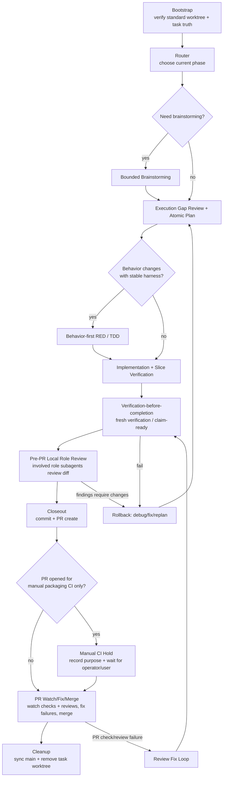

# Engineering Workflow Source of Truth

Version: **v1.4.12**
Last Updated: **2026-06-04**

## 0. Purpose
This file is the **only normative workflow specification** for engineering task execution in oasis7.

Mandatory rule:
1. Any workflow change must be edited in this file first.
2. After this file is updated, sync all related scripts/docs/skills to match.
3. PRs that change workflow scripts without updating this file are invalid.

## 1. Phase Diagram

### 1.1 Skill Map by Phase
This map makes skill reachability explicit. TPM owns the route decision as a workflow coordination act and records the selected skill path in `.pm/tasks/<TASK-UID>.execution.md` before delegated execution begins.

| Phase / trigger | Skill surface | Requiredness | Formal evidence |
| --- | --- | --- | --- |
| Any user request starts | `default-workflow-bootstrap` | Required before fact lookup, chat answer, professional slice dispatch, edits, verification, review, or external messaging unless already inside the bound task worktree | Bootstrap entry in `.pm/tasks/<TASK-UID>.execution.md` |
| Read-only professional/domain question | Matching professional bounded slice under TPM coordination after task/worktree bootstrap | Required when the answer depends on product/design/runtime/WASM/agent/viewer/QA/liveops judgment; skipped only for pure fact lookup after task truth exists | Role-tagged slice return recorded in `.pm/tasks/<TASK-UID>.execution.md` and summarized to the user |
| Bound task needs next phase selection | `repo-owned-workflow-router` | Required after bootstrap and whenever phase is unclear | Route entry with selected/skipped skills in `.pm/tasks/<TASK-UID>.execution.md` |
| Scope is ambiguous, option-heavy, or visual enough to need ideation | `bounded-brainstorming` | Optional, risk-based | Brainstorming output or skip reason in execution log/project |
| Behavior changes with a stable automated harness | `tdd-test-writer` | Conditional required when RED criteria are met; otherwise skip reason required | RED command, failing evidence, and handoff contract |
| Repo truth is ready and implementation proceeds step by step | `executing-project-tasks` | Required for non-trivial execution after route selection | Atomic step evidence in `.pm/tasks/<TASK-UID>.execution.md` |
| Bug, failing test, broken script, unexpected diff, or regression appears | `systematic-debugging` | Conditional required before speculative fixes | Reproduction, narrowed hypothesis, fix evidence |
| Branch is about to create a PR | `requesting-repo-owned-review` | Required before PR creation; TPM must spawn or dispatch fresh local subagents for all involved relevant roles, collect review findings/no-findings/residual risk, and address or explicitly reject actionable findings with evidence before continuing | `Pre-PR Local Role Review: passed` execution-log packet with roles, review evidence, finding disposition, and residual risk |
| About to claim done/tests-pass/ready-for-PR/ready-to-merge | `verification-before-completion` | Required before completion claims | Fresh verification command/output or claim-ready evidence |
| Implementation is done and branch needs closeout/commit/PR/watch/merge | `finishing-a-development-branch` | Required for development branch closeout | Closeout output, commit, PR linkage, PR purpose decision, CI/review watch evidence, merge/cleanup evidence |
| GitHub PR receives review comments or requested changes | `receiving-code-review` | Required for actionable PR review feedback | Comment verification, fix evidence, thread status |
| Workflow skill/docs themselves are created or edited | `writing-repo-owned-skills` | Required for local skill surface changes | Source-of-truth-first sync plus governance checks |

### 1.2 Specialist Skill Reachability
Specialist skills are not mandatory workflow phases. They become reachable through TPM routing or professional subagent slice planning when the task domain matches their trigger.

- Product/planning docs: `prd`, `game-architect`; these may create planning artifacts, but the route, TODOs, and downstream handoff must still be recorded in `.pm/tasks/<TASK-UID>.execution.md`.
- Game/domain implementation: `game-design-theory`, `gameplay-mechanics`, `level-design`, `audio-systems`, `particle-systems`, `optimization-performance`, `memory-management`, `asset-optimization`, `synchronization-algorithms`, `monetization-systems`.
- Narrative/community/content: `epic-story-orchestrator-zh`, `content-creation`, `humanizer-zh`.
- Browser/visual/content tools: `agent-browser`, `gpt-image-2`, `xiaohongshu`, `xiaohongshu-note-analyzer`.

If a specialist skill is used, TPM must still bind it to the same owner, `.pm` task, canonical worktree, and PR chain through the subagent slice contract. TPM may route to specialist skills, but the specialist role owns the professional conclusion.

## 2. Responsibility Boundary
- `tpm`: default main Agent / workflow coordinator / canonical integrator only; owns phase decision, role allocation, subagent dispatch, integration order, task-truth writeback, fresh-verification gate coordination, completion-claim coordination, and PR chain coordination.
- TPM is not a professional execution role. TPM must not be the source of domain/professional analysis, implementation, verification judgment, code review judgment, product/design judgment, runtime/wasm/viewer/agent/QA judgment, or liveops/community messaging.
- Professional/domain work must be done by the matching bounded subagent slice. This includes:
  - product/system design by `producer_system_designer`
  - runtime/gameplay/server logic by `runtime_engineer`
  - WASM/platform/ABI work by `wasm_platform_engineer`
  - agent behavior/prompt/provider work by `agent_engineer`
  - Viewer/Web/UI work by `viewer_engineer`
  - verification strategy, test evidence, and release blocking judgment by `qa_engineer`
  - external messaging, community feedback, incidents, player promises, and channel runbooks by `liveops_community`
- professional role subagents provide bounded slices only (analysis/implementation/verification/review/liveops messaging) and must return artifacts to the TPM owner chain.
- TPM may perform mechanical orchestration edits to workflow governance surfaces, task logs, integration notes, and PR plumbing. If the work requires a professional conclusion, TPM must dispatch the matching role slice first and attribute the conclusion to that slice/evidence.
- For every request, TPM planning, TODO decomposition when needed, subagent slice contracts, and integration order are task execution truth and must be written to `.pm/tasks/<TASK-UID>.execution.md` before the delegated work begins.
- Every user request must enter the standard worktree flow before any substantive handling begins, including chat-only answers, read-only inspection, fact lookup, professional slice dispatch, implementation, verification, review, and external messaging.
- The only allowed pre-bootstrap work is mechanical enough to create or enter the task truth: inspect current git/worktree state, choose or confirm the task/worktree, and run the bootstrap helper.
- Do not first classify a request as "read-only", "chat-only", "pure fact lookup", or "professional judgment" to decide whether task/worktree truth is needed. That classification happens only after bootstrap, inside the bound task/worktree, and only controls whether TPM can answer from objective evidence or must dispatch a professional slice.
- Read-only/chat-only requests still split by judgment type after task truth exists:
  - Pure fact lookup, path lookup, command-output restatement, or mechanical evidence collection may be handled by TPM inside the bound task worktree, as long as the answer does not present a professional/domain conclusion.
  - Read-only professional/domain questions must be dispatched to the matching bounded professional role slice before the answer is presented as authoritative. Examples: "does viewer have a performance collection/evaluation mechanism", "is this QA evidence release-blocking", "what runtime design risk is present", or "how should LiveOps message this incident".
  - Such read-only professional slices require the same `.pm` task and canonical task worktree as any other request. Their required sink is `.pm/tasks/<TASK-UID>.execution.md`, plus the role-tagged user-facing answer.
  - TPM may gather raw files, commands, or repo context before dispatch only after bootstrap; the final user-facing answer must label TPM synthesis separately from professional role conclusions and cite the role/evidence that owns each professional conclusion.
- Canonical truth per user request must remain single-threaded:
  - one owner role
  - one `.pm` task
  - one canonical worktree
  - one PR chain

## 3. Gates
### 3.1 Required Gates (must pass)
1. **Task truth gate**: isolated worktree + bound `.pm` task + owner role confirmed.
2. **Planning gate**: PRD/project/execution truth aligned for scope and verification entry; TPM TODOs and any subagent slice plan are recorded in `.pm/tasks/<TASK-UID>.execution.md` before execution.
3. **Execution gate**: atomic step evidence captured (`Action`, `Validation Command`, `Expected Result`, `Actual Result`, plus blocker fields when needed).
4. **Fresh verification gate**: current-round verification success before completion claims.
5. **Pre-PR local role review gate**: fresh local subagent review by all involved relevant roles, with actionable findings addressed or explicitly rejected with evidence.
6. **Closeout gate**: closeout metadata + task status transition + lint/governance checks + commit + PR creation.
7. **Post-PR watch/merge gate**: unless the PR is explicitly opened only to access manual-trigger packaging/release CI, watch normal PR required checks and review/approval to completion, fix failures through the review/debug loop, then merge and clean up.

### 3.2 Optional Gates (risk-based)
1. Bounded brainstorming gate (ambiguous scope / architecture tradeoffs).
2. TDD RED gate (behavior-changing tasks with stable harness).
3. Liveops/community gate (external messaging, incident, player promise changes).

## 4. Failure and Rollback Paths
### 4.1 Verification failure
- Stop completion claim.
- Record failure signature + blocker in execution sink.
- Route back to execution/debug phase.

### 4.2 Scope drift / unknown impact
- Stop speculative implementation.
- Update planning truth (PRD/project/execution) before resuming code edits.

### 4.3 PR check/review failure
- Re-enter review-fix loop.
- Re-run fresh verification.
- Re-submit PR evidence.

### 4.3.1 Manual packaging CI hold
- If the PR exists specifically to run manual-trigger packaging/release CI jobs, record that purpose in the task execution log and do not auto-watch-to-merge.
- Resume the normal PR watch/fix/merge path only after the operator/user says the manual packaging CI purpose is complete and the PR should proceed to merge readiness.

### 4.4 Workflow governance drift
- If scripts/skills/docs conflict with this file, this file wins.
- Sync downstream artifacts immediately in the same change set where possible.

## 5. Normative Details (from legacy AGENTS workflow)
### 5.1 Worktree + task truth
- Every user request uses a dedicated task worktree by default, regardless of whether the immediate answer is chat-only, read-only, fact lookup, professional analysis, implementation, verification, review, or external messaging.
- Only explicit user authorization allows reuse of an existing task worktree.
- Do not classify work as `trivial`, `read-only`, `chat-only`, or `pure fact lookup` to bypass task worktree / `.pm` task setup.
- If incoming instructions or role notes appear to allow a read-only/chat-only bypass, this source-of-truth wins: bootstrap first, then route the already-bound request.
- Do not edit any files from the `main` branch/worktree; create or enter the relevant task worktree before making changes.
- Entering implementation requires owner role selection and `.pm` task binding.
- Cross-role collaboration must converge to one owner / one `.pm` task / one canonical worktree / one PR chain.
- Task worktrees created through `./scripts/new-task-worktree.sh` must create a git-ignored `target` symlink to the repo-family shared cargo target cache resolved by `./scripts/cargo-dev.sh --print-target-dir`, so direct cargo and the development wrapper share local build artifacts by default.

### 5.2 TPM planning and subagent dispatch
- For every request, TPM must record the current plan, TODO decomposition when needed, selected roles, and integration order in `.pm/tasks/<TASK-UID>.execution.md` before dispatching professional subagent work.
- Each subagent slice must declare role, slice type, intended model configuration, actual dispatched model/reasoning, context delivery mode, mandatory context checklist/packet, write scope, return contract, validation command, mandatory `.pm` execution-log sink, and integration order.
- Default subagent runtime is `gpt-5.5` with `reasoning_effort=medium` (shorthand: `gpt-5.5-medium`). TPM should request this default for bounded professional slices when the available subagent tool permits model selection, unless the user explicitly requests another model or the slice contract records a concrete reason to use a stronger, faster, or cheaper model.
- Compatibility marker: Any non-default subagent model or reasoning effort must be recorded in the slice contract.
- Any actual non-default subagent model or reasoning effort must be recorded in the slice contract with the reason, such as high-risk architecture/review work, simple read-only exploration, a user-specified override, a connector/tool limitation that forces inheritance from the parent thread, or a requested model/reasoning selection whose actual dispatch cannot be verified. If the actual dispatched model cannot be verified, the contract must say `actual model: inherited/unverified` and explain why.
- Context delivery defaults to full-thread/full-history fork or the closest available equivalent so the subagent receives the same conversation and repository-governance context as TPM. The slice contract must still record a mandatory context checklist identifying the governance/task/user/repo/collaboration context the subagent is expected to have. A manually assembled explicit context packet is allowed only as a delivery supplement or fallback when full-history fork is unavailable, unsafe, stalled, or incompatible with required model/reasoning selection; the slice contract must record that fallback reason.
- Compatibility marker: mandatory context packet means the recorded mandatory context checklist/packet, not necessarily a manually assembled explicit delivery packet.
- Compatibility marker: The mandatory context packet must include:
- The mandatory context checklist/packet must include:
  - identity and authority: assigned role, role card path, owner role, and TPM integration owner
  - workflow governance: `AGENTS.md`, `doc/engineering/workflow/source-of-truth.md`, and the selected workflow skills
  - task truth: current `.pm/tasks/<TASK-UID>.yaml`, `.pm/tasks/<TASK-UID>.execution.md`, canonical worktree, branch, base ref, and PR link/status when present
  - user intent and acceptance target: original request summary, current TODO, explicit non-goals, and done/verification expectations
  - scoped repo context: relevant `prd.md`, `project.md`, handoff, changed paths, current diff or evidence summary, and known constraints such as `third_party` read-only boundaries
  - collaboration boundary: sibling slices, write-scope conflicts, integration order, allowed commands, return contract, and formal sink
- `AGENTS.md` and the assigned role card are mandatory inputs for implementation, verification, review, or domain-specialist slices. A narrow read-only explorer slice may omit the role card only when the slice contract records the exemption reason and the exact files to inspect; it still runs after task/worktree bootstrap and records its sink in `.pm`.
- TPM read-only exploration is allowed only to gather routing context, inspect task truth, or integrate returned evidence. It must not be reported as a professional finding unless a matching professional role slice owns or verifies that finding.
- TPM user-facing summaries must distinguish procedural synthesis from professional conclusions. Professional conclusions must be traceable to subagent artifacts, execution evidence, handoff, project/prd records, or PR evidence.
- Project docs, handoff files, signals, memory, and PR evidence may supplement the `.pm` execution log, but they do not replace it for task execution truth.
- If the plan changes during execution, TPM must append an execution-log update before continuing the changed work.
- Pre-task discoveries, loose TODOs, and follow-up ideas found before an owner decides to create a `.pm` task should be captured with `./scripts/pm/capture-todo.sh --source-ref <path> --summary "<text>"`. This records a `source_type=reflection` signal by default and must not be treated as committed task truth until explicitly promoted with `--create-task` or another task-creation path.

### 5.2.1 Read-only specialist routing
- The task/worktree decision and the professional-slice decision are intentionally decoupled:
  - Task/worktree truth is required for every request.
  - Professional judgment controls whether a matching bounded role slice is required after bootstrap.
- Therefore, a read-only request must enter `default-workflow-bootstrap` first and may still require a professional role slice.
- Minimal read-only specialist slice contract:
  - role and slice type (`read_only_analysis`, `verification_judgment`, `review_judgment`, or `liveops_messaging`)
  - intended model configuration, defaulting to the `Default subagent runtime` policy unless an override reason is recorded
  - actual dispatch model/reasoning, or `inherited/unverified` with the connector/tool limitation, stalled default context delivery, or unverifiable actual dispatch reason
  - context delivery mode, defaulting to full-thread/full-history fork unless a recorded fallback reason requires explicit context
  - exact question to answer and explicit non-goals
  - scoped files/commands/evidence to inspect
  - return contract with conclusion, evidence, uncertainty, and whether repository writeback is recommended
  - attribution rule for the final answer
- Read-only specialist slice contracts must be recorded in `.pm/tasks/<TASK-UID>.execution.md`; chat/thread text may supplement but not replace the `.pm` sink.
- Pure evidence questions may be answered by TPM directly only after bootstrap and only when the user asks for an objective fact such as "does this file exist", "what command output says", or "which paths match this search".
- If a read-only specialist slice recommends changing repository state, TPM continues in the already-bound canonical task worktree and records the changed route in `.pm` before applying changes.

### 5.3 Execution evidence
- Atomic steps should be recorded with `Action / Validation Command / Expected Result / Actual Result`.
- If blocked, also record `Blocker / Next Action`.
- For tasks started with the `2026-05-23` execution-log template or later, these fields are mandatory per entry.

### 5.4 Claim / closeout chain
- Before completion claims, run fresh verification (prefer `./scripts/pm/claim-ready.sh --claim-type <type> --verify-command "<cmd>"` when applicable).
- Closeout should run `./scripts/pm/task-closeout.sh --role <owner_role> --task-uid <TASK-UID> --verify-command "<fresh cmd>"` (or equivalent manual chain).
- For `done` closeout, fresh verification must be from the current round.

### 5.5 PR and review chain
- Standard path is local role-subagent review + GitHub PR + required checks + review/approval.
- The workflow no longer requests Copilot review as a PR helper step.
- Before PR creation, TPM must create or dispatch fresh local review subagents for every involved relevant professional role in the diff scope. At minimum, use changed paths, role ownership, and task slice history to select roles; include `qa_engineer` when the claim involves verification or release readiness; include `liveops_community` when external messaging, incidents, player promises, or channel runbooks are touched.
- Each local role review must return `findings` or `no_findings` plus `residual_risk`. TPM must fix valid findings or record why a finding is stale/rejected with code or doc evidence before PR creation.
- `scripts/prepare-task-pr.sh --create` must refuse to create the PR unless the task execution log contains a passed pre-PR local role review packet for the source worktree. The packet marker is:
  - `Pre-PR Local Role Review: passed`
  - `Task UID: <task_uid>`
  - `Source Worktree: <absolute path>`
  - `Source Branch: <branch>`
  - `Source Head: <reviewed git sha; must be current source head or an ancestor whose later changes are only the task review evidence files>`
  - `Comparison Ref: <base ref>`
  - `Reviewed Changed Paths: <semicolon-separated paths or diff summary ref>`
  - `Role Selection Basis: <changed paths + task slice history + explicit includes/skips>`
  - `Review Roles: <comma-separated roles>`
  - `Review Evidence: <per-role section or handoff refs>`
  - `Review Findings Disposition: addressed` or `Review Findings Disposition: no_findings`
  - `Finding Disposition Evidence: <fix refs or rejected/stale evidence refs>`
  - `Residual Risk: <text>`
- Before merge, explicitly check PR comments and review threads. If any actionable comments or unresolved blocking threads exist, fix + re-verify + resolve or answer them before the merge claim.
- After PR creation, TPM must record the PR purpose decision:
  - `normal_pr_ci_watch`: default. Use this unless the user or task truth says the PR was opened only to access manual-trigger packaging/release CI jobs.
  - `manual_packaging_ci_hold`: allowed only when the PR is explicitly created for manual-trigger packaging/release CI. Record which manual job(s) or packaging purpose need the PR and stop before auto-merge until the operator/user resumes the normal path.
- For `normal_pr_ci_watch`, TPM continues without waiting for another user prompt: watch the PR's normal required checks, review/approval state, and mergeability. If checks fail or review requests changes, route through the fix loop, rerun fresh verification, push fixes, and continue watching.
- Once normal required checks and required review/approval pass, PR comments/review threads have been checked, and no actionable comments or unresolved blocking review threads remain, merge the PR using the repository's configured merge method, then sync local `main` and clean up the task worktree/branch.
- After merge, sync local `main` and clean up task worktree/branch.

## 6. Required Artifacts by Phase
- Bootstrap/Router: decision record in `.pm/tasks/<TASK-UID>.execution.md`; project or handoff records may supplement it.
- Planning/Dispatch: TPM TODO decomposition and subagent slice contracts in `.pm/tasks/<TASK-UID>.execution.md`.
- Execution: atomic evidence records per risky step.
- Verification: claim-ready command + output evidence.
- Pre-PR local role review: involved-role subagent review packet, finding disposition, and residual risk.
- Closeout: closeout command output, task status update, pre-PR local role review evidence, PR linkage, PR purpose decision, CI/review watch evidence, merge evidence, and cleanup evidence.

## 7. Change Log
- **v1.4.12 (2026-06-04)**
  - Added the post-PR purpose decision: normal PRs proceed into CI/review watch, failure fix loop, merge, and cleanup without waiting for another prompt.
  - Added the manual packaging/release CI hold exception for PRs opened specifically to access manual-trigger packaging CI jobs.
  - Clarified that merge readiness requires an explicit PR comment/review-thread check before merge.
- **v1.4.11 (2026-06-03)**
  - Replaced the optional/risk-based local supplemental review gate with a required pre-PR local role-subagent review gate.
  - Removed the Copilot review request from the standard PR helper flow.
  - Required `prepare-task-pr.sh --create` to verify passed local role review evidence in the task execution log before creating a PR.
- **v1.4.10 (2026-06-03)**
  - Updated the default subagent runtime policy to `gpt-5.5` with `reasoning_effort=medium`.
  - Consolidated synced guidance, templates, and workflow eval checks to reference the section 5.2 `Default subagent runtime` policy instead of duplicating the concrete model string.
  - Added the `capture-todo.sh` pre-task discovery intake path for loose TODOs and follow-up ideas that should become `reflection` signals before any explicit `.pm` task promotion.
- **v1.4.9 (2026-06-02)**
  - Clarified that request-type classification cannot happen before task/worktree bootstrap; bootstrap happens first, then read-only/professional routing.
  - Required subagent slice contracts to distinguish intended default model from actual dispatched model, including inherited/unverified connector cases.
  - Made full-thread/full-history context the default subagent context delivery mode, with mandatory context checklist recording and explicit context packets as delivery supplement/fallback only when recorded.
- **v1.4.8 (2026-06-01)**
  - Required every user request to create or enter standard task worktree / `.pm` task truth before substantive handling, including read-only, chat-only, and pure fact lookup requests.
  - Removed the read-only/chat-only bypass for `default-workflow-bootstrap`; read-only professional slices now record their contract and sink in `.pm/tasks/<TASK-UID>.execution.md`.
  - Clarified that professional routing still happens after bootstrap, but no request is handled outside task/worktree truth.
- **v1.4.7 (2026-06-01)**
  - Defined the sink for unbound read-only professional slices as the role-tagged user-facing answer or preserved chat/thread transcript. Superseded by v1.4.8, which forbids unbound read-only professional slices.
  - Clarified that `.pm` execution-log sinks are mandatory for task-bound or repository-changing subagent work, not for standalone read-only professional answers. Superseded by v1.4.8, which requires `.pm` task truth for every request.
- **v1.4.6 (2026-06-01)**
  - Added the default subagent runtime policy, originally `gpt-5.4` with `reasoning_effort=medium`.
  - Required slice contracts to record model configuration and reasons for non-default model/reasoning overrides.
- **v1.4.5 (2026-06-01)**
  - Split read-only/chat-only handling into pure fact lookup versus read-only professional/domain judgment.
  - Required matching professional role slices for read-only professional questions without forcing task/worktree bootstrap unless repository writeback follows. Superseded by v1.4.8, which forces bootstrap first.
  - Added a minimal read-only specialist slice contract and explicit examples.
- **v1.4.4 (2026-06-01)**
  - Clarified that TPM is a workflow coordinator/canonical integrator only, not a professional execution role.
  - Required professional/domain analysis, implementation, verification judgment, review judgment, and liveops/community messaging to come from matching bounded subagent slices.
  - Limited TPM read-only exploration to routing/integration context unless a professional slice owns or verifies the resulting conclusion.
- **v1.4.3 (2026-06-01)**
  - Defined the mandatory subagent context packet so identity, workflow governance, task truth, user intent, repo context, and collaboration boundaries are provided before dispatch.
  - Required `AGENTS.md` and the assigned role card for non-read-only subagent slices, with explicit exemption reasons for narrow read-only explorer slices.
- **v1.4.2 (2026-06-01)**
  - Added the normative skill map by workflow phase so each core skill has an explicit trigger, requiredness level, and evidence sink.
  - Clarified that specialist skills are domain-triggered through TPM routing rather than mandatory default workflow phases.
- **v1.4.1 (2026-06-01)**
  - Tightened TPM planning governance: TODO decomposition, subagent slice contracts, and integration order must be written to the task execution log before delegated work begins.
  - Clarified that other formal sinks may supplement but cannot replace `.pm/tasks/<TASK-UID>.execution.md` for task execution truth.
- **v1.4.0 (2026-06-01)**
  - Added `tpm` as the default main Agent / orchestrator / canonical integrator.
  - Required all professional roles to participate as bounded subagent slices under TPM coordination.
- **v1.3.0 (2026-06-01)**
  - Removed the `trivial` / `non-trivial` workflow split for repository-changing work.
  - Required every repository-changing request to enter the standard task worktree + `.pm` task flow before edits begin.
  - Kept read-only inspection and chat-only answers outside repository writeback requirements. Superseded by v1.4.8, which requires task/worktree truth for every request.
- **v1.2.3 (2026-05-28)**
  - Required all file edits to happen from a task worktree instead of the `main` branch/worktree.
- **v1.2.2 (2026-05-26)**
  - Required PR helper Copilot review requests to use a verifiable requested-reviewers API path and warn when the request does not stick.
- **v1.2.1 (2026-05-26)**
  - Tightened macOS local workflow compatibility: workflow helpers should avoid bash 4-only builtins and GNU-only `find -printf` in default gates.
  - Clarified that expired task-scoped working-memory entries keep structural lint coverage without requiring machine-local transcript source files to remain present.
- **v1.2.0 (2026-05-25)**
  - Required new task worktrees to link ignored `target` to the repo-family shared cargo target cache.
- **v1.1.0 (2026-05-25)**
  - Restored high-impact normative details that were previously only in `AGENTS.md` (worktree/task-truth policy, execution evidence fields, claim/closeout chain, PR/review chain).
  - Clarified semantic migration to avoid policy loss after dedup.
- **v1.0.0 (2026-05-25)**
  - Created single source-of-truth workflow spec with phase diagram, role boundary, required/optional gates, and rollback paths.
  - Established policy: workflow changes must update this document first, then sync scripts/docs/skills.

## 8. Semantic Migration Checklist
This checklist records whether key legacy `AGENTS.md` workflow semantics were preserved here to avoid policy loss during deduplication.

- [x] Single owner / single `.pm` task / single worktree / single PR chain.
- [x] Standard task worktree flow for every user request, with explicit-reuse-only policy.
- [x] Owner role selection and `.pm` task binding before implementation.
- [x] TPM planning/TODO decomposition and subagent slice contracts written to `.pm` execution log before delegated execution.
- [x] TPM is workflow coordinator/integrator only; professional findings and judgments must come from matching role slices.
- [x] Read-only professional/domain questions require matching bounded role slices after task/worktree bootstrap.
- [x] Subagent intended model configuration defaults to the `Default subagent runtime` policy; actual dispatched model/reasoning and non-default/inherited/unverified rationale are recorded.
- [x] Subagent context checklist/packet includes identity, governance, task truth, user intent, scoped repo context, and collaboration boundaries.
- [x] Mandatory execution evidence fields and blocker recording.
- [x] Current-round fresh verification before completion claim.
- [x] Pre-PR local role-subagent review packet before PR creation.
- [x] Closeout command chain and `done` verification strictness.
- [x] Local role-subagent review + GitHub PR + required checks + review/approval as formal review boundary.
- [x] PR review fix loop: fix -> re-verify -> resolve threads -> merge claim.
- [x] Workflow phase-to-skill map preserves required, conditional, optional, and specialist skill reachability.

If any item above changes, update this file first and then sync downstream docs/skills/scripts.
