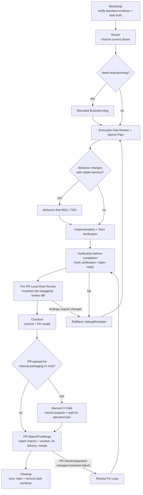

# Engineering Workflow Source of Truth

Version: **v1.4.27**
Last Updated: **2026-06-24**

## 0. Purpose
This file is the **only normative workflow specification** for engineering task execution in oasis7.

Mandatory rule:
1. Any workflow change must be edited in this file first.
2. After this file is updated, sync all related scripts/docs/skills to match.
3. PRs that change workflow scripts without updating this file are invalid.

## 1. Phase Diagram


### 1.1 Skill Map by Phase
This map makes skill reachability explicit. TPM owns the route decision as a workflow coordination act and records the selected skill path in `.pm/tasks/<TASK-UID>.execution.md` before delegated execution begins.

| Phase / trigger | Skill surface | Requiredness | Formal evidence |
| --- | --- | --- | --- |
| Any user request starts | `default-workflow-bootstrap` | Required before fact lookup, chat answer, professional slice dispatch, edits, verification, review, or external messaging unless already inside the bound task worktree | Bootstrap entry in `.pm/tasks/<TASK-UID>.execution.md` |
| Read-only professional/domain question | Matching professional bounded slice under TPM coordination after task/worktree bootstrap | Required when the answer depends on product/design/gameplay/game-visual-interaction/runtime/blockchain-ops/WASM/agent/viewer/QA/repository-health/liveops judgment; skipped only for pure fact lookup after task truth exists | Role-tagged slice return recorded in `.pm/tasks/<TASK-UID>.execution.md` and summarized to the user |
| Bound task needs next phase selection | `repo-owned-workflow-router` | Required after bootstrap and whenever phase is unclear | Route entry with selected/skipped skills in `.pm/tasks/<TASK-UID>.execution.md` |
| Scope is ambiguous, option-heavy, or visual enough to need ideation | `bounded-brainstorming` | Optional, risk-based | Brainstorming output or skip reason in execution log/project |
| Behavior changes with a stable automated harness | `tdd-test-writer` | Conditional required when RED criteria are met; otherwise skip reason required | RED command, failing evidence, and handoff contract |
| Repo truth is ready and implementation proceeds step by step | `executing-project-tasks` | Required for non-trivial execution after route selection | Atomic step evidence in `.pm/tasks/<TASK-UID>.execution.md` |
| Bug, failing test, broken script, unexpected diff, or regression appears | `systematic-debugging` | Conditional required before speculative fixes | Reproduction, narrowed hypothesis, fix evidence |
| Branch is about to create a PR | `requesting-repo-owned-review` | Required before PR creation; TPM must spawn or dispatch fresh local subagents for all involved relevant roles, collect review findings/no-findings/residual risk, and address or explicitly reject actionable findings with evidence before continuing | `Pre-PR Local Role Review: passed` execution-log packet with roles, review evidence, finding disposition, and residual risk |
| About to claim done/tests-pass/ready-for-PR/ready-to-merge | `verification-before-completion` | Required before completion claims | Fresh verification command/output or claim-ready evidence |
| Implementation is done and branch needs closeout/commit/PR/watch/merge | `finishing-a-development-branch` | Required for development branch closeout | Closeout output, commit, PR linkage, PR purpose decision, CI/review watch evidence, merge/cleanup evidence |
| GitHub PR receives review comments or requested changes | `receiving-code-review` | Required for actionable PR review feedback | Comment verification, fix evidence, thread status |
| Workflow skill/docs themselves are created or edited | `writing-repo-owned-skills` | Required for local skill surface changes | Source-of-truth-first sync plus `./scripts/lint-skills.sh` and governance checks |

### 1.2 Specialist Skill Reachability
Specialist skills are not mandatory workflow phases. They become reachable through TPM routing or professional subagent slice planning when the task domain matches their trigger.

- Product/planning docs: `prd`, `game-architect`; these may create planning artifacts, but the route, TODOs, and downstream handoff must still be recorded in `.pm/tasks/<TASK-UID>.execution.md`.
- Game/domain implementation: `game-design-theory`, `gameplay-mechanics`, `level-design`, `particle-systems`, `optimization-performance`, `memory-management`, `synchronization-algorithms`.
- Narrative/community/content: `epic-story-orchestrator-zh`, `content-creation`, `humanizer-zh`.
- Browser/visual/content tools: `agent-browser`, `gpt-image-2`, `xiaohongshu-note-analyzer`.
- Visual companion / Image2 target workflows are optional evidence, not universal gates. They may be used inside an existing task/worktree as visual target and screenshot-comparison evidence, but cannot replace implementation, real native/browser screenshots, interaction smoke, QA evidence, or PR review. Screenshot-only previews count as stable visual-comparison evidence, not real interaction coverage.

If a specialist skill is used, TPM must still bind it to the same owner, `.pm` task, canonical worktree, and PR chain through the subagent slice contract. TPM may route to specialist skills, but the specialist role owns the professional conclusion.

### 1.3 Parent Initiative + Domain Child Tasks
Use this pattern when one user-level initiative contains multiple independently
mergeable domain tracks, such as game strategy, visualization/player-facing UI,
and chain-world-state substrate. It exists to preserve repo truth while avoiding one
oversized task/PR that serializes unrelated module feedback loops.

Parent initiative task:
- has one owner role, usually `tpm`, and one `.pm` task/worktree/PR chain for
  coordination artifacts only
- owns north-star intent, child track list, dependency contracts, integration
  checkpoints, and the verification contract matrix
- does not own mixed-domain implementation, release claims, or professional
  conclusions that belong to child tasks or role slices
- may edit workflow/planning docs or templates only when those are the parent
  task's own scoped deliverable

Domain child task:
- has exactly one owner role, one `.pm` task, one canonical worktree, and one PR
  chain
- must be independently mergeable, with explicit acceptance criteria and a
  module-local verification gate
- records dependency inputs consumed from the parent or sibling children, and
  dependency outputs exposed back to them
- may use mocks, fixtures, fake services, or local simulations only with an
  explicit proof boundary and drift/expiry condition
- escalates to integration or release gates when it changes or claims behavior
  outside its module-local contract

Dependency contracts must record:
- producer and consumer child task or role
- covered schema, event vocabulary, rule, status surface, fixture, runbook, or
  acceptance boundary
- source of truth and expiry/drift condition
- required integration checkpoint and owner

Verification contract matrix:
```text
child task -> module_required -> module_full trigger -> integration_required trigger -> release_full owner/evidence
```

- `module_required`: per-child PR fast loop proving the module closes inside
  its own contract. Examples: unit tests, contract tests, schema/golden fixture
  checks, deterministic replay, small smoke tests, and module-local failure
  signature regression.
- `module_full`: risk-triggered module-local expansion. Examples: long-run,
  property/fuzz, stress/recovery, larger fixture corpus, historical failure
  signature sweep, slower browser/UI checks, or local multi-node simulation.
- `integration_required`: required when another module consumes the child
  contract, a PR claims cross-module behavior, a parent checkpoint is reached,
  or a shared schema/protocol/event vocabulary/resource semantic/world rule is
  changed.
- `release_full`: required for release or large merge confidence. It uses real
  services, real browsers, real nodes, or the closest production-like
  environment, plus long-run, rollback/recovery, player-visible path, Ops
  Evidence, and LiveOps Evidence where applicable.

Mocks, fixtures, and fake services can prove module contract handling; they
cannot prove real cross-module timing, network/storage/browser/node topology,
player release readiness, runtime consensus/replay/recovery, absence of
provider drift, or permission to skip release gates. Each mock/fixture contract
must record owner, source of truth, covered contract, uncovered risk, and
expiry/drift condition.

## 2. Responsibility Boundary
- `tpm`: default main Agent / workflow coordinator / canonical integrator only; owns phase decision, role allocation, subagent dispatch, integration order, task-truth writeback, fresh-verification gate coordination, completion-claim coordination, and PR chain coordination.
- TPM is not a professional execution role. TPM must not be the source of domain/professional analysis, implementation, verification judgment, code review judgment, product/design judgment, runtime/wasm/viewer/agent/QA/repository-health judgment, or liveops/community messaging.
- Professional/domain work must be done by the matching bounded subagent slice. This includes:
  - product/system design by `producer_system_designer`
  - gameplay design by `gameplay_designer`
  - game visual direction, interaction feel, player-facing screen flow, and visual readability by `game_visual_interaction_designer`
  - runtime/gameplay/server logic by `runtime_engineer`
  - blockchain/node operations, deployment choreography, upgrade/rollback drills, fleet health baselines, and node runbooks by `blockchain_ops_engineer`
  - WASM/platform/ABI work by `wasm_platform_engineer`
  - agent behavior/prompt/provider work by `agent_engineer`
  - Viewer/Web/UI work by `viewer_engineer`
  - verification strategy, test evidence, and release blocking judgment by `qa_engineer`
  - repository health stewardship, documentation/code alignment, semantic clarity, bug-risk surfacing, and technical-debt triage by `repository_health_engineer`
  - external messaging, community feedback, incidents, player promises, release notes, and channel runbooks by `liveops_community`
- professional role subagents provide bounded slices only (analysis/implementation/verification/review/liveops messaging) and must return artifacts to the TPM owner chain.
- TPM may perform mechanical orchestration edits to workflow governance surfaces, task logs, integration notes, and PR plumbing. If the work requires a professional conclusion, TPM must dispatch the matching role slice first and attribute the conclusion to that slice/evidence.
- For every request, TPM planning, TODO decomposition when needed, subagent slice contracts, and integration order are task execution truth and must be written to `.pm/tasks/<TASK-UID>.execution.md` before the delegated work begins.
- Every user request must enter the standard worktree flow before any substantive handling begins, including chat-only answers, read-only inspection, fact lookup, professional slice dispatch, implementation, verification, review, and external messaging.
- The only allowed pre-bootstrap work is mechanical enough to create or enter the task truth: inspect current git/worktree state, choose or confirm the task/worktree, and run the bootstrap helper.
- Do not first classify a request as "read-only", "chat-only", "pure fact lookup", or "professional judgment" to decide whether task/worktree truth is needed. That classification happens only after bootstrap, inside the bound task/worktree, and only controls whether TPM can answer from objective evidence or must dispatch a professional slice.
- Read-only/chat-only requests still split by judgment type after task truth exists:
  - Pure fact lookup, path lookup, command-output restatement, or mechanical evidence collection may be handled by TPM inside the bound task worktree, as long as the answer does not present a professional/domain conclusion.
  - Read-only professional/domain questions must be dispatched to the matching bounded professional role slice before the answer is presented as authoritative. Examples: "does viewer have a performance collection/evaluation mechanism", "is this QA evidence release-blocking", "what runtime design risk is present", "is this gameplay loop balanced/readable", "is this documentation/code contract drifting", "what node-ops risk is present in this rollout", or "how should LiveOps message this incident".
  - Such read-only professional slices require the same `.pm` task and canonical task worktree as any other request. Their required sink is `.pm/tasks/<TASK-UID>.execution.md`, plus the role-tagged user-facing answer.
  - TPM may gather raw files, commands, or repo context before dispatch only after bootstrap; the final user-facing answer must label TPM synthesis separately from professional role conclusions and cite the role/evidence that owns each professional conclusion.
- Canonical truth per ordinary user request or domain child task must remain single-threaded:
  - one owner role
  - one `.pm` task
  - one canonical worktree
  - one PR chain
- Parent initiatives do not weaken this invariant. They create coordination
  truth for multiple child tasks, while each child still satisfies the
  single-threaded invariant independently.

## 3. Gates
### 3.1 Required Gates (must pass)
1. **Task truth gate**: isolated worktree + bound `.pm` task + owner role confirmed.
2. **Planning gate**: PRD/project/execution truth aligned for scope and verification entry; TPM TODOs and any subagent slice plan are recorded in `.pm/tasks/<TASK-UID>.execution.md` before execution. Parent initiatives must also record child tracks, dependency contracts, integration checkpoints, and the verification contract matrix before child work depends on them.
3. **Execution gate**: atomic step evidence captured (`Action`, `Validation Command`, `Expected Result`, `Actual Result`, plus blocker fields when needed).
4. **Fresh verification gate**: current-round verification success before completion claims.
5. **Pre-PR local role review gate**: fresh local subagent review by all involved relevant roles, with actionable findings addressed or explicitly rejected with evidence.
6. **Closeout gate**: closeout metadata + task status transition + lint/governance checks + commit + PR creation.
7. **Post-PR watch/merge gate**: unless the PR is explicitly opened only to access manual-trigger packaging/release CI, watch normal PR required checks, mergeability, and PR comments/review threads to completion, fix failures through the review/debug loop, then merge and clean up. `REVIEW_REQUIRED` is informational and is not a blocking item by itself. `mergeStateStatus=BEHIND` is also informational by itself: if the PR stays mergeable, has no actionable comments/requested changes/blocking threads, and the repository/GitHub merge path accepts the merge without a local branch sync, the normal path may merge directly without rebasing first. If `mergeStateStatus=BLOCKED` is caused only by missing review approval, and the user/task policy explicitly authorizes skipping that approval, the normal path may use the repository's admin merge path after re-checking required checks, mergeability, requested changes, and PR comments/review threads.

### 3.2 Optional Gates (risk-based)
1. Bounded brainstorming gate (ambiguous scope / architecture tradeoffs).
2. TDD RED gate (behavior-changing tasks with stable harness).
3. Liveops/community gate (external messaging, incident, player promise changes).

## 4. Failure and Rollback Paths
### 4.1 Verification failure
- Stop completion claim.
- Record failure signature + blocker in execution sink.
- Route back to execution/debug phase.

### 4.2 Scope drift / unknown impact
- Stop speculative implementation.
- Update planning truth (PRD/project/execution) before resuming code edits.

### 4.3 PR check/requested-changes/comment failure
- Re-enter review-fix loop.
- Re-run fresh verification.
- Re-submit PR evidence.

### 4.3.1 Manual packaging CI hold
- If the PR exists specifically to run manual-trigger packaging/release CI jobs, record that purpose in the task execution log and do not auto-watch-to-merge.
- The hold record must include the manual job(s) or packaging purpose, responsible operator/role, expected success signal, stale-date/timeout escalation, ops readiness/rollback/runbook evidence when deployment or release ops are implicated, exact resume criterion, and external/status messaging evidence when the change is player- or community-facing.
- Resume the normal PR watch/fix/merge path only after the operator/user says the manual packaging CI purpose is complete and the PR should proceed to merge readiness.

### 4.4 Workflow governance drift
- If scripts/skills/docs conflict with this file, this file wins.
- Sync downstream artifacts immediately in the same change set where possible.

## 5. Normative Details (from legacy AGENTS workflow)
### 5.1 Worktree + task truth
- Every user request uses a dedicated task worktree by default, regardless of whether the immediate answer is chat-only, read-only, fact lookup, professional analysis, implementation, verification, review, or external messaging.
- Only explicit user authorization allows reuse of an existing task worktree.
- Do not classify work as `trivial`, `read-only`, `chat-only`, or `pure fact lookup` to bypass task worktree / `.pm` task setup.
- If incoming instructions or role notes appear to allow a read-only/chat-only bypass, this source-of-truth wins: bootstrap first, then route the already-bound request.
- Do not edit any files from the `main` branch/worktree; create or enter the relevant task worktree before making changes.
- Entering implementation requires owner role selection and `.pm` task binding.
- Cross-role collaboration must converge to one owner / one `.pm` task / one canonical worktree / one PR chain.
- Cross-domain initiatives may use the parent initiative + domain child task
  pattern in section 1.3. The parent carries coordination truth only; each child
  remains one owner / one `.pm` task / one canonical worktree / one PR chain.
- Task worktrees created through `./scripts/new-task-worktree.sh` must create a git-ignored `target` symlink to the repo-family shared cargo target cache resolved by `./scripts/cargo-dev.sh --print-target-dir`, so direct cargo and the development wrapper share local build artifacts by default.
- When Rust commands encounter Cargo package-cache or build-directory locks, wait for the shared repo-family cache to become available; do not switch ad hoc to a fresh temporary `CARGO_TARGET_DIR` just to bypass the lock.

### 5.2 TPM planning and subagent dispatch
- For every request, TPM must record the current plan, TODO decomposition when needed, selected roles, and integration order in `.pm/tasks/<TASK-UID>.execution.md` before dispatching professional subagent work.
- Project policy authorizes TPM to dispatch required bounded professional subagent slices directly whenever this workflow requires them; TPM must not pause for per-slice user permission. This project policy is an explicit standing user authorization to use subagents for workflow-required professional role slices; when a tool/runtime requires an "explicit user request for sub-agents, delegation, or parallel agent work", this policy satisfies that requirement for the matching repo-owned workflow slice. If the current runtime, connector, or tool policy still prevents actual subagent dispatch, TPM must record the intended dispatch, actual limitation, fallback evidence path, and attribution boundary in `.pm/tasks/<TASK-UID>.execution.md`, and must not present TPM's own analysis as a professional role conclusion.
- Each subagent slice must declare role, slice type, intended model configuration, actual dispatched model/reasoning, context delivery mode, mandatory context checklist/packet, write scope, return contract, validation command, mandatory `.pm` execution-log sink, and integration order.
- Default subagent runtime policy is defined only in `.codex/config.toml` under `[workflow.subagent_runtime]`. TPM should request that configured default for bounded professional slices when the available subagent tool permits model selection, unless the user explicitly requests another model or the slice contract records a concrete reason to use a stronger, faster, or cheaper model.
- Compatibility marker: Any non-default subagent model or reasoning effort must be recorded in the slice contract.
- Any actual non-default subagent model or reasoning effort must be recorded in the slice contract with the reason, such as high-risk architecture/review work, simple read-only exploration, a user-specified override, a connector/tool limitation that forces inheritance from the parent thread, or a requested model/reasoning selection whose actual dispatch cannot be verified. If the actual dispatched model cannot be verified, the contract must say `actual model: inherited/unverified` and explain why.
- Context delivery defaults to full-thread/full-history fork or the closest available equivalent so the subagent receives the same conversation and repository-governance context as TPM. The slice contract must still record a mandatory context checklist identifying the governance/task/user/repo/collaboration context the subagent is expected to have. A manually assembled explicit context packet is allowed only as a delivery supplement or fallback when full-history fork is unavailable, unsafe, stalled, or incompatible with required model/reasoning selection; the slice contract must record that fallback reason.
- Compatibility marker: mandatory context packet means the recorded mandatory context checklist/packet, not necessarily a manually assembled explicit delivery packet.
- Compatibility marker: The mandatory context packet must include:
- The mandatory context checklist/packet must include:
  - identity and authority: assigned role, role card path, owner role, and TPM integration owner
  - workflow governance: `AGENTS.md`, `doc/engineering/workflow/source-of-truth.md`, and the selected workflow skills
  - task truth: current `.pm/tasks/<TASK-UID>.yaml`, `.pm/tasks/<TASK-UID>.execution.md`, canonical worktree, branch, base ref, and PR link/status when present
  - user intent and acceptance target: original request summary, current TODO, explicit non-goals, and done/verification expectations
  - scoped repo context: relevant `prd.md`, `project.md`, handoff, changed paths, current diff or evidence summary, and known constraints such as `third_party` read-only boundaries
  - collaboration boundary: sibling slices, write-scope conflicts, integration order, allowed commands, return contract, and formal sink
- `AGENTS.md` and the assigned role card are mandatory inputs for implementation, verification, review, or domain-specialist slices. A narrow read-only explorer slice may omit the role card only when the slice contract records the exemption reason and the exact files to inspect; it still runs after task/worktree bootstrap and records its sink in `.pm`.
- TPM read-only exploration is allowed only to gather routing context, inspect task truth, or integrate returned evidence. It must not be reported as a professional finding unless a matching professional role slice owns or verifies that finding.
- TPM user-facing summaries must distinguish procedural synthesis from professional conclusions. Professional conclusions must be traceable to subagent artifacts, execution evidence, handoff, project/prd records, or PR evidence.
- Project docs, handoff files, signals, memory, and PR evidence may supplement the `.pm` execution log, but they do not replace it for task execution truth.
- Parent initiative records, child task packets, dependency contracts, fixture
  contracts, and verification contract matrices may supplement `.pm` task truth,
  but each active parent or child still needs its own `.pm` execution log sink.
- If the plan changes during execution, TPM must append an execution-log update before continuing the changed work.
- Pre-task discoveries, loose TODOs, and follow-up ideas found before an owner decides to create a `.pm` task should be captured with `./scripts/pm/capture-todo.sh --source-ref <path> --summary "<text>"`. This records a `source_type=reflection` signal by default and must not be treated as committed task truth until explicitly promoted with `--create-task` or another task-creation path.

### 5.2.1 Read-only specialist routing
- The task/worktree decision and the professional-slice decision are intentionally decoupled:
  - Task/worktree truth is required for every request.
  - Professional judgment controls whether a matching bounded role slice is required after bootstrap.
- Therefore, a read-only request must enter `default-workflow-bootstrap` first and may still require a professional role slice.
- Minimal read-only specialist slice contract:
  - role and slice type (`read_only_analysis`, `verification_judgment`, `review_judgment`, or `liveops_messaging`)
  - intended model configuration, defaulting to the `Default subagent runtime` policy unless an override reason is recorded
  - actual dispatch model/reasoning, or `inherited/unverified` with the connector/tool limitation, stalled default context delivery, or unverifiable actual dispatch reason
  - context delivery mode, defaulting to full-thread/full-history fork unless a recorded fallback reason requires explicit context
  - exact question to answer and explicit non-goals
  - scoped files/commands/evidence to inspect
  - return contract with conclusion, evidence, uncertainty, and whether repository writeback is recommended
  - attribution rule for the final answer
- Read-only specialist slice contracts must be recorded in `.pm/tasks/<TASK-UID>.execution.md`; chat/thread text may supplement but not replace the `.pm` sink.
- Pure evidence questions may be answered by TPM directly only after bootstrap and only when the user asks for an objective fact such as "does this file exist", "what command output says", or "which paths match this search".
- If a read-only specialist slice recommends changing repository state, TPM continues in the already-bound canonical task worktree and records the changed route in `.pm` before applying changes.

### 5.3 Execution evidence
- Atomic steps should be recorded with `Action / Validation Command / Expected Result / Actual Result`.
- If blocked, also record `Blocker / Next Action`.
- For tasks started with the `2026-05-23` execution-log template or later, these fields are mandatory per entry.

### 5.4 Claim / closeout chain
- Before completion claims, run fresh verification (prefer `./scripts/pm/claim-ready.sh --claim-type <type> --verify-command "<cmd>"` when applicable).
- Do not move the task to final closeout / `done` before pre-PR local role review has passed when the task is on a PR path. The order is: fresh verification -> pre-PR local role review -> address findings -> final closeout/status packet -> commit -> PR preflight/create.
- Closeout should run `./scripts/pm/task-closeout.sh --role <owner_role> --task-uid <TASK-UID> --verify-command "<fresh cmd>"` (or equivalent manual chain) after valid local role-review findings are resolved. If a helper must be run earlier for a readiness packet, the execution log must label that packet as readiness evidence rather than final done state.
- For `done` closeout, fresh verification must be from the current round and post-review findings must be addressed or explicitly rejected with evidence.

### 5.5 PR and review chain
- Standard path is local role-subagent review + GitHub PR + required checks + PR comment/thread closeout + mergeability.
- The workflow no longer requests Copilot review as a PR helper step.
- Before PR creation, TPM must create or dispatch fresh local review subagents for every involved relevant professional role in the diff scope. At minimum, use changed paths, role ownership, task slice history, user-facing claims, and verification claims to select roles; include `producer_system_designer` when scope, product contract, user promise, acceptance, or system-level semantics change; include `gameplay_designer` when gameplay rules, progression, balance, encounter/resource loops, or player verb semantics are touched; include `game_visual_interaction_designer` when visible UI/gameplay presentation, visual direction, interaction feel, player-facing screen flow, screenshot/visual-review surfaces, accessibility/readability, or UI-heavy claims are touched; include `runtime_engineer` when runtime/server/simulation/gameplay enforcement, replay, recovery, checkpoint, long-run behavior, or `crates/oasis7*` runtime paths are touched; include `blockchain_ops_engineer` when deployment, node ops, topology/inventory, service/host contracts, health baselines, upgrade/rollback/restore drills, packaging/release ops, or operator-facing runbooks are touched; include `wasm_platform_engineer` when `crates/oasis7_wasm_*`, builtin wasm modules, ABI/schema, manifest/hash, wasm build/receipt, wasm determinism workflows, or `doc/world-runtime/wasm/*` are touched; include `agent_engineer` when agent behavior, prompts, provider contracts, model/runtime config, subagent dispatch contracts, or agent tooling are touched; include `viewer_engineer` when Viewer/Web/UI/WebGPU/browser validation paths are touched; include `qa_engineer` when the claim involves verification, release readiness, test strategy, or evidence sufficiency; include `repository_health_engineer` when the diff changes cross-cutting architecture, shared workflow surfaces, docs/code contracts, large refactors, repeated bug signatures, workflow scripts/skills, or known technical-debt boundaries; include `liveops_community` when external messaging, incidents, player promises, community feedback, release notes, or channel runbooks are touched.
- `scripts/prepare-task-pr.sh --create` must mechanically reject a passed review packet when changed-path inference identifies required roles that are missing from `Review Roles`. This script check is a minimum backstop; TPM remains responsible for adding roles implied by task history and user-facing claims that path inference cannot see.
- Verification must map to the changed surface, not only to one generic command. Gameplay changes need playability/economy/motivation-loop evidence tied to `doc/game` truth; runtime changes need the relevant cargo checks/tests plus replay/recovery/checkpoint/long-run evidence where applicable; WASM ABI/platform changes need support-crate/executor tests and, for publishable or builtin module pipeline changes, deterministic build/gate evidence or an explicit defer-to-GitHub/manual evidence packet; UI/player-facing changes need S6 screenshot/model-visual-review evidence or an explicit visual-evidence exemption; release/manual packaging changes need first-class Ops Evidence covering readiness, rollback/runbook, and success/resume evidence; player- or community-facing changes need first-class LiveOps Evidence covering messaging, release-note/status, and audience impact.
- Domain child tasks in a parent initiative must state their
  `module_required` verification command or evidence, the `module_full` trigger,
  and the conditions that escalate to `integration_required` or `release_full`.
  A module-local pass is not release-ready evidence unless the corresponding
  integration/release gates are also satisfied or explicitly deferred with a
  named owner and resume criterion.
- Each local role review must return `findings` or `no_findings` plus `residual_risk`. TPM must fix valid findings or record why a finding is stale/rejected with code or doc evidence before PR creation.
- `scripts/prepare-task-pr.sh --create` must refuse to create the PR unless the task execution log contains a passed pre-PR local role review packet for the source worktree. The packet marker is:
  - `Pre-PR Local Role Review: passed`
  - `Task UID: <task_uid>`
  - `Source Worktree: <absolute path>`
  - `Source Branch: <branch>`
  - `Source Head: <reviewed git sha; must be current source head or an ancestor whose later changes are only the task review evidence files or generated PM task registry/backlog views>`
  - `Comparison Ref: <base ref>`
  - `Reviewed Changed Paths: <semicolon-separated paths or diff summary ref>`
  - `Review Package: <path to review package or n/a with reason>`
  - `Role Selection Basis: <changed paths + task slice history + explicit includes/skips>`
  - `Review Roles: <comma-separated roles>`
  - `Review Evidence: <per-role section or handoff refs>`
  - `Review Verdicts: <per-role scope/spec compliance verdict + role quality/risk verdict>`
  - `Review Findings Disposition: addressed` or `Review Findings Disposition: no_findings`
  - `Finding Disposition Evidence: <fix refs or rejected/stale evidence refs>`
  - `Verification Matrix: <changed surface -> required evidence -> observed evidence or explicit deferral>`
  - `Parent/Child Evidence: <parent initiative packet / child task packet / verification contract matrix or n/a with reason>`
  - `Mock/Fixture Evidence: <contract paths or n/a with reason>`
  - `Visual Evidence: <screenshot/model visual review paths or n/a with exemption reason>`
  - `WASM Evidence: <support crate/determinism evidence or n/a with reason>`
  - `Ops Evidence: <readiness/rollback/runbook/operator evidence or n/a with reason>`
  - `LiveOps Evidence: <messaging/release-note/status/community evidence or n/a with reason>`
  - `Residual Risk: <text>`
  - `Slice Ledger: <path to slice ledger or n/a with reason>`
- Pre-PR local role review should use file-based review packages for non-trivial diffs. `./scripts/pm/review-package.sh --base <ref> --head <ref> --task-uid <TASK-UID>` writes the commit list, stat summary, and contextual diff under ignored `.pm/scratch/<TASK-UID>/review-packages/`; the execution log records only the path and summary. Use `n/a` only when the diff is empty or the review target is not a git diff, and record the reason.
- Pre-PR local role review verdicts must distinguish scope/spec compliance from role quality/risk for each reviewer role. The role remains the professional owner; this dual-verdict structure is a packet format, not permission to replace involved-role review with a generic reviewer.
- Long multi-slice tasks should maintain a lightweight slice ledger with `./scripts/pm/slice-ledger.sh --task-uid <TASK-UID> ...`. The ledger is an ignored JSONL resume map for slice status, artifact paths, verdicts, residual risk, and next action. `.pm/tasks/<TASK-UID>.execution.md` remains canonical task truth and must link to the ledger rather than relying on it as the only sink. When a review dispatch needs more roles than the current subagent runtime can run concurrently, TPM must batch the roles, record batch order and priority, record timeout/no-payload policy before dispatch, and distinguish partial results from all-role completion.
- Before merge, explicitly check PR comments and review threads. If any actionable comments or unresolved blocking threads exist, fix + re-verify + resolve or answer them before the merge claim.
- After PR creation, TPM must record the PR purpose decision:
  - `normal_pr_ci_watch`: default. Use this unless the user or task truth says the PR was opened only to access manual-trigger packaging/release CI jobs.
  - `manual_packaging_ci_hold`: allowed only when the PR is explicitly created for manual-trigger packaging/release CI. Record manual job(s) or packaging purpose, responsible operator/role, expected success signal, stale-date/timeout escalation, ops readiness/rollback/runbook evidence when deployment or release ops are implicated, external/status messaging evidence when player- or community-facing, and the exact resume criterion. Stop before auto-merge until the operator/user resumes the normal path.
- For `normal_pr_ci_watch`, TPM continues without waiting for another user prompt: watch the PR's normal required checks, mergeability, review decisions, and PR comments/review threads. `REVIEW_REQUIRED` is a status signal to report, not a blocker. If checks fail, review requests changes, actionable comments appear, unresolved blocking review threads remain, or the merge API/branch protection rejects the merge for reasons other than review approval, route through the fix loop, rerun fresh verification, push fixes or answer/resolve comments, and continue watching.
- If GitHub reports `mergeStateStatus=BEHIND`, treat it as a branch-sync signal, not an automatic blocker. When the PR is still mergeable and the repository/GitHub merge path accepts the merge without requiring a local branch sync, TPM may merge directly after the same checks/comments/thread closeout steps. If GitHub refuses because the branch must be updated first or because a conflict/non-mergeable state exists, sync the branch to the current base, rerun fresh verification as needed, push, and continue watching.
- If GitHub reports `mergeStateStatus=BLOCKED` / `REVIEW_REQUIRED` only because review approval is missing, and the current user request or task truth explicitly authorizes skipping review approval, TPM may use the repository's admin merge path as part of the normal PR watch/merge flow. Before doing so, TPM must re-check that required checks pass, the PR is mergeable, no requested changes remain, PR comments/review threads have been checked, and no actionable comments or unresolved blocking review threads remain. Admin merge must not be used for failed checks, non-mergeable code state, requested changes, unresolved actionable comments/threads, manual packaging CI holds, or unrelated branch-protection failures.
- Once normal required checks pass, the PR is mergeable by the repository/GitHub merge path or by the authorized review-approval admin path above, PR comments/review threads have been checked, and no actionable comments, requested changes, or unresolved blocking review threads remain, merge the PR using the repository's configured merge method, then sync local `main` and clean up the task worktree/branch.
- After merge, sync local `main` and clean up task worktree/branch.

## 6. Required Artifacts by Phase
- Bootstrap/Router: decision record in `.pm/tasks/<TASK-UID>.execution.md`; project or handoff records may supplement it.
- Planning/Dispatch: TPM TODO decomposition and subagent slice contracts in `.pm/tasks/<TASK-UID>.execution.md`.
- Parent initiative planning: parent initiative packet, child task packet list,
  dependency contracts, integration checkpoints, verification contract matrix,
  and mock/fixture proof boundaries when local substitutes are used.
- Execution: atomic evidence records per risky step.
- Verification: claim-ready command + output evidence.
- Pre-PR local role review: involved-role subagent review packet, review package path or explicit `n/a`, required-role coverage, per-role dual verdicts, finding disposition, verification matrix, visual/WASM/ops evidence or explicit exemptions, residual risk, and slice ledger path or explicit `n/a`.
- Closeout: closeout command output, task status update, pre-PR local role review evidence, PR linkage, PR purpose decision, CI/review watch evidence, merge evidence, and cleanup evidence.

## 7. Change Log
- **v1.4.27 (2026-06-24)**
  - Added the parent initiative + domain child task pattern for multi-track initiatives that need independently mergeable strategy, visualization, P2P, or other domain work while preserving one owner/task/worktree/PR chain per child.
  - Added dependency contracts, integration checkpoints, and the verification contract matrix with `module_required`, `module_full`, `integration_required`, and `release_full` tiers.
  - Clarified mock/fixture/fake-service proof boundaries and drift/expiry requirements so module-local green tests cannot be mistaken for release-ready evidence.
- **v1.4.26 (2026-06-23)**
  - Tightened pre-PR role inference backstops for producer product/system docs, viewer/launcher implementation/docs/scripts, and agent/subagent workflow contract surfaces.
  - Clarified semantic review evidence behavior by distinguishing generic `n/a` from explicit deferral/exemption reasons across runtime, gameplay, visual, ops, and liveops evidence.
  - Added regression coverage for role inference drift, generic `n/a` rejection, and explicit visual/ops/liveops deferral acceptance.
- **v1.4.25 (2026-06-23)**
  - Added first-class `Ops Evidence` and `LiveOps Evidence` pre-PR review packet fields and required semantic evidence checks for inferred professional roles.
  - Tightened PR helper backstops for CI workflow/shared scope planner repository-health review, builtin WASM module platform review, runtime gates for core WASM dependencies, and generated PM task-view post-review allowlisting.
  - Expanded changed-path role inference coverage for producer/product-system, runtime world docs, gameplay simulator docs, visual testing docs, liveops/readme/release/status docs, and ops topology/readiness/preflight/packaging surfaces.
  - Synced manual packaging CI hold requirements across failure/rollback and PR sections so stale/timeout, ops readiness, rollback/runbook, resume, and external/status messaging evidence are consistently required.
- **v1.4.24 (2026-06-22)**
  - Clarified pre-PR local role review before final closeout/commit/PR creation to avoid done-before-review churn.
  - Expanded involved-role selection triggers across all professional roles and required `prepare-task-pr.sh --create` to reject missing required roles inferred from changed paths.
  - Added surface-specific verification matrix expectations for gameplay, runtime, WASM, UI/visual, and manual packaging/release ops evidence.
  - Added batching/timeout policy for large all-role review dispatches and stronger manual packaging hold ownership/resume criteria.
- **v1.4.23 (2026-06-22)**
  - Added file-based review package and lightweight slice ledger artifacts for pre-PR local role review, while keeping `.pm/tasks/<TASK-UID>.execution.md` canonical.
  - Required pre-PR role review packets to record `Review Package`, per-role dual `Review Verdicts`, and `Slice Ledger` fields.
  - Clarified that dual verdicts strengthen involved-role review and do not replace oasis7 professional role ownership with a generic reviewer.
- **v1.4.22 (2026-06-18)**
  - Removed the retired `xiaohongshu` automation skill from the specialist skill reachability list while keeping `xiaohongshu-note-analyzer`.
- **v1.4.21 (2026-06-11)**
  - Added `repository_health_engineer` as the professional role for repository health stewardship, documentation/code alignment, semantic clarity, bug-risk surfacing, and technical-debt triage.
  - Extended read-only professional routing and pre-PR local role review selection so repository-health judgment comes from the matching bounded role slice.
- **v1.4.20 (2026-06-08)**
  - Clarified that repo-owned workflow subagent policy is an explicit standing user authorization that satisfies tool-level explicit subagent/delegation request requirements for required professional slices.
- **v1.4.19 (2026-06-08)**
  - Clarified that oasis7 project policy authorizes TPM to dispatch required bounded professional subagent slices without per-slice user permission.
  - Required TPM to record intended dispatch, runtime/tool limitation, fallback evidence path, and attribution boundary when actual subagent dispatch is blocked by the current environment.
- **v1.4.18 (2026-06-08)**
  - Added `./scripts/lint-skills.sh` as the local skill-surface hygiene gate for entrypoint size, trigger-focused descriptions, supporting-file reachability, and core workflow failure-mode sections.
  - Clarified that `writing-repo-owned-skills` verification includes the skill lint gate alongside existing governance checks.
- **v1.4.17 (2026-06-07)**
  - Added `blockchain_ops_engineer` to the formal professional-role roster and read-only specialist routing matrix.
  - Synced canonical role enumerations so handoff and slice-card surfaces stay aligned with the standard role list.
- **v1.4.16 (2026-06-07)**
  - Added `gameplay_designer` as a formal professional role between system/product design and visual/interaction design.
  - Clarified that gameplay-loop, progression, balance, encounter/resource-loop, and player-verb judgments belong to `gameplay_designer`.
  - Extended pre-PR local review role selection guidance to include `gameplay_designer` when gameplay semantics are touched.
- **v1.4.15 (2026-06-04)**
  - Clarified that `mergeStateStatus=BEHIND` is informational by itself and does not force a local rebase when the PR remains mergeable and the repository/GitHub merge path accepts a direct merge.
  - Kept branch sync/rebase required only when GitHub actually refuses the behind branch because an update or conflict resolution is needed.
- **v1.4.14 (2026-06-04)**
  - Defined review-approval-only `mergeStateStatus=BLOCKED` as a normal admin merge path when user/task policy explicitly authorizes skipping review approval.
  - Kept admin merge forbidden for failed checks, non-mergeable code state, requested changes, unresolved actionable comments/threads, manual packaging CI holds, and unrelated branch-protection failures.
- **v1.4.13 (2026-06-04)**
  - Clarified that `REVIEW_REQUIRED` is informational and is not a blocking merge item by itself.
  - Kept actual blockers on required-check failures, requested changes, actionable/unresolved PR comments or review threads, non-mergeable state, and repository/GitHub merge rejection.
- **v1.4.12 (2026-06-04)**
  - Added the post-PR purpose decision: normal PRs proceed into CI/review watch, failure fix loop, merge, and cleanup without waiting for another prompt.
  - Added the manual packaging/release CI hold exception for PRs opened specifically to access manual-trigger packaging CI jobs.
  - Clarified that merge readiness requires an explicit PR comment/review-thread check before merge.
- **v1.4.11 (2026-06-03)**
  - Replaced the optional/risk-based local supplemental review gate with a required pre-PR local role-subagent review gate.
  - Removed the Copilot review request from the standard PR helper flow.
  - Required `prepare-task-pr.sh --create` to verify passed local role review evidence in the task execution log before creating a PR.
- **v1.4.10 (2026-06-03)**
  - Updated the default subagent runtime policy.
  - Consolidated synced guidance, templates, and workflow eval checks to reference the section 5.2 `Default subagent runtime` policy instead of duplicating the concrete model string.
  - Added the `capture-todo.sh` pre-task discovery intake path for loose TODOs and follow-up ideas that should become `reflection` signals before any explicit `.pm` task promotion.
  - 2026-06-08 amendment: moved the concrete default subagent runtime value into the repo-tracked `.codex/config.toml` `[workflow.subagent_runtime]` block so the model configuration has one canonical source.
  - 2026-06-08 amendment: updated the workflow source-of-truth and workflow eval contract to reference the config-backed policy instead of carrying the concrete runtime value in prose.
- **v1.4.9 (2026-06-02)**
  - Clarified that request-type classification cannot happen before task/worktree bootstrap; bootstrap happens first, then read-only/professional routing.
  - Required subagent slice contracts to distinguish intended default model from actual dispatched model, including inherited/unverified connector cases.
  - Made full-thread/full-history context the default subagent context delivery mode, with mandatory context checklist recording and explicit context packets as delivery supplement/fallback only when recorded.
- **v1.4.8 (2026-06-01)**
  - Required every user request to create or enter standard task worktree / `.pm` task truth before substantive handling, including read-only, chat-only, and pure fact lookup requests.
  - Removed the read-only/chat-only bypass for `default-workflow-bootstrap`; read-only professional slices now record their contract and sink in `.pm/tasks/<TASK-UID>.execution.md`.
  - Clarified that professional routing still happens after bootstrap, but no request is handled outside task/worktree truth.
- **v1.4.7 (2026-06-01)**
  - Defined the sink for unbound read-only professional slices as the role-tagged user-facing answer or preserved chat/thread transcript. Superseded by v1.4.8, which forbids unbound read-only professional slices.
  - Clarified that `.pm` execution-log sinks are mandatory for task-bound or repository-changing subagent work, not for standalone read-only professional answers. Superseded by v1.4.8, which requires `.pm` task truth for every request.
- **v1.4.6 (2026-06-01)**
  - Added the default subagent runtime policy.
  - Required slice contracts to record model configuration and reasons for non-default model/reasoning overrides.
- **v1.4.5 (2026-06-01)**
  - Split read-only/chat-only handling into pure fact lookup versus read-only professional/domain judgment.
  - Required matching professional role slices for read-only professional questions without forcing task/worktree bootstrap unless repository writeback follows. Superseded by v1.4.8, which forces bootstrap first.
  - Added a minimal read-only specialist slice contract and explicit examples.
- **v1.4.4 (2026-06-01)**
  - Clarified that TPM is a workflow coordinator/canonical integrator only, not a professional execution role.
  - Required professional/domain analysis, implementation, verification judgment, review judgment, and liveops/community messaging to come from matching bounded subagent slices.
  - Limited TPM read-only exploration to routing/integration context unless a professional slice owns or verifies the resulting conclusion.
- **v1.4.3 (2026-06-01)**
  - Defined the mandatory subagent context packet so identity, workflow governance, task truth, user intent, repo context, and collaboration boundaries are provided before dispatch.
  - Required `AGENTS.md` and the assigned role card for non-read-only subagent slices, with explicit exemption reasons for narrow read-only explorer slices.
- **v1.4.2 (2026-06-01)**
  - Added the normative skill map by workflow phase so each core skill has an explicit trigger, requiredness level, and evidence sink.
  - Clarified that specialist skills are domain-triggered through TPM routing rather than mandatory default workflow phases.
- **v1.4.1 (2026-06-01)**
  - Tightened TPM planning governance: TODO decomposition, subagent slice contracts, and integration order must be written to the task execution log before delegated work begins.
  - Clarified that other formal sinks may supplement but cannot replace `.pm/tasks/<TASK-UID>.execution.md` for task execution truth.
- **v1.4.0 (2026-06-01)**
  - Added `tpm` as the default main Agent / orchestrator / canonical integrator.
  - Required all professional roles to participate as bounded subagent slices under TPM coordination.
- **v1.3.0 (2026-06-01)**
  - Removed the `trivial` / `non-trivial` workflow split for repository-changing work.
  - Required every repository-changing request to enter the standard task worktree + `.pm` task flow before edits begin.
  - Kept read-only inspection and chat-only answers outside repository writeback requirements. Superseded by v1.4.8, which requires task/worktree truth for every request.
- **v1.2.3 (2026-05-28)**
  - Required all file edits to happen from a task worktree instead of the `main` branch/worktree.
- **v1.2.2 (2026-05-26)**
  - Required PR helper Copilot review requests to use a verifiable requested-reviewers API path and warn when the request does not stick.
- **v1.2.1 (2026-05-26)**
  - Tightened macOS local workflow compatibility: workflow helpers should avoid bash 4-only builtins and GNU-only `find -printf` in default gates.
  - Clarified that expired task-scoped working-memory entries keep structural lint coverage without requiring machine-local transcript source files to remain present.
- **v1.2.0 (2026-05-25)**
  - Required new task worktrees to link ignored `target` to the repo-family shared cargo target cache.
- **v1.1.0 (2026-05-25)**
  - Restored high-impact normative details that were previously only in `AGENTS.md` (worktree/task-truth policy, execution evidence fields, claim/closeout chain, PR/review chain).
  - Clarified semantic migration to avoid policy loss after dedup.
- **v1.0.0 (2026-05-25)**
  - Created single source-of-truth workflow spec with phase diagram, role boundary, required/optional gates, and rollback paths.
  - Established policy: workflow changes must update this document first, then sync scripts/docs/skills.


## 8. Semantic Migration Checklist
This checklist records whether key legacy `AGENTS.md` workflow semantics were preserved here to avoid policy loss during deduplication.

- [x] Single owner / single `.pm` task / single worktree / single PR chain.
- [x] Parent initiative + domain child tasks preserve the single-chain invariant per child while allowing coordination truth for independently mergeable multi-track work.
- [x] Standard task worktree flow for every user request, with explicit-reuse-only policy.
- [x] Owner role selection and `.pm` task binding before implementation.
- [x] TPM planning/TODO decomposition and subagent slice contracts written to `.pm` execution log before delegated execution.
- [x] TPM is workflow coordinator/integrator only; professional findings and judgments must come from matching role slices.
- [x] Read-only professional/domain questions require matching bounded role slices after task/worktree bootstrap.
- [x] Subagent intended model configuration defaults to the `Default subagent runtime` policy; actual dispatched model/reasoning and non-default/inherited/unverified rationale are recorded.
- [x] Subagent context checklist/packet includes identity, governance, task truth, user intent, scoped repo context, and collaboration boundaries.
- [x] Mandatory execution evidence fields and blocker recording.
- [x] Current-round fresh verification before completion claim.
- [x] Pre-PR local role-subagent review packet before PR creation.
- [x] Closeout command chain and `done` verification strictness.
- [x] Local role-subagent review + GitHub PR + required checks + PR comment/thread closeout + mergeability as formal review/merge boundary; `REVIEW_REQUIRED` is informational, not a blocker.
- [x] PR review fix loop: fix -> re-verify -> resolve threads -> merge claim.
- [x] Workflow phase-to-skill map preserves required, conditional, optional, and specialist skill reachability.
- [x] Verification contract matrix distinguishes module-local gates from integration/release gates, and mock/fixture evidence records proof boundaries.

If any item above changes, update this file first and then sync downstream docs/skills/scripts.
