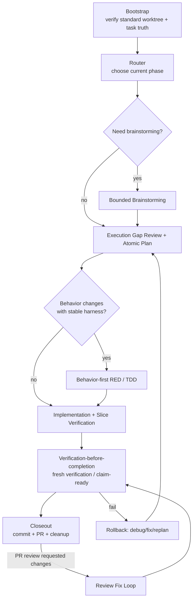

# Engineering Workflow Source of Truth

Version: **v1.4.4**
Last Updated: **2026-06-01**

## 0. Purpose
This file is the **only normative workflow specification** for engineering task execution in oasis7.

Mandatory rule:
1. Any workflow change must be edited in this file first.
2. After this file is updated, sync all related scripts/docs/skills to match.
3. PRs that change workflow scripts without updating this file are invalid.

## 1. Phase Diagram

### 1.1 Skill Map by Phase
This map makes skill reachability explicit. TPM owns the route decision as a workflow coordination act and records the selected skill path in `.pm/tasks/<TASK-UID>.execution.md` before delegated execution begins.

| Phase / trigger | Skill surface | Requiredness | Formal evidence |
| --- | --- | --- | --- |
| Repository-changing request starts | `default-workflow-bootstrap` | Required before edits unless the user explicitly authorized reuse of a bound task worktree | Bootstrap entry in `.pm/tasks/<TASK-UID>.execution.md` |
| Bound task needs next phase selection | `repo-owned-workflow-router` | Required after bootstrap and whenever phase is unclear | Route entry with selected/skipped skills in `.pm/tasks/<TASK-UID>.execution.md` |
| Scope is ambiguous, option-heavy, or visual enough to need ideation | `bounded-brainstorming` | Optional, risk-based | Brainstorming output or skip reason in execution log/project |
| Behavior changes with a stable automated harness | `tdd-test-writer` | Conditional required when RED criteria are met; otherwise skip reason required | RED command, failing evidence, and handoff contract |
| Repo truth is ready and implementation proceeds step by step | `executing-project-tasks` | Required for non-trivial execution after route selection | Atomic step evidence in `.pm/tasks/<TASK-UID>.execution.md` |
| Bug, failing test, broken script, unexpected diff, or regression appears | `systematic-debugging` | Conditional required before speculative fixes | Reproduction, narrowed hypothesis, fix evidence |
| Major/high-risk diff needs local supplemental review | `requesting-repo-owned-review` | Optional, risk-based; does not replace GitHub review | Findings/no-findings packet and residual risk |
| About to claim done/tests-pass/ready-for-PR/ready-to-merge | `verification-before-completion` | Required before completion claims | Fresh verification command/output or claim-ready evidence |
| Implementation is done and branch needs closeout/commit/PR | `finishing-a-development-branch` | Required for development branch closeout | Closeout output, commit, PR linkage |
| GitHub PR receives review comments or requested changes | `receiving-code-review` | Required for actionable PR review feedback | Comment verification, fix evidence, thread status |
| Workflow skill/docs themselves are created or edited | `writing-repo-owned-skills` | Required for local skill surface changes | Source-of-truth-first sync plus governance checks |

### 1.2 Specialist Skill Reachability
Specialist skills are not mandatory workflow phases. They become reachable through TPM routing or professional subagent slice planning when the task domain matches their trigger.

- Product/planning docs: `prd`, `game-architect`; these may create planning artifacts, but the route, TODOs, and downstream handoff must still be recorded in `.pm/tasks/<TASK-UID>.execution.md`.
- Game/domain implementation: `game-design-theory`, `gameplay-mechanics`, `level-design`, `audio-systems`, `particle-systems`, `optimization-performance`, `memory-management`, `asset-optimization`, `synchronization-algorithms`, `monetization-systems`.
- Narrative/community/content: `epic-story-orchestrator-zh`, `content-creation`, `humanizer-zh`.
- Browser/visual/content tools: `agent-browser`, `gpt-image-2`, `xiaohongshu`, `xiaohongshu-note-analyzer`.

If a specialist skill is used, TPM must still bind it to the same owner, `.pm` task, canonical worktree, and PR chain through the subagent slice contract. TPM may route to specialist skills, but the specialist role owns the professional conclusion.

## 2. Responsibility Boundary
- `tpm`: default main Agent / workflow coordinator / canonical integrator only; owns phase decision, role allocation, subagent dispatch, integration order, task-truth writeback, fresh-verification gate coordination, completion-claim coordination, and PR chain coordination.
- TPM is not a professional execution role. TPM must not be the source of domain/professional analysis, implementation, verification judgment, code review judgment, product/design judgment, runtime/wasm/viewer/agent/QA judgment, or liveops/community messaging.
- Professional/domain work must be done by the matching bounded subagent slice. This includes:
  - product/system design by `producer_system_designer`
  - runtime/gameplay/server logic by `runtime_engineer`
  - WASM/platform/ABI work by `wasm_platform_engineer`
  - agent behavior/prompt/provider work by `agent_engineer`
  - Viewer/Web/UI work by `viewer_engineer`
  - verification strategy, test evidence, and release blocking judgment by `qa_engineer`
  - external messaging, community feedback, incidents, player promises, and channel runbooks by `liveops_community`
- professional role subagents provide bounded slices only (analysis/implementation/verification/review/liveops messaging) and must return artifacts to the TPM owner chain.
- TPM may perform mechanical orchestration edits to workflow governance surfaces, task logs, integration notes, and PR plumbing. If the work requires a professional conclusion, TPM must dispatch the matching role slice first and attribute the conclusion to that slice/evidence.
- TPM planning, TODO decomposition, subagent slice contracts, and integration order are task execution truth and must be written to `.pm/tasks/<TASK-UID>.execution.md` before the delegated work begins.
- Every request that changes repository state must enter the standard worktree flow before edits begin; chat-only answers and read-only inspection may be handled directly without repository writeback.
- Canonical truth per repository-changing request must remain single-threaded:
  - one owner role
  - one `.pm` task
  - one canonical worktree
  - one PR chain

## 3. Gates
### 3.1 Required Gates (must pass)
1. **Task truth gate**: isolated worktree + bound `.pm` task + owner role confirmed.
2. **Planning gate**: PRD/project/execution truth aligned for scope and verification entry; TPM TODOs and any subagent slice plan are recorded in `.pm/tasks/<TASK-UID>.execution.md` before execution.
3. **Execution gate**: atomic step evidence captured (`Action`, `Validation Command`, `Expected Result`, `Actual Result`, plus blocker fields when needed).
4. **Fresh verification gate**: current-round verification success before completion claims.
5. **Closeout gate**: closeout metadata + task status transition + lint/governance checks + commit + PR creation.

### 3.2 Optional Gates (risk-based)
1. Bounded brainstorming gate (ambiguous scope / architecture tradeoffs).
2. TDD RED gate (behavior-changing tasks with stable harness).
3. Repo-owned supplemental review gate (high-risk or large convergence diffs).
4. Liveops/community gate (external messaging, incident, player promise changes).

## 4. Failure and Rollback Paths
### 4.1 Verification failure
- Stop completion claim.
- Record failure signature + blocker in execution sink.
- Route back to execution/debug phase.

### 4.2 Scope drift / unknown impact
- Stop speculative implementation.
- Update planning truth (PRD/project/execution) before resuming code edits.

### 4.3 PR review failure
- Re-enter review-fix loop.
- Re-run fresh verification.
- Re-submit PR evidence.

### 4.4 Workflow governance drift
- If scripts/skills/docs conflict with this file, this file wins.
- Sync downstream artifacts immediately in the same change set where possible.

## 5. Normative Details (from legacy AGENTS workflow)
### 5.1 Worktree + task truth
- Every request that changes repository state uses a dedicated task worktree by default; only explicit user authorization allows reuse of an existing task worktree.
- Do not classify repository-changing work as `trivial` to bypass task worktree / `.pm` task setup.
- Do not edit any files from the `main` branch/worktree; create or enter the relevant task worktree before making changes.
- Entering implementation requires owner role selection and `.pm` task binding.
- Cross-role collaboration must converge to one owner / one `.pm` task / one canonical worktree / one PR chain.
- Task worktrees created through `./scripts/new-task-worktree.sh` must create a git-ignored `target` symlink to the repo-family shared cargo target cache resolved by `./scripts/cargo-dev.sh --print-target-dir`, so direct cargo and the development wrapper share local build artifacts by default.

### 5.2 TPM planning and subagent dispatch
- TPM must record the current plan, TODO decomposition, selected roles, and integration order in `.pm/tasks/<TASK-UID>.execution.md` before dispatching professional subagent work.
- Each subagent slice must declare role, slice type, mandatory context packet, write scope, return contract, validation command, mandatory `.pm` execution-log sink, and integration order.
- The mandatory context packet must include:
  - identity and authority: assigned role, role card path, owner role, and TPM integration owner
  - workflow governance: `AGENTS.md`, `doc/engineering/workflow/source-of-truth.md`, and the selected workflow skills
  - task truth: current `.pm/tasks/<TASK-UID>.yaml`, `.pm/tasks/<TASK-UID>.execution.md`, canonical worktree, branch, base ref, and PR link/status when present
  - user intent and acceptance target: original request summary, current TODO, explicit non-goals, and done/verification expectations
  - scoped repo context: relevant `prd.md`, `project.md`, handoff, changed paths, current diff or evidence summary, and known constraints such as `third_party` read-only boundaries
  - collaboration boundary: sibling slices, write-scope conflicts, integration order, allowed commands, return contract, and formal sink
- `AGENTS.md` and the assigned role card are mandatory inputs for implementation, verification, review, or domain-specialist slices. A narrow read-only explorer slice may omit them only when the slice contract records the exemption reason and the exact files to inspect.
- TPM read-only exploration is allowed only to gather routing context, inspect task truth, or integrate returned evidence. It must not be reported as a professional finding unless a matching professional role slice owns or verifies that finding.
- TPM user-facing summaries must distinguish procedural synthesis from professional conclusions. Professional conclusions must be traceable to subagent artifacts, execution evidence, handoff, project/prd records, or PR evidence.
- Project docs, handoff files, signals, memory, and PR evidence may supplement the `.pm` execution log, but they do not replace it for task execution truth.
- If the plan changes during execution, TPM must append an execution-log update before continuing the changed work.

### 5.3 Execution evidence
- Atomic steps should be recorded with `Action / Validation Command / Expected Result / Actual Result`.
- If blocked, also record `Blocker / Next Action`.
- For tasks started with the `2026-05-23` execution-log template or later, these fields are mandatory per entry.

### 5.4 Claim / closeout chain
- Before completion claims, run fresh verification (prefer `./scripts/pm/claim-ready.sh --claim-type <type> --verify-command "<cmd>"` when applicable).
- Closeout should run `./scripts/pm/task-closeout.sh --role <owner_role> --task-uid <TASK-UID> --verify-command "<fresh cmd>"` (or equivalent manual chain).
- For `done` closeout, fresh verification must be from the current round.

### 5.5 PR and review chain
- Standard path is GitHub PR + required checks + review/approval.
- PR creation helpers that request Copilot review must verify the request through GitHub's requested-reviewers API rather than relying only on `gh pr edit` exit status.
- If review comments arrive, fix + re-verify + resolve threads before merge claim.
- After merge, sync local `main` and clean up task worktree/branch.

## 6. Required Artifacts by Phase
- Bootstrap/Router: decision record in `.pm/tasks/<TASK-UID>.execution.md`; project or handoff records may supplement it.
- Planning/Dispatch: TPM TODO decomposition and subagent slice contracts in `.pm/tasks/<TASK-UID>.execution.md`.
- Execution: atomic evidence records per risky step.
- Verification: claim-ready command + output evidence.
- Closeout: closeout command output, task status update, and PR linkage.

## 7. Change Log
- **v1.4.4 (2026-06-01)**
  - Clarified that TPM is a workflow coordinator/canonical integrator only, not a professional execution role.
  - Required professional/domain analysis, implementation, verification judgment, review judgment, and liveops/community messaging to come from matching bounded subagent slices.
  - Limited TPM read-only exploration to routing/integration context unless a professional slice owns or verifies the resulting conclusion.
- **v1.4.3 (2026-06-01)**
  - Defined the mandatory subagent context packet so identity, workflow governance, task truth, user intent, repo context, and collaboration boundaries are provided before dispatch.
  - Required `AGENTS.md` and the assigned role card for non-read-only subagent slices, with explicit exemption reasons for narrow read-only explorer slices.
- **v1.4.2 (2026-06-01)**
  - Added the normative skill map by workflow phase so each core skill has an explicit trigger, requiredness level, and evidence sink.
  - Clarified that specialist skills are domain-triggered through TPM routing rather than mandatory default workflow phases.
- **v1.4.1 (2026-06-01)**
  - Tightened TPM planning governance: TODO decomposition, subagent slice contracts, and integration order must be written to the task execution log before delegated work begins.
  - Clarified that other formal sinks may supplement but cannot replace `.pm/tasks/<TASK-UID>.execution.md` for task execution truth.
- **v1.4.0 (2026-06-01)**
  - Added `tpm` as the default main Agent / orchestrator / canonical integrator.
  - Required all professional roles to participate as bounded subagent slices under TPM coordination.
- **v1.3.0 (2026-06-01)**
  - Removed the `trivial` / `non-trivial` workflow split for repository-changing work.
  - Required every repository-changing request to enter the standard task worktree + `.pm` task flow before edits begin.
  - Kept read-only inspection and chat-only answers outside repository writeback requirements.
- **v1.2.3 (2026-05-28)**
  - Required all file edits to happen from a task worktree instead of the `main` branch/worktree.
- **v1.2.2 (2026-05-26)**
  - Required PR helper Copilot review requests to use a verifiable requested-reviewers API path and warn when the request does not stick.
- **v1.2.1 (2026-05-26)**
  - Tightened macOS local workflow compatibility: workflow helpers should avoid bash 4-only builtins and GNU-only `find -printf` in default gates.
  - Clarified that expired task-scoped working-memory entries keep structural lint coverage without requiring machine-local transcript source files to remain present.
- **v1.2.0 (2026-05-25)**
  - Required new task worktrees to link ignored `target` to the repo-family shared cargo target cache.
- **v1.1.0 (2026-05-25)**
  - Restored high-impact normative details that were previously only in `AGENTS.md` (worktree/task-truth policy, execution evidence fields, claim/closeout chain, PR/review chain).
  - Clarified semantic migration to avoid policy loss after dedup.
- **v1.0.0 (2026-05-25)**
  - Created single source-of-truth workflow spec with phase diagram, role boundary, required/optional gates, and rollback paths.
  - Established policy: workflow changes must update this document first, then sync scripts/docs/skills.

## 8. Semantic Migration Checklist
This checklist records whether key legacy `AGENTS.md` workflow semantics were preserved here to avoid policy loss during deduplication.

- [x] Single owner / single `.pm` task / single worktree / single PR chain.
- [x] Standard task worktree flow for every repository-changing request, with explicit-reuse-only policy.
- [x] Owner role selection and `.pm` task binding before implementation.
- [x] TPM planning/TODO decomposition and subagent slice contracts written to `.pm` execution log before delegated execution.
- [x] TPM is workflow coordinator/integrator only; professional findings and judgments must come from matching role slices.
- [x] Subagent context packet includes identity, governance, task truth, user intent, scoped repo context, and collaboration boundaries.
- [x] Mandatory execution evidence fields and blocker recording.
- [x] Current-round fresh verification before completion claim.
- [x] Closeout command chain and `done` verification strictness.
- [x] GitHub PR + required checks + review/approval as formal review boundary.
- [x] PR review fix loop: fix -> re-verify -> resolve threads -> merge claim.
- [x] Workflow phase-to-skill map preserves required, conditional, optional, and specialist skill reachability.

If any item above changes, update this file first and then sync downstream docs/skills/scripts.
