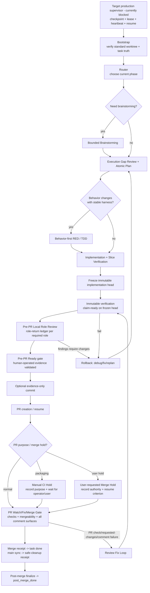

# Engineering Workflow Source of Truth
Version: **v1.9.6**
Last Updated: **2026-07-12**

## 0. Purpose
This file is the **only normative workflow specification** for engineering task execution in oasis7.

Mandatory rule:
1. Any workflow change must be edited in this file first.
2. After this file is updated, sync all related scripts/docs/skills to match.
3. PRs that change workflow scripts without updating this file are invalid.

<a id="capability-and-ownership"></a>
## Capability status
**Current:** TPM is the accountable workflow coordinator / integrator. It advances the canonical lifecycle explicitly with repo helpers and professional subagent slices. The production supervisor is blocked; no current surface can run intake through merge and cleanup unattended.
**Target:** a production supervisor executes the durable lifecycle from intake through merge and cleanup while TPM remains accountable for coordination, evidence integration, and escalation.
| Capability | Status | Meaning |
| --- | --- | --- |
| Durable reducer/checkpoint and fail-closed phase gates | implemented | Safe local state and validation primitives exist. |
| Receipt-bound main-sync and safe-cleanup helpers | implemented | Production helpers validate durable receipts and fail closed. |
| Fake-GitHub lifecycle fixtures | test-only | They test reducers; they are not production evidence. |
| Human-operated pre-PR role review | implemented | TPM records frozen-head, role-complete review evidence in the GitHub task issue; repo helpers validate the local ledger and artifacts before PR creation. |
| Unattended pre-PR review attestation | blocked | No trusted runtime provenance-attestation producer exists; unattended automation must stop at `capability_blocked`. |
| Production supervisor from intake through merge | blocked | Without trusted production producers, automation is `capability_blocked`. |

## Lifecycle ownership
TPM is the accountable workflow coordinator / integrator and continuation owner.
A professional **phase owner** owns only its bounded slice; the **task owner role** remains
accountable for task outcome and evidence. Bootstrap establishes truth and the
router selects a phase; neither owns continuation.

The **target production supervisor** is the durable runtime executor, not an
accountability owner. It is `blocked`, so TPM coordinates each action explicitly.

<a id="canonical-lifecycle"></a>
## Canonical state machine
The production supervisor is a target runtime executor and is currently
blocked; the state machine below defines required order, not implemented
automation.

`bootstrap -> route -> professional execution -> freeze -> verify -> review -> pre_pr_ready -> create PR -> watch/fix/reverify/review/push -> merge -> merge receipt -> task done -> main sync -> safe cleanup receipt -> post-merge finalize -> post_merge_done`

## Workflow states
- `running`: the recorded action authority is executing its typed action.
- `action_required`: a bounded action awaits an authorized consumer.
- `external_wait`: a trusted external condition has a durable resume condition.
- `capability_blocked`: missing machinery required by the selected execution mode, including runtime attestation for unattended automation.
- `completed`: terminal completion has been independently proven.
- `failed`: a non-retryable contract violation; stop and escalate. Recovery
  requires an authorized new evidence epoch or a fresh bootstrap, not resume.

This enumeration is closed; phase names and blocker reasons are separate fields.
Recorded action authority is task/checkpoint-bound permission to execute or
resume the typed action, not a role title.

<a id="canonical-gates"></a>
## Ready and Done
These are the only gate definitions in this specification.

<a id="freeze-gate"></a>
**Freeze gate.**

The final implementation head freezes one immutable tree; later code
  changes invalidate downstream verification and review.

<a id="pre-pr-ready-gate"></a>
**Pre-PR Ready.**

Frozen-head verification and required involved-role review have passed. Ready
is a pre-PR gate, not PR creation or Done. The human-operated path requires a
GitHub task packet, all-required-role ledger, head binding, artifact digests,
findings dispositions, and residual risk. Runtime-issued provenance applies
only to unattended supervision, which remains `capability_blocked`. Fixtures
never satisfy a live task.

<a id="pr-creation-gate"></a>
**PR creation gate.**

An evidence-only commit may change HEAD but not the frozen implementation tree.
When it changes HEAD, re-run final-head verification and review, then record a
new review packet; otherwise PR creation is forbidden. PR creation binds the
reviewed PR head.

<a id="post-pr-merge-ready-gate"></a>
**Post-PR merge-ready.**

The canonical live PR gate permits merge for its current head and epoch. It is
not terminal completion. It inspects all applicable required-check identities,
mergeability, requested changes, conversation comments, each reviewer's latest
effective review, and every paginated review thread. Permission, transport,
pagination, policy-discovery, or evidence-readback uncertainty fails closed.
Actionable comments require a current-head disposition; acknowledgements and
status chatter do not block. `REVIEW_REQUIRED` and `BEHIND` alone are
informational.

A successful gate emits a trusted receipt bound to issuer, repository, PR,
head, observation time, and gate epoch. Holds and dispositions are accepted
only from verified GitHub-backed evidence. Admin merge additionally requires a
fresh, complete-ruleset runtime receipt proving approval is the sole blocker
plus explicit task/user authority. That producer is unavailable, so admin merge
is currently `capability_blocked`. Fixture or caller-authored receipts cannot
enable production merge.

<a id="post-merge-done-gate"></a>
**Terminal Done.**

A fresh merge receipt, task done truth, main sync, safe-cleanup receipt, and
post-merge finalization have completed in that order.

## State, gate, and PM mapping
| Workflow state | Gate meaning | GitHub Project status | Resume authority |
| --- | --- | --- | --- |
| `running` | trusted action executing | in progress | recorded action authority |
| `action_required` | authorized consumer required | in progress | authorized consumer |
| `external_wait` | external condition with resume authority | blocked | recorded authority |
| `capability_blocked` | required trusted producer missing | blocked | capability provider |
| `completed` | `post_merge_done` proven | done | none |
| `failed` | non-retryable contract failure | blocked | escalation authority may authorize a new epoch or rebootstrap |

## Documentation policy
`AGENTS.md`, `finishing-a-development-branch`, `tpm.md`, and `.pm/README.md`
are thin operational entrypoints. They may contain local triggers, commands,
I/O, and minimal safety invariants, but must not restate
[ownership](#lifecycle-ownership), [state machine](#canonical-state-machine),
[states](#workflow-states), [gates](#ready-and-done), or the
[review packet](#pre-pr-review-packet).

## 1. Phase Diagram


### 1.1 Skill Map by Phase
This map makes skill reachability explicit. TPM owns the route decision as a workflow coordination act and records the selected skill path in GitHub task issue evidence comments before delegated execution begins.

| Phase / trigger | Skill surface | Requiredness | Formal evidence |
| --- | --- | --- | --- |
| Any user request starts | `default-workflow-bootstrap` | Required before fact lookup, chat answer, professional slice dispatch, edits, verification, review, or external messaging unless already inside the bound task worktree | Bootstrap entry in GitHub task issue evidence comments |
| Read-only professional/domain question | Matching professional bounded slice under TPM coordination after task/worktree bootstrap | Required when the answer depends on product/design/gameplay/game-visual-interaction/runtime/blockchain-ops/WASM/agent/viewer/QA/repository-health/liveops judgment; skipped only for pure fact lookup after task truth exists | Role-tagged slice return recorded in GitHub task issue evidence comments and summarized to the user |
| Bound task needs next phase selection | `repo-owned-workflow-router` | Required after bootstrap and whenever phase is unclear | Route entry with selected/skipped skills in GitHub task issue evidence comments |
| Bound task spans multiple lifecycle phases | `tpm-production-supervisor` target | Blocked until trusted collaboration, wake, action and validator producers exist | Durable reducer evidence plus explicit capability blocker |
| Scope is ambiguous, option-heavy, or visual enough to need ideation | `bounded-brainstorming` | Optional, risk-based | Brainstorming output or skip reason in GitHub task issue evidence comments/project |
| Behavior changes with a stable automated harness | `tdd-test-writer` | Conditional required when RED criteria are met; otherwise skip reason required | RED command, failing evidence, and handoff contract |
| Repo truth is ready and implementation proceeds step by step | `executing-project-tasks` | Required for non-trivial execution after route selection | Atomic step evidence in GitHub task issue evidence comments |
| Bug, failing test, broken script, unexpected diff, or regression appears | `systematic-debugging` | Conditional required before speculative fixes | Reproduction, narrowed hypothesis, fix evidence |
| Branch is about to create a PR | `requesting-repo-owned-review` | Required before PR creation; TPM must spawn or dispatch fresh local subagents for all involved relevant roles, collect review findings/no-findings/residual risk, and address or explicitly reject actionable findings with evidence before continuing | `Pre-PR Local Role Review: passed` GitHub issue evidence packet with roles, review evidence, finding disposition, and residual risk |
| About to claim done/tests-pass/ready-for-PR/ready-to-merge | `verification-before-completion` | Required before completion claims | Fresh verification command/output or claim-ready evidence |
| Implementation is done and branch needs closeout/commit/PR/watch/merge | `finishing-a-development-branch` | Required for development branch closeout | Closeout output, commit, PR linkage, PR purpose decision, CI/review watch evidence, merge/cleanup evidence |
| GitHub PR receives review comments or requested changes | `receiving-code-review` | Required for actionable PR review feedback | Comment verification, fix evidence, thread status |
| Workflow skill/docs themselves are created or edited | `writing-repo-owned-skills` | Required for local skill surface changes | Source-of-truth-first sync plus `./scripts/lint-skills.sh` and governance checks |

### 1.2 Specialist Skill Reachability
Specialist skills are not mandatory workflow phases. They become reachable through TPM routing or professional subagent slice planning when the task domain matches their trigger.

The repository has two skill-like surfaces:

- `.agents/skills/`: default-loadable repo-owned workflow skill entrypoints. Keep workflow gates here.
- `skills/`: non-default specialist library material for professional method skills. Role cards and slice contracts may reference these skills, but they do not automatically trigger.

Only `.agents/skills/*/SKILL.md` entries are default skill entrypoints. Material under `skills/` may preserve `SKILL.md`-style structure for provenance and linting, but it is not part of the default workflow trigger set unless a `.agents/skills` wrapper or source-of-truth update explicitly promotes it back.

- Product/planning docs: `skills/prd`, `skills/game-architect`; these may create planning artifacts, but the route, work items, and downstream handoff must still be recorded in GitHub task issue evidence comments.
- Game/domain implementation: `skills/game-design-theory`, `skills/gameplay-mechanics`, `skills/level-design`, `skills/particle-systems`, `skills/optimization-performance`, `skills/memory-management`, `skills/synchronization-algorithms`.
- Narrative/community/content: `skills/epic-story-orchestrator-zh`, `skills/content-creation`, `skills/humanizer-zh`, `skills/xiaohongshu-note-analyzer`.
- Browser/visual/content tools: `skills/agent-browser`, `skills/gpt-image-2`.
- Visual companion / Image2 target workflows are optional evidence, not universal gates. They may be used inside an existing task/worktree as visual target and screenshot-comparison evidence, but cannot replace implementation, real native/browser screenshots, interaction smoke, QA evidence, or PR review. Screenshot-only previews count as stable visual-comparison evidence, not real interaction coverage.

If a specialist skill is used, TPM must still bind it to the same owner, GitHub-backed task, canonical worktree, and PR chain through the subagent slice contract. TPM may route to specialist skills, but the specialist role owns the professional conclusion.

### 1.2.1 Friction Controls After Task Truth
The always-bootstrap rule protects traceability, but it must not turn every
small question into a heavyweight workflow.

- Once a request is already inside the bound task/worktree, pure fact lookup,
  path lookup, command-output restatement, or mechanical evidence collection may
  use the objective-fact fast path: TPM gathers the evidence, answers directly,
  and records a short GitHub issue evidence note only when the fact materially
  affects task truth, PR evidence, or a future decision.
- Read-only professional/domain questions still require a matching role slice,
  but the default slice should be bounded and time-boxed: one concrete question,
  explicit evidence paths, `findings/no_findings` or verdict return, and no file
  edits unless the task is routed into execution.
- Do not dispatch a professional slice when the user is only asking for a
  mechanical GitHub status, file path, command output, or exact current fact that
  TPM can verify directly inside the bound task.
- Do not create a second parent/planning surface to answer a small follow-up
  inside an existing bound task; append the follow-up evidence to the current
  task unless it changes owner, scope, or PR chain.
- Use the GitHub Project `Module` field, mirrored in
  `.pm/github-project-sync/tasks.json`, as the default large-module marker for
  ordinary task grouping, reporting, and parallel work queues. It is a small
  enum, not a free tag or owner-role substitute. Current allowed values are
  `engineering`, `game-strategy`, `visualization`, and
  `chain-world-state-substrate`.
- Do not create a separate parent/planning surface merely to label a task's
  large module. Use a normal task with `module` unless the user explicitly asks
  for a separate coordination task.

### 1.2.2 Learning Intake / Loop Closeout
Reflection signal: use `capture-todo.sh` for an uncommitted cross-task idea;
same-task evidence stays in the bound GitHub task.

Detailed game-design documentation follows `doc/game/README.md`,
`doc/game/prd.md`, `doc/game/prd.index.md`, and matching topic documents.
Route design conclusions to the relevant professional roles; require
claim-to-owner-to-validation traceability instead of expanding this workflow
specification with a separate design method.
### 1.2.3 GitHub Project-Backed PM Contract
GitHub Issues + GitHub Project are the authoritative project-management
surface for oasis7 tasks. Local files under `.pm/github-project-sync/` are
generated mirrors/caches for scripts and audits, not a parallel task queue or
per-PR truth artifact.

- GitHub Issue is the task collaboration envelope.
- GitHub Project item fields are authoritative for active queue/status views:
  module grouping, priority, PM status, workflow phase, blocked/ready/PR-watch
  cockpit views, and task-to-issue/project-item mapping.
- `Task UID` remains the stable internal identity. GitHub issue numbers and
  Project item IDs are external object handles, not replacements for `task_uid`.
- `.pm/github-project-sync/tasks.json`, when generated locally, is a
  deterministic mapping cache from `task_uid` to issue/project item handles. It
  is not required to be committed in ordinary task PRs; scripts must tolerate it
  being absent or refresh it from GitHub/task issue evidence.
- `.pm/github-project-sync/task-archive.jsonl` is the immutable repo-local
  archive for historical task metadata and evidence records. It is an audit
  bridge, not a planning queue.
- Lifecycle wrappers use GitHub Issues/Project as task truth. Ordinary audit,
  readiness verification, and `claim-ready.sh` are read-only with respect to
  `.pm/github-project-sync/tasks.json`; only an explicit create/sync/refresh or
  lifecycle status mutation may rewrite that generated cache. Claim evidence
  uses claim-specific timestamps and must not refresh record-level
  `updated_at`. When refresh-capable GitHub access is available, audit fails on
  cached title or acceptance drift instead of making stale cache content look
  current.
- Execution evidence is recorded in GitHub task issue evidence comments.
- role memory, task-scoped `working_memory`, signals, stage/gate state, and
  this workflow source-of-truth remain repo-local unless a later source-of-truth
  update explicitly migrates them.
- `pm-lint` is read-only against the canonical workspace: it must capture one coherent full-`.pm` snapshot using before/after/source-vs-copy manifests with bounded retry/fail behavior, run every PM read against that single snapshot epoch, isolate Python bytecode under its temporary directory, and leave no ignored artifact behind. The surrounding guard must cover the complete `.pm` filesystem path set—including tracked, baseline-untracked, and ignored entries—with lstat file kind/mode/content or symlink target, while comparing exact Git index mode/OID/stage/path records separately. The guard records symlink state so type and retarget drift are visible; the lint source-manifest boundary must reject any `.pm` symlink before copying.

Project field taxonomy:

| Field | Owner | Meaning | Allowed / expected values |
| --- | --- | --- | --- |
| `Module` | TPM during task creation/routing | Large work queue and reporting group, not owner role or free tag | `engineering`, `game-strategy`, `visualization`, `chain-world-state-substrate` |
| GitHub Project built-in `Status` | TPM and Project views | Human cockpit lane for day-to-day queue visibility | `Todo`, `In Progress`, `Blocked`, `Ready / PR`, `PR Watch`, `Done` |
| `PM Status` | PM lifecycle scripts | Deterministic lifecycle state used by helpers/audits | `candidate`, `committed`, `blocked`, `ready`, `pr_watch`, `done`, `deferred` |
| `Workflow Phase` | Workflow helpers | Current workflow stage, orthogonal to queue lane | `bootstrap`, `planning`, `execution`, `verification`, `pre_pr_review`, `pre_pr_ready`, `pr_watch`, `blocked`, `task_done`, `main_sync`, `post_merge_done` |
| Priority | Owner / TPM | Scheduling priority, not severity | repo-defined `P0`..`P3` values |

Scripts that sync Project state must keep GitHub built-in `Status`, custom `PM
Status`, and `Workflow Phase` aligned through deterministic mapping:
`candidate -> Todo/execution`, `committed -> In Progress/execution`,
`blocked -> Blocked/blocked`, `ready -> Ready / PR/pre_pr_ready`,
`pr_watch -> PR Watch/pr_watch`, `done -> In Progress/task_done`, and
`deferred -> Done/blocked`; only the finalizer advances to `post_merge_done`.
`Blocked`, `Ready / PR`, `PR Watch`, and `Done` are cockpit lanes, not modules
or owner roles.

Deterministic script contract:

- `./scripts/pm/github-project-workflow.sh ... sync` applies mapping/archive
  task metadata to GitHub Issues/Project items idempotently.
- `./scripts/pm/github-project-workflow.sh ... audit` verifies the selected
  task set, mapping, and GitHub Project item/field state agree. Its default
  path must be selected-task / mapping-targeted and must not list the full
  Project during ordinary task closeout or PR readiness checks. It loads task
  truth from archive + mapping and fails if local task-file artifacts reappear.
  For a single task, use
  `./scripts/pm/github-project-workflow.sh audit --task-uid <TASK-UID> --json`;
  the helper reads `repo`, `project-owner`, and `project-number` defaults from
  `.pm/github-project-sync/tasks.json` when they are present.
- `./scripts/pm/github-project-workflow.sh ... step3-gate` is the full
  historical coverage audit for the GitHub Project/mapping/archive set.
- `./scripts/pm/github-project-retire-tasks.sh --delete` maintains
  `.pm/github-project-sync/task-archive.jsonl`; if the archive already exists,
  it must preserve existing records and upsert only the task UIDs represented by
  the current input set.
- `./scripts/pm/github-project-task.py` is the active task lifecycle adapter:
  create issue/project task, append evidence comments, and move Project status.

- `./scripts/pm/task-closeout.sh` defaults to `ready` / `ready_for_pr`.
  `ready` requires a passed review packet bound to the same frozen
  source head and required-role review-evidence ledger; arbitrary caller-provided
  success commands are not lifecycle proof. `done` requires a recorded merged
  PR, or a classified `non_pr_task`, plus verified `task_complete` evidence. It
  persists the trusted receipt and advances only to PM `done` / `task_done`;
  the issue stays open and processing follows the [terminal runbook](#terminal-runbook).

`post-merge-finalize.py` is the only `post_merge_done` and issue-close writer.
- `./scripts/prepare-task-pr.sh --create` records the created PR URL and moves
  the task to `pr_watch` when GitHub-backed mapping exists. PR creation is
  resumable: before creating, query all states using the exact head repository,
  head branch, and base branch. Reuse only an OPEN match and retry the missing
  task-record transition. A CLOSED exact match may be replaced but never
  reused. A MERGED exact match blocks replacement and requires task-truth
  reconciliation. A foreign repository's same-name head is never a match.
- `scripts/prepare-task-pr.sh` must read passed local role review packets from
  GitHub task issue evidence comments and mapping-backed task truth.
- `scripts/prepare-task-pr.sh --create` must include a GitHub auto-close
  keyword for the bound GitHub task issue in the PR body, or reject an explicit
  PR body file that omits the linkage. The normal generated linkage is
  `Closes #<task-issue-number>` and is separate from `Task UID`.
- `scripts/pm/audit-pr-watch-issues.sh --close` is the remedial post-merge
  audit for GitHub-backed tasks whose recorded PR is already merged but whose
  PM task issue/body/Project state still says `pr_watch`. The PR body
  auto-close keyword is only a missed-closure backstop; the audit remains the
  PM lifecycle synchronizer. Despite its retained CLI name, it advances only to
  `task_done`; it never writes `post_merge_done` or closes an issue. It may
  synchronize only PM task issues whose body
  contains the task marker, `status: pr_watch`, a recorded `pr_number` whose
  GitHub PR state is merged, and existing issue comments with passed pre-PR
  local role review plus verified ready closeout/claim evidence. The audit is
  remedial PM metadata synchronization, not independent professional completion
  judgment. It writes remedial sync evidence, updates Project/body state to
  `done` / `task_done`, then points TPM to the [terminal runbook](#terminal-runbook).
  Missing task issue mapping, missing required Project fields,
  missing existing review/ready evidence, unmerged PRs, non-`pr_watch` statuses,
  or manual hold markers are fail-closed blockers.
- `./scripts/pm/fallback-evidence.sh` is the replay/audit helper for temporary
  `.pm/scratch/<TASK-UID>/fallback-evidence/` packets; unreplayed fallback
  packets do not satisfy task truth and are rejected by PR-readiness lint.
- All future GitHub-backed create/move/report/closeout helpers must use
  deterministic `gh`/GitHub API paths, preserve or recover the `task_uid`
  mapping, and refuse ambiguous duplicate mappings.
- Remote task bootstrap is a journaled, resumable transaction. Before creating
  the issue, write a local journal keyed by the requested worktree/title/owner;
  the journal also stores a canonical immutable-request object and digest covering
  repository, title, owner role, worktree hint, module, priority, source refs,
  acceptance criteria, source signal/type/severity, document/PRD refs, and
  handoff roles. Every resume recomputes that digest and fails before any
  remote call when the request drifted; changing scope requires a new bootstrap.
  after each irreversible remote step, atomically persist task UID, issue URL,
  Project item ID, and next action. A retry must resume that journal or discover
  the unique task UID marker instead of creating another issue. Once any remote
  object exists, bootstrap failure must preserve the task worktree/branch and
  print the exact resume command; force cleanup is forbidden.

## 2. Responsibility Boundary
<a id="specialist-review-role-selection"></a>
- `tpm`: default main Agent / workflow coordinator / canonical integrator only; owns phase decision, role allocation, subagent dispatch, integration order, task-truth writeback, fresh-verification gate coordination, completion-claim coordination, and PR chain coordination.
- TPM is not a professional execution role. TPM must not be the source of domain/professional analysis, implementation, verification judgment, code review judgment, product/design judgment, runtime/wasm/viewer/agent/QA/repository-health judgment, or liveops/community messaging.
- Professional/domain work must be done by the matching bounded subagent slice. This includes:
  - product/system design by `producer_system_designer`
  - gameplay design by `gameplay_designer`
  - game visual direction, interaction feel, player-facing screen flow, and visual readability by `game_visual_interaction_designer`
  - runtime/gameplay/server logic by `runtime_engineer`
  - blockchain/node operations, deployment choreography, upgrade/rollback drills, fleet health baselines, and node runbooks by `blockchain_ops_engineer`
  - WASM/platform/ABI work by `wasm_platform_engineer`
  - in-world Agent perception/memory/planning/execution/feedback/behavior and its inference model/provider behavior by `agent_engineer`
  - Viewer/Web/UI work by `viewer_engineer`
  - verification strategy, test evidence, and release blocking judgment by `qa_engineer`
  - repository health stewardship, documentation/code alignment, semantic clarity, bug-risk surfacing, technical-debt triage, and repository Codex config/adapter/validation-contract audit by `repository_health_engineer`
  - external messaging, community feedback, incidents, player promises, release notes, and channel runbooks by `liveops_community`
- professional role subagents provide bounded slices only (analysis/implementation/verification/review/liveops messaging) and must return artifacts to the TPM owner chain.
- TPM may perform mechanical coordination edits to workflow governance surfaces, task logs, integration notes, and PR plumbing. If the work requires a professional conclusion, TPM must dispatch the matching role slice first and attribute the conclusion to that slice/evidence.
- For every request, TPM planning, work decomposition when needed, subagent slice contracts, and integration order are task execution truth and must be written to GitHub task issue evidence comments before the delegated work begins.
- Every user request must enter the standard worktree flow before any substantive handling begins, including chat-only answers, read-only inspection, fact lookup, professional slice dispatch, implementation, verification, review, and external messaging.
- The only allowed pre-bootstrap work is mechanical enough to create or enter the task truth: inspect current git/worktree state, choose or confirm the task/worktree, and run the bootstrap helper.
- Do not first classify a request as "read-only", "chat-only", "pure fact lookup", or "professional judgment" to decide whether task/worktree truth is needed. That classification happens only after bootstrap, inside the bound task/worktree, and only controls whether TPM can answer from objective evidence or must dispatch a professional slice.
- Read-only/chat-only requests still split by judgment type after task truth exists:
  - Pure fact lookup, path lookup, command-output restatement, or mechanical evidence collection may be handled by TPM inside the bound task worktree, as long as the answer does not present a professional/domain conclusion.
  - Read-only professional/domain questions must be dispatched to the matching bounded professional role slice before the answer is presented as authoritative. Examples: "does viewer have a performance collection/evaluation mechanism", "is this QA evidence release-blocking", "what runtime design risk is present", "is this gameplay loop balanced/readable", "is this documentation/code contract drifting", "what node-ops risk is present in this rollout", or "how should LiveOps message this incident".
  - Such read-only professional slices require the same GitHub-backed task and canonical task worktree as any other request. Their required sink is GitHub task issue evidence comments, plus the role-tagged user-facing answer.
  - TPM may gather raw files, commands, or repo context before dispatch only after bootstrap; the final user-facing answer must label TPM synthesis separately from professional role conclusions and cite the role/evidence that owns each professional conclusion.
- Canonical truth per user request must remain single-threaded:
  - one owner role
  - one GitHub-backed task
  - one canonical worktree
  - one PR chain

## 3. Lifecycle prerequisites and conditional phases
These items determine whether a phase may start; they are not a second gate
taxonomy. Lifecycle transitions use only the five [canonical gates](#canonical-gates).

### 3.1 Prerequisites
- Task truth: isolated worktree, bound GitHub-backed task, and owner role.
- Planning: scope, verification entry, TPM work items, slice contracts, and
  integration order recorded in task evidence.
- Execution evidence: each risky step records action, validation command,
  expected result, actual result, and any blocker.
- Completion claim: fresh current-round verification.

### 3.2 Conditional phases
- Bounded brainstorming when scope or architecture is ambiguous.
- TDD RED for behavior changes with a stable harness; otherwise record why it
  was skipped.
- LiveOps/community review for external messaging, incidents, or player
  commitments.

The current path uses explicit TPM continuation. The future unattended
executor is limited by the [unattended invariants](#appendix-a-target-supervisor-contract).
## 4. Failure and Rollback Paths
### 4.1 Verification failure
- Stop completion claim.
- Record failure signature + blocker in execution sink.
- Route back to execution/debug phase.

### 4.2 Scope drift / unknown impact
- Stop speculative implementation.
- Update planning truth (PRD/project/execution) before resuming code edits.

### 4.3 PR check/requested-changes/comment failure
- Re-enter review-fix loop.
- Re-run fresh verification.
- Re-submit PR evidence.

### 4.3.1 Manual packaging CI hold
- If the PR exists specifically to run manual-trigger packaging/release CI jobs, record that purpose in GitHub task issue evidence comments and do not auto-watch-to-merge.
- The hold record must include the manual job(s) or packaging purpose, responsible operator/role, expected success signal, stale-date/timeout escalation, ops readiness/rollback/runbook evidence when deployment or release ops are implicated, exact resume criterion, and external/status messaging evidence when the change is player- or community-facing.
- Resume the normal PR watch/fix/merge path only after the operator/user says the manual packaging CI purpose is complete and the PR should proceed to merge readiness.

### 4.3.2 User-requested merge hold
- When the user says to create/push a PR but not merge it, record
  `user_requested_merge_hold` with requesting authority, timestamp, reason, and
  exact resume authority. This is not a packaging hold.
- The PR-state gate, ordinary merge path, and admin merge path must all fail
  closed while the hold is active. Only a later user/task-truth instruction from
  the recorded authority clears it.

### 4.4 Workflow governance drift
- If scripts/skills/docs conflict with this file, this file wins.
- Sync downstream artifacts immediately in the same change set where possible.

## 5. Normative Details
### 5.1 Worktree + task truth
- Every user request uses a dedicated task worktree by default, regardless of whether the immediate answer is chat-only, read-only, fact lookup, professional analysis, implementation, verification, review, or external messaging.
- Only explicit user authorization allows reuse of an existing task worktree.
- Do not classify work as `trivial`, `read-only`, `chat-only`, or `pure fact lookup` to bypass task worktree / GitHub-backed task setup.
- If incoming instructions or role notes appear to allow a read-only/chat-only bypass, this source-of-truth wins: bootstrap first, then route the already-bound request.
- Do not edit any files from the `main` branch/worktree; create or enter the relevant task worktree before making changes.
- Entering implementation requires owner role selection and GitHub-backed task binding.
- Cross-role collaboration must converge to one owner / one GitHub-backed task / one canonical worktree / one PR chain.
- Post-merge cleanup must use the fail-closed cleanup helper. Cleanup requires:
  a fresh repository-generated PR receipt proving `MERGED`, task truth proving
  `done`, a clean task worktree, and the task branch tip contained in main. A
  squash/rebase merge may substitute a repository-generated patch-equivalence
  receipt bound to the exact branch tip and main tree; literal CLI state or
  mutable cache fields are not proof. The helper uses non-force
  `git worktree remove` and `git branch -d`; it never prints or executes
  `worktree remove --force` / `branch -D` as normal workflow guidance.
- Task worktrees created through `./scripts/new-task-worktree.sh` must create a git-ignored `target` symlink to the repo-family shared cargo target cache resolved by `./scripts/cargo-dev.sh --print-target-dir`, so direct cargo and the development wrapper share local build artifacts by default.
- When Rust commands encounter Cargo package-cache or build-directory locks, wait for the shared repo-family cache to become available; do not switch ad hoc to a fresh temporary `CARGO_TARGET_DIR` just to bypass the lock.

### 5.2 TPM planning and subagent dispatch
- For every request, TPM must record the current plan, work decomposition when needed, selected roles, and integration order in GitHub task issue evidence comments before dispatching professional subagent work.
- Project policy authorizes TPM to dispatch required bounded professional subagent slices directly whenever this workflow requires them; TPM must not pause for per-slice user permission. This project policy is an explicit standing user authorization to use subagents for workflow-required professional role slices; when a tool/runtime requires an "explicit user request for sub-agents, delegation, or parallel agent work", this policy satisfies that requirement for the matching repo-owned workflow slice. If the current runtime, connector, or tool policy still prevents actual subagent dispatch, TPM must record the intended dispatch, actual limitation, fallback evidence path, and attribution boundary in GitHub task issue evidence comments, and must not present TPM's own analysis as a professional role conclusion.
- Each subagent slice must declare role, slice type, intended model configuration, actual dispatched model/reasoning, context delivery mode, role activation, mandatory context checklist, write scope, return contract, validation command, GitHub task issue evidence sink, and integration order.
- The repository does not pin a default subagent model or reasoning effort in `.codex/config.toml`, because Codex top-level `model` and `model_reasoning_effort` keys also change the root TPM session. A slice defaults to the runtime selected by the user or inherited from the parent session. When a dispatch surface supports explicit model selection, TPM may request a concrete model/reasoning pair and must record it as intended configuration; otherwise the contract records `intended model: inherit current parent selection` and `actual model: inherited/unverified`.
- Every slice contract must record one explicit runtime outcome: the requested model/reasoning and its reason when selection is requested; the observed actual model/reasoning when the surface reports it; or `actual model: inherited/unverified` plus the capability reason when selection or observation is unavailable. A requested value must never be presented as the observed actual runtime without evidence.
- Context delivery defaults to full-thread/full-history fork or the closest available equivalent so the subagent receives the same conversation and repository-governance context as TPM. The slice contract must still record a mandatory context checklist identifying the governance/task/user/repo/collaboration context the subagent is expected to have. A manually assembled explicit context packet is allowed only as a delivery supplement or fallback when full-history fork is unavailable, unsafe, stalled, or incompatible with required model/reasoning or named-role selection; the slice contract must record that fallback reason.
- The mandatory context checklist must include:
  - identity and authority: assigned role, role card path, owner role, and TPM integration owner
  - workflow governance: `AGENTS.md`, `doc/engineering/workflow/source-of-truth.md`, and the selected workflow skills
  - task truth: current GitHub issue, GitHub Project item/status, `.pm/github-project-sync/tasks.json` mapping record, canonical worktree, branch, base ref, and PR link/status when present
  - user intent and acceptance target: original request summary, current work item, explicit non-goals, and done/verification expectations
  - scoped repo context: relevant `prd.md`, `project.md`, handoff, changed paths, current diff or evidence summary, and known constraints such as `third_party` read-only boundaries
  - collaboration boundary: sibling slices, write-scope conflicts, integration order, allowed commands, return contract, and formal sink
- `AGENTS.md` and the assigned role card are mandatory inputs for implementation, verification, review, or domain-specialist slices. A narrow read-only explorer slice may omit the role card only when the slice contract records the exemption reason and the exact files to inspect; it still runs after task/worktree bootstrap and records its sink in GitHub task issue evidence comments.
- TPM read-only exploration is allowed only to gather routing context, inspect task truth, or integrate returned evidence. It must not be reported as a professional finding unless a matching professional role slice owns or verifies that finding.
- TPM user-facing summaries must distinguish procedural synthesis from professional conclusions. Professional conclusions must be traceable to subagent artifacts, execution evidence, handoff, project/prd records, or PR evidence.
- Project docs, handoff files, signals, memory, and PR evidence may supplement GitHub task issue evidence comments, but they do not replace them for task execution truth.
- Codex-native specialist role adapters live under `.codex/agents/*.toml` and are registered by `[agents.<role>]` entries in `.codex/config.toml`. The matching `.agents/roles/<role>.md` remains the governance source of truth; an adapter is a concise operational projection for routing, non-goals, write/escalation rules, and the return contract. `repository_health_engineer` owns repository config/adapter projection and validation-contract audit, while `tpm` retains live role selection, dispatch, coordination, and integration. `agent_engineer` owns only the model/provider behavior used by in-world Agents, not repository Codex config or subagent dispatch. `tpm` remains the root coordinator and must not be registered as a selectable specialist role. Adapter text must not broaden the role card, create a second task/worktree/PR truth, or bypass the GitHub task issue evidence sink.
- Every specialist role card owns a structured `Codex Adapter Projection` with schema version, registry description, domain contract, operational constraints, and return contract. The adapter and registry description are deterministic renderings of those role-card fields; opaque paired hashes are not a semantic contract. The validator must compare the full rendered output, so replacing an adapter body and merely updating a digest cannot pass.
- Adapter registration is not proof of adapter activation. TPM may claim `adapter-backed` dispatch only when the active Codex surface exposes a named-role selector such as `agent_type` (or a documented equivalent), the requested role is passed through that selector, and the actual activation is observable. Codex 0.137 CLI can strictly load the registered role registry, but the current Desktop `spawn_agent` schema has no named-role selector and full-thread/full-history fork does not activate a registered adapter by itself.
- On a surface without named-role selection, TPM must use the full-history message-assigned fallback: identify the professional role in the dispatched message, require the role card and slice contract as inputs, and record `role activation: message-assigned; adapter inactive on this surface`. The returned conclusion remains attributed to that professional slice, but TPM must not describe it as adapter-backed. If a surface supports named roles but cannot combine them with full-history delivery, TPM chooses the mode required by the slice, records the capability tradeoff, and supplies the mandatory context checklist explicitly when named-role activation is selected.
- A specialist adapter must require the dispatched slice to read `AGENTS.md`, this source of truth, its role card, and the task contract before substantive work; stay within the explicit write scope; treat `third_party` as read-only; escalate cross-role decisions to TPM; and return role-attributed outcome, changed artifacts, findings, command evidence, uncertainty, residual risk, and requested follow-up. Direct GitHub evidence writes are allowed only when the slice contract explicitly authorizes them; otherwise the subagent returns the evidence packet to TPM for canonical writeback.
- If GitHub task issue comments are temporarily unavailable, TPM may write a temporary fallback packet under `.pm/scratch/<TASK-UID>/fallback-evidence/<timestamp>.md` and must record the intended GitHub issue target, reason for fallback, attribution boundary, and replay command. Fallback packets unblock evidence capture only; they do not satisfy task truth, pre-PR review, closeout, or completion claims until replayed to the GitHub task issue comments.
- If the plan changes during execution, TPM must append a GitHub issue evidence comment before continuing the changed work.
- After task truth exists, use the section 1.2.2 learning-intake ladder for discoveries and follow-ups: no-op, short GitHub issue evidence note, reflection signal, task-scoped `working_memory`, or owner-reviewed candidate task/memory promotion. Do not skip directly from a lightweight observation to committed task truth unless the owner explicitly selects that promotion.

### 5.2.1 Read-only specialist routing
- The task/worktree decision and the professional-slice decision are intentionally decoupled:
  - Task/worktree truth is required for every request.
  - Professional judgment controls whether a matching bounded role slice is required after bootstrap.
- Therefore, a read-only request must enter `default-workflow-bootstrap` first and may still require a professional role slice.
- Minimal read-only specialist slice contract:
  - role and slice type (`read_only_analysis`, `verification_judgment`, `review_judgment`, or `liveops_messaging`)
  - intended model configuration, defaulting to `inherit current parent selection` unless an explicit model-selection reason is recorded
  - actual dispatch model/reasoning, or `inherited/unverified` with the connector/tool limitation, stalled default context delivery, or unverifiable actual dispatch reason
  - context delivery mode, defaulting to full-thread/full-history fork unless a recorded fallback reason requires explicit context
  - exact question to answer and explicit non-goals
  - scoped files/commands/evidence to inspect
  - return contract with conclusion, evidence, uncertainty, and whether repository writeback is recommended
  - attribution rule for the final answer
- Read-only specialist slice contracts must be recorded in GitHub task issue evidence comments; chat/thread text may supplement but not replace the GitHub task sink.
- Pure evidence questions may be answered by TPM directly only after bootstrap and only when the user asks for an objective fact such as "does this file exist", "what command output says", or "which paths match this search".
- If a read-only specialist slice recommends changing repository state, TPM continues in the already-bound canonical task worktree and records the changed route in GitHub task issue evidence comments before applying changes.

### 5.3 Execution evidence
- Atomic steps should be recorded with `Action / Validation Command / Expected Result / Actual Result`.
- If blocked, also record `Blocker / Next Action`.
- These fields are mandatory for GitHub task issue evidence entries.
- Record evidence when it changes route, scope, status, claims, verification
  interpretation, blocker state, review findings, or user-visible decisions.
  Routine reads/searches that only support TPM routing can stay in the local
  transcript unless they become part of a claim or handoff.

### 5.4 Claim and lifecycle transitions
Follow the [canonical gates](#ready-and-done) and
[terminal order](#canonical-state-machine); this section only names operational
helpers.

- Freeze a clean implementation commit. Verify an isolated snapshot of that
  exact tree and run `git diff --check <comparison-ref>...<frozen-head>`.
  A later relevant change starts a new evidence epoch.
- Use `claim-ready.sh` for fresh claim evidence. Multi-surface claims use one
  repository-owned composite verification command.
- After the [Pre-PR review packet](#pre-pr-review-packet) passes, run
  `task-closeout.sh --role <owner-role> --task-uid <TASK-UID> --comparison-ref <ref> --verification-profile <profile>`. Profiles are repo-owned;
  caller-authored commands cannot authorize a transition.
- On partial remote mutation, run `refresh-task-cache.sh`, audit the selected
  task, then retry. Never edit generated cache JSON.
- The done transition resolves the recorded PR and requires a fresh
  repository-generated merge receipt. An explicitly classified non-PR task uses
  its repository-owned completion profile.

<a id="terminal-runbook"></a>
### Terminal runbook

After merge, use `<canonical-task-worktree>` for task evidence and
`<canonical-default-worktree>` for sync, cleanup receipts, and finalization.
Helpers fail closed unless inputs bind the same repository, task, PR, head,
worktree, branch, and default branch as applicable.
Receipt identity is bound to the Git common-dir. Relocation or identity mismatch
is `capability_blocked` until trusted mapping migration authorizes a new epoch;
do not copy or edit receipt identity files.

```bash
cd <canonical-default-worktree>
RECEIPT_ROOT="$(python3 scripts/pm/canonical-receipt-root.py \
  --default-worktree <canonical-default-worktree> \
  --task-uid <TASK-UID> --create)"
```

1. Merge receipt — require live readback; retry this command with the same PR.
```bash
cd <canonical-task-worktree>
python3 scripts/pm/pr-merge-receipt.py <PR> --json \
  > "$RECEIPT_ROOT/merge-receipt.json"
```

2. Task done — require task readback; retry this command with the same receipt.
```bash
./scripts/pm/task-closeout.sh --role <owner-role> --task-uid <TASK-UID> \
  --to-status done --verification-profile <repository-owned-profile> \
  --pr-receipt "$RECEIPT_ROOT/merge-receipt.json"
```

3. Refresh mapping — require default-root readback; retry the same refresh.
```bash
cd <canonical-default-worktree>
./scripts/pm/refresh-task-cache.sh --task-uid <TASK-UID> --json
```

4. Main sync — require receipt readback; retry with the same bound inputs.
```bash
./scripts/pm/post-merge-main-sync.sh --repo-root <canonical-default-worktree> \
  --main-ref <default-branch> --task-uid <TASK-UID> \
  --pr-receipt "$RECEIPT_ROOT/merge-receipt.json" \
  --receipt-output "$RECEIPT_ROOT/main-sync-receipt.json"
```

5. Safe cleanup — require journal/receipt readback; resume by retrying this command.
```bash
./scripts/pm/post-merge-cleanup.sh --repo-root <canonical-default-worktree> \
  --worktree <canonical-task-worktree> --branch <canonical-task-branch> \
  --main-ref <default-branch> --task-uid <TASK-UID> \
  --pr-receipt "$RECEIPT_ROOT/merge-receipt.json" \
  --main-sync-receipt "$RECEIPT_ROOT/main-sync-receipt.json" \
  --terminal-receipt-output "$RECEIPT_ROOT/terminal-cleanup-receipt.json"
```

6. Finalize — require terminal issue/Project readback; retry to resume safely.
```bash
python3 ./scripts/pm/post-merge-finalize.py \
  --repo-root <canonical-default-worktree> --task-uid <TASK-UID> \
  --terminal-receipt "$RECEIPT_ROOT/terminal-cleanup-receipt.json"
```

| Step | Product | Required readback | Resume |
| --- | --- | --- | --- |
| 1 | merge receipt | live PR is merged | repeat step 1 |
| 2 | `task_done` | task remains open at `task_done` | repeat step 2 |
| 3 | refreshed mapping | canonical default-worktree task truth | repeat step 3 |
| 4 | main-sync receipt | local/default remote heads match | repeat step 4 |
| 5 | cleanup receipt | intent journal proves cleanup | repeat step 5 |
| 6 | `post_merge_done` | phase persisted and issue closed | repeat step 6 |

All six steps require successful readback; never reorder them or substitute caller-authored receipts.

### 5.5 PR and review chain
Select every involved reviewer through the
[specialist review role selection](#specialist-review-role-selection), using
changed paths, task slice history, user-visible claims, and verification claims.
Each role returns `findings` or `no_findings` plus `residual_risk`; TPM records
evidence-backed dispositions. `prepare-task-pr.sh --create` verifies the
minimum path-inferred role set and the packet below. PR watch, holds, merge
authority, invalidation, and terminal behavior come only from the
[canonical gates](#ready-and-done) and
[terminal order](#canonical-state-machine).

#### Pre-PR review packet

A passed packet in GitHub task issue evidence comments contains:

- `Pre-PR Local Role Review: passed`
- `Task UID`, `Source Worktree`, `Source Branch`, `Source Head`, and
  `Comparison Ref`
- `Reviewed Changed Paths`, `Review Package`, and `Role Selection Basis`
- `Review Roles`, per-role `Review Evidence`, and dual `Review Verdicts`
- `Review Findings Disposition` and `Finding Disposition Evidence`
- `Verification Matrix`, `Visual Evidence`, `WASM Evidence`, `Ops Evidence`,
  and `LiveOps Evidence`, each with evidence or a reasoned exemption
- `Residual Risk` and `Slice Ledger`

The immutable ledger matches `Review Roles` and `Source Head`, with one return
per required role. Each human-operated return binds its slice ID, role,
activation/context mode, actual runtime or unverifiable reason, artifact digest,
both verdicts, disposition, and residual risk. The repository validates role
coverage, head binding, and artifact integrity; the GitHub task issue remains
the evidence sink. `n/a` ledgers and fixtures fail closed for live tasks.

An unattended supervisor additionally requires runtime-issued dispatch and
return attestation. Caller-authored receipts, issuer text, local fixtures, and
self-signed evidence cannot satisfy that target mode; missing attestation is
`capability_blocked` only for unattended automation.

For non-trivial diffs, `review-package.sh` writes under
`.pm/scratch/<TASK-UID>/review-packages/`. `record-pre-pr-review.sh` may
format a small workflow/docs packet but cannot replace role returns.
`slice-ledger.sh` is a resumable local index; GitHub task issue evidence
comments remain the formal sink.

<a id="appendix-a-target-supervisor-contract"></a>
### Appendix A: Unattended automation invariants

Future unattended automation does not change the current human-operated path:

- it must preserve canonical task/worktree/head/PR identity and lifecycle order;
- it must derive remote facts and mutation success from trusted readback;
- it must not manufacture professional judgment or accept caller-authored,
  self-signed, or fixture evidence as runtime authority; and
- missing required unattended machinery is `capability_blocked`.
