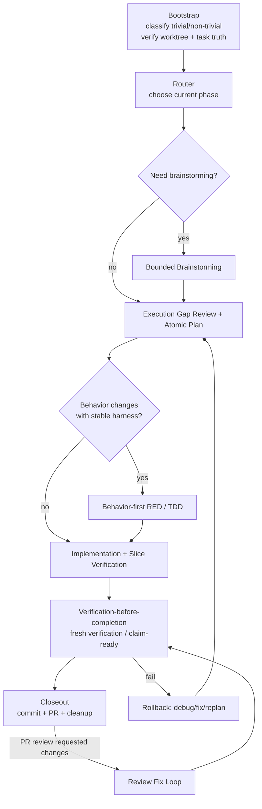

# Engineering Workflow Source of Truth

Version: **v1.2.2**
Last Updated: **2026-05-26**

## 0. Purpose
This file is the **only normative workflow specification** for engineering task execution in oasis7.

Mandatory rule:
1. Any workflow change must be edited in this file first.
2. After this file is updated, sync all related scripts/docs/skills to match.
3. PRs that change workflow scripts without updating this file are invalid.

## 1. Phase Diagram

## 2. Responsibility Boundary
- `producer_system_designer`: orchestrates phase decision, resource/role allocation, and cross-role consistency.
- `owner role` (single role per task): canonical integrator; owns final writeback, fresh verification, completion claim, and PR chain.
- role subagents: provide bounded slices only (analysis/implementation/verification/review/liveops messaging) and must return artifacts to the owner chain.
- Canonical truth per task must remain single-threaded:
  - one owner role
  - one `.pm` task
  - one canonical worktree
  - one PR chain

## 3. Gates
### 3.1 Required Gates (must pass)
1. **Task truth gate**: isolated worktree + bound `.pm` task + owner role confirmed.
2. **Planning gate**: PRD/project/execution truth aligned for scope and verification entry.
3. **Execution gate**: atomic step evidence captured (`Action`, `Validation Command`, `Expected Result`, `Actual Result`, plus blocker fields when needed).
4. **Fresh verification gate**: current-round verification success before completion claims.
5. **Closeout gate**: closeout metadata + task status transition + lint/governance checks + commit + PR creation.

### 3.2 Optional Gates (risk-based)
1. Bounded brainstorming gate (ambiguous scope / architecture tradeoffs).
2. TDD RED gate (behavior-changing tasks with stable harness).
3. Repo-owned supplemental review gate (high-risk or large convergence diffs).
4. Liveops/community gate (external messaging, incident, player promise changes).

## 4. Failure and Rollback Paths
### 4.1 Verification failure
- Stop completion claim.
- Record failure signature + blocker in execution sink.
- Route back to execution/debug phase.

### 4.2 Scope drift / unknown impact
- Stop speculative implementation.
- Update planning truth (PRD/project/execution) before resuming code edits.

### 4.3 PR review failure
- Re-enter review-fix loop.
- Re-run fresh verification.
- Re-submit PR evidence.

### 4.4 Workflow governance drift
- If scripts/skills/docs conflict with this file, this file wins.
- Sync downstream artifacts immediately in the same change set where possible.

## 5. Normative Details (from legacy AGENTS workflow)
### 5.1 Worktree + task truth
- New demand uses a dedicated worktree by default; only explicit user authorization allows reuse.
- `AGENTS.md` must not be edited from the `main` branch/worktree; create or enter a task worktree first, then edit `AGENTS.md` there.
- Entering implementation requires owner role selection and `.pm` task binding.
- Cross-role collaboration must converge to one owner / one `.pm` task / one canonical worktree / one PR chain.
- Task worktrees created through `./scripts/new-task-worktree.sh` must create a git-ignored `target` symlink to the repo-family shared cargo target cache resolved by `./scripts/cargo-dev.sh --print-target-dir`, so direct cargo and the development wrapper share local build artifacts by default.

### 5.2 Execution evidence
- Atomic steps should be recorded with `Action / Validation Command / Expected Result / Actual Result`.
- If blocked, also record `Blocker / Next Action`.
- For tasks started with the `2026-05-23` execution-log template or later, these fields are mandatory per entry.

### 5.3 Claim / closeout chain
- Before completion claims, run fresh verification (prefer `./scripts/pm/claim-ready.sh --claim-type <type> --verify-command "<cmd>"` when applicable).
- Closeout should run `./scripts/pm/task-closeout.sh --role <owner_role> --task-uid <TASK-UID> --verify-command "<fresh cmd>"` (or equivalent manual chain).
- For `done` closeout, fresh verification must be from the current round.

### 5.4 PR and review chain
- Standard path is GitHub PR + required checks + review/approval.
- PR creation helpers that request Copilot review must verify the request through GitHub's requested-reviewers API rather than relying only on `gh pr edit` exit status.
- If review comments arrive, fix + re-verify + resolve threads before merge claim.
- After merge, sync local `main` and clean up task worktree/branch.

## 6. Required Artifacts by Phase
- Bootstrap/Router: decision record in project or execution log.
- Execution: atomic evidence records per risky step.
- Verification: claim-ready command + output evidence.
- Closeout: closeout command output, task status update, and PR linkage.

## 7. Change Log
- **v1.2.2 (2026-05-26)**
  - Required PR helper Copilot review requests to use a verifiable requested-reviewers API path and warn when the request does not stick.
- **v1.2.1 (2026-05-26)**
  - Tightened macOS local workflow compatibility: workflow helpers should avoid bash 4-only builtins and GNU-only `find -printf` in default gates.
  - Clarified that expired task-scoped working-memory entries keep structural lint coverage without requiring machine-local transcript source files to remain present.
- **v1.2.0 (2026-05-25)**
  - Required new task worktrees to link ignored `target` to the repo-family shared cargo target cache.
- **v1.1.0 (2026-05-25)**
  - Restored high-impact normative details that were previously only in `AGENTS.md` (worktree/task-truth policy, execution evidence fields, claim/closeout chain, PR/review chain).
  - Clarified semantic migration to avoid policy loss after dedup.
- **v1.0.0 (2026-05-25)**
  - Created single source-of-truth workflow spec with phase diagram, role boundary, required/optional gates, and rollback paths.
  - Established policy: workflow changes must update this document first, then sync scripts/docs/skills.

## 8. Semantic Migration Checklist
This checklist records whether key legacy `AGENTS.md` workflow semantics were preserved here to avoid policy loss during deduplication.

- [x] Single owner / single `.pm` task / single worktree / single PR chain.
- [x] Dedicated worktree-by-default and explicit-reuse-only policy.
- [x] Owner role selection and `.pm` task binding before implementation.
- [x] Mandatory execution evidence fields and blocker recording.
- [x] Current-round fresh verification before completion claim.
- [x] Closeout command chain and `done` verification strictness.
- [x] GitHub PR + required checks + review/approval as formal review boundary.
- [x] PR review fix loop: fix -> re-verify -> resolve threads -> merge claim.

If any item above changes, update this file first and then sync downstream docs/skills/scripts.
