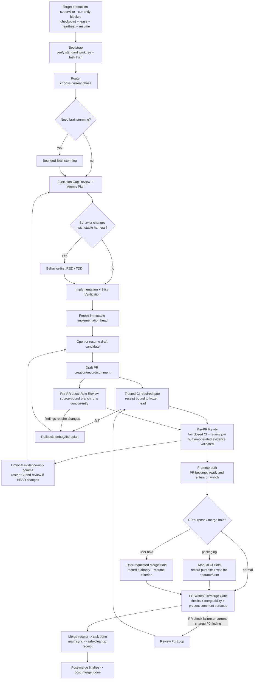

# Engineering Workflow Source of Truth
Version: **v1.23.0**
Last Updated: **2026-09-26**
## 0. Purpose
This file is the **only normative workflow specification** for engineering task execution in oasis7.
Mandatory rule:
1. Any workflow change must be edited in this file first.
2. After this file is updated, sync all related scripts/docs/skills to match.

3. PRs that change workflow scripts without updating this file are invalid; the explicitly authorized same-PR bootstrap may freeze and independently review an immutable specification revision before compatible implementation without activating candidate authority. Otherwise the exception is a code-only projection of an independently reviewed and merged normative revision: task evidence must bind that immutable source commit, consumed clauses, declared scope, and unchanged normative semantics; any semantic gap requires a separately approved normative revision before implementation proceeds.
**Invalid publication supersession:** A uniquely read-back immutable publication may be superseded without editing its remote comment only when an explicit current manual request selects the exact journal action ID, the remote publication identity, full contract bytes, digest and authority all match, and `target_delivery_not_covered` is its sole stable validation blocker. Recovery appends immutable validated supersession evidence. Absent or ambiguous selection, read/API uncertainty, identity/content/digest/authority mismatch, duplicate publication, or any additional or different blocker remains pending. The invalid revision remains immutable and ineligible, and a later valid publication uses the next revision; there is no generic force or reason-based recovery API.
**Product-document and system-design content gate integration.**
The author, local preflight, and required-CI paths use repository-owned checkers for `doc/product/**/*.prd.md` and `doc/product/**/*.design.md` files, plus new or materially source-changed concrete professional/system `*.design.md` files outside `doc/product/**`. Product changed-range checks retain the new/materially-changed boundary; required CI and PR-prep additionally run explicit `--full-corpus` over every regular current-tree product document so unchanged legacy product files cannot remain outside the adopted contract. The system-design checker is changed-scope-only: it does not run a full-corpus pass and does not force untouched legacy system designs into migration. It requires each selected design's exact upstream-to-local demand allocation and validation mapping, while semantic quality remains with professional review. Product full-corpus metadata validation requires `Last reviewed` to be a zero-padded, real `YYYY-MM-DD` calendar date, and an active topic's trace fragments must resolve to that same topic before satisfying its local REQ/AC trace. Both changed-range checkers require explicit trusted full `base` and `head` commit OIDs for committed ranges, or explicit `--worktree` mode to evaluate the selected range together with staged, unstaged, and untracked working-tree changes. A missing or empty selected range is reported as `checked 0` with its reason; it is not a successful substitute for a requested range. The caller may not bypass either gate with labels, comments, allowlists, or user-controlled opt-out variables.
`scripts/doc-governance-check.sh` is the local author entrypoint and invokes both changed-scope checkers in explicit worktree mode unless its caller supplies the trusted comparison OIDs. If either explicit local OID is supplied, the other is required; neither checker may silently derive a replacement in that case. `scripts/prepare-task-pr.sh` derives its existing comparison OID and frozen source head, then invokes both checkers in worktree mode against those exact OIDs before the product full-corpus pass and before reporting preflight success. Required CI passes the workflow's actual event or integration base/head OIDs into the shared changed-range invocation before the required test tier, then runs product `--full-corpus` only; system-design remains changed-scope-only. A missing, partial, malformed, or unsupported event range, including a CI invocation with no readable event payload or explicit OIDs, fails closed instead of falling back to a local comparison. For both gates, the committed scope is the selected source head from `merge-base(base, head)`; in worktree mode, staged and unstaged changes are relative to the caller's checked-out `HEAD`, and untracked applicable files are added separately. Target-only changes already present in a divergent checkout are not source changes unless locally edited. All author, PR-prep, and required-CI paths fail closed on malformed identity or checker failure, and no caller-controlled skip is available. Product full-corpus paths validate every current-tree product document; system-design paths enforce only the selected changed scope.

<a id="required-gate-capability-split"></a>
**Required-gate capability-selection contract (normative; implementation and activation remain separate).** The [P0 design](./ci-required-gate-p0-on-demand.design.md) records the interface and verification mapping; this source remains the only normative contract. Ordinary PR `required-gate` may select only an auditable, sufficient subset of its existing required-tier checks from the trusted changed-path planner. `scope=full` means coverage expansion inside the required tier; it does not select the separate `full` test tier or relax any existing admission, receipt, review, merge, or release gate. The repository-owned required-scope configuration remains the sole path-selection policy, unmatched paths remain full, and changes to the planner, its rules, the central runner, or the `rust.yml` gate retain the existing conservative/full treatment until independently verified and activated.

The required-gate baseline is always selected. It retains actual product changed-range and full-corpus validation, system-design changed-scope validation, shared gate and identity checks, and trusted scope admission. All other existing mandatory required-tier actual and invariant checks remain in the baseline, including `lint-skills.sh`, `check-windows-paths.sh`, `check-script-executable-bits.sh`, `check-rust-file-size.sh`, validated projection consumption, trusted Cargo-scope admission, and completion checks for activated profiles. Capability-specific regression tests are separate selectable groups: `doc_checker_contracts`, `cargo_tooling_contracts`, `workflow_governance`, `packaging_contracts`, and `operational_contracts`. A group's planner output, selector, dispatcher function, workflow condition, local renderer input, and receipt field must name that group uniquely. `operational_contracts` must not alias `packaging_contracts` or `workflow_governance`, and an operational dispatcher must not invoke either neighboring group's tests. Shared dependencies are represented by selecting the explicit union of affected groups. Every moved test must remain in each applicable historical `full`, `full-core`, and `full-support` suite even when selected through a dependency capability group. Actual document validation is baseline work; testing the document checkers is `doc_checker_contracts`. Cargo wrapper/worktree contract tests belong to `cargo_tooling_contracts` and must declare their Rust/tool requirements.

For valid changed paths, explicit capability matches are unioned before ordinary minimal classification; a broad minimal match must not suppress a more specific governance or shared-dependency match. Explicit full rules take precedence over capability selection. Unknown paths remain full, and invalid or incomplete trusted identity fails closed rather than being treated as a path-selection result. Manual-only provider or hosted-account checks remain off unless separately and explicitly authorized.

The trusted scope configuration declares `execution_contract="required-domain-split/v1"` before the new interpretation is used. Under that version, every planner-owned selector and resource requirement is explicit, complete, and validated before tool installation or test execution; missing, empty, malformed, contradictory, mixed-version, or unknown-version fields fail closed. The existing unversioned planner/artifact/receipt format retains its legacy interpretation and coverage. New-version selector fields and the interpretation version participate in canonical receipt identity and digest; legacy receipts are not rewritten or accepted as proof of the new contract. The workflow projection remains `oasis7-workflow-impact-projection/v2`; this change does not introduce a projection schema upgrade.

`closure_status` reports only whether changed-scope impact analysis is complete and has verifiable supporting evidence. It must not encode CI conclusion, review status, or readiness. Complete scope analysis allows the trusted planner to select the path-appropriate required capabilities while existing CI, review, live admission, hold, merge, and release checks continue to decide readiness. Genuine pending or unknown scope retains the full fallback; invalid identity/evidence blocks. Existing projection digests, source-scope identity, integration-base identity, and high-risk integration rules remain independent.

The capability-split interpretation is not active merely because this source or a candidate implementation is merged. Its compatible readers, producers, runner, workflow wiring, local rendering, legacy/negative contracts, focused and full required verification, hosted document/PM/operational samples, and QA acceptance must pass on one tested integration tree. Only then may the effective trusted configuration adopt the new interpretation through the existing authorized workflow. Until that point, current trusted behavior remains authoritative and no candidate policy may admit itself.

<a id="manual-three-loop-transition"></a>**Manual three-loop transition:** The [design companion](./local-codex-three-loop.design.md) documents implemented manual helpers and remaining live activation evidence. The explicitly user-authorized bootstrap migration may deliver this source and its compatible implementation in one PR; it remains legacy and cannot use its candidate policy for self-admission. After compatible helpers, PM roundtrips, trusted scope/contract gates, legacy and negative tests, and actual client/GitHub verification pass and the user enables the entry through the existing upgrade process, each new leaf binds one `product`, `system`, or `code` loop, owner, UID, canonical worktree/branch and PR chain to an explicit manual request and immutable approved inputs; `change_id` links delivery obligations without a second task ledger. Ordinary promotion and production merge readiness use a fresh source-bound PR CI receipt plus the current source review; a later unrelated target advance does not require exact latest-target integration revalidation or a source rebase. High-risk escalation retains the exact current-target integration requirement. Conflict-free merge-tree output alone is not executed CI evidence. A high-risk target advance requires a new explicitly requested integration_revalidation workflow_dispatch on the trusted default-branch Rust workflow, with exact task/PR/source/base identities; ordinary reruns retain old event identity and cannot refresh integration. Select the latest dispatch request by immutable creation time/ID for the exact task/PR/base/source binding, then validate its latest live attempt; an older dispatch rerun cannot supersede a newer dispatch, and execution start/completion times never order requests; trusted workflow/ref/run provenance must establish request identity independently of artifact availability. New failure, pending state or uncertain readback blocks and never falls back to older green or ordinary PR green. Saved or explicit run IDs are locators only and cannot bypass a newer matching request. Request discovery parses task/PR/request-base/source identity before excluding execution refs: an exact current request executed on a wrong branch or base blocks rather than exposing older green; proven unrelated requests remain outside its failure scope. Every live Issue admission, including legacy, requires one exact canonical task_uid field; incidental mentions never establish identity. Predetermined-UID creation requires complete exact canonical Issue discovery before POST. Epoch binding validates snapshot existence, digest, epoch and archive consistency before intent or mutation, including when a cached base exists, while preserving recovery of a proven partial transition. A saved bootstrap base pin alone does not establish an in-flight task: pre-create retries retain new_tasks eligibility, and only proven existing-task continuation uses in_flight. After trusted provenance and parseable request identity are established, scope consistency failures to the exact task/PR/request-base/source binding: a stale dispatch whose requested base differs from its execution base remains invalid evidence, but cannot block another exact request or a correctly rebound retry. Unknown identity or provenance still blocks. Discovery uses bounded pagination, distinguishes confirmed absence from incomplete range/read failure, and skips only proven unrelated identities. Bootstrap resolves the unique canonical Task UID from the live PR, reads Refs as candidate Issue locators first, and requires exact UID plus unique reciprocal PR binding; all supplied Refs are checked, and zero exact matches blocks. Only absent Refs permit bounded search with exact UID filtering. Search indexing is not task truth: an empty search does not prove task absence, while incomplete discovery or ambiguous identity blocks. Additional absorbed Refs are not identities, and no-UID legacy resolution still requires one unambiguous reciprocal Issue. The runner checks out the verified base/source merge, runs the required test set, and freezes tested tree, workflow provenance and run identity in its artifact. Local existing gh dispatch/readback verifies that evidence before receipts or merge readiness. This mode is unavailable until the workflow/helper version is merged into default-branch authority; the held bootstrap PR cannot activate its candidate workflow. Every manual bootstrap PM identity/lifecycle helper executes from the pinned effective tool root with the target worktree passed explicitly; candidate PM helpers cannot substitute. Explicit --with-harness retains its target application execution semantics as a user-authorized operation, separate from PM authority. Creation intent is durable immediately before POST: never-attempted preflight is distinct from uncertain write, and empty, ambiguous or unavailable discovery cannot authorize re-POST after uncertain intent. Bind preflight completes before its first mutation intent, and the actual bind adapter inherits the task/scope OS reservation for its entire lifetime, including recovery children; parent death cannot admit another writer while the adapter survives. Confirmed no-write needs no pending mutation; attempted or uncertain writes remain pending until exact authoritative reconciliation, never cleared by generic exceptions or unchanged old remote values. Bootstrap resolves the exact default OID from one remote advertisement and fetches without writing shared FETCH_HEAD; each request journals its own exact OID, and historical contract fetches also preserve FETCH_HEAD. Product owns player promises/rules; system owns human-readable technical contracts; code owns implementation assets and executable agent instructions. Final leaf PRs may not mix these ownership classes. Existing tasks remain legacy unless explicitly migrated with a new evidence epoch. For the activated manual entry, the stable-wait rule below stops at yielding control: record resumable facts and return without heartbeat, scheduling, background continuation, or starting another task; only an explicit user continuation resumes that identity. A request may authorize all stages of the same task, subject to unchanged review, CI, hold, merge and terminal gates. Publication, CI completion, comments and dependency changes never authorize another task. Neither this transition nor activation unlocks the production supervisor or proves execution isolation; candidate policy/helper changes cannot authorize themselves. 现存 doc/game/prd.md、prd.index.md、README.md、gameplay/README.md、gameplay/*.prd.md 与 agency/war-politics 玩家保证 design 属 product；README 公共说明仍是 system 对已批准承诺的投影。doc/game/design.md 与 gameplay regional-infrastructure-micro-depot、agent-claim-economy、top-level-design 混合文件须另行授权语义拆分，当前所有 loop 均拒绝其任一变更端点；本次不迁移文档，也不新增第五产品模块。
Manual loop live admission uses the existing local authenticated `gh` session and effective helpers to recheck Project/task truth, dependency completion, contract eligibility/provenance and holds at local continuation, promotion and merge boundaries. Hosted CI uses only its repository-scoped `GITHUB_TOKEN` to independently validate repository/task/PR identity, effective policy, scope and immutable published contract content. CI success does not establish live Project admission or authorize promotion/merge; fresh local admission remains mandatory, without caller-signed substitute receipts, exporting local credentials, or adding a Project token secret. Bind the derived task scope/review merge-base separately from the immutable CI run or current integration base; task scope remains ancestor-checked and integration freshness/conflict validation remains independent. Verified squash contracts may acquire missing exact source/merge objects from the canonical repository and PR ref before checking both byte digests; never substitute latest main content. Recovery may reconcile only journal-recorded old/new binding differences after stable identity and effective authority checks; ordinary execution rejects drift. Publication preflight precedes pending intent; confirmed no-write and completed results resolve intents, while uncertain attempted writes remain pending for exact readback. Scope and policy patterns match whole repository-relative paths component by component: `*`, `?` and character classes (including `[!a]`) never cross `/`; only a whole `**` component matches zero or more components, retaining `directory/**` recursion. Literal paths grant no implicit descendant permission; exclusions override allowed scope and first matching ownership rule remains authoritative. Output publication, its post-write readback and lost-response reconciliation all use `new_tasks` eligibility; `in_flight` remains the purpose for consuming existing bound inputs and does not veto an otherwise eligible output publication. After ordinary source/check evidence or high-risk integration evidence and its applicable request/attempt revalidation, re-read the live PR and recheck open/unmerged state, task/Refs and draft admission, source head and target ref before emitting readiness; source-head/ref drift always blocks, while target OID drift blocks the high-risk or verified-related path.
<a id="three-loop-completion-proposal"></a>**Proposed manual three-loop completion contract (not activated):** The [completion and dependency design](./three-loop-completion-and-dependency.design.md) specifies subsequent implementation and explicitly authorized document migration; neither this document change nor held PR #3645 activates it. Retain `product`, `system`, and `code` ownership independently of completion route: repository changes require the existing PR/merge lifecycle; tasks with no repository change reuse `completion_mode=non_pr_task`, `non_pr_completion_evidence`, verified `task_complete`, and `non_pr_completed`, with empty repository `write_scope` permitted only for that route. External effects additionally require explicit authorization bound to target environment, objects, actions, limits, acceptance and rollback; classification alone grants none. Scope or output changes must stop for recorded reclassification and fresh applicable gates, never silently switch completion mode or erase PR authority. Dependencies default to merged delivery; an explicit accepted dependency must verify the existing non-PR completion receipt and acceptance evidence against the exact task and consumed object/evidence version. Cancelled, duplicate, superseded, deferred, or not-planned outcomes do not satisfy either route, and accepted research never replaces required design approval, contract publication, review, CI, merge authorization or holds. Before activation, every tracked path must have explicit ownership, prohibition, or an approved migration disposition; unknown paths fail closed and never default to code. The four identified mixed documents require an explicitly authorized, bounded semantic split and reviewed policy update, with no permanent mixed allowance or fabricated legacy classification. Preserve one task/worktree/owner, manual continuation authority, existing terminal cleanup and all current gates; proposed schema/API changes and real acceptance evidence remain later implementation work.
<a id="traceability-record-contract"></a>**Traceability record contract (normative record obligation; checker and activation not implied):** For an authorized finite change with multiple delivery obligations, the existing coordinating Issue MUST first freeze the approved required product/professional clauses, design/implementation/verification obligations, explicit exclusions or accepted risks, mapping slots and candidate-selection rule; before composition/overall completion it MUST bind actual Task/contract/evidence identities and the aggregate source/integration/tested-tree candidate. For such a finite multi-obligation change, manual execution entrypoints MUST read this coordinating record before starting a leaf and confirm its required set, mapping slots, selection rule and blocking feedback; before an aggregate/overall-completion claim they MUST compare those against actual references, results and clearance. An absent optional `delivery_obligations` field does not prove there are no obligations, but is not itself a blocker when the required record and evidence are complete. Missing references, results or clearance for a declared required obligation remain pending and block overall completion, but do not block approved leaf work or permit post-hoc omission. Every cross-file consumed clause MUST be recorded as the immutable contract/publication repository (currently canonical `eng-cc/oasis7`) plus repository-relative path and stable fragment inherited from the frozen contract/publication and matched at every consumer, and a leaf result MUST NOT close an outstanding aggregate obligation. Distinct leaf source heads are allowed, but aggregate evidence MUST bind one comparable integration/tested tree, configuration, entry, environment and evidence window; this adds no second ledger or fourth loop.
Only when a change has a bound coordinating record and enters an aggregate candidate, each `required=true` obligation in that record requires exactly one aggregate evidence row whose `mapping_slot` equals the obligation's declared slot and whose slot owner loop/role equals the obligation owner. `mapping_slots.allowed_task_uids` omitted means no additional UID restriction, a non-empty array is an exact allowlist, and an explicit empty array allows no UID and therefore blocks any required obligation bound to that slot. Within that aggregate candidate, a leaf evidence locator MUST be a structured canonical repository/Issue/comment identity with an exact body digest; its live Task Issue and comment MUST read back a versioned `oasis7.loop-leaf-result/v1` result produced by a repository-owned named verification profile. Generic PM, claim-verification or terminal comments, local JSON, mutable URLs and caller-declared digests or authors cannot substitute. The producer MUST read back the exact published body, and the consumer MUST verify the live server author and current comment permission before using the result. An ordinary single leaf that has no bound coordinating record uses its own Task/PR/evidence chain and MUST NOT be forced to create an aggregate row, `oasis7.loop-leaf-result/v1`, equivalence approval or candidate tuple; it still cannot claim composition or overall aggregate completion.
An equivalence approval MUST reference an exact admin-published `oasis7.loop-approval-authority/v1` role-to-account map. The live approval author MUST equal the mapped account, its current GitHub collaborator permission MUST meet the map's floor, and the mapped role MUST equal both the approval role and the declared professional owner; a non-empty login or self-declared role is insufficient. Candidate metadata MUST retain the existing change, source/integration/tested-tree, configuration, entry, environment, evidence-window, effective-identity and consumed-contract fields with their typed immutable values and no `null` placeholders; the configuration digest MUST be recomputable from the effective metadata. Missing, stale, conflicting or unavailable evidence blocks. These aggregate producer, schema and live-readback requirements remain inactive until a compatible reviewed implementation and explicit enablement; this revision grants no self-authorization, production activation, second ledger or fourth loop.
For a cross-loop finding that requires action, the record MUST retain a stable source-finding locator using an existing Issue comment, artifact, path#fragment or equivalent evidence identity; a local label may disambiguate findings within that record, but no new global ID or ledger is required. The chain is `source-finding locator -> receiving owner -> disposition authority/approval owner -> decision and basis -> authorized task/contract revision or explicit no-change -> affected consumer/blocking effect -> clearance evidence`; unresolved blocking feedback remains an outstanding obligation, and feedback never authorizes automatic downstream dispatch. The persistent design plan records obligations, verification entrypoints, candidate-selection rules, environments and criteria; task evidence records actual source/integration/tested-tree facts, commands, results and artifacts. These are record requirements only until a separately reviewed compatible checker/schema implementation and explicit enablement satisfy the manual transition; current legacy behavior and all existing gates remain effective. Changed coordinating records MUST carry typed `trace.upstream_refs` (`product_requirement` or `professional_acceptance`) plus `trace.system_design` as an exact `path#fragment` or explicit N/A disposition; `applicability` MUST be `required` or `not_applicable`; every new or materially modified record MUST emit both `applicability` and its compatibility alias `required`, with `applicability=required` paired with `required=true` and `applicability=not_applicable` paired with `required=false`. Aggregate mappings MUST preserve exact Task/evidence identity, and projection refresh MUST NOT drop fine-grained terminal or trace metadata.
**Comment-ID-bound publication protocol (normative; publisher implementation and activation remain separate):** A publication starts from a draft containing the canonical coordinating Issue identity, exact task UID, change ID and draft bytes, with no claimed server comment ID. The publisher MUST reject a caller-supplied guessed or stale comment ID as publication authority.
Before its first write, the publisher MUST durably journal one unique nonce, canonical repository and Issue, task UID, change ID, and digest of the exact draft bytes. It then MAY POST one inert `oasis7-loop-change-reservation` comment binding that intent; a reservation is never a record, evidence locator, or authorization for leaf or aggregate admission.
After an uncertain reservation POST, recovery MUST use complete pagination of that exact Issue and recover only from exactly one comment whose reservation marker, nonce, task/change identity, draft digest, Issue, and server author match the journaled intent and authenticated publisher. Zero matches, multiple matches, incomplete or ambiguous pagination, or any identity/body/author mismatch remain pending and MUST NOT trigger another POST.
The publisher MUST GET the recovered server comment ID and validate its Issue and author before constructing the final record. It then binds that server-assigned ID in `coordination_ref.comment_id`, recomputes the record digest, serializes the complete marker body as canonical UTF-8 JSON, and PATCHes only that same comment ID.
An uncertain PATCH is resolved by GET of that exact ID: exact final bytes and recomputed identities may complete publication; the exact unchanged reservation permits retrying only the same ID with the same final bytes; any other body, identity mismatch, duplicate, absent comment, or uncertain readback remains pending.
Publication authority begins only after live readback confirms the canonical Issue's exact task UID, the server ID bound inside the record, canonical body bytes and digests, uniqueness of the active record marker for that task/change, server author equal to the authenticated publisher, and the publisher's current repository collaborator permission is `admin`. Missing permission readback, lower permission, author mismatch or a second active marker fails closed; caller-supplied authors, roles, permissions and approval maps cannot substitute.
For the explicitly authorized one-PR source-first bootstrap, the normative change MUST be frozen in an auditable source-only R1 commit with its exact OID and independently reviewed by PS2 before any R2 helper implementation is added; otherwise use a separate PR. The completed PR still requires its full review and CI gates.
The publisher remains inactive until compatible reviewed code is merged and explicitly enabled after merge; this source change, candidate helper, inert reservation, or successful candidate-PR checks MUST NOT authorize publication use, aggregate admission, or an overall PASS.
<a id="three-loop-role-proposal"></a>**Proposed common role contract (not activated):** The [role-adaptation design](./three-loop-role-adaptation.design.md) retains all 12 canonical role IDs and 11 professional adapters, with no TPM adapter. Separate loop asset ownership, professional `owner_role`, existing slice type and completion mode; each leaf task has one identity/worktree/owner/delivery chain, while only an explicitly authorized finite group may contain linked leaves. Editing requires the intersection of professional responsibility, effective loop policy, task scope, slice permission and current authority; role participation or knowledge grants no cross-loop write permission. TPM coordinates within the manual request and does not replace professional judgment; repository health may design/implement authorized harness changes under the proposed responsibility, while game Agent engineering remains separate and QA may write tests/tools but not substitute business fixes. Cross-loop findings and experience candidates return through existing evidence/handoff mechanisms without forced edits to upstream rules, manuals, README or shared caches. Stable waits, budget exhaustion, blocked dependencies and completion return resumable facts without heartbeat, automatic dispatch or another task; current lifecycle behavior is unchanged until compatible activation. Review selection retains existing impact-based minima and affected-role review; a formal review requires a distinct non-author slice, frozen inputs and actual observations, never repackaged implementation selfassessment or independence inferred from role names. No candidate role/policy can authorize itself, no in-flight task silently switches owner/loop/rules, and no model/reasoning/concurrency/sandbox/credential permission changes are included. Source defines common rules, role cards professional differences and adapters consistent projections; this is not another router or lifecycle. Under the explicit single-PR authorization, R2 must cite an immutable R1 specification revision frozen and independently reviewed earlier within this same PR and satisfy separate helper/client compatibility, review, CI and explicit activation prerequisites; R1 approval releases no hold or migration authority.
<a id="three-loop-document-placement"></a>**Proposed document-placement admission:** Follow the existing `doc/README.md`, sole product entrance `doc/product/README.md` and professional document-structure standard, as applied in the [placement procedure](./three-loop-completion-and-dependency.design.md#31-document-placement-before-execution). New or rewritten product promises/design/cross-domain acceptance belong in one of the four product-module trees; existing professional gameplay rules remain their linked professional authority. Technical contracts go to the relevant existing professional domain, not automatically engineering. PRD/design suffixes describe document responsibility, never loop ownership. Before execution, bind subject/semantic authority, change kind, existing authority, exact destination, stable topic, index/backlinks and effective classification; missing placement or classification blocks rather than defaults. New, modified and renamed documents must satisfy the same semantic and path checks; mixed legacy content requires separately authorized clause-level migration. These are proposed placement-validation requirements, not a claim that current path classification proves semantic placement or that this documentation change permits migration or changes current task permissions.
**S1 fixed handoff for C1/C2/C3:** C1 consumes only the immutable S1 document identities plus current `oasis7.loop-change/v1`/`oasis7.loop-task/v1` fields and must prove identity/version separation, explicit applicability, complete-vs-excerpt sample boundaries, legacy compatibility and negative diagnostics; C2 consumes C1's fixed read-only reference interface and must prove actual technical authority, declared bounded-consumption closure, changed-scope and legacy boundaries; C3 consumes C1/C2 interfaces plus task binding/policy/CI identity and must prove one binding across create/resume/publish/promotion/closeout/CI, ordinary leaf vs aggregate behavior and lossless evidence projection. Each downstream implementation needs its own compatible negative tests and live readback, then separate existing enablement; this S1 revision grants no migration or activation authority.
### GitHub query budget and terminal defaults

- The canonical source remains concise through one 790-line budget, enforced by `scripts/pm/tpm-workflow-doc-contract.test.py`; do not add a second line-limit contract elsewhere.
- Terminal refresh, sync, PR-watch audit, and closeout require the selected `task_uid`; broad Project or repository issue traversal requires explicit `--global-maintenance`.
- Selected terminal audit is `./scripts/pm/audit-pr-watch-issues.sh --task-uid <task_uid> --json`; repository-wide repair is the separate operator action `./scripts/pm/audit-pr-watch-issues.sh --global-maintenance --json`, guarded by the live GraphQL budget before issue listing.
- Broad GraphQL reads live `rateLimit.remaining/resetAt` first and returns resumable `capability_blocked` when unknown or insufficient; stale cache is never authority to continue.
- Project metadata is cached per process run; field updates skip values proven unchanged by the same live snapshot.
- One-task refresh uses at most one Project GraphQL read including missing-item recovery; one PR-watch poll batches comments, reviews, threads, and checks; selected-task closeout reuses one audit while task, HEAD, and evidence inputs remain frozen.
- Commands expected to emit broad logs or search results must run through `./scripts/pm/bounded-command-output.py` when the repo-owned wrapper is available. The wrapper preserves the full stdout/stderr artifact, digest, exit status, and a bounded head/tail summary; truncation is explicit. This bounds only commands routed through the helper and does not claim control over Codex host logs, context windows, or tool `max_output_tokens`.
- Required-gate changed-path planning is config-driven through `scripts/ci-required-scope.v2.json`; the planner is the only mapping authority for GitHub, local preflight, and CI receipts. Rules union matching gates, `full` dominates, known documentation paths may select no Rust gates, and unmatched/unresolvable paths select full scope. Compile-metrics implementation/scripts use the dedicated `compile_metrics` capability and run only the focused compile-metrics contract; `.github/workflows/compile-metrics.yml`, shared planner/config files, and other production workflow changes remain `full`. Invalid configuration fails the planner before CI execution.
- Canonical specialist role-card changes under `.agents/roles/<role>.md` select `codex_agent_config_validation` because those cards are the adapter projection source; `.agents/roles/templates/**` remains documentation-only.
- <a id="stable-required-gate-wait"></a>Active PR/CI handling may use short one-shot checks. Once one current-HEAD read confirms that only a stable long-running required check or `required-gate` wait remains, the human-operated TPM on a Codex surface must stop polling in the active turn, yield it, and schedule a task-bound continuation/heartbeat for roughly ten minutes later. Repeating the same unchanged read, status query, agent-list, terminal poll, or wait call in that active turn is a workflow violation; a timeout without a meaningful state change is still unchanged state. Each wake performs one batched current-HEAD gate read. Unchanged state stays quiet and schedules the next heartbeat; any meaningful gate, HEAD, review, comment, thread, hold, query-certainty, or operator-input change cancels the stable cadence and immediately resumes normal gate handling. This continuation is not an unattended production supervisor. A non-Codex fallback must be finite, bounded, run outside model-turn polling where possible, and return control with a resumable wait instead of polling forever.
- An absent GitHub Codex review is never a wait condition. After PR publication, do not add a grace period, heartbeat, repeated poll, or merge delay solely to see whether Codex posts a review. Each otherwise-authorized merge attempt performs one fresh batched live read and triages any review material that already exists; material arriving later never retroactively invalidates a completed merge.
<a id="capability-and-ownership"></a>
## Capability status
**Current:** TPM is the accountable workflow coordinator / integrator. It advances the canonical lifecycle explicitly with repo helpers and professional subagent slices. The production supervisor is blocked; no current surface can run intake through merge and cleanup unattended.
**Target:** a production supervisor executes the durable lifecycle from intake through merge and cleanup while TPM remains accountable for coordination, evidence integration, and escalation.
Target unattended execution requires four independently observable producer classes: task-bound mechanical/bootstrap action, independent live validator/readback, runtime-issued collaboration/return attestation, and durable wake/scheduler delivery. All four plus QA-owned isolated kill/restart staging evidence are required before reconsidering blocked capability; no milestone or fixture changes status alone. Detailed target schemas and staging criteria are non-normative design guidance in `production-supervisor-runtime.design.md`. The targeted live/staging evaluation of the supervisor-runtime is a promotion criterion, not a universal required gate for every workflow or documentation change.
| Capability | Status | Meaning |
| --- | --- | --- |
| Durable reducer/checkpoint and fail-closed phase gates | implemented | Safe local state and validation primitives exist. |
| Receipt-bound main-sync and safe-cleanup helpers | implemented | Production helpers validate durable receipts and fail closed. |
| Fake-GitHub lifecycle fixtures | test-only | They test reducers; they are not production evidence. |
| Human-operated pre-PR role review | implemented | TPM starts trusted same-head CI and source-bound professional review concurrently, then joins both current identities before readiness or promotion. |
| Input-scoped CI evidence reuse (`input-scope-reuse/v1`) | proposed / disabled | The normative target contract is documented in this source and its design companion; no current code or task may consume it to relax existing checks. |
| Unattended pre-PR review attestation | blocked | No trusted runtime provenance-attestation producer exists; unattended automation must stop at `capability_blocked`. |
| Production supervisor from intake through merge | blocked | Without trusted production producers, automation is `capability_blocked`. |

## Proposed CI input-scoped evidence reuse contract

This target contract is detailed in [ci-parallel-evidence-reuse.design.md](./ci-parallel-evidence-reuse.design.md). Publication identity and recovery remain detailed in [ci-projection-publication.design.md](./ci-projection-publication.design.md). The `input-scope-reuse/v1` capability is **proposed and disabled**. Until compatible implementation, independent fake and hosted verification, platform required-check verification, and explicit authorization through the existing enablement process are complete, current checks and risk-triggered integration rules remain controlling. An implementation or documentation merge alone does not enable reuse.

For an explicitly admitted task after enablement, separate `initial_validation_level` (`standard` or `elevated`) from `applicability_mode` (`input_scoped` or explicitly selected `snapshot_exact`). Risk raises first-validation requirements; it does not by itself make unrelated later target advances invalidate evidence. `input_scoped` is the default, including for elevated engineering work. Use `snapshot_exact` only when the task explicitly freezes a tested candidate tree. A target push does not create a task, background run, or CI dispatch. At an existing resume, promotion, or merge boundary, read and freeze the current target Q, then assess changes since the last fully verified applicability point. Until the capability is active and admitted for a task, the existing risk-triggered integration policy remains controlling.

Reuse only when trusted, complete input manifests and obligation sets prove the original test and source-review evidence still applies. Preserve immutable execution identity `(H,B,M,T,W,R,A)` and source-review identity; record reused evidence and its applicability decision separately. Never rewrite receipts, claim Q was tested, or treat plan/diagnostic artifacts as passing tests. Record integration base B and trusted workflow/executor W independently; `W != B` is not itself a failure when the approved executor contract and requested B are independently verified.

Revalidate only units and roles whose actual consumed inputs, obligations, effective policy, review context, or environment/freshness contract changed. Evaluate additions, deletions, renames, dependency and consumer edges, shared inputs, and cross-document links using complete old/new membership. Path non-overlap or an author's claim is not proof of unrelatedness. Unknown closure, untrusted provenance, revoked policy, missing evidence, or an applicable newer pending/failed attempt fails closed and follows the conservative validation route; it never falls back to an older green receipt. Main advancement alone must not create a freshness requirement. For production acceptance, start the twenty-advance measurement at a fresh target Q0 after the separately delivered implementation is explicitly enabled through the existing process, and count only subsequent real natural main advances for a task admitted under that production policy. Disabled-era and validation-only advances count zero. The production target remains zero source commits, role redispatches, heavy CI executions, and task phase rollbacks across twenty advances independently proven unrelated to all required inputs. Validation-only proof is pre-activation evidence for the existing authorization process; it neither enables production policy nor completes production acceptance, and this contract does not declare combined acceptance complete.

The product full-corpus obligation remains complete. While the capability is disabled, current product `--full-corpus` behavior is unchanged. After enablement, reused product-document results must still prove complete current-tree coverage and relationships, including additions, deletions, renames, and cross-document links; changed-range checks alone cannot replace that proof. If closure is missing, stale, or ambiguous, run the existing complete validation or fail closed. System-design validation remains changed-scope-only.

Merge readiness continues to require current live task/PR/hold/permission checks and the applicable latest-attempt failure barrier. Re-read the target immediately before merge and assess any new interval. Ordinary merge remains optimistic because the API has no target-base compare-and-swap; read back the actual merge result and block release or final completion for any newly discovered required validation. This capability does not create server-side atomic integration or change existing merge authorization.

For tasks admitted to the enabled capability, this contract supersedes only the existing strict-mode rule that requires a new latest-target integration run solely because Q advanced. All high-risk classification, required-check, source identity, related-input, policy, completeness, provenance, and latest-attempt failure requirements remain in force. The risk-triggered policy below remains controlling for disabled or non-admitted tasks.

<a id="validation-only-pre-activation-contract"></a>
**Validation-only pre-activation authority (non-promotable).** While `input-scope-reuse/v1` remains disabled, hosted validation may use only a distinct authority issued by trusted default-branch `rust.yml` for one canonical manual `workflow_dispatch`. The issuer's `workflow_sha` is the actual `GITHUB_WORKFLOW_SHA`; its ref is the canonical default workflow ref and its SHA matches the live default-branch SHA used to resolve authority. Before dispatch, TPM must freeze exactly one task-bound `oasis7-ci-reuse-validation-request/v1` record as an evidence comment on Issue #4059. The record body is exactly the marker `<!-- oasis7-ci-reuse-validation-request/v1 -->`, one LF byte, and one compact JSON object, with no trailing bytes or newline. The object has exactly the fields in the table below; unknown, duplicate, missing, or wrongly typed fields invalidate it. The nested `authorization_source` object likewise has exactly its listed fields.

| Field | Type and constraint |
| --- | --- |
| `schema` | String exactly `oasis7-ci-reuse-validation-request/v1`. |
| `repository` | String exactly `eng-cc/oasis7`. |
| `task_uid` | String matching `^task_[0-9a-f]{32}$` and equal to the unique canonical Task UID on `task_issue_number`. |
| `task_issue_number` | Positive JSON integer equal to the task Issue number; for the current V1 acceptance route this is `4059`. |
| `pr_number` | Positive JSON integer equal to the unique reciprocal PR bound to that Task Issue; for the current V1 acceptance route this is `4060`. |
| `head_oid`, `integration_base_oid`, `source_scope_oid` | Strings matching `^[0-9a-f]{40}$`, respectively H, B, and S. |
| `projection_digest` | String matching `^sha256:[0-9a-f]{64}$`, the trusted projection digest D. |
| `validation_units` | Nonempty array of canonical unit-ID strings matching `^[a-z0-9][a-z0-9._-]{0,127}$`; entries are unique and in ascending ASCII-byte order. Every entry must exist in the trusted planner inventory for this exact S/D binding and the array must equal the complete set explicitly authorized by the referenced source evidence; unknown or omitted units are rejected. |
| `purpose` | String exactly `v1_pre_activation_validation`. |
| `authorization_decision` | String exactly `authorize_validation_only`. |
| `authorization_source` | Object with exactly `issue_number` (positive JSON integer equal to `task_issue_number`), `comment_id` (positive JSON integer identifying a different, pre-existing comment on that Issue), and `body_digest` (string matching `^sha256:[0-9a-f]{64}$`). The referenced comment must be a valid `oasis7-ci-reuse-validation-authorization/v1` record and authorize the exact task/PR/H/B/S/D/unit set. |
| `authorized_actor` | Nonempty ASCII GitHub login equal byte-for-byte to the authenticated author login of `authorization_source.comment_id`; that author must pass the live canonical-repository admin permission check below. A login or comment reference alone grants no authority. |
| `request_digest` | String matching `^sha256:[0-9a-f]{64}$`; computed as specified below. |

The referenced authorization comment has the exact marker `<!-- oasis7-ci-reuse-validation-authorization/v1 -->`, one LF byte, and one compact JSON object, with no trailing bytes or newline. That object has exactly these fields: `schema` (string exactly `oasis7-ci-reuse-validation-authorization/v1`), `repository`, `task_uid`, `task_issue_number`, `pr_number`, `head_oid`, `integration_base_oid`, `source_scope_oid`, `projection_digest`, `validation_units`, `purpose`, and `decision` (the exact string `authorize_validation_only`). Each field uses the corresponding request-field type and constraint above, except `decision` replaces `authorization_decision`, and the object has no `authorization_source`, `authorized_actor`, or digest field. W requires every identity, purpose, and unit field in this approval record to equal the corresponding request field; the live authenticated comment author must equal `authorized_actor` and pass the live canonical-repository admin permission check below. A syntactically valid record or actor alone grants no authority.

The task-evidence pin is a separate Issue #4059 comment with exact marker `<!-- oasis7-ci-reuse-validation-pin/v1 -->`, one LF byte, and one compact JSON object, with no trailing bytes or newline. It has exactly these fields; unknown, duplicate, missing, or wrongly typed fields invalidate it.

| Field | Type and constraint |
| --- | --- |
| `schema` | String exactly `oasis7-ci-reuse-validation-pin/v1`. |
| `repository` | String exactly `eng-cc/oasis7`. |
| `task_uid` | String matching `^task_[0-9a-f]{32}$` and exactly equal to the request `task_uid`. |
| `task_issue_number` | Positive JSON integer exactly equal to the request `task_issue_number` (`4059`). |
| `pr_number` | Positive JSON integer exactly equal to the request `pr_number` (`4060`). |
| `request_comment_id` | Positive JSON integer equal to the server-assigned ID of the unique request comment. |
| `request_body_digest` | String matching `^sha256:[0-9a-f]{64}$` and equal to SHA-256 of the exact request comment body bytes. |
| `request_digest` | String matching `^sha256:[0-9a-f]{64}$` and equal to the request object's digest. |
| `purpose` | String exactly `freeze_validation_only_request`. |

W discovers authority only from the canonical repository and the fixed V1 Task Issue #4059, not from caller-supplied Issue, comment, pin, or authorization IDs. It GETs every page of `GET /repos/eng-cc/oasis7/issues/4059/comments` with `per_page=100`, follows each live `Link` `next` relation until none remains, and blocks on any failed, incomplete, or ambiguous read. In that complete comment set there must be exactly one comment for each request, authorization, and pin marker, each with its exact body framing and valid schema. Any comment containing one of those marker strings must have that marker as its exact first line and parse as its corresponding valid record; a malformed or duplicate candidate marker blocks. The request's `authorization_source` must identify that unique authorization comment. The pin's request ID and both digests must match that unique request comment and its exact raw body. W must not accept an ID or body supplied by workflow inputs as a substitute for unique discovery. It verifies the live Task UID on #4059 and its unique reciprocal PR #4060 binding against all three records. The authorization comment must precede the request; the request must precede the pin; all three comments' `created_at` and `updated_at` must be strictly earlier than the dispatched run's `created_at`. This makes post-dispatch edits or pins invalid.

GitHub server comment metadata, not record fields or caller claims, establishes each author. Before W issues validation authority, it fetches `user.login` from the live approval and pin comments and, using its trusted canonical-repository credential, GETs `/repos/eng-cc/oasis7/collaborators/{URL-encoded-login}/permission` for each distinct author login. Each response must be a successful live read whose `permission` is exactly `admin`; `maintain`, lower permission, missing/mismatched identity, 403/404, or any read error fails closed. The approval comment author must also equal request `authorized_actor` byte-for-byte. These live repository-admin checks are the concrete approver and task-pin authority rule; neither issue authorship, Task owner metadata, `GITHUB_ACTOR`, workflow role, ambient CLI identity, nor a caller-supplied permission or actor field grants authority. W records the exact request/approval/pin comment IDs, each exact body digest, server author logins, and admin permission observations in its validation authority. Permission is checked when the request is resolved for dispatch; a later revocation does not rewrite that already-issued run's provenance, while a new dispatch requires fresh checks.

The canonical request payload is the complete object with `request_digest` removed. For the request payload, complete request object, authorization object, and pin object, canonical JSON serialization is UTF-8 without BOM, with ASCII-only string values, object keys sorted by ascending ASCII-byte order, arrays in their schema-defined order, base-10 integers without leading zeroes, and no insignificant whitespace (`separators=(',', ':')`). Null, booleans, floats, non-ASCII values, duplicate keys, and noncanonical alternate encodings are invalid. `request_digest` is `sha256:` followed by the lowercase hexadecimal SHA-256 of the canonical request-payload bytes. The authorization source `body_digest` and pin `request_body_digest` are each `sha256:` plus lowercase SHA-256 of the exact UTF-8 bytes returned for the respective comment body; they are not hashes of parsed or normalized Markdown. W also computes `pin_body_digest` as `sha256:` plus lowercase SHA-256 of the exact pin-comment body bytes and records it in the validation authority together with the pin comment ID. Task evidence pins the exact request comment ID, exact request record-body digest, and `request_digest` before dispatch through the structured pin above. Edits, replacement, missing or duplicate records, a changed authorization-source body, or uncertain readback invalidate the request. The live Issue #4059 body alone is not presumed to contain or authorize these request fields.

Workflow dispatch inputs are assertions only and must exactly match the uniquely discovered records; they cannot supply or override authority. W independently reads the full canonical Issue comment set, recomputes the request, authorization, and pin body digests, verifies the reciprocal live Task/Issue/PR binding and both live admin permissions, and rejects any missing, ambiguous, stale, or mismatched value. It verifies PR head H and projection D, resolves authorized B/S/D/units/purpose from the frozen request, and compares B exactly to the request before testing; ancestry alone is insufficient. W then verifies B ancestry and records tested merge M=`merge(B,H)` and tree T. No caller may supply or override policy objects, capability lists, or policy digests. This authority leaves the production effective policy and identity unchanged, with `enabled_capabilities=[]`.

W derives `validation_id` as the lowercase 64-hex SHA-256 of the exact byte concatenation `ASCII("oasis7-ci-reuse-validation-id/v1") || 0x00 || ASCII(request_digest)`, where `request_digest` is the complete `sha256:<64 lowercase hex>` field from the verified request. The only expected payload artifact name is `oasis7-ci-reuse-validation-v1-<validation_id>-r<R>-a<A>`, where R and A are positive GitHub run ID and attempt integers rendered as canonical base-10 without leading zeroes. Producer and reader use these exact domain-separated derivations; the reader accepts exactly one live artifact with this name for the selected R/A, and a duplicate or another validation payload for the same validation ID/R/A blocks. The validation authority binds the validation ID, frozen request ID/digests, pin and approval IDs/digests, verified author logins/admin observations, and `capability_under_test=input-scope-reuse/v1`.

The implementation MUST add a separate `run_mode=v1_reuse_validation_only` to trusted default-branch `.github/workflows/rust.yml`; it MUST not enter the production `integration_revalidation` request/result path. Its trusted `run-name` expression MUST produce exactly `oasis7-ci|workflow_dispatch|v1_reuse_validation_only|<task_uid>|<pr_number>|<integration_base_oid>|<head_oid>|<validation_id>`, using canonical decimal and lowercase-hex fields. The existing `request_key` dispatch input equals the derived `validation_id`. Workflow-run discovery uses GitHub REST [`display_title`](https://docs.github.com/en/rest/actions/workflow-runs) only as an index: the W running that exact workflow independently verifies the actual event inputs, unique frozen request, authorization, pin, PR head/projection and all bindings before issuing authority or testing. A run title, run ID supplied by a caller, request key, workflow input, artifact, or successful result cannot establish the request-to-run binding.

W resolves request-to-run identity by resolving the live workflow ID for `eng-cc/oasis7/.github/workflows/rust.yml`, then exhaustively paginating `GET /repos/eng-cc/oasis7/actions/workflows/{workflow_id}/runs?per_page=100` until no `Link: next` remains. This request MUST omit every search/filter parameter other than `per_page`, including `actor`, `branch`, `check_suite_id`, `created`, `event`, `head_sha`, and `status`; those filters trigger GitHub's documented 1,000-result-per-search ceiling. W filters event, title, and every remaining identity field locally after receiving the full workflow history. It MUST read every historical page without a date window or page cap. The `total_count` must be present and unchanged on all pages, and must equal the number of unique returned run IDs when pagination ends; duplicate run IDs, count mismatch, missing run/title fields, incomplete pagination, unknown pagination state, API error, or other evidence of truncation blocks. The candidate set includes every run whose `display_title` ends in `|<validation_id>` and every run whose title begins `oasis7-ci|workflow_dispatch|v1_reuse_validation_only|<task_uid>|<pr_number>|<integration_base_oid>|<head_oid>|`, even when that second set has a different or malformed final key. There must be exactly one distinct run ID across that union, and its complete `display_title` must equal the exact title above. W also verifies the candidate's repository, live workflow ID and `.github/workflows/rust.yml@main` path, `event=workflow_dispatch`, default-branch ref, dispatched head/workflow SHA and exact event-input values against the frozen request. Any candidate with a wrong identity or title, or any second run ID regardless of status, result, attempt or artifact availability, rejects the request. In particular, one successful R1 plus a pending, failed, cancelled or otherwise incomplete R2 cannot select R1.

The W-issued validation authority and every payload/readback bind the uniquely discovered request to that exact run ID R and canonical workflow/event/ref/head identity. On every attempt, trusted W repeats full run discovery before tests and proceeds only when its own `GITHUB_RUN_ID` is the sole candidate; if the current run is not yet visible in the complete listing, it blocks rather than assume uniqueness. The dispatcher may issue one initial `workflow_dispatch` after freezing authority. If its response is lost or ambiguous, recovery repeats run discovery and never sends another `workflow_dispatch` for that request. An empty or uncertain listing after an attempted dispatch is not permission to dispatch again. When exactly one R is established, an eligible retry uses GitHub's rerun operation on that same R, creating a newer A; a new run ID is never a retry. If multiple distinct R values exist, the request is permanently ineligible and no older or greener R may be selected or repaired into acceptance. A later validation then requires a separately authorized and pinned request on a distinct task route with a new request digest and validation ID; existing request/approval/pin records are not edited, replaced, or duplicated.

Each run attempt emits only a distinct `oasis7-ci-reuse-validation/v1` payload artifact. The payload binds the validation ID, request ID/digest and authority plus Task/Issue/PR/H/B/S/D/M/T/W identities to GitHub run R, exact attempt A, the workflow run's dispatched head SHA, its validation job/check name, check-run ID and app ID, selected units/obligations, and result digests. The validation check name is distinct and non-required; derive its check-run ID from the job record for exact R/A, verify trusted W/ref provenance, and require the check head SHA to match that workflow run's dispatched head SHA. H remains an independently bound and verified PR source identity. The payload cannot contain its own GitHub-assigned artifact ID, name, or content digest. After upload, a separate `oasis7-ci-reuse-validation-readback/v1` envelope records the GitHub-assigned artifact ID/name, SHA-256 digest of the downloaded artifact content, and exact R/A/check metadata read from GitHub, bound to the downloaded payload identity; an accepted envelope is derived from fresh live observations, not a caller assertion. The payload and envelope must never use production required-plan/result schemas or names. Request lookup is the complete run discovery above, not the production integration request journal or selector. A rerun is a newer attempt A of that same unique R; only the latest live attempt may pass, with its own completed successful check proven for exact R/A and W/ref and its own exact payload and readback envelope.

A later independent acceptance readback first performs complete run discovery and requires the same unique R, then reads live R and its latest attempt A, verifies canonical repository/workflow ID/path/ref/workflow_dispatch identity, W, exact display title, event inputs and dispatched head, and reads the exact attempt's jobs/check and enumerates, downloads, and hashes its uniquely named artifact. It also rereads the complete #4059 comment set and rechecks the exact request, authorization, and pin IDs, body bytes/digests, marker counts, and pre-dispatch `updated_at` bindings against W's authority; any edit, deletion, added duplicate, pagination gap, or mismatch blocks. After all issue/job/check/artifact content and identity validation is complete, it MUST exhaustively enumerate the workflow's dispatch run set again and require exactly the same sole R and exact title, then make a final live read of R. It accepts only if that final response still has the same latest `run_attempt` A and the same canonical repository/workflow/event/head identities, with status `completed` and conclusion `success`; any second run ID, attempt advance, status/conclusion change, mismatch, or uncertain read blocks this readback, and evidence from an earlier A is never a fallback. The final run-set enumeration and final R read are separate terminal observations, not an atomic cross-endpoint snapshot or GitHub compare-and-swap; this contract does not claim to prevent a new dispatch after the last enumeration. Every later acceptance or consumer must repeat complete enumeration and final latest-R/A read immediately before using the evidence, and any newly observed dispatch or rerun invalidates the old readback. Validation-only evidence cannot authorize production activation, so later production admission must reject a stale or superseded readback.

Every production receipt, applicability, closeout, lifecycle, merge, and release consumer must explicitly reject this authority, payload, and readback envelope before any can affect receipt status, reusable units, readiness, merge decisions, or task lifecycle. Validation evidence does not satisfy the production required check or authorize capability activation. Compatible code and hosted-readback work is a separately bound linked delivery task that depends on this source revision being merged and binds its exact source commit, clauses, and declared scope; it remains subject to independent QA review and the existing explicit production enablement process.

## Lifecycle ownership
TPM is the accountable workflow coordinator / integrator and continuation owner. A professional **phase owner** owns only its bounded slice; the **task owner role** remains accountable for task outcome and evidence. Bootstrap establishes truth and the router selects a phase; neither owns continuation.

The **target production supervisor** is the durable runtime executor, not an accountability owner. It is `blocked`, so TPM coordinates each action explicitly.
<a id="canonical-lifecycle"></a>
## Canonical state machine
The production supervisor is a target runtime executor and is currently blocked; the state machine below defines required order, not implemented automation.

`bootstrap -> route -> professional execution -> freeze -> draft_candidate -> create/record/comment draft PR -> CI verify -> review -> pre_pr_ready -> promote_draft -> pr_watch/fix/reverify/review -> merge -> merge receipt -> task done -> main sync -> safe cleanup receipt -> post-merge finalize -> post_merge_done`; for an ordered multi-PR task, `merge -> merge receipt` returns to the next declared delivery obligation (or aggregate verification) and cannot enter `task done` until every required delivery is merged. A classified non-merge outcome may branch from bootstrap, planning, execution, or task done directly to `closed_without_merge` through the canonical non-merge finalizer.
## Workflow states
- `running`: the recorded action authority is executing its typed action.
- `action_required`: a bounded action awaits an authorized consumer.
- `external_wait`: only a durable production-supervisor checkpoint emission for a trusted external condition; task/epoch-bound wait_class, authority, resume condition, wake policy, retry/deadline budget, and delivery identity are required. Transient human-operated helper transport/status JSON, including `pr-watch-loop` and the current collaboration probe, is observation-only, not a workflow checkpoint transition, and cannot be persisted or promoted as one.
- `capability_blocked`: missing machinery required by the selected execution mode, including runtime attestation for unattended automation.
- `completed`: terminal completion has been independently proven.
- `failed`: a non-retryable contract violation; stop and escalate. Recovery
  requires an authorized new evidence epoch or a fresh bootstrap, not resume.

This enumeration is closed; phase names and blocker reasons are separate fields. Recorded action authority is task/checkpoint-bound permission to execute or resume the typed action, not a role title.

<a id="canonical-gates"></a>
## Ready and Done

These are the only gate definitions in this specification.

Ordinary local `git commit` is not a gate: repository pre-commit hooks run no formatting or validation, and `scripts/pre-commit.sh` is only a silent legacy compatibility entrypoint. CI required and frozen-head readiness remain authoritative.

<a id="freeze-gate"></a>
**Freeze gate.**

The final implementation head freezes one immutable tree; later code
  changes invalidate downstream verification and review.

<a id="pre-pr-ready-gate"></a>
**Pre-PR Ready.**

The draft PR's trusted CI receipt and required involved-role review bind the same frozen reviewed PR head and have passed. Draft PR creation is an identity/readback step before CI and review; Ready is a pre-PR gate, not promotion or Done. The human-operated path requires a GitHub task packet, all-required-role ledger, head binding, artifact digests, findings dispositions, and residual risk. Runtime-issued provenance applies only to unattended supervision, which remains `capability_blocked`. Fixtures never satisfy a live task.

<a id="pr-creation-gate"></a>
**Draft candidate and promotion gate.**

A draft candidate opens or resumes its frozen-head draft PR before exact-head CI. Before any push or PR write, the repo-owned helper derives the bound task identity from canonical mapping, writes a marked `<!-- oasis7-pm-evidence -->` comment binding task UID, canonical worktree/branch, source head, and comparison ref/OID, then reads that exact identity back from the task issue; write/readback failure or mismatch rejects the operation. Its receipt binds repository, task, PR, base/head OIDs, check/app/run, planner, conclusion, and observation time. Review identity uses the receipt's canonical CI-authority digest over every one of those authority fields except observation time; `observed_at` is liveness evidence, not review scope. A same-authority live refresh may renew only `observed_at` without creating another review epoch. Any authority change, including head/base, check app/run, conclusion, or planner identity, invalidates CI evidence and review. Promotion requires a fresh live receipt whose CI-authority digest equals the recorded review evidence digest.
<a id="split-source-review-integration-contract"></a>**Source professional review and CI (v2).** `oasis7-review-plan/v2` records `source_review_identity={task_uid,bootstrap_epoch,repository,pr_number,source_head_oid,source_scope_oid,changed_paths_digest,ordered_role_ids,role_contract_digest,review_policy_digest,input_contract_digest}` and `source_review_digest` as the SHA-256 of its canonical JSON; `source_scope_oid` is the fixed immutable source-review range base and is never redefined by a later target advance. Every accepted CI receipt binds the repository, task, PR, source head, required check name/app/run, planner identity, terminal successful conclusion, and the check's target ref. An ordinary PR receipt may retain the base OID used by its PR check when that base is older than the current target; that base is audit provenance and does not claim to validate the later target combination. An escalated integration snapshot additionally records `integration_ci_identity={repository,task_uid,pr_number,source_head_oid,integration_base_oid,workflow_ref,workflow_sha,request_id,request_created_at,run_id,run_attempt,check_app_id,check_run_id,planner_digest,tested_tree_oid,conclusion}` and `integration_ci_digest` over that canonical JSON. Source-review reuse requires the verified applicability identity—changed paths, ordered roles, role contract, review policy and input contract—to remain equal; `tested_tree_oid` is integration evidence, not review applicability. Ordinary promotion and merge use a fresh live read of the source-bound PR CI receipt and source review; they do not require a latest exact integration dispatch merely because the target branch advanced. A fresh exact integration dispatch/attempt and live current-PR readback remain mandatory for an explicit high-risk escalation or a verified related target change. Changed source/role/policy/input applicability, new findings, unknown dependency or authority closure, or legacy v1 requires a full new review epoch; verified target-only drift may reuse source review when the applicable ordinary policy permits it.
`record-pr` has a separate live write barrier: before any Project, Issue, comment, or mapping write, it requires the authoritative task Issue exactly `OPEN` with matching UID, number/URL, lifecycle fields, and worktree, plus the live requested PR exactly `OPEN`, unmerged, same repository/number/URL, task branch, default base, requested draft state, and head commit equal to canonical task `HEAD`; missing, non-OPEN, malformed, or mismatched live identity fails before every writer, and cached Issue state is not authority. The hosted loop CI reader may wait for an initially absent canonical Issue PR-number field in six fixed five-second steps, at most thirty seconds of waiting. Each attempt reads the exact selected Issue and PR again and requires the same canonical task UID, PR number/repository, frozen head, task/Refs identity and head/base refs, with an open unmerged draft PR and open canonical task Issue. Only an absent field is retryable; conflicting, duplicate or malformed PR identity, identity drift, API/readback failure and timeout block admission. Binding arrival resumes the existing content gate and never grants readiness by itself.

Promotion-side review revalidation binds the packet's immutable `Comparison OID` to the fresh receipt/plan base OID; `Comparison Ref` is audit context and may move, but receipt base/head or PR base identity mismatch is rejected. Promotion also requires a fresh live repository default-branch read to match the task mapping's recorded `default_branch` and the caller-selected base; missing or drifted authority is rejected safely and never redefines the task base. The draft candidate remains PM status `committed` while its workflow phase is `verification`; selected-task audit projects that explicit pair as Project workflow phase `verification`. Other `committed` task states project as `execution`.

**Risk-triggered integration policy.** The trusted impact projection and its published planner identity select one of two evidence modes. The ordinary mode is valid when the source head, required PR CI check, source review applicability, target ref, and mergeability remain valid and the projection contains no high-risk or unknown trigger. It may reuse successful PR CI whose recorded target base is older than current main; main advancement alone is not a failure. The strict mode is required for workflow/check/permission policy changes, public API or WASM ABI changes, persistence/serialization/state-root/consensus changes, security or critical dependency changes, verified related consumer/contract drift, merge conflicts, or unknown impact closure. When the target advances, a consumed contract or affected-consumer declaration counts as related only through a trusted repository-relative path and stable fragment mapping; an absent or unverifiable mapping, including incomplete closure evidence, escalates strictly because unrelatedness cannot be proven. Strict mode requires the latest matching trusted integration request and successful attempt against the current target. Both modes reject missing, pending, cancelled, failed, wrong-head, wrong-app, wrong-ref, malformed, or unreadable evidence and never fall back to an older green result.
Before freeze, affected changes run the smallest production-entry loop—configuration generation through runtime admission, Viewer through the runtime protocol, persistence write through recovery, or the skill command through its helper. These loops find boundary breaks early but never replace final CI, environment/browser, recovery or professional-review evidence.
<a id="post-pr-merge-ready-gate"></a>
**Post-PR merge-ready.**

The canonical live PR gate permits merge for its current head and epoch. It is not terminal completion. It inspects all applicable required-check identities, mergeability, requested changes, conversation comments, each reviewer's latest effective review, and every paginated review thread. Permission, transport, pagination, policy-discovery, or evidence-readback uncertainty fails closed. Actionable comments require a current-head disposition; acknowledgements and status chatter do not block. `REVIEW_REQUIRED` and `BEHIND` alone are informational.
The gate does not wait for a GitHub Codex review absent from that fresh read. For post-publication GitHub feedback, only a credible `P0` finding caused or exposed by the current PR diff requires repair in this PR. `P0` is review-finding severity (an immediate merge-safety risk such as a critical correctness, security, data-loss, or unrecoverable-regression defect), not GitHub Project scheduling `Priority`. Lower-severity or out-of-scope findings require no code/doc change; record `non_actionable` or `rejected_with_evidence`, and create no follow-up without separate authorization. Requested-change state or required thread resolution may still require reviewer/admin disposition or thread-resolution action under live repository policy, but that administrative clearance does not make repair mandatory. Required checks, mergeability, holds, readback certainty, and pre-PR repo-owned role review remain unchanged. A successful gate emits a trusted receipt bound to issuer, repository, PR, head, observation time, and gate epoch. Holds and dispositions are accepted only from verified GitHub-backed evidence. When GitHub reports the current head as `MERGEABLE`, `REVIEW_REQUIRED`, and either `BLOCKED` solely by approval or `BEHIND`, repository standing policy selects the admin merge path by default after a fresh recheck of required
checks, mergeability, requested changes, conversation comments, review threads, and merge holds. This exact approval-only state does not require a per-task authority comment, a caller flag, or another user prompt. The successful live gate still emits a head-bound readiness receipt and `use_admin_merge: true`; that receipt, not a local assertion, is the execution prerequisite.
`record-admin-merge-authority.sh` may preserve an optional head-bound audit note for exceptional requester context, but it is not an additional gate. Admin merge remains forbidden for active holds, failed or missing checks, requested changes, actionable comments, unresolved threads, non-mergeable heads, or any blocking state not attributable to missing review approval or the up-to-date protection represented by `BEHIND`. No separate collaboration/runtime producer is required for this repository-policy path.

<a id="post-merge-done-gate"></a>
**Terminal Done.**

A fresh merge receipt, task done truth, main sync, safe-cleanup receipt, and post-merge finalization are recorded in that order for a merged PR; for an ordered multi-PR task, the merge receipt is recorded per delivery entry and the task-done transition is withheld until all required entries plus aggregate verification are read back. Classified non-merge work uses `non-merge-finalize.py` to record evidence-bound `closed_without_merge`.
`done` is not terminal reconciliation: `post_merge_done` proves merged receipts; `closed_without_merge` proves its receipt/ledger and terminal tombstone (`checkout_recreation_forbidden: true`). Its consumer must prove reciprocal same-repository task/PR number+URL, live `MERGED` state and merge commit/version, then load the task UID's repository-owned canonical receipt root, validate actual merge/main-sync/cleanup/tombstone/ledger bytes with schema and producer provenance, bind those digests, and read back the server finalizer; comment/Operation-ID alone, caller/local receipts, wrong author, missing/mismatched receipts, or non-PR/unmerged/cross-task delivery fail closed. Merged path uses `terminal-task-audit.py --task-uid <uid> --json`; non-merge uses receipt/ledger readback; only explicit `--resume-finalizer` repairs merged path.

## State, gate, and PM mapping
| Workflow state | Gate meaning | GitHub Project status | Resume authority |
| --- | --- | --- | --- |
| `running` | trusted action executing | in progress | recorded action authority |
| `action_required` | authorized consumer required | in progress | authorized consumer |
| `external_wait` | external condition with resume authority | blocked | recorded authority |
| `capability_blocked` | required trusted producer missing | blocked | capability provider |
| `completed` | `post_merge_done` or `closed_without_merge` proven | done | none |
| `failed` | non-retryable contract failure | blocked | escalation authority may authorize a new epoch or rebootstrap |

## Documentation policy
`AGENTS.md`, `finishing-a-development-branch`, `tpm.md`, and `.pm/README.md` are thin operational entrypoints. They may contain local triggers, commands, I/O, and minimal safety invariants, but must not restate [ownership](#lifecycle-ownership), [state machine](#canonical-state-machine), [states](#workflow-states), [gates](#ready-and-done), or the [review packet](#pre-pr-review-packet).

## 1. Phase Diagram

### 1.1 Skill Map by Phase
This map makes skill reachability explicit. TPM owns the route decision as a workflow coordination act and records the selected skill path in GitHub task issue evidence comments before delegated execution begins.
| Phase / trigger | Skill surface | Requiredness | Formal evidence |
| --- | --- | --- | --- |
| Any user request starts | `default-workflow-bootstrap` | Required before fact lookup, chat answer, professional slice dispatch, edits, verification, review, or external messaging unless already inside the bound task worktree | Bootstrap entry in GitHub task issue evidence comments |
| Read-only professional/domain question | Matching professional bounded slice under TPM coordination after task/worktree bootstrap | Required when the answer depends on product/design/gameplay/game-visual-interaction/runtime/blockchain-ops/WASM/agent/viewer/QA/repository-health/liveops judgment; skipped only for pure fact lookup after task truth exists | Role-tagged slice return recorded in GitHub task issue evidence comments and summarized to the user |
| Bound task needs next phase selection | `repo-owned-workflow-router` | Required after bootstrap and whenever phase is unclear | Route entry with selected/skipped skills in GitHub task issue evidence comments |
| Bound task spans multiple lifecycle phases | `tpm-production-supervisor` target | Blocked until trusted collaboration, wake, action and validator producers exist | Durable reducer evidence plus explicit capability blocker |
| Scope is ambiguous, option-heavy, or visual enough to need ideation | `bounded-brainstorming` | Optional, risk-based | Brainstorming output or skip reason in GitHub task issue evidence comments/project |
| Behavior changes with a stable automated harness | `tdd-test-writer` | Conditional required when RED criteria are met; otherwise skip reason required | RED command, failing evidence, and handoff contract |
| Repo truth is ready and implementation proceeds step by step | `executing-project-tasks` | Required for non-trivial execution after route selection | Atomic step evidence in GitHub task issue evidence comments |
| Bug, failing test, broken script, unexpected diff, or regression appears | `systematic-debugging` | Conditional required before speculative fixes | Reproduction, narrowed hypothesis, fix evidence |
| Draft CI receipt is ready and branch is about to be promoted | `requesting-repo-owned-review` | Required before draft promotion; TPM dispatches fresh involved-role review against the receipt head | `Pre-PR Local Role Review: passed` packet |
| About to claim done/tests-pass/ready-for-PR/ready-to-merge | `verification-before-completion` | Required before completion claims | Fresh verification command/output or claim-ready evidence |
| Implementation is done and branch needs closeout/commit/PR/watch/merge | `finishing-a-development-branch` | Required for development branch closeout | Closeout output, commit, PR linkage, PR purpose decision, CI/review watch evidence, merge/cleanup evidence |
| GitHub PR receives review comments or requested changes | `receiving-code-review` | Required for actionable PR review feedback | Comment verification, fix evidence, thread status |
| Workflow skill/docs themselves are created or edited | `writing-repo-owned-skills` | Required for local skill surface changes | Source-of-truth-first sync plus `./scripts/lint-skills.sh` and governance checks |

### 1.2 Specialist Skill Reachability
Specialist skills are not mandatory workflow phases. They become reachable through TPM routing or professional subagent slice planning when the task domain matches their trigger.

The repository has two skill-like surfaces:

- `.agents/skills/`: default-loadable repo-owned workflow skill entrypoints. Keep workflow gates here.
- `skills/`: non-default specialist library material for professional method skills. Role cards and slice contracts may reference these skills, but they do not automatically trigger.

Only `.agents/skills/*/SKILL.md` entries are default skill entrypoints. Material under `skills/` may preserve `SKILL.md`-style structure for provenance and linting, but it is not part of the default workflow trigger set unless a `.agents/skills` wrapper or source-of-truth update explicitly promotes it back.

- Product/planning docs: `skills/prd`, `skills/game-architect`; these may create planning artifacts, but the route, work items, and downstream handoff must still be recorded in GitHub task issue evidence comments.
- Game/domain implementation: `skills/game-design-theory`, `skills/gameplay-mechanics`, `skills/level-design`, `skills/particle-systems`, `skills/optimization-performance`, `skills/memory-management`, `skills/synchronization-algorithms`.
- Narrative/community/content: `skills/epic-story-orchestrator-zh`, `skills/content-creation`, `skills/humanizer-zh`, `skills/xiaohongshu-note-analyzer`.
- Browser/visual/content tools: `skills/agent-browser`, `skills/gpt-image-2`.
- Visual companion / Image2 target workflows are optional evidence, not universal gates. They may be used inside an existing task/worktree as visual target and screenshot-comparison evidence, but cannot replace implementation, real native/browser screenshots, interaction smoke, QA evidence, or PR review. Screenshot-only previews count as stable visual-comparison evidence, not real interaction coverage.

If a specialist skill is used, TPM must still bind it to the same owner, GitHub-backed task, canonical worktree, and PR chain through the subagent slice contract. TPM may route to specialist skills, but the specialist role owns the professional conclusion.

### 1.2.1 Friction Controls After Task Truth
The always-bootstrap rule protects traceability, but it must not turn every small question into a heavyweight workflow.

- Once a request is already inside the bound task/worktree, pure fact/path/command-output lookup or mechanical evidence collection may use the objective-fact fast path: TPM answers directly and records a short GitHub issue evidence note only when the fact materially affects task truth, PR evidence, or a future decision.
- Bootstrap must emit one immutable machine-readable snapshot from the selected GitHub task mapping and live Git facts. It records task UID, issue/Project identity/status, owner, repository, canonical worktree, branch, initial base/HEAD, request identity/acceptance, producer/time, bootstrap epoch, and digest. Strict bootstrap reuse validation rejects drift in any recorded field before initial routing. Later formal-review admission instead validates the snapshot's immutable digest and task/bootstrap-epoch identity while allowing the ordinary implementation HEAD/base to advance; the fresh packet and immutable review plan own that later live HEAD/comparison identity. Task, worktree, branch, bootstrap epoch, request, or acceptance drift invalidates epoch-identity use. The snapshot is a cache of canonical truth, never a second mutable task store.
- Bootstrap uses `bootstrap-task-snapshot.py validate-or-create` as its canonical idempotent entrypoint. A missing snapshot is created once; an existing snapshot is validated and reused byte-for-byte. It must derive a newly-created request identity only from uniquely bound task truth, preserve an existing immutable identity, and fail closed before downstream work on absent, ambiguous, stale, or drifting task truth. `create` and `validate` remain strict compatibility commands during the migration window; neither may overwrite a snapshot. `new-task-worktree.sh --pm-owner-role ... --json` is a single-pass producer: JSON with `pm_task.bootstrap_complete=true`, committed/workflow-started status, and snapshot path/digest satisfies initial start/snapshot confirmation; incomplete/recovery output preserves the worktree and repeats only the missing journaled step after same task UID/request/epoch validation.
- <a id="same-uid-branch-identity-migration"></a>**Same-UID branch identity migration and bootstrap epoch.** A task UID normally has one immutable canonical worktree/branch identity for its active bootstrap epoch. A collision, deleted/unregistered worktree, Git common-dir relocation, or other identity drift is `capability_blocked`, not permission to edit the mapping, copy a receipt, overwrite `bootstrap-task-snapshot.json`, or reuse a merged/foreign branch. For an active task whose legitimate worktree/branch must change, the sole recovery path is a repository-owned same-UID branch identity migration that starts a new bootstrap epoch. TPM may authorize and integrate this recovery only after task-truth readback shows that the same GitHub task UID remains the authoritative task; the migration helper, rather than a caller or a generic mapping merge, is the only writer allowed to replace that UID's active `canonical_worktree` and `task_branch`. The distinct terminal-candidate mapping-retirement path below cannot change or transfer a task identity.

  The migration helper must perform one lock-held, journaled, all-or-nothing state transition. Before the first mutation it must resolve and record: the task UID; repository, issue, Project item, owner, default branch, and active status; the old canonical worktree/branch/common-dir identity; the old snapshot digest and path if present; the exact implementation HEAD OID to preserve; and the current comparison ref and its resolved OID. It must reject a missing or ambiguous task mapping, a task already terminal, repository/default-branch/owner drift, an unresolved implementation HEAD or comparison ref, an unregistered source worktree when an implementation HEAD cannot otherwise be proven, or a source branch whose identity belongs to another task. On a first attempt, the proposed replacement worktree path must be absent; the helper creates and registers it in the same repository/common-dir. On resume, that path may already exist only when the durable journal proves this migration created it and live Git readback confirms the recorded branch, exact implementation HEAD, and common-dir. The proposed replacement branch must be a distinct, valid name uniquely bound to this task UID and new epoch by the migration journal, active task mapping, and migration receipt; the branch name need not literally contain the UID.

  Branch uniqueness is a precondition, not a best-effort check. The proposed branch must be absent from every conflicting local branch, registered worktree, and remote branch namespace before creation; an existing branch is acceptable only when the durable journal proves that this exact migration created it and its tip still equals the recorded implementation HEAD. A branch with the same name in a foreign repository is never a match. The helper must create the replacement worktree and branch at the recorded exact implementation HEAD, or on journal-proven resume reuse only that already-created exact identity, then re-resolve the replacement worktree registration, branch, common-dir, `HEAD`, comparison ref, and comparison OID. Any mismatch fails before task-truth commit. Migration must not silently rebase, reset, advance, or choose a new implementation HEAD; ordinary later implementation changes remain subject to the normal freeze/evidence rules.

  The atomic commit replaces only the active identity and epoch-scoped authority: it increments a durable `bootstrap_epoch`, binds that epoch to the replacement worktree/branch/common-dir, exact implementation HEAD, comparison ref/OID, migration issuer/time/reason, and a digest of the migration record, and persists the complete pre-migration task record plus old snapshot bytes/digest and prior evidence/receipt references under an append-only historical-epoch ledger. Historical snapshots and evidence remain readable audit artifacts and must retain their original digest and epoch; they are never rewritten, relabelled as current, or used to satisfy a new gate. The migration record, its journal revision, the new active mapping, and the archived historical record must be committed by the same durable transaction and then read back from the canonical task mapping. The helper must emit a machine-readable migration receipt only after that readback; its receipt binds old and new identity, both epochs, implementation HEAD, comparison ref/OID, historical-artifact digests, and the invalidation set.

  A new epoch invalidates every active bootstrap snapshot and every downstream receipt, review ledger, claim, CI result, PR association, closeout, merge, main-sync, cleanup, or finalization authority bound to the former epoch, branch, worktree, common-dir, comparison OID, or HEAD. The migration transaction must record those artifacts as invalidated with the migration receipt/reason and must clear their active authority without deleting their historical bytes. It returns the task to `bootstrap`/`action_required`; TPM must write and read back the migration evidence to the GitHub task issue, run the normal bootstrap snapshot creation for the new epoch, re-plan or reaffirm the frozen implementation HEAD and comparison ref/OID, and repeat all verification, review, draft/PR, and terminal gates. No receipt may be refreshed across epochs, and a live PR discovered from the former identity requires explicit task-truth reconciliation rather than reuse.

  On any failure before the atomic commit, the active mapping and current epoch remain unchanged; the journal, discovered collision facts, and exact resume command remain preserved, and the task stays `capability_blocked`. On a crash or uncertain mutation result, retry must first load the journal and perform the same live uniqueness and identity readback: it either proves the exact committed migration and returns its receipt, resumes the one missing safe step, or fails closed without a second branch, epoch, or mapping rewrite. Rollback is therefore recovery to the still-active old epoch before commit, not deletion of the new worktree/branch after any uncertain commit. Only the normal terminal cleanup helper for the new epoch may remove the replacement branch/worktree. A superseded historical branch/worktree is retained until separately proven safe by a repository-owned cleanup receipt that binds its historical epoch; force deletion is forbidden.
- <a id="closed-duplicate-candidate-mapping-retirement"></a>**Closed-duplicate unbound-candidate mapping retirement (normative; local mapping reconciliation only).** This retires only a poisoned active cache entry for a candidate closed as `DUPLICATE` before execution; it is neither same-UID branch migration, task completion, `closed_without_merge` finalization, nor generic mapping deletion, and never transfers the duplicate UID to its replacement or to the task whose identity it aliases. A fresh complete live read must bind one exact repository/Issue/UID/Project item/cache row: the Issue has exactly one matching canonical `task_uid`, `state=CLOSED`, `stateReason=DUPLICATE`, `status=candidate`, `workflow_phase=bootstrap`, and empty `worktree_hint`, `pr_number`, and `pr_url`; its unique unarchived item in the canonical Project points to that Issue/UID and has `Status=Done`, `PM Status=candidate`, `Workflow Phase=bootstrap`, and empty Canonical Worktree. Missing, duplicated, stale, conflicting or incompletely paginated Issue/Project reads fail closed, and retirement never edits Issue or Project fields. Exactly one live server comment must use marker `<!-- oasis7.duplicate-candidate-disposition/v1 -->` plus LF and canonical compact JSON binding the duplicate repository/Issue/UID/item, `reason=duplicate`, `no_source_work=true`, `no_workflow_start=true`, `no_worktree=true`, `no_pr=true`, and one replacement repository/Issue/UID/item. The helper re-reads that comment by server ID, hashes exact body bytes, and verifies its author currently has repository `admin` permission; an ID is only a locator. The replacement must independently resolve to one exact same-repository Issue and unarchived canonical Project item with matching UID, must not itself be `DUPLICATE`, and must have its normal receipts if terminal. Complete live worktree/branch/PR discovery must prove no candidate-owned worktree, branch, bootstrap snapshot, execution evidence, terminal receipt, or reciprocal PR exists; unknown/incomplete discovery blocks. If the cached worktree/branch is another task's identity, its sole different nonterminal UID, live Issue/Project, registered worktree, branch and immutable snapshot must agree exactly; never mutate those foreign artifacts. Any unregistered candidate-specific branch or other conflicting artifact requires separate reconciliation. A repository-owned helper exposes read-only preflight and explicit apply from the effective pinned trusted tool root with target mapping root; apply repeats all live reads and validates the exact mapping row under lock. In one atomic update of that `.pm/github-project-sync/tasks.json`, it removes only the duplicate UID from active `tasks` and appends an `oasis7.duplicate-candidate-retirement/v1` tombstone to top-level `retired_duplicate_candidates`. The tombstone binds the complete old record/digest, all exact Issue/Project/comment/permission/replacement/foreign-owner evidence, issuer/time/reason and transaction ID; the UID ledger is append-only, generic merges preserve it and reject reintroduction, and exact readback makes retries idempotent. It preserves all source task, terminal and snapshot evidence; does not synthesize completion, write GitHub, or delete/move any branch, worktree, Issue, Project item or PR. Refresh, bootstrap/admission, audit and mapping readers must validate tombstones, never resurrect the UID, and fail with the supported reconcile path before retirement rather than inherit stale cached identity; draft-freeze counting must then find one unchanged active owner. Positive tests must prove this exact path, atomic tombstone, foreign task/snapshot/PR preservation, UID reservation, refresh non-resurrection and unique freeze; negative tests must prove zero partial mutation for stale/missing/ambiguous authority, invalid marker/permission/replacement, any candidate work/start/PR/worktree/snapshot/receipt, conflicting map or concurrent write. Existing active-task refresh behavior and every current readiness/merge/terminal gate remain unchanged; this source does not activate the future helper.
- Read-only professional/domain questions still require a matching role slice, but the default slice should be bounded and time-boxed: one concrete question, explicit evidence paths, `findings/no_findings` or verdict return, and no file edits unless the task is routed into execution.
- Do not dispatch a professional slice when the user is only asking for a mechanical GitHub status, file path, command output, or exact current fact that TPM can verify directly inside the bound task.
- Do not create a second parent/planning surface to answer a small follow-up inside an existing bound task; append the follow-up evidence to the current task unless it changes owner, scope, or PR chain.
- Use the GitHub Project `Module` field, mirrored in
  `.pm/github-project-sync/tasks.json`, as the default large-module marker for
  ordinary task grouping, reporting, and parallel work queues. It is a small
  enum, not a free tag or owner-role substitute. Current allowed values are
  `engineering`, `game-strategy`, `visualization`, and
  `chain-world-state-substrate`.
- Do not create a separate parent/planning surface merely to label a task's
  large module. Use a normal task with `module` unless the user explicitly asks
  for a separate coordination task.

### 1.2.2 Learning Intake / Loop Closeout
Reflection signal: use `capture-todo.sh` for an uncommitted cross-task idea; same-task evidence stays in the bound GitHub task.

Learning artifacts are supporting context, never task truth: raw
session/transcript material may be used only as explicit evidence, must first
be distilled into task-scoped `working_memory` or a reflection signal, and may
not directly update long-term memory, formal documents, or GitHub task state.
Owner review decides promotion to a candidate task or source-backed memory;
otherwise the artifact is retained only for the task, discarded, or allowed to
expire. Recall must stay role/phase-scoped and budgeted; provisional beliefs
require review or supersession rather than indefinite active use.

Detailed game-design documentation follows `doc/game/README.md`,
`doc/game/prd.md`, `doc/game/prd.index.md`, and matching topic documents.
Route design conclusions to the relevant professional roles; require
claim-to-owner-to-validation traceability instead of expanding this workflow
specification with a separate design method.
### 1.2.3 GitHub Project-Backed PM Contract
GitHub Issues + GitHub Project are the authoritative project-management
surface for oasis7 tasks. Local files under `.pm/github-project-sync/` are
generated mirrors/caches for scripts and audits, not a parallel task queue or
per-PR truth artifact.

- GitHub Issue is the sole task record and evidence envelope: its body binds the `Task UID`, and its evidence comments carry plan, execution, review, and closeout traceability directly. A `project.md` or `*.project.md` file is not a task record, task-row mirror, or required traceability surface.
- GitHub Project item fields are authoritative for active queue/status views:
  module grouping, priority, PM status, workflow phase, blocked/ready/PR-watch
  cockpit views, and task-to-issue/project-item mapping.
- `Task UID` remains the stable internal identity. GitHub issue numbers and
  Project item IDs are external object handles, not replacements for `task_uid`.

- **Ordered multi-PR task contract.** One GitHub-backed task MAY authorize a finite, ordered set of delivery PRs when its Issue first declares required obligations, order and mapping slots. Each entry has a unique ordinal and binds its PR number/URL, source head, base OID, review/CI evidence and live merge receipt. A later entry cannot be promoted before the preceding required entry is verified merged unless the Issue explicitly declares independence. Each merge is a delivery milestone: it does not write `task_done`, `post_merge_done`, or close the Issue. Completion requires every required entry merged, canonical Issue readback of all per-PR evidence, and aggregate verification of the integrated tested tree. Missing, duplicate, out-of-order, stale or ambiguous entries fail closed and cannot be dropped.
- This normative contract is inactive until a compatible multi-PR adapter, receipt schema, closeout/finalizer and negative tests are merged and explicitly activated. Current helpers consume singular `pr_number`/`pr_url` and one receipt; a second PR under one Task UID MUST fail closed. Single-PR tasks retain the legacy route, and no task with multiple required entries may complete after its first PR.
- **Linked-delivery aggregate completion route.** A coordinating Issue with linked delivery tasks is a separate completion route from same-UID multi-PR and from `non_pr_task`. Its task truth MUST select `completion_mode=ordered_delivery_aggregate`; the coordinator MUST NOT acquire a synthetic `pr_number` or `pr_url`. After every required child PR identity is known and while all required child PRs are still open and unmerged, but before the first child merge/promotion, the coordinator Issue MUST bind one immutable plan comment with the exact marker `<!-- oasis7-aggregate-delivery-plan/v1 -->`, followed by one LF and canonical compact JSON, with no trailing newline. The comment is identified by its server-assigned ID and SHA-256 of the exact body bytes. The plan binds the exact coordinator Task UID/repository/Issue, change ID, each required delivery's unique contiguous ordinal, obligation ID, child Task UID/Issue, reciprocal PR number/URL, and declared dependencies, plus the exact aggregate candidate and evidence digests and candidate tuple (`integration_base_oid`, `tested_tree_oid`, configuration digest, entry, environment, and evidence window). Every dependency MUST name an earlier declared required delivery. After binding, plan or selection changes require a separately authorized task evidence revision and new live pointer; the consumer MUST NOT infer, add, omit, or reorder obligations from delivery history.
- Plan JSON has exactly these top-level fields: `schema`, `task_uid`, `repository`, `issue_number`, `change_id`, `required_deliveries`, and `candidate_selection`. Each delivery has exactly `ordinal`, `obligation_id`, `task_uid`, `issue_number`, `pr_number`, `pr_url`, and `depends_on`. Candidate selection has exactly `candidate_sha256`, `evidence_sha256`, `integration_base_oid`, `tested_tree_oid`, `configuration_digest`, `entry`, `environment`, and `evidence_window`. The coordinator Issue body carries the exact server-assigned `aggregate_plan_comment_id` and `aggregate_plan_sha256`; the plan does not contain its own comment digest. The helper CLI is `python3 scripts/pm/aggregate-task-completion.py create --repo-root <root> --task-uid <uid> --record <plan.json> --candidate <candidate.json> --evidence <evidence.json> --output <receipt.json> --json`; the matching `validate` command takes the same identity/input arguments and `--receipt <receipt.json>` instead of `--output`. All JSON digests are SHA-256 over canonical UTF-8 JSON with sorted object keys and compact separators; the plan body digest covers the exact marker, one LF, and canonical plan bytes without a trailing newline.
- Receipt JSON has exactly `schema`, `receipt_type`, `issuer`, `evidence_mode`, `status`, `claim_type`, `task_uid`, `repository`, `issue_number`, `plan_comment_id`, `plan_body_sha256`, `plan_sha256`, `candidate_sha256`, `evidence_sha256`, `candidate_selection`, `effective_validator_commit`, `observed_at`, `deliveries`, and `receipt_sha256`. It uses `receipt_type=oasis7_aggregate_task_complete`, `issuer=github_live_query`, `evidence_mode=production`, `status=verified`, and `claim_type=task_complete`. Each receipt delivery copies the exact plan entry and adds `merge_commit_oid`, `head_oid`, `base_ref`, `merged_at`, `task_complete_claim_sha256`, `merge_receipt_sha256`, `main_sync_receipt_sha256`, `terminal_receipt_sha256`, and `terminal_tombstone_sha256`. All required fields have concrete typed values; unknown versions/fields, duplicate identities, and null placeholders fail closed.
- `scripts/pm/aggregate-task-completion.py create` MUST live-read the coordinator Issue and the exact plan comment, prove the Issue body declares the same comment ID/digest and exact Task UID, verify the comment's live server author has current repository `admin` permission, and compare input plan/candidate/evidence to those live identities and hashes. For every required child, it MUST live-read the exact child Issue and Project mapping and verify reciprocal Task UID, Issue, PR number/URL, default-branch base, and merged PR identity; it MUST consume the child's existing verified `task_complete` and fully reconciled `post_merge_done` receipt chain. It MUST reject missing, duplicate, extra, out-of-order, stale, conflicting, unavailable, or ambiguous evidence. The resulting canonical `oasis7.aggregate-task-completion/v1` receipt MUST bind the coordinator identity, plan comment ID/body digest, candidate/evidence digests and tuple, effective validator commit, and each ordered child's merge, task-complete, and terminal receipt digests. `validate` MUST repeat live reads and prove the receipt digest and every bound input still match; a caller-created JSON file, comment URL without server ID, or digest without live readback is not authority.
- Aggregate `task_done` requires that verified receipt and fresh `task_complete` verification. Bind the frozen plan through `github-project-task.py bind-aggregate-plan <root> --task-uid <uid> --plan <plan.json> --comment-id <server-id>` before any child promotion. The dedicated `finalize-aggregate-task.py --repo-root <default-worktree> --task-uid <uid> --record <plan.json> --candidate <candidate.json> --evidence <evidence.json> --receipt <aggregate-receipt.json>` route-tagged finalizer MUST consume the same receipt, persist a canonical `oasis7.aggregate-terminal/v1` receipt and effect journal, read back the coordinator's terminal Project fields and closed Issue, and bind the aggregate receipt digest. Its `--preflight` validates without mutation; retries after closure verify the stored terminal receipt and live Project/Issue readback. It does not invent a coordinator PR, main-sync receipt, branch, or worktree-cleanup proof; its child delivery proofs MUST remain intact and verifiable. `post_merge_done` consumers MUST select the tagged single-PR or linked-delivery proof route from trusted task truth and fail closed on mixed/unknown mode. Preserve all existing single-PR and classified non-PR gates unchanged. This aggregate adapter remains inactive until compatible closeout/finalizer consumers and negative tests are merged and explicitly activated. Do not retire the linked-delivery bridge merely because same-UID multi-PR is activated; retire it only when the activated route covers this coordinator case.
- Until aggregate activation, TPM MAY use one recorded coordinating Issue with ordered linked delivery tasks. Each child retains its own task truth and receipts; it cannot copy the coordinator's UID or receipt. The coordinating Issue stays open until every required delivery is merged and aggregate verification is recorded. This bridge does not authorize coordinator `task_done` or terminal completion through the singular PR or non-PR helper.

- `workflow-report --phase start` and `workflow-report --phase close` require the selected `--task-uid` before any mapping or GitHub mutation. UID-less `workflow-report --phase review` remains the repository-wide review report.
  A workflow-report `close` records report/evidence completion only through
  `last_workflow_report_close_at`; it never writes `last_closed_at`. That field
  is reserved for a real `task-closeout` lifecycle transition. Historical cache
  values are audit artifacts and are not backfilled or reinterpreted.
- `.pm/github-project-sync/tasks.json`, when generated locally, is a
  deterministic mapping cache from `task_uid` to issue/project item handles. It
  is ignored local runtime state, never a frozen implementation-head artifact.
  Scripts must tolerate it being absent or refresh it from GitHub/task issue
  evidence; ordinary lifecycle mutations must not require a task PR evidence
  commit or invalidate same-head CI/review.
- `.pm/github-project-sync/task-archive.jsonl` is the immutable repo-local
  archive for historical task metadata and evidence records. It is an audit
  bridge, not a planning queue.
- Lifecycle wrappers use GitHub Issues/Project as task truth. Ordinary audit,
  readiness verification, and `claim-ready.sh` are read-only with respect to
  `.pm/github-project-sync/tasks.json`; only an explicit create/sync/refresh or
  lifecycle status mutation may rewrite that generated cache. Claim evidence
  uses claim-specific timestamps and must not refresh record-level
  `updated_at`. When refresh-capable GitHub access is available, audit fails on
  cached title or acceptance drift instead of making stale cache content look
  current.
- Execution evidence is recorded in GitHub task issue evidence comments.
- PRDs define product or domain intent, design documents define technical contracts, and test/operations artifacts retain their professional evidence authority. They may link to the GitHub Issue when useful, but must not copy mutable task status, task rows, or evidence ledgers.
- role memory, task-scoped `working_memory`, signals, stage/gate state, and
  this workflow source-of-truth remain repo-local unless a later source-of-truth
  update explicitly migrates them.
- `pm-lint` is read-only against the canonical workspace: it must capture one coherent full-`.pm` snapshot using before/after/source-vs-copy manifests with bounded retry/fail behavior, run every PM read against that single snapshot epoch, isolate Python bytecode under its temporary directory, and leave no ignored artifact behind. The surrounding guard must cover the complete `.pm` filesystem path set—including tracked, baseline-untracked, and ignored entries—with lstat file kind/mode/content or symlink target, while comparing exact Git index mode/OID/stage/path records separately. The guard records symlink state so type and retarget drift are visible; the lint source-manifest boundary must reject any `.pm` symlink before copying.

Project field taxonomy:

| Field | Owner | Meaning | Allowed / expected values |
| --- | --- | --- | --- |
| `Module` | TPM during task creation/routing | Large work queue and reporting group, not owner role or free tag | `engineering`, `game-strategy`, `visualization`, `chain-world-state-substrate` |
| GitHub Project built-in `Status` | TPM and Project views | Human cockpit lane for day-to-day queue visibility | `Todo`, `In Progress`, `Blocked`, `Ready / PR`, `PR Watch`, `Done` |
| `PM Status` | PM lifecycle scripts | Deterministic lifecycle state used by helpers/audits | `candidate`, `committed`, `blocked`, `ready`, `pr_watch`, `done`, `deferred` |
| `Workflow Phase` | Workflow helpers | Project cockpit stage, orthogonal to queue lane | `bootstrap`, `planning`, `execution`, `verification`, `pre_pr_review`, `pre_pr_ready`, `pr_watch`, `blocked`, `done` (internal `closed_without_merge` projects as `done`) |
| Priority | Owner / TPM | Scheduling priority, not severity | repo-defined `P0`..`P3` values |

Scripts that sync Project state must keep GitHub built-in `Status`, custom `PM
Status`, and `Workflow Phase` aligned through deterministic mapping:
`candidate -> Todo/execution`, `committed -> In Progress/execution` (draft candidate may use `In Progress/verification`), `blocked -> Blocked/blocked`, `ready -> Ready / PR/pre_pr_ready`,
`pr_watch -> PR Watch/pr_watch`, `done/task_done -> In Progress/done`, `done/closed_without_merge -> Done/done`, and `deferred -> Done/blocked`;
internal receipts retain `task_done -> main_sync -> post_merge_done` or `closed_without_merge`; the Project cockpit uses coarse `done`. For PM status `done`, only terminal finalization advances built-in Status to `Done`; `deferred` remains a non-completion archive lane.
`Blocked`, `Ready / PR`, `PR Watch`, and `Done` are cockpit lanes, not modules or owner roles.

Deterministic script contract:

- `./scripts/pm/github-project-workflow.sh ... sync` applies mapping/archive task metadata to GitHub Issues/Project items idempotently.
- `./scripts/pm/github-project-workflow.sh ... audit` verifies the selected task set, mapping, and GitHub Project item/field state agree. Its default
  path must be selected-task / mapping-targeted and must not list the full
  Project during ordinary task closeout or PR readiness checks. It loads task
  truth from archive + mapping and fails if local task-file artifacts reappear.
  For a single task, use
  `./scripts/pm/github-project-workflow.sh audit --task-uid <TASK-UID> --json`;
  the helper reads `repo`, `project-owner`, and `project-number` defaults from
  `.pm/github-project-sync/tasks.json` when they are present.
- `./scripts/pm/github-project-workflow.sh ... step3-gate` is the full
  historical coverage audit for the GitHub Project/mapping/archive set.
- `./scripts/pm/github-project-retire-tasks.sh --delete` maintains
  `.pm/github-project-sync/task-archive.jsonl`; if the archive already exists,
  it must preserve existing records and upsert only the task UIDs represented by
  the current input set.
- `./scripts/pm/github-project-task.py` is the active task lifecycle adapter:
  create issue/project task, append evidence comments, and move Project status; draft-candidate and ready closeout transitions preflight Status/PM Status/Workflow Phase, fail closed with one refresh/retry command when unavailable, and never silently leave local `verification` truth projected as Project `execution`. The future sole mapping-retirement writer is `scripts/pm/retire-closed-duplicate-candidate.py --mapping-root <registered-worktree> --task-uid <TASK-UID> --disposition-comment-id <server-comment-id> --preflight|--apply`; it loads from the effective pinned trusted tool root, treats the comment ID as a locator, performs mutation-free preflight, and repeats all authority checks under lock for apply, atomically updating only the selected `tasks.json` through the repository-owned durable store. It does not write GitHub or delete Git objects. Refresh inspects live closed-duplicate authority before cached identity selection, fails with this command before retirement, and reports a valid tombstone as retired without recreating the UID; selected-task audit validates tombstone authority without projecting `closed_without_merge` or task completion. Active refresh and freeze-count behavior remain unchanged; tombstones are excluded from active ownership counts.
- `./scripts/pm/task-closeout.sh` defaults to `ready` / `ready_for_pr`.
  `ready` requires a passed review packet bound to the same frozen
  source head and required-role review-evidence ledger; arbitrary caller-provided
  success commands are not lifecycle proof. `done` requires a recorded merged
  PR for the single-PR route, or a classified `non_pr_task`, plus verified `task_complete` evidence. Ordered multi-PR completion requires an activated adapter to prove every required entry and aggregate `task_complete`; the singular helper must fail closed. It
  persists the trusted receipt and advances only to PM `done` / `task_done`;
  the issue stays open and follows the [terminal runbook](#terminal-runbook); use
  `non-merge-finalize.py --reason <reason> --evidence-file <path>` for classified non-merge outcomes.
  `non_pr_completed` additionally requires the existing verified `task_complete`
  closeout and `task_done` phase; cancellation reasons do not manufacture
  completion evidence. The bounded evidence file is persisted in the terminal
  receipt and copied into the task Issue evidence comment with its digest.
  It is the lifecycle writer for `last_closed_at`; workflow-report close is not
  a terminal closeout.

`post-merge-finalize.py` remains the only `post_merge_done` writer; `non-merge-finalize.py` is the only `closed_without_merge` and non-merge Issue-close writer.
- `scripts/pm/record-draft-freeze-evidence.py` is the canonical pre-draft identity producer; `./scripts/prepare-task-pr.sh --draft-candidate --create --impact-projection <projection.json> --review-change-class <class>` is the standard v2 entrypoint and requires its issue readback before consumer validation or side effects, then creates or resumes the frozen-head draft PR. An explicit `--body-file` must contain the exact digest-bound projection marker. Only `--promote-draft` after the trusted CI/review and `pre_pr_ready` checks moves
  the task to `pr_watch` when GitHub-backed mapping exists. PR creation is
  resumable: before creating, query all states using the exact head repository,
  head branch, and base branch. Reuse only an OPEN match and retry the missing
  task-record transition. A CLOSED exact match may be replaced but never
  reused. A MERGED exact match blocks replacement and requires task-truth
  reconciliation. A foreign repository's same-name head is never a match.
- `scripts/prepare-task-pr.sh` must read passed local role review packets from
  GitHub task issue evidence comments and mapping-backed task truth.
- `record-pre-pr-review.sh --review-plan <plan>` treats the immutable plan as authoritative for role/slice identity; optional `--roles` is validated, the persisted preflight `ledger_path` is authoritative and any supplied `--slice-ledger` must resolve to that exact repository-owned file, evidence/artifact paths normalize repo-relatively, and missing artifacts return an exact review-plan regeneration command while preserving the immutable epoch.
- `scripts/prepare-task-pr.sh --create` must include a non-closing GitHub task
  reference in the PR body and reject explicit bodies that contain an
  auto-close keyword for the task. The generated linkage is
  `Refs #<task-issue-number>` and is separate from `Task UID`; only the terminal
  finalizer closes the task issue.
- `scripts/pm/audit-pr-watch-issues.sh --task-uid <TASK-UID> --close` is the remedial post-merge
  audit for GitHub-backed tasks whose recorded PR is already merged but whose
  PM task issue/body/Project state still says `pr_watch`. The PR body
  PR linkage is not a closure mechanism; the audit remains the PM lifecycle
  synchronizer. Despite its retained CLI name, it advances only to
  `task_done`; it never writes `post_merge_done` or closes an issue. It may
  synchronize only PM task issues whose body
  contains the task marker, `status: pr_watch`, a recorded `pr_number` whose
  GitHub PR state is merged, and existing issue comments with passed pre-PR
  local role review plus verified ready closeout/claim evidence. The audit is
  remedial PM metadata synchronization, not independent professional completion
  judgment. It writes remedial sync evidence, updates Project/body state to
  `done` / `task_done`, then points TPM to the [terminal runbook](#terminal-runbook).
  Missing task issue mapping, missing required Project fields,
  missing existing review/ready evidence, unmerged PRs, non-`pr_watch` statuses,
  or manual hold markers are fail-closed blockers.
- `./scripts/pm/fallback-evidence.sh` is the replay/audit helper for temporary
  `.pm/scratch/<TASK-UID>/fallback-evidence/` packets; unreplayed fallback
  packets do not satisfy task truth and are rejected by PR-readiness lint.
- All future GitHub-backed create/move/report/closeout helpers must use
  deterministic `gh`/GitHub API paths, preserve or recover the `task_uid`
  mapping, and refuse ambiguous duplicate mappings.
- Remote task bootstrap is a journaled, resumable transaction. Before creating
  the issue, write a local journal keyed by the requested worktree/title/owner;
  the journal also stores a canonical immutable-request object and digest covering
  repository, title, owner role, worktree hint, module, priority, source refs,
  acceptance criteria, source signal/type/severity, document/PRD refs, and
  handoff roles. Every resume recomputes that digest and fails before any
  remote call when the request drifted; changing scope requires a new bootstrap.
  after each irreversible remote step, atomically persist task UID, issue URL,
  Project item ID, and next action. A retry must resume that journal or discover
  the unique task UID marker instead of creating another issue. Once any remote
  object exists, bootstrap failure must preserve the task worktree/branch and
  print the exact resume command; force cleanup is forbidden.

## 2. Responsibility Boundary
<a id="specialist-review-role-selection"></a>
- `tpm`: default main Agent / workflow coordinator / canonical integrator only; owns phase decision, role allocation, subagent dispatch, integration order, task-truth writeback, fresh-verification gate coordination, completion-claim coordination, and PR chain coordination.
- TPM is not a professional execution role. TPM must not be the source of domain/professional analysis, implementation, verification judgment, code review judgment, product/design judgment, runtime/wasm/viewer/agent/QA/repository-health judgment, or liveops/community messaging.
- Professional/domain work must be done by the matching bounded subagent slice. This includes:
  - product/system design by `producer_system_designer`
  - gameplay design by `gameplay_designer`
  - game visual direction, interaction feel, player-facing screen flow, and visual readability by `game_visual_interaction_designer`
  - runtime/gameplay/server logic by `runtime_engineer`
  - blockchain/node operations, deployment choreography, upgrade/rollback drills, fleet health baselines, and node runbooks by `blockchain_ops_engineer`
  - WASM/platform/ABI work by `wasm_platform_engineer`
  - in-world Agent perception/memory/planning/execution/feedback/behavior and its inference model/provider behavior by `agent_engineer`
  - Viewer/Web/UI work by `viewer_engineer`
  - verification strategy, test evidence, and release blocking judgment by `qa_engineer`
  - repository health stewardship, documentation/code alignment, semantic clarity, bug-risk surfacing, technical-debt triage, and repository Codex config/adapter/validation-contract audit by `repository_health_engineer`
  - external messaging, community feedback, incidents, player promises, release notes, and channel runbooks by `liveops_community`
- professional role subagents provide bounded slices only (analysis/implementation/verification/review/liveops messaging) and must return artifacts to the TPM owner chain.
- TPM may perform mechanical coordination edits to workflow governance surfaces, task logs, integration notes, and PR plumbing. If the work requires a professional conclusion, TPM must dispatch the matching role slice first and attribute the conclusion to that slice/evidence.
- For every request, TPM planning, work decomposition when needed, subagent slice contracts, and integration order are task execution truth and must be written to GitHub task issue evidence comments before the delegated work begins.
- Every user request must enter the standard worktree flow before any substantive handling begins, including chat-only answers, read-only inspection, fact lookup, professional slice dispatch, implementation, verification, review, and external messaging.
- The only allowed pre-bootstrap work is mechanical enough to create or enter the task truth: inspect current git/worktree state, choose or confirm the task/worktree, and run the bootstrap helper.
- Do not first classify a request as "read-only", "chat-only", "pure fact lookup", or "professional judgment" to decide whether task/worktree truth is needed. That classification happens only after bootstrap, inside the bound task/worktree, and only controls whether TPM can answer from objective evidence or must dispatch a professional slice.
- Read-only/chat-only requests still split by judgment type after task truth exists:
  - Pure fact lookup, path lookup, command-output restatement, or mechanical evidence collection may be handled by TPM inside the bound task worktree, as long as the answer does not present a professional/domain conclusion.
  - Read-only professional/domain questions must be dispatched to the matching bounded professional role slice before the answer is presented as authoritative. Examples: "does viewer have a performance collection/evaluation mechanism", "is this QA evidence release-blocking", "what runtime design risk is present", "is this gameplay loop balanced/readable", "is this documentation/code contract drifting", "what node-ops risk is present in this rollout", or "how should LiveOps message this incident".
  - Such read-only professional slices require the same GitHub-backed task and canonical task worktree as any other request. Their required sink is GitHub task issue evidence comments, plus the role-tagged user-facing answer.
  - TPM may gather raw files, commands, or repo context before dispatch only after bootstrap; the final user-facing answer must label TPM synthesis separately from professional role conclusions and cite the role/evidence that owns each professional conclusion.
- Canonical truth per user request must remain single-threaded:
  - one owner role
  - one GitHub-backed task
  - one canonical worktree
  - one ordered PR chain (multiple entries only under the contract above)

## 3. Lifecycle prerequisites and conditional phases
These items determine whether a phase may start; they are not a second gate
taxonomy. Lifecycle transitions use only the five [canonical gates](#canonical-gates).

### 3.1 Prerequisites
- Task truth: isolated worktree, bound GitHub-backed task, and owner role.
- Planning: scope, verification entry, TPM work items, slice contracts, and
  integration order recorded in task evidence.
- Execution evidence: each risky step records action, validation command,
  expected result, actual result, and any blocker.
- Completion claim: fresh current-round verification.

### 3.2 Conditional phases
- Bounded brainstorming when scope or architecture is ambiguous.
- TDD RED for behavior changes with a stable harness; otherwise record why it
  was skipped.
- LiveOps/community review for external messaging, incidents, or player
  commitments.

**Human-operated `human_direct_ssh` authority.**
`human_direct_ssh` is an evidence-only quiescence mode: after a separately authorized human stop, the executor may use only repository-owned fixed commands, roles, canonical roots, and named services over SSH with pinned host keys and `StrictHostKeyChecking=yes`; credentials enter only through a temporary FD or environment binding and never argv, logs, or receipts; it observes quiescence read-only, accepts no arbitrary adapter JSON or caller assertion, cannot mutate/restart/stop, and does not claim compromised-host resistance. Acceptance criteria (all required, fail closed): task-bound human authority and stop evidence; fixed command/role/root/service allowlist; host-key pin; strict SSH checking; secret-free argv/log/receipt audit; live read-only quiescence readback after stop; no generic adapter input; and runtime-issued dispatch/return attestation for unattended automation, else `capability_blocked`.
## 4. Failure and Rollback Paths
### 4.1 Verification failure
- Stop completion claim.
- Record failure signature + blocker in execution sink.
- Route back to execution/debug phase.

### 4.2 Scope drift / unknown impact
- Stop speculative implementation.
- Update planning truth (PRD/project/execution) before resuming code edits.

### 4.3 PR check/requested-changes/comment failure
- Re-enter review-fix loop.
- Re-run fresh verification.
- Re-submit PR evidence.

### 4.3.1 Manual packaging CI hold
- If the PR exists specifically to run manual-trigger packaging/release CI jobs, record that purpose in GitHub task issue evidence comments and do not auto-watch-to-merge.
- The hold record must include the manual job(s) or packaging purpose, responsible operator/role, expected success signal, stale-date/timeout escalation, ops readiness/rollback/runbook evidence when deployment or release ops are implicated, exact resume criterion, and external/status messaging evidence when the change is player- or community-facing.
- Resume the normal PR watch/fix/merge path only after the operator/user says the manual packaging CI purpose is complete and the PR should proceed to merge readiness.

### 4.3.2 User-requested merge hold
- When the user says to create/push a PR but not merge it, record
  `user_requested_merge_hold` with requesting authority, timestamp, reason, and
  exact resume authority. This is not a packaging hold.
- The PR-state gate, ordinary merge path, and admin merge path must all fail
  closed while the hold is active. Only a later user/task-truth instruction from
  the recorded authority clears it.

### 4.4 Workflow governance drift
- If scripts/skills/docs conflict with this file, this file wins.
- Sync downstream artifacts immediately in the same change set where possible.

## 5. Normative Details
### 5.1 Worktree + task truth
- Every user request uses a dedicated task worktree by default, regardless of whether the immediate answer is chat-only, read-only, fact lookup, professional analysis, implementation, verification, review, or external messaging.
- Only explicit user authorization allows reuse of an existing task worktree.
- Do not classify work as `trivial`, `read-only`, `chat-only`, or `pure fact lookup` to bypass task worktree / GitHub-backed task setup.
- If incoming instructions or role notes appear to allow a read-only/chat-only bypass, this source-of-truth wins: bootstrap first, then route the already-bound request.
- Do not edit any files from the `main` branch/worktree; create or enter the relevant task worktree before making changes.
- Entering implementation requires owner role selection and GitHub-backed task binding.
- Cross-role collaboration converges to one owner / one GitHub-backed task / one canonical worktree / one ordered PR chain. Multiple entries require the contract above and do not create new task owners or truths.
- Post-merge cleanup must use the fail-closed cleanup helper. Cleanup requires:
  a fresh repository-generated PR receipt proving `MERGED`, task truth proving
  `done`, a clean task worktree, and the task branch tip contained in main. A
  squash/rebase merge may substitute a repository-generated patch-equivalence
  receipt bound to the exact branch tip and integration tree; the helper must
  prove that a conflict-free three-way projection of the branch tip onto the
  recorded first-parent integration base exactly equals the integration
  commit tree. The receipt also binds the branch patch identity for exact-tip
  recomputation, but context-sensitive branch/main patch-ID equality is not
  authority; literal CLI state or mutable cache fields are not proof. Patch-equivalence cleanup may use `git branch -D` only
  after complete repository proof plus deletion-time exact-tip reread; ancestry remains `git branch -d`,
  and neither path may use `git worktree remove --force`. Legacy journals missing derived common-dir/tip
  fields may be backfilled once by the helper after live identity, fresh receipt, and applicable proof; caller edits are not authority.
- Task worktrees created through `./scripts/new-task-worktree.sh` must create a git-ignored `target` symlink to the current-worktree source-identity namespace resolved by `./scripts/cargo-dev.sh --print-target-dir`, so direct cargo and the development wrapper share local build artifacts within that worktree while divergent worktrees remain artifact-isolated by default. A resumed task worktree may migrate an existing target symlink by replacing only the symlink; it must never delete the old cache directory.
- When Rust commands encounter Cargo package-cache or build-directory locks, wait for the current-worktree shared cache to become available; do not switch ad hoc to a fresh temporary `CARGO_TARGET_DIR` just to bypass the lock. CI, deterministic wasm, and release flows retain their raw Cargo entrypoints and do not inherit this development cache namespace.

<a id="cargo-package-scope-and-impact-scoped-verification"></a>**Cargo package scope and impact-scoped integration verification (normative).** Immediate write/migration boundaries, high-risk escalation, and fail-closed behavior are normative now. The package-aware `integration_revalidation` route is selected only for high-risk or verified-related impact by trusted merged producer, receipt, and gate logic; ordinary changes use source-bound PR CI and source review without latest-target exact-base revalidation. Cargo manifests and the resolved `cargo metadata` graph define package identity, never a guessed `crates/<name>` path; `primary_package` is intent and the actual diff is authoritative. An ordinary Rust code PR changes exactly one package (including its source/tests/fixtures/examples/binaries and package-local manifest), a CI/harness PR changes no business package, and a product/system-document PR contains no code. A new-package PR permits only one package plus mechanical root-member registration and mechanically induced `Cargo.lock` changes; unrelated workspace features, profiles, patches, toolchain changes, or dependency upgrades require a separate expanded-scope infrastructure PR. <a id="required-gate-native-wasm-smoke"></a>**Required-gate stable native WASM smoke exception (normative).** The `wasm_build_suite-native` profile uses the stable `RUST_TOOLCHAIN`; its copied subprocess environment must set `OASIS7_WASM_BUILD_STD=0` for that profile item only, while sibling profile items inherit the workflow environment. This smoke continues to exercise nested WASM compilation with the installed stable target but without nightly-only `-Z build-std` arguments. It does not replace deterministic WASM artifact validation, which must remain pinned to `OASIS7_WASM_TOOLCHAIN=nightly-2025-12-11` with `OASIS7_WASM_BUILD_STD=1` and `OASIS7_WASM_BUILD_STD_COMPONENTS=std,panic_abort`; the native-smoke exception must not weaken or disable that gate.
- Workspace/path-dependency membership, generated sources, and package-local manifests are semantic scope: cross-package `git mv` counts both endpoints; `include!`, `#[path]`, cross-package generated-source/code pairs, or dev-dependencies cannot disguise a second package; README placement does not alter three-loop document ownership. Extraction is independently mergeable `add -> adapt -> switch -> cleanup`, each stage verified on current `main`, with no reverse dependency or dual implementation; preserve type identity where possible and test DTO/encoding/error/signature/replay/recovery conversions. For an extraction's `add` or `adapt` stage, a newly added Cargo dependency edge may still be attributed to the sole changed existing source package only when the trusted base/head `cargo metadata` comparison proves all of the following: the edge is a `normal` path dependency; the source package already existed at the trusted base and is the only changed business package; the target package already existed at the trusted base and has no changed paths; and no reverse edge, newly introduced target package, target-package edit, or second business package is present. Here `target package` means a Cargo package node in the resolved metadata graph, not a Cargo compilation target/triple/profile/feature selection. This is an attribution rule for the compile closure, not permission to edit a second package; dev- or build-dependencies, generated-source/code pairs, reverse dependencies, new or changed target packages, and multi-package changes remain rejected.
- A standalone Cargo workspace outside the root workspace may own a separate `Cargo.lock`. During a one-package normal path-dependency migration, its lock change is attributable only when its unchanged manifest already depends on the primary package, its lock already contains that package at the trusted base, and the trusted base/head package graph proves the new edge. The standalone lock may update the primary package's dependency references and add records reachable solely through the newly introduced target; existing unrelated package records, lock metadata, other files in that workspace, and any second standalone lock drift remain out of scope. The checker must verify the lock's parsed records and mechanical text, reject ambiguity, and never treat the standalone lock as permission to change another business package or relax required CI. The staged checker test matrix MUST include a Cargo-generated standalone-lock positive and distinct negatives for a missing base manifest dependency or primary lock record, a changed standalone manifest, unrelated package records or lock metadata/text, and a second changed standalone lock.
<a id="cargo-checker-authority-upgrade"></a>**Trusted Cargo checker authority-upgrade contract (normative).** A checker or scope-policy change MUST be staged without candidate self-admission: (1) the normative-source stage binds the trusted predecessor normative commit and candidate source head, task/PR identity, declared scope, and stable fragment; after that stage merges, live server readback of the immutable default-branch commit, tree, path and fragment digest produces the sole `approved_normative_source`; (2) a planner-authority PR consumes only that pre-existing approved normative source, changes only the planner/authority contract and its tests, and has no checker, scope-policy, or business-package edits; after merge, live server readback produces the approved planner authority; (3) a checker implementation PR consumes only the merged approved normative and planner authorities, changes only the checker and its tests, and is admitted by the trusted planner under the frozen upgrade contract; after merge, live server readback produces the approved checker authority; (4) only after the checker authority is approved may a separate scope-policy/schema stage consume those merged authorities and change policy, never as an unbound checker self-approval. For stage 1, the candidate head and predecessor commit are inputs only: the candidate comment, local file, or candidate digest is not the approved source. For every stage, the server readback MUST identify the canonical repository and default branch, exact merged commit OID, commit tree OID, repository-relative authority path(s), stable fragment(s), stage name, and recomputed SHA-256 digest(s) of bytes fetched at that commit; the next stage MUST reject any repository, branch, identity, OID, tree, path, fragment, digest, or stage mismatch. Each stage MUST bind the exact normative source commit and stable fragment, task/PR identity, trusted integration base, source head, source-scope base, predecessor authority digests, declared stage and write scope, and required verification commands/results. The binding is read from trusted pre-change authority and live server/task readback; a candidate planner, checker, policy, label, comment, or caller-controlled opt-out cannot create or widen it. The checker-stage identity follows the same staged authority: the existing Issue #3827, task UID `task_be264ac2833044969d3c2c50b2b83cea`, and PR #3864 binding MUST remain unchanged until a separately ordered planner/admission-authority stage consumes this source, freezes exactly one successor Issue number and Task UID from the unique canonical Project-backed task mapping and live readback of that Task Issue, whose creation time MUST predate its reciprocal candidate PR, and is merged with live default-branch readback before admission. A coordinating Issue created later may confirm delivery order but MUST NOT establish the successor binding or choose the candidate PR. That authority, never a candidate PR, body, label, artifact, workflow input, local task file, or caller option, selects the successor. The trusted classifier and receipt consumer MUST independently read that canonical Issue and verify its exact number and expected UID, derive exactly one unique PR number from reciprocal Issue references, and read the live PR to verify its canonical repository/default-branch base, reciprocal Issue/UID references, PR number, and candidate head. Missing or ambiguous identity, distinct PR references, unavailable or inconsistent readback, or any mismatch fails closed; selection MUST NOT fall back between the preserved #3827 binding and its successor. An unbound scope-policy diff remains rejected by the trusted predecessor until its separately ordered policy stage is merged. The staged contract test matrix MUST include one allowed normal path-edge positive and negatives for dev-dependency, build-dependency, registry/git dependency disguise, cross-package generated-source pair, reverse dependency, changed target package, new target package, second business package, policy self-modification, and wrong identity/OID/tree/digest/stage binding. Every stage remains subject to ordinary role review, required CI, current-main merge order, and fresh exact-head verification; until the compatible trusted planner/checker/policy implementation and explicit activation are merged, the existing conservative/full gate remains authoritative. Verification separates write, compile-closure, and behavior scope. Exact integration uses `H` source head, `B` target commit, and `T` tested tree, selecting the real `B -> T` impact rather than `B..H`; the planner freezes source/integration/tested-tree identities, package, rules, profiles, commands/results, toolchain, targets/features, and policy version, and target movement requires fresh exact revalidation. `integration_revalidation` is impact-scoped only with trusted analysis; `full_escalation` covers unknown impact and high-risk API/default/feature/dependency, ABI/signature/state-root/persistence/consensus profiles. Planned cancellation/timeout/missing/unexpected skip fails; trusted merged policy prevents self-approval, and selection never weakens high-risk or readiness gates.

<a id="cargo-checker-stage-integration-route"></a>**Trusted checker-stage integration route (normative).** After the independent checker-stage admission producer is merged, `integration_revalidation` MAY bypass the generic Cargo package-profile planner only when the trusted workflow classifier proves the exact checker-only changed-path set and independently reads the canonical checker task Issue's unique reciprocal PR and UID. Ordinary, mixed, partial, rename/copy, missing-range, ambiguous, and authority-touching changes MUST retain the generic planner/conservative route or fail closed; no candidate impact marker, PR body, artifact, or caller option may select the exception. The required-gate job MUST run the trusted generic required-test route and may export only its verified checker-stage task/PR identity and `B`/`H`/source-scope inputs. Only after that job completes successfully, a separate GitHub-hosted producer job on a fresh runner MAY produce the stage receipt. The producer job MUST be gated on successful completion of the same-run required-gate job, use a clean checkout at trusted `B`, fetch and verify `H`, and load the adapter, planner, checker, and policy from the trusted source-scope commit; it MUST NOT run candidate-controlled test or build code. It MUST recompute and bind `B`/`H`/`T`, re-read the live authority chain, execute the exact trusted checker command, and upload one provisional receipt artifact named for that workflow run and attempt. Failed, cancelled, skipped, unavailable, duplicate, or ambiguous required-gate/producer evidence MUST NOT yield a valid stage receipt. CI-ready validation MUST independently classify whether the live task selects checker-stage handling, require the unique same-run/same-attempt receipt artifact, and read the exact-attempt workflow jobs and producer check to verify that the producer job completed successfully after required-gate on the same workflow head, runner class, job/check identity, and run attempt; artifact creation must fall within that producer job's successful interval. It MUST independently bind repository, workflow/ref/SHA, run/attempt, the required-gate check/app/run (with its check head bound to workflow execution SHA `W`, distinct from `B`/`H`/`T`), task/PR, exact checker scope, command and successful result, `B`/`H`/`T`, source-scope base, producer job/check, receipt digest, and retention/expiry. A stage receipt is a typed coverage disposition, not a generic package-profile receipt and not activation by itself; missing, partial, expired, duplicate, cross-run/attempt, failed, cancelled, skipped, tampered, stale, or divergent evidence fails closed. The existing four-artifact Cargo package-profile contract remains mandatory for every non-stage integration route, and checker-stage activation remains held until the live reciprocal checker PR and downstream completed-success consumer are both verified.
### 5.2 TPM planning and subagent dispatch
- Before editing or execution, each ordered step's `Plan-Gap Evidence` must record all of the following non-empty fields: `step_id`, `acceptance_refs`, `dependencies`, `verification_command`, `verification_evidence`, `write_scope`, `out_of_scope`, and `required_role_slices`; refs map to task truth, dependencies identify prerequisites, verification names the expected then actual evidence, scopes name exact paths/non-goals, and roles name required slices or a reasoned exemption. Missing field, evidence, or mapping fails closed before editing or execution; record it in the GitHub task issue, which remains the sole mutable plan truth and records plan, decomposition, selected roles, and integration order before dispatch.
- Project policy authorizes TPM to dispatch required bounded professional subagent slices directly whenever this workflow requires them; TPM must not pause for per-slice user permission. This project policy is an explicit standing user authorization to use subagents for workflow-required professional role slices; when a tool/runtime requires an "explicit user request for sub-agents, delegation, or parallel agent work", this policy satisfies that requirement for the matching repo-owned workflow slice. If the current runtime, connector, or tool policy still prevents actual subagent dispatch, TPM must record the intended dispatch, actual limitation, fallback evidence path, and attribution boundary in GitHub task issue evidence comments, and must not present TPM's own analysis as a professional role conclusion.
- Each subagent slice must declare role, slice type, intended model configuration, actual dispatched model/reasoning, context delivery mode, role activation, mandatory context checklist, write scope, return contract, validation command, GitHub task issue evidence sink, and integration order.
- The repository does not pin a default subagent model or reasoning effort in `.codex/config.toml`, because top-level `model` and `model_reasoning_effort` keys also change the root TPM session. Each `.codex/agents/<role>.toml` specialist adapter declares its intended model and reasoning effort for adapter-backed named-role activation only. A message-assigned fallback with `role activation: message-assigned; adapter inactive on this surface` does not consume that adapter pin and instead uses the runtime selected by the user or inherited from the parent session. When a dispatch surface supports explicit model selection, TPM may request a concrete model/reasoning pair and must record it as intended configuration; otherwise the fallback contract records `intended model: inherit current parent selection` and `actual model: inherited/unverified`.
- Every slice contract must record one explicit runtime outcome: the requested model/reasoning and its reason when selection is requested; the observed actual model/reasoning when the surface reports it; or `actual model: inherited/unverified` plus the capability reason when selection or observation is unavailable. A requested value must never be presented as the observed actual runtime without evidence.
- Context delivery defaults to a minimal, HEAD-bound task packet for bounded professional slices. Generate and validate immutable packets with `./scripts/pm/subagent-task-packet.py create|validate`; the helper writes under ignored `.pm/scratch/<TASK-UID>/slice-packets/` and fails closed on task/worktree/branch/HEAD drift. On surfaces that expose history controls, use no inherited history or the smallest recent-turn window that carries the packet; do not copy the full parent conversation by default. The packet must identify its task UID, canonical worktree, base ref, frozen/current HEAD, assigned role, context-delivery mode, packet producer/time, and the mandatory checklist below; it may link to exact GitHub evidence comments and repo paths instead of embedding long documents or command output. Full-thread/full-history delivery is an explicit escalation only when the bounded packet is insufficient for a named ambiguity, cross-turn user decision, safety/authority conflict, or evidence reconstruction. The slice contract must record the escalation reason and why targeted paths/comments cannot resolve it. A packet is invalid after HEAD, task truth, user intent, scope, or collaboration boundaries change; TPM must regenerate it rather than append an unbounded transcript.
- For one frozen HEAD and relevant-evidence digest, TPM records one expected role/slice batch before dispatch and performs one canonical collection after the batch returns. For CI-backed review, the relevant-evidence digest is the canonical CI-authority digest derived by `review-plan.py --ci-ready-receipt`, never the SHA of the whole receipt file; an `observed_at`-only live refresh preserves the epoch. A repo-owned batch validator must reject missing, duplicate, stale-HEAD, wrong-epoch, or artifact-digest-mismatched returns. The same HEAD/evidence epoch must not be redispatched after a complete valid collection; transport retry preserves logical identity and epoch with per-attempt identities, while semantic, head, or authority changes create a new epoch and invalidate the old collection. Machine-readable DAG/evidence graphs are derived digest-bound projections; GitHub issue evidence remains mutable truth; parallel slices require disjoint scope; integration is serialized through TPM's canonical worktree and task chain. The scratch ledger is audit evidence only. This contract audits repository evidence and does not claim to control Codex host concurrency, `spawn_agent` timing, or mailbox cadence.
- Every expected slice identity is a canonical UUID allocated when the batch is created. Before dispatch, run the batch preflight to materialize an incomplete collector-valid artifact skeleton and ledger for every expected role. After reviewers complete those artifacts, `reconcile` validates every identity, status, disposition, finding, and residual-risk field and atomically publishes a digest-current completed ledger with human-operated provenance; an incomplete or mismatched artifact produces no receipt. Preflight never writes a passed collection receipt; only `collect` may do so after all immutable role returns are completed.
- After freeze, build one verified impact projection, create/admit the default v2 source plan, and dispatch CI plus the complete formal-review batch concurrently. Immediately before each specialist dispatch TPM runs `./scripts/pm/subagent-task-packet.py review-admission --packet <packet> --review-plan <plan> --bootstrap-snapshot <snapshot>`; task/head/base/projection/batch/packet drift fails closed. Closeout and promotion live-validate the latest explicitly requested CI identity and join it with the completed source review; neither branch authorizes readiness alone, and explicit v1 remains compatibility-only.
- Documentation review uses an explicit risk class rather than broad path fan-out: `mechanical-doc` and `workflow-doc` require repository health plus QA; `domain-semantic-doc` requires repository health plus one of the eight canonical domain specialists (`producer_system_designer`, `gameplay_designer`, `game_visual_interaction_designer`, `runtime_engineer`, `blockchain_ops_engineer`, `wasm_platform_engineer`, `agent_engineer`, or `viewer_engineer`), adding QA only when verification behavior or coverage changes; coordinator, QA, repository-health, LiveOps/community, and unknown roles are rejected as the domain role. `external-messaging` requires repository health plus LiveOps/community, adding QA only when verification changes. Unknown or mixed scope requires explicit, ordered `--manual-role <canonical-review-role>` inputs; missing, duplicate, TPM, and unknown roles fail closed, and explicit documentation classes reject manual roles. The planner binds that ordered manual selection into the comparison-bound plan, deterministic UUIDs, immutable batch, and packet references. Path inference remains the safety floor for non-document and unclassified changes.
- `prepare-task-pr.sh --review-change-class <class>` consumes that policy only when every changed path is documentation (`doc/**`, Markdown, or repository README surfaces); non-document scope rejects the override and retains path inference.
  Domain-semantic classification also requires `--review-domain-role`; `--review-verification-affected` adds QA where the matrix specifies it.
- The mandatory context checklist must include:
  - identity and authority: assigned role, role card path, owner role, and TPM integration owner
  - workflow governance: `AGENTS.md`, `doc/engineering/workflow/source-of-truth.md`, and the selected workflow skills
  - task truth: current GitHub issue, GitHub Project item/status, `.pm/github-project-sync/tasks.json` mapping record, canonical worktree, branch, base ref, and PR link/status when present
  - user intent and acceptance target: original request summary, current work item, explicit non-goals, and done/verification expectations
  - scoped repo context: relevant `prd.md`, design, handoff, changed paths, current diff or evidence summary, and known constraints such as `third_party` read-only boundaries
  - collaboration boundary: sibling slices, write-scope conflicts, integration order, allowed commands, return contract, and formal sink
- `AGENTS.md` and the assigned role card are mandatory inputs for implementation, verification, review, or domain-specialist slices. A narrow read-only explorer slice may omit the role card only when the slice contract records the exemption reason and the exact files to inspect; it still runs after task/worktree bootstrap and records its sink in GitHub task issue evidence comments.
- TPM read-only exploration is allowed only to gather routing context, inspect task truth, or integrate returned evidence. It must not be reported as a professional finding unless a matching professional role slice owns or verifies that finding.
- TPM user-facing summaries must distinguish procedural synthesis from professional conclusions. Professional conclusions must be traceable to subagent artifacts, execution evidence, handoff, project/prd records, or PR evidence.
- Historical project docs, handoff files, signals, memory, and PR evidence may supplement GitHub task issue evidence comments, but they do not replace them for task execution truth.
- Codex-native specialist role adapters live under `.codex/agents/*.toml` and are registered by `[agents.<role>]` entries in `.codex/config.toml`. The matching `.agents/roles/<role>.md` remains the governance source of truth; an adapter is a concise operational projection for routing, non-goals, write/escalation rules, and the return contract. `repository_health_engineer` owns repository config/adapter projection and validation-contract audit, while `tpm` retains live role selection, dispatch, coordination, and integration. `agent_engineer` owns only the model/provider behavior used by in-world Agents, not repository Codex config or subagent dispatch. `tpm` remains the root coordinator and must not be registered as a selectable specialist role. Adapter text must not broaden the role card, create a second task/worktree/PR truth, or bypass the GitHub task issue evidence sink.
- The model and reasoning values in a specialist adapter are intended configuration, not an observation. Static TOML validation, deterministic projection checks, registry strict-loading, or the presence of those values does not prove named-role activation, model availability, or the actual dispatched runtime. TPM and reviewers must never report an adapter pin as the observed actual model/reasoning without runtime evidence from the active dispatch surface.
- Every specialist role card owns a structured `Codex Adapter Projection` with schema version, registry description, domain contract, operational constraints, and return contract. The adapter and registry description are deterministic renderings of those role-card fields; opaque paired hashes are not a semantic contract. The validator must compare the full rendered output, so replacing an adapter body and merely updating a digest cannot pass.
- Adapter registration is not proof of adapter activation. TPM may claim `adapter-backed` dispatch only when the active Codex surface exposes a named-role selector such as `agent_type` (or a documented equivalent), the requested role is passed through that selector, and the actual activation is observable. Codex 0.137 CLI can strictly load the registered role registry, but the current Desktop `spawn_agent` schema has no named-role selector and full-thread/full-history fork does not activate a registered adapter by itself.
- On a surface without named-role selection, TPM must use the task-packet message-assigned fallback: identify the professional role in the dispatched message, require the role card and slice contract as inputs, and record `role activation: message-assigned; adapter inactive on this surface`. The returned conclusion remains attributed to that professional slice, but TPM must not describe it as adapter-backed. If a surface supports named roles but cannot combine them with the minimal packet delivery mode, TPM chooses the mode required by the slice, records the capability tradeoff, and supplies the mandatory context checklist explicitly when named-role activation is selected.
- A specialist adapter must require the dispatched slice to read `AGENTS.md`, this source of truth, its role card, and the task contract before substantive work; stay within the explicit write scope; treat `third_party` as read-only; escalate cross-role decisions to TPM; and return role-attributed outcome, changed artifacts, findings, command evidence, uncertainty, residual risk, and requested follow-up. Direct GitHub evidence writes are allowed only when the slice contract explicitly authorizes them; otherwise the subagent returns the evidence packet to TPM for canonical writeback.
- If GitHub task issue comments are temporarily unavailable, TPM may write a temporary fallback packet under `.pm/scratch/<TASK-UID>/fallback-evidence/<timestamp>.md` and must record the intended GitHub issue target, reason for fallback, attribution boundary, and replay command. Fallback packets unblock evidence capture only; they do not satisfy task truth, pre-PR review, closeout, or completion claims until replayed to the GitHub task issue comments.
- If the plan changes during execution, TPM must append a GitHub issue evidence comment before continuing the changed work.
- After task truth exists, use the section 1.2.2 learning-intake ladder for discoveries and follow-ups: no-op, short GitHub issue evidence note, reflection signal, task-scoped `working_memory`, or owner-reviewed candidate task/memory promotion. Do not skip directly from a lightweight observation to committed task truth unless the owner explicitly selects that promotion.

### 5.2.1 Read-only specialist routing
- The task/worktree decision and the professional-slice decision are intentionally decoupled:
  - Task/worktree truth is required for every request.
  - Professional judgment controls whether a matching bounded role slice is required after bootstrap.
- Therefore, a read-only request must enter `default-workflow-bootstrap` first and may still require a professional role slice.
- Minimal read-only specialist slice contract:
  - role and slice type (`read_only_analysis`, `verification_judgment`, `review_judgment`, or `liveops_messaging`)
  - intended model configuration, defaulting to `inherit current parent selection` unless an explicit model-selection reason is recorded
  - actual dispatch model/reasoning, or `inherited/unverified` with the connector/tool limitation, stalled default context delivery, or unverifiable actual dispatch reason
  - context delivery mode, defaulting to a minimal HEAD-bound task packet; full-thread/full-history requires a recorded escalation reason
  - exact question to answer and explicit non-goals
  - scoped files/commands/evidence to inspect
  - return contract with conclusion, evidence, uncertainty, and whether repository writeback is recommended
  - attribution rule for the final answer
- Read-only specialist slice contracts must be recorded in GitHub task issue evidence comments; chat/thread text may supplement but not replace the GitHub task sink.
- Pure evidence questions may be answered by TPM directly only after bootstrap and only when the user asks for an objective fact such as "does this file exist", "what command output says", or "which paths match this search".
- If a read-only specialist slice recommends changing repository state, TPM continues in the already-bound canonical task worktree and records the changed route in GitHub task issue evidence comments before applying changes.

### 5.3 Execution evidence
- Atomic steps should be recorded with `Action / Validation Command / Expected Result / Actual Result`.
- If blocked, also record `Blocker / Next Action`.
- These fields are mandatory for GitHub task issue evidence entries.
- Record evidence when it changes route, scope, status, claims, verification
  interpretation, blocker state, review findings, or user-visible decisions.
  Routine reads/searches that only support TPM routing can stay in the local
  transcript unless they become part of a claim or handoff.

### 5.4 Claim and lifecycle transitions
Follow the [canonical gates](#ready-and-done) and
[terminal order](#canonical-state-machine); this section only names operational
helpers.

- Freeze a clean implementation commit. Verify an isolated snapshot of that
  exact tree and run `git diff --check <comparison-ref>...<frozen-head>`.
  A later relevant change starts a new evidence epoch.
- Use `claim-ready.sh` for fresh claim evidence. Multi-surface claims use one
  repository-owned composite verification command.
- A stale CI receipt whose repository, task, PR, base/head, check app/run,
  conclusion, and trusted planner all still match live authority may be refreshed
  explicitly once during closeout. The refresh changes only `observed_at`, writes
  a caller-owned temporary receipt, and never mutates the original. Any identity,
  planner, or conclusion drift fails closed and starts a new evidence epoch.
- After the [Pre-PR review packet](#pre-pr-review-packet) passes, run
  `task-closeout.sh --role <owner-role> --task-uid <TASK-UID> --comparison-ref <ref> --verification-profile <profile>`. Profiles are repo-owned; caller-authored commands cannot authorize a transition.
- `codex_subagent_role_fit` audits its required `--task-uid`; hard-coded identities are forbidden.
- On partial remote mutation, run `refresh-task-cache.sh`, audit the selected
  task, then retry. Never edit generated cache JSON.
- Closeout uses two bounded selected-task audits: one immediately before the
  transition and one postcondition readback immediately after it. The latter
  must structurally identify `task_uid`, target PM status, and workflow phase
  before success. Minimal `{status: ok}` audit fixtures are accepted only by
  the explicit `fixture_repository_state` verification profile. Neither
  audit performs a broad Project traversal.
- The done transition resolves the recorded PR and requires a fresh
  repository-generated merge receipt. An explicitly classified non-PR task uses
  its repository-owned completion profile.

<a id="terminal-runbook"></a>

### Terminal runbook
<a id="terminal-readiness-preflight"></a>
#### Terminal readiness preflight
Before merge, the canonical default worktree must pass the mutation-free
`finalize-task.sh --preflight --json` gate with `status: ready`, no blockers, and
an exact executable `next_command`; identity drift fails closed. If the default
worktree still has the pre-change helper, invoke the reviewed helper with
`<canonical-task-worktree>/scripts/pm/finalize-task.sh --repo-root <canonical-default-worktree> --task-uid <task-uid> --pr <pr-number> --preflight --json`.
Repair identity and rerun preflight; this gate creates no receipt or lifecycle state.
After preflight and merge, use `<canonical-task-worktree>` for task evidence and
`<canonical-default-worktree>` for sync, receipts, and finalization. Helpers
fail closed on repository/task/PR/head/worktree/branch/default-branch drift.
Receipt/common-dir relocation requires a trusted new epoch; never edit receipts.
```bash
cd <canonical-default-worktree>
RECEIPT_ROOT="$(python3 scripts/pm/canonical-receipt-root.py \
  --default-worktree <canonical-default-worktree> \
  --task-uid <TASK-UID> --create)"
```
Normal operation is `./scripts/pm/finalize-task.sh --repo-root <canonical-default-worktree> --task-uid <TASK-UID> --pr <PR-NUMBER> --resume --json`. A classified non-merge outcome uses `python3 ./scripts/pm/non-merge-finalize.py --repo-root <canonical-default-worktree> --task-uid <TASK-UID> --reason <reason> --evidence-file <path> --json`; classify read-only work first with `python3 ./scripts/pm/github-project-task.py classify-non-pr-task <canonical-task-worktree> --task-uid <TASK-UID> --evidence "<evidence>" --json`, then use `non_pr_completed`. Resume state comes only from `python3 ./scripts/pm/workflow-next.py --repo-root <canonical-worktree> --task-uid <TASK-UID> --json`.
It derives identity and squash proof while preserving the six fail-closed
authorities below as the recovery/debug contract:
1. Merge receipt — require live readback; retry this command with the same PR.
```bash
cd <canonical-task-worktree>
python3 scripts/pm/pr-merge-receipt.py <PR> --json \
  > "$RECEIPT_ROOT/merge-receipt.json"
```
2. Task done — require task readback; retry this command with the same receipt.
```bash
./scripts/pm/task-closeout.sh --role <owner-role> --task-uid <TASK-UID> \
  --to-status done --verification-profile <repository-owned-profile> \
  --pr-receipt "$RECEIPT_ROOT/merge-receipt.json"
```

3. Refresh mapping — require default-root readback; retry the same refresh.
```bash
cd <canonical-default-worktree>
./scripts/pm/refresh-task-cache.sh --task-uid <TASK-UID> --json
```
4. Main sync — require receipt readback; retry with the same bound inputs. A
dirty default worktree is allowed only when it already equals fetched origin;
any fast-forward still requires a clean worktree.
```bash
./scripts/pm/post-merge-main-sync.sh --repo-root <canonical-default-worktree> \
  --main-ref <default-branch> --task-uid <TASK-UID> \
  --pr-receipt "$RECEIPT_ROOT/merge-receipt.json" \
  --receipt-output "$RECEIPT_ROOT/main-sync-receipt.json"
```
Squash/rebase retry: run `./scripts/pm/patch-equivalence-receipt.sh --root <canonical-default-worktree> --branch-tip <task-branch-tip> --main-commit <integration-commit-in-main-history> --main-parent <integration-first-parent-base> > "$RECEIPT_ROOT/patch-equivalence-receipt.json"`, then retry steps 4 and 5 with `--patch-equivalence-receipt "$RECEIPT_ROOT/patch-equivalence-receipt.json"`. Both helpers require the recorded base on the integration commit's first-parent chain, recompute the bound branch patch identity, and require the conflict-free projected tree from merging the branch tip onto that base to equal the integration commit tree exactly; later main commits are allowed only while the integration commit remains an ancestor, and caller-authored JSON is not authority.
5. Safe cleanup — require journal/receipt readback; resume by retrying this command.
```bash
./scripts/pm/post-merge-cleanup.sh --repo-root <canonical-default-worktree> \
  --worktree <canonical-task-worktree> --branch <canonical-task-branch> \
  --main-ref <default-branch> --task-uid <TASK-UID> \
  --pr-receipt "$RECEIPT_ROOT/merge-receipt.json" \
  --main-sync-receipt "$RECEIPT_ROOT/main-sync-receipt.json" \
  --terminal-receipt-output "$RECEIPT_ROOT/terminal-cleanup-receipt.json"
```
6. Finalize — require terminal issue/Project readback; retry to resume safely.
```bash
python3 ./scripts/pm/post-merge-finalize.py \
  --repo-root <canonical-default-worktree> --task-uid <TASK-UID> \
  --terminal-receipt "$RECEIPT_ROOT/terminal-cleanup-receipt.json"
```

| Step | Product | Required readback | Resume |
| --- | --- | --- | --- |
| 1 | merge receipt | live PR is merged | repeat step 1 |
| 2 | `task_done` | task remains open at `task_done` | repeat step 2 |
| 3 | refreshed mapping | canonical default-worktree task truth | repeat step 3 |
| 4 | main-sync receipt | local/default remote heads match and ancestry or exact patch equivalence is verified | repeat step 4 |
| 5 | cleanup receipt | intent journal proves cleanup | repeat step 5 |
| 6 | `post_merge_done` | phase persisted and issue closed | repeat step 6 |
Current cleanup receipts set `cleanup_intent_required: true`; before any finalizer effect, adjacent `cleanup-intent.json` must match task, repository, worktree, and branch and prove `worktree_removed`, `branch_deleted`, and `terminal_receipt_committed` are all `true`. Missing or false progress flags fail closed with no GitHub effects; resume by rerunning `post-merge-cleanup.sh`. A remote tip mismatch persists an identity-bound `remote_branch_blocker`; cleanup neither deletes that ref nor emits a new terminal receipt while blocked. Retry resolves only after the ref is absent or the exact merged tip is deleted by force-with-lease and readback; finalization rejects unresolved or malformed blockers before GitHub effects.
Absent intent is legacy-compatible only for a markerless receipt whose mapping is already `post_merge_done`, stores the identical `phase_receipts.post_merge_done`, and binds its current bytes with `phase_receipt_sha256.post_merge_done`; this permits idempotent recovery of fully committed pre-journal state. Missing intent for a current-marker receipt or a markerless receipt still at `main_sync` fails closed; never infer or synthesize intent from receipt fields, and require explicit reconciliation for pending legacy state.

All six steps require readback; never reorder or substitute caller-authored
receipts. The finalizer keeps one persistent ignored lock inode, and cleanup
diagnostics distinguish absent, non-worktree, unregistered, and common-dir
mismatch states.

### 5.5 PR and review chain
Select every involved reviewer through the [specialist review role selection](#specialist-review-role-selection), using changed paths, task slice history, user-visible claims, and verification claims. Each role returns `findings` or `no_findings` plus `residual_risk`; TPM records evidence-backed dispositions. `prepare-task-pr.sh --create` verifies the minimum path-inferred role set and the packet below. PR watch, holds, merge authority, invalidation, and terminal behavior come only from the [canonical gates](#ready-and-done) and [terminal order](#canonical-state-machine).
#### Review feedback triage <a id="review-feedback-triage"></a>
Review requires professional assessment, not automatic adoption of every suggestion. Verify each post-publication GitHub comment against the current diff, effective contract and actual consumers; judge impact, confidence, regression risk and scope. Do not wait for an absent GitHub Codex review. Only a credible P0 finding caused or exposed by the current PR diff requires repair in this PR, with focused evidence. Lower-severity findings and findings outside the current change receive an evidence-backed no-change disposition; they do not expand the task or authorize follow-up work. A Project priority label is scheduling metadata and is not review-finding severity. Investigate uncertainty proportionately before deciding; a hypothetical concern is not automatically a P0 blocker. Reject an incorrect or stale premise with concrete evidence. This post-PR policy does not weaken the pre-PR role-finding resolution contract, required checks, mergeability, holds, or live repository-policy clearance.
Before a repair loop begins, every structured pre-PR role finding MUST carry a typed `triage` object with `classification=blocking|nonblocking` and a non-empty evidence basis. Missing, malformed, or unknown classification fails closed. A `blocking` pre-PR role finding requires a repair or an evidence-backed rejection; it may not be cleared with `non_actionable`. A `nonblocking` role finding may use the existing evidence-backed `non_actionable` disposition or be deferred with its rationale and residual-risk/revisit condition. Post-PR GitHub comments use the P0/current-change boundary above. Neither classification lowers required checks, role coverage, exact-head identity, or merge authority.
A nonblocking improvement may remain unchanged in this PR when its benefit is low relative to cost, or it falls outside the authorized scope. Record a concise rationale and residual risk in the existing task/review evidence; for material follow-up, identify the responsible role and the condition that would justify revisiting it. Small preferences need no separate task or elaborate follow-up record. Deferral does not authorize another task, and cost or scope cannot excuse a real merge blocker.
Use the existing evidence-backed no-change disposition path before resolving a GitHub thread. For formal role findings, preserve the immutable return and satisfy the role-finding resolution contract below: evidence-backed rejection uses `rejected_with_evidence`; a justified nonblocking no-change decision uses `non_actionable` only when evidence establishes why no change is required for this PR. It must never relabel a real blocker to bypass a gate. This guidance adds no disposition or lifecycle state and changes no resolver permissions. Required checks, requested changes, thread/disposition readback, frozen-head review, holds and merge authorization remain governed by the existing gates; triage alone does not make the PR merge-ready.
Before pushing a repair, inventory all comments currently available and record an evidence-backed disposition for each. Batch only compatible accepted repairs that share the current source scope and can use one focused verification and push/CI cycle; a newly discovered blocker remains in scope and must be handled. Comments arriving after triage require a fresh inventory. There is no arbitrary cycle cap; batching never carries approval across a changed source head: after a push, prior review returns and any prior plan are context only, while the new epoch, current-head CI and all required roles remain mandatory.
#### Pre-PR review packet
A passed packet in GitHub task issue evidence comments contains:
- `Pre-PR Local Role Review: passed`
- `Task UID`, `Source Worktree`, `Source Branch`, `Source Head`, `Comparison Ref`, and its resolved `Comparison OID`
- `Source Review Identity v2`: `source_head_oid`, `source_scope_oid`, changed-path/ordered-role digests, and role/policy/input digests
- `Source Review Applicability/Impact Identity`: independently verified digest-bound projection of write scope, consumed contracts, public semantics, affected consumers, tests, CI capabilities and required roles, or an explicit conservative `unknown` escalation
- `Integration CI Identity`: current target/base, dispatch/request/run, planner/tested-tree/conclusion digests, and latest receipt
- `Reviewed Changed Paths`, `Review Package`, `Role Selection Basis`, `Review Roles`, per-role `Review Evidence`, dual `Review Verdicts`, and findings disposition evidence
- `Review Plan` when an immutable plan was used; legacy v1 plans cannot be reused after CI authority drift
- `Verification Matrix`, `Visual Evidence`, `WASM Evidence`, `Ops Evidence`,
  and `LiveOps Evidence`, each with evidence or a reasoned exemption
- `Residual Risk` and `Slice Ledger`
The immutable ledger matches `Review Roles` and `Source Head`, with one return per required role; each human-operated return binds slice ID, role, activation/context mode, actual runtime or unverifiable reason, artifact digest, both verdicts, disposition, and residual risk.
The repository validates role coverage, head binding, and artifact integrity; the GitHub task issue remains the evidence sink. `n/a` ledgers and fixtures fail closed for live tasks.
An optional `--prior-review-plan <completed-plan>` supplies incremental context only. The plan helper accepts it only when the prior plan, batch, completed collection and ledger are intact, and records the prior/current heads, exact changed paths and actual prior-head-to-current-head patch digest. Passing `--review-plan <current-plan>` to task-packet creation embeds that context with `authority=context_only`; it never supplies a current approval, role return, CI result or merge authority. Source changes still create a new review epoch and require current-head CI plus every expected role. `--impacted-role <canonical-role>` is repeatable only with a validated prior plan; a duplicate, unknown, non-required, or otherwise unbound role fails closed. An incremental context without explicit impacted roles has `review_scope=full` and `escalation_reasons=[unknown_impact]`. With explicit impacted roles it records `review_scope=scoped`, a deterministic `role_review_modes` map (`full_review` for impacted/new-required roles and `impact_confirmation` for other previously reviewed required roles), and digests binding every mode to the prior/current heads, exact delta-path digest, and scope digest. Affected roles perform full assessment; unaffected required roles must return bounded delta/impact confirmation. Unknown scope, new required roles, authority or policy drift, an uncovered finding, or invalid/incomplete prior evidence requires full assessment.
##### Role-finding resolution contract
A role return is immutable: its `disposition=findings` and findings list are never rewritten to `no_findings`; one repository-owned role-resolution manifest, with one role record per finding-bearing return, is required before reconcile/collection, packet generation, or publication.
The closeout facade and direct recorder consume that manifest through the same validator before either path emits output; invalid input must not rewrite the ledger. The schema is `oasis7-review-resolution/v1` at `.pm/scratch/<TASK-UID>/review-resolutions/<EPOCH>.json`, created once with no replacement; changes require a new epoch.
Construction is acyclic: build payload `P` without `manifest_digest`, server readback, or comment fields; hash `P` to obtain `manifest_digest`; then write `P` plus that digest once. `P` binds `task_uid`, frozen `head`, `epoch`, and one role record per finding-bearing return; the corresponding bound role-return artifact is required to have `status=completed`.
Each role record binds `role`, `slice_id`, and `findings_digest` (SHA-256 of canonical JSON bytes for the exact artifact array of typed JSON-object findings). Each finding object MUST include the typed `triage` classification and non-empty basis described above. For each finding, `finding_digest` is SHA-256 of its canonical JSON bytes; for each resolution entry, hash its complete preimage `E0` (status, contiguous index, finding digest, disposition, evidence descriptor, and verification result) to obtain `entry_digest` before adding that digest to `P`.
A concrete fixture is `F={"id":"F1","summary":"fixture"}`; `f=sha256(J(F))`; `E0={status:"completed",index:0,finding_digest:f,disposition:"rejected_with_evidence",evidence_kind:"repository_verification",evidence_ref:"verify.txt",verification_result:{status:"passed",output_digest:sha256(output)}}`; then `entry_digest=sha256(J(E0))`, `P={schema,task_uid,head,epoch,role_record(entries:[E0+entry_digest])}`, and `manifest_digest=sha256(J(P))`.
Entries are keyed by role, slice, status, index, finding digest, and entry digest; they exactly cover every finding across all role returns, with no missing, duplicate, unexpected, or cross-role entry and none for `no_findings` returns.
Each entry has `addressed`, `rejected_with_evidence`, or `non_actionable` and uses `repository_verification` evidence binding exact supporting bytes/digest; `non_actionable` is valid only for a `nonblocking` finding and is invalid for `blocking`. Task-issue authorization/readback is carried only by the post-creation envelope below and is not a per-finding evidence kind. Verification status is `passed` or `not_applicable` with a required output digest.
Canonical `J` means UTF-8 JSON with `ensure_ascii=false`, sorted keys, and compact separators; payload/findings/entry digests use those bytes. Role records are sorted by `(role,slice_id)`, and each role's entries remain in contiguous ascending `index` order. Publish body `B=J({marker,schema,task_uid,head,epoch,manifest_digest})`, where `marker` is the literal `oasis7-review-resolution`; after the server creates B, readback envelope R is written to `.pm/scratch/<TASK-UID>/review-resolutions/<EPOCH>.readback.json` and records `schema`, `marker`, `task_uid`, `head`, `epoch`, `manifest_digest`, canonical `repository`, `issue_number`, `comment_id`, `comment_url`, server `author`, `created_at`, `observed_at`, and `body_digest=sha256(exact UTF-8 B)`. R is never part of P, E0, or either digest.
The validator loads the immutable manifest, recomputes all preimages, fixes the canonical repository to `eng-cc/oasis7`, uses the local task map only to select a candidate issue, then fetches that issue live and requires its server body to contain the exact `<!-- oasis7-pm-task -->` marker and exact `task_uid: <TASK-UID>` binding before fetching the resolution comment. The eventual packet publication repository and issue must equal that same live-verified canonical identity. It checks B/R marker, task/head/epoch/manifest and every entry digest; absent mapping or live issue, task marker/UID mismatch, publication-target mismatch, caller-supplied body, URL, author, time, or digest fails closed. The only entry evidence kind is `repository_verification` (content integrity only, never authority alone); the exact task-issue comment is the sole authorization/readback envelope source.
Existing `record-pr-disposition.sh` is reusable only as a server-comment roundtrip pattern: its authority is PR-node/head-bound and `pr-lifecycle-gate.py` has no local role/slice/finding binding or resolver-permission check. It cannot authorize this manifest, and arbitrary prose, CLI overrides, caller issuer/runtime claims, or role self-resolution are forbidden.
Only an account verified live by GitHub as having repository `admin` permission may authorize an exact-head, exact-finding `addressed`, `rejected_with_evidence`, or `non_actionable` resolution. The validator fetches the resolution comment's server author and that author's current permission for the canonical repository; absent lookup, non-`admin` permission, author mismatch, or stale/cached identity fails closed. Ambient `gh` identity, workflow role, task/issue authorship, local snapshots, and caller-supplied identity or permission claims never confer resolver authority and must not rewrite identity truth. Human-operated readback proves provenance/content integrity and admin authorization, not reviewer correctness or unattended runtime attestation.
The packet aggregate is derived from structured returns, ignoring prose: `no_findings` only when every return is `no_findings`, and `addressed` only after exact all-findings coverage with every entry terminal and evidenced.
Without `--review-plan`, a ledger `no_findings` return retains the legacy opaque-artifact path, including arbitrary bytes (plain text or JSON), with existing digest/path provenance checks. Only a parseable JSON object with `schema: "oasis7-review-return/v1"` invokes structured artifact checks in that mode; every other artifact remains opaque, while plan-backed/preflight returns are always structured.
A no-plan `findings` return, or a reserved structured artifact without a valid epoch-bound manifest, remains blocked. Any invalid or missing manifest fails closed before facade reconcile/collection or either packet emission path and leaves the ledger unchanged. `review-closeout.sh --task-uid <uid> --review-plan <plan> --role-returns <ledger>` then reconciles/collects and delegates to `record-pre-pr-review.sh`; the recorder validates plan task/head/comparison ref+OID/roles and available comparison commit before publication.
An unattended supervisor additionally requires runtime-issued dispatch and return attestation. Caller-authored receipts, issuer text, local fixtures, and self-signed evidence cannot satisfy that target mode; missing attestation is `capability_blocked` only for unattended automation. `review-package.sh` writes non-trivial packets under `.pm/scratch/<TASK-UID>/review-packages/`; `slice-ledger.sh` is a local index and task-issue comments remain the formal sink.

<a id="appendix-a-target-supervisor-contract"></a>
### Appendix A: Unattended automation invariants
Future unattended automation does not change the current human-operated path: it preserves canonical task/worktree/head/PR identity and lifecycle order; derives remote facts and mutation success from trusted readback; never manufactures professional judgment or accepts caller-authored, self-signed, or fixture evidence as runtime authority; and treats missing required machinery as `capability_blocked`.
<a id="controlled-mixed-document-source-first-exception"></a>

## Controlled mixed-document source-first exception
The four restricted mixed documents named in the manual transition section remain denied at every ordinary endpoint. A separately bound `system` task may amend this authority before any policy, helper, skill, or restricted-source projection change. Its immutable admission object MUST bind `task_uid`, bootstrap epoch, frozen source-head OID, authority commit OID, exactly one source path, exact source fragment IDs, one destination path and fragment per clause or an explicitly reviewed retirement, semantic class (`product_promise`, `professional_rule`, `system_contract`, `history`, or `retire`), owner, reviewer set, write scope, out-of-scope set, dependencies, acceptance, rollback, and stop conditions. A clause may have exactly one authoritative destination; whole-section copying and dual authority are forbidden. Authorization is never inferred from a plan, label, filename, frontmatter, candidate policy, or user-controlled opt-out.
The bounded routes are fixed: `doc/game/design.md` product goals/loops/feedback map to the world-rules root and playability evidence while technical integration/navigation remains; micro-depot product/staging/ROI maps to governed regional capabilities, mature-world progression, and paired PRD-GAME-016 while ABI/runtime/DTO/receipt remains technical; agent-claim player costs/runway/exclusivity/provenance map to agent ownership/stewardship and paired PRD-GAME-011 while ledger/state/events/DTO remains technical; top-level product clauses map to world-rules/playability, professional rules to its paired PRD, and technical navigation to `doc/game/design.md`. No new product module; delete only after backlink/provenance/test-fixture closure.
Authorization MUST preserve source promises, technical constraints, defaults, thresholds, opaque blocker/receipt invariants, and distinct onboarding/capability gates; numeric/default/acceptance changes invalidate admission and require fresh product/gameplay approval. Review is producer/system mapping, applicable gameplay and runtime/WASM, repository health, and QA, plus viewer when receipt/ROI display changes. Acceptance requires clause-complete traceability, destination/source digest readback, repaired indexes/backlinks, no duplicate authority, exact classification, negative policy tests, role-complete review, and source-bound CI. Unknown path, stale identity, missing reviewer, clause drift, duplicate authority, failed readback, or new semantics stops the change and leaves the mixed source unchanged.
Before projection, negative tests MUST reject direct edits, rename/copy, broad/wildcard or suffix/path bypasses, fake labels/frontmatter, unknown classification, mixed product/technical leaves, duplicate authority, missing clause/backlink/index mappings, stale task/PR/source/base/tree/OID/digest/stage identity, missing reviewers, changed invariants, incomplete/ambiguous readback, candidate-policy/checker self-modification or self-approval, projection without merged authority, and deletion before provenance/test-fixture closure. Ordinary deny remains authoritative until the amendment is merged and independently read back from default branch by exact repository, commit, tree, path, fragment, and recomputed digest. Only then may separately bound clause-scoped delivery tasks be admitted.
