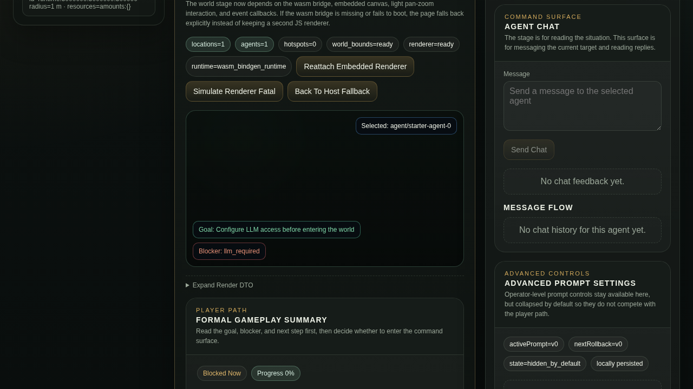

# Formal Release Fixed Genesis Viewer Evidence

- Date: 2026-05-16
- Viewer URL: `http://127.0.0.1:4175/software_safe.html?ws=ws://127.0.0.1:5011&test_api=1&locale=en`
- Runtime mode: `oasis7_viewer_live --no-llm`
- World ID: `live-formal-release-default`
- Snapshot summary:
  - `connectionStatus=connected`
  - `selectedId=starter-agent-0`
  - `entityCounts.agents=1`
  - `entityCounts.locations=1`
- Screenshot: `doc/world-runtime/evidence/assets/formal-release-fixed-genesis-default-viewer-2026-05-16.png`

