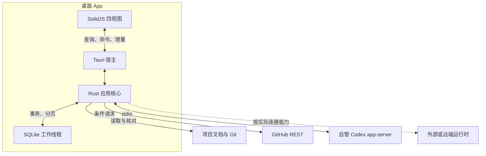

# 指挥客户端架构

日期：2026-10-10。项目基线：`eng-cc/oasis7@7039bc376882ab8f84f88ca014f6d7ce642539a8`。

本分册把本次调研转为后续实现的技术基线：**Tauri 2 桌面宿主、独立 Rust 核心、SolidJS/TypeScript 界面、本地 SQLite**。这是待实施的架构，不是已有客户端、性能实测或协议兼容性验收报告。选型理由见 [技术选型决策](technology-decision.md)，产品形态见 [客户端形态](desktop-client.md)。

本文约定客户端内部的组件与产品行为。项目通用开发流程仍由仓库现行 `doc/engineering/workflow/source-of-truth.md` 拥有；这里的本地数据结构、操作状态和验证情形不成为上游任务的准入字段或新交付门禁。

## 目录

- [一、架构决定](#一架构决定)
- [二、组件与运行结构](#二组件与运行结构)
- [三、代码落点与依赖](#三代码落点与依赖)
- [四、数据模型与事实来源](#四数据模型与事实来源)
- [五、文档、Git 与 GitHub 采集](#五文档git-与-github-采集)
- [六、界面与 IPC](#六界面与-ipc)
- [七、Codex 接入与操作恢复](#七codex-接入与操作恢复)
- [八、窗口、退出与远端生命周期](#八窗口退出与远端生命周期)
- [九、凭据与内容边界](#九凭据与内容边界)
- [十、构建、验证与发布](#十构建验证与发布)
- [十一、实施顺序与重选条件](#十一实施顺序与重选条件)
- [十二、依据](#十二依据)

## 一、架构决定

| 事项 | 本次决定 | 直接影响 |
| --- | --- | --- |
| 语言边界 | Rust 拥有领域模型、采集、持久化、索引、会话与操作；TypeScript/TSX/CSS 拥有界面 | Rust 核心可脱离桌面框架测试，UI 变化不要求重写连接器 |
| 进程结构 | Rust 核心驻留 Tauri Core，生产 UI 随 App 打包 | 日常启动不需要终端、Node 服务或 HTTP 端口 |
| 本地状态 | SQLite + rusqlite bundled + 专用数据库线程 | 离线可读；可重建缓存和个人记录分别处理 |
| Codex | 通过版本受控的 app-server 适配器，先支持 stdio 与非实验 API | 官方协议变化局限于连接器，不复制 Agent 执行循环 |
| 后台执行 | 关闭窗口后 App 留在菜单栏；完整退出明确处理自管活跃任务 | 首版不承诺 stdio 任务跨 App 崩溃、完整退出或系统重启继续 |
| 云端 | 保留环境与传输边界，需要时接用户既有远端环境 | 首版本地使用无需自建中心服务 |

Tauri 的 Core 与系统 WebView 分工是此结构的基础；macOS 使用 WKWebView。[S1] “App 管理本地后端”在本方案中指 App 内 Rust 服务及它明确持有的子进程，不要求另一个看板 daemon。

## 二、组件与运行结构

图中的数据源保持各自事实所有权。虚线表示可选接入，不代表已经能接管所有 Codex App、CLI 或云端任务。

| 组件 | 负责的内容 | 关键边界 |
| --- | --- | --- |
| `desktop` | 窗口、菜单栏、文件选择、通知、IPC 转接、退出协调 | 不在窗口回调里解释规范或直接拼 GitHub 请求 |
| `application` | 打开项目、查询四视图、刷新来源、搜索、准备与执行明确操作 | 使用当前授权和真实能力；刷新不启动模型任务 |
| `domain` | 来源身份、规范适用范围、目标与工作关联、事实投影 | 不依赖 Tauri 类型、SQL 行或 Solid store |
| `adapters` | Markdown/Git/GitHub/Codex 的解码、查询及有限操作 | 保留原始身份、版本、错误和覆盖范围 |
| `store` | 快照、索引、偏好、关联、草稿、操作回执 | 索引重建不删除个人记录与未决操作 |
| `runtime` | 连接能力、子进程句柄、请求分发、重连与退出 | 只管理本 App 明确拥有的进程；外部 runtime 保留外部所有权 |

先采用一个核心 crate 内的模块边界。只有独立复用或发布需要出现时再拆更多 crate，不预建通用 GUI 抽象、插件平台或微服务体系。

## 三、代码落点与依赖

建议后续实现落在 **`tools/oasis7-command-center/`**。以下路径是规划，当前文档提交不创建应用骨架：

| 路径 | 用途 |
| --- | --- |
| `tools/oasis7-command-center/Cargo.toml`、`Cargo.lock` | 桌面工具自己的小型 Cargo workspace，成员为 `core` 和 `src-tauri` |
| `tools/oasis7-command-center/core/src/` | `domain`、`application`、`adapters`、`store`、`runtime` 模块 |
| `tools/oasis7-command-center/src-tauri/` | 薄桌面宿主、Tauri 配置、生产 capabilities、打包资源 |
| `tools/oasis7-command-center/ui/` | 独立 npm 包，Solid/TSX、样式、生成的 DTO、界面测试与 lockfile |
| `tools/oasis7-command-center/tests/fixtures/` | 文档、GitHub 响应、Codex 协议和故障回放样本 |

采用独立 workspace 是为了使桌面系统依赖和默认构建范围与游戏工程分开；代价是多维护一个小型锁文件。实现时在根 workspace 中明确排除该应用路径，继承仓库当前 **Rust 1.96.0** 工具链，核对新依赖的 MSRV；不为它升级整个项目。Cargo workspace 的成员、锁文件与构建选择规则见 [S2]。

沿用仓库已有 Cargo/sccache 缓存策略，不为每次任务分配新缓存目录或改写 `CARGO_TARGET_DIR`。核心 crate 不依赖 `oasis7` 模拟器、游戏 Agent 协议或 Viewer；Tauri 与平台凭据实现放在对应边界，UI 组件不导入游戏运行状态。

当前 Viewer 声明 Solid `^1.9.15`、Vite `^8.3.3`、Vitest `^5.0.3`；可复用工具经验，但不是把 Viewer 作为客户端启动前提。这些是现有 manifest 的版本范围，不是新应用已验证的锁定版本。[P1][P2]

核心依赖采用 Tokio/tokio-util、serde/serde_json、thiserror、reqwest + rustls、rusqlite bundled、pulldown-cmark、notify、tracing。数据库连接由单独线程独占，用有界请求队列和 oneshot 回传结果；索引按小批事务写入，让交互查询能在批次间执行。HTTP 与子进程 I/O 使用共享运行时；长解析和同步系统调用进入受限阻塞工作池。[S3][S4]

前端采用 SolidJS + TypeScript strict + Vite；表格/长列表采用 TanStack 的 Solid Table/Virtual，交互基础组件采用 Kobalte。领域 DTO 用稳定 `ts-rs` 从 Rust 类型生成；它不生成完整命令客户端，也不提供运行时校验，另外保留小型 `bridge.ts` 和真实 JSON 契约测试。[S5]

## 四、数据模型与事实来源

### 身份与证据

下表字段属于客户端设计，不要求现有文档、PR 或会话补填新字段：

| 对象 | 身份与主要信息 |
| --- | --- |
| `Project` / `Checkout` | 项目登记 ID；可获得的远端 repository ID；环境、真实 Git 公共目录与工作树映射。分支是属性，不能当主键 |
| `Source` | 来源类别、主机/账号/环境、连接配置、读取范围与能力；换账号或环境后重新识别 |
| `DocumentSection` | 路径、已有条款 ID 或标题定位、源 revision/内容 hash、工作树 dirty 标记；行号只作导航辅助 |
| `Goal` / `Rule` | 来自当前条款的定义、范围与验收依据；不凭文档状态推导实现完成 |
| `WorkItem` / `EvidenceLink` | PR URL/稳定身份为有效工作对象；可选 Issue；目标关联注明源事实、用户确认或建议关联 |
| `SessionKey` / `Connection` | 持久会话按来源存储/配置命名空间、环境和 thread/session ID 识别；同一会话可有多个运行绑定，运行状态按 runtime instance、thread、turn 分别保存 |
| `OperationReceipt` | 本地 operation ID、目标、请求指纹、关联上游 ID、回执与不确定结果；只用于防重复和解释操作 |

关键展示对象带来源引用、可得的源版本、观测时间、事实性质和覆盖范围。ID/OID 使用字符串；超过 JavaScript 安全整数的值必须显式采用字符串等 JSON 表示，不能把生成的 TypeScript `bigint` 当作 JSON 自动转换。

同一持久 thread 可能被多个 server 加载，一个实例的 idle 不能覆盖另一个实例的 active。副作用操作和运行时请求回复绑定原运行实例及其上游对象；重连后先核实绑定，不能仅凭持久 thread ID 把控制自动迁移到新实例。

### 三类本地数据

| 数据组 | 内容 | 丢失或重建策略 |
| --- | --- | --- |
| 可重建快照 | 文档章节、FTS 索引、PR/CI 投影、已读取会话摘要 | 可从来源重建；保留最近成功时间和读取范围 |
| 个人持久数据 | 布局、筛选、明确记录的阅读位置、手工关联、决定草稿 | 独立保留；迁移与备份不能按缓存处理 |
| 操作记录 | 已发起动作、上游回执、结果未知、待恢复关联 | 完整退出/重启后保留，协调完成后按保留策略清理 |

一个 SQLite 文件内分表即可。数据库结构用递增 schema version 和事务迁移；迁移失败保留原数据并报告受影响功能。初始采用单写者、短事务、明确 busy timeout；WAL 按实际读取并发开启，不把它当作多写者保证。缓存清理按表组执行，不能删除整个数据库来修复一个索引。

正式决定仍记录到对应主责文档。UI 中保存的决定草稿必须显示草稿身份；用户已经作出的新决定可显示为当前意图，并注明规范或实现待同步。首版可通过来源编辑入口或明确的 Codex 任务完成回写，不需要再造通用文档审批系统。

### 刷新一致性

每个来源维护 `last_attempt`、`last_success`、`source_revision`、`generation`、`coverage` 和错误。一个区域的成功空结果、未接入、权限不足、过期缓存和分页未完有不同状态。

刷新分为“读取候选快照 → 校验范围/版本 → 事务应用 → 发布本地 view revision”。旧 generation 的迟到响应不能覆盖新快照。GitHub 分页无法保证跨页原子快照时保留采集时间范围；完整读取列表也不能宣称所有字段属于同一瞬间。

PR 的源 HEAD、测试实际 SHA、merge 事实与目标验收分别关联。旧 SHA 的绿灯不覆盖新提交的状态；main 前进也不自动否定同一源 HEAD 已有的适用 CI。流程解释始终回到当前仓库主责规范。[P3]

## 五、文档、Git 与 GitHub 采集

### 文档与中文搜索

文档入口遵循 [项目地图](project-map.md)。按当前条款、显式链接和替代关系索引，不用 mtime 排规范优先级。选中的工作树内容与已提交基线分别标识；切分支后使旧投影失效，未提交内容不能显示为 main 已生效规则。

`pulldown-cmark` 解析标题、段落、表格、代码和链接，生成可定位的结构化章节。解析器只负责语法；哪些条款有效、哪些内容是愿景仍由项目解释层及来源负责。[S6]

中文正文采用 **FTS5 trigram 子串索引**；标题、路径和已有条款 ID 优先。少于三个 Unicode 字符的查询，例如“规范”“合入”，回退到选定项目/文档范围的参数化子串查询，限制结果数、支持取消与输入去抖。默认 unicode61 不能被当成完整中文分词方案，trigram 的短查询限制有官方明确说明。[S7]

文件事件由 `notify` 收集并合并，只作失效提示。初次加载、恢复唤醒、重新聚焦或检测到事件缺失时核对已登记来源；仅扫描必要文档及 Git 元数据，不递归索引 `target`、`node_modules` 或 Git objects。网络文件系统等无法可靠监听时使用受限轮询。[S8]

### Git

采用系统 Git CLI 的机器可读输出，例如 `status --porcelain=v2 -z --branch`、`worktree list --porcelain -z`。Rust 用参数数组、明确 cwd、超时与输出上限调用；正确处理空格、换行路径和 detached HEAD。[S9]

读取不暗含 fetch、切分支、reset、提交或清理 worktree。分支变化以实际 Git 数据核对，远端分支引用只代表本地最近所知状态。需要修改仓库的操作单独绑定用户目标与真实对象。

### GitHub

由 Rust 的共享 `reqwest::Client` 访问 REST；按主机/账号排队，采用条件请求、分页、限额与退避，前台按需要刷新、后台降低频率。首版没有公网 webhook 接收服务，因此选择克制的轮询；这是一项桌面部署取舍，不是忽略 GitHub 推荐的 webhook 路线。[S10]

保留 API 返回的链接与分页指示；403、404、超时、限额和空列表不混同。只刷新当前可见或关联的 PR 与检查，Issue/Project 可选。离线时文档和最近可用事实仍可读取。

## 六、界面与 IPC

### 四视图交互

| 视图 | 首个有效交互 |
| --- | --- |
| 方向与进度 | 从当前里程碑打开验收条款、关联 PR 和未核实部分；长期方向保留独立层级 |
| 规范与决策 | 搜索中文规则，查看作用范围、理由、来源与后继；查看自上次明确记录的阅读版本后的变化 |
| 开发执行 | 同时看到工作目的、分支/worktree、PR/CI 和会话活动；通过真实会话目标继续或中断 |
| 待我处理 | 处理具体问题与真实运行时输入请求；保留选项影响和来源，不把普通实现变成审批队列 |

界面用紧凑列表、详情抽屉与清晰来源跳转；Solid 状态只保留当前选择、筛选、展开、输入草稿和显示缓存。进度的分母不明时显示已核实部分，不生成装饰性总百分比。完整规则见 [视图约定](view-model.md)。

### 应用接口

下列是本应用计划中的命令，不是声称 Codex 提供这些方法：

| 接口族 | 示例 | 行为 |
| --- | --- | --- |
| 项目与查询 | `open_project`、`query_view`、`search_rules`、`read_source` | 返回有范围、revision 和分页信息的 DTO |
| 刷新与订阅 | `refresh_source`、`subscribe_view`、`ack_batch`、`unsubscribe` | 读取或订阅；取消订阅只影响观察 |
| 会话操作 | `start_work`、`send_input`、`interrupt_turn`、`answer_runtime_request` | 核对环境/会话/能力和目标，返回 operation ID，再以回执及来源事实更新 |
| 个人状态 | `save_preference`、`save_decision_draft`、`confirm_link` | 保存明确的个人动作，不改写源端交付状态 |
| 导航 | `open_source_target` | 后端验证项目范围与链接协议后打开来源 |

查询使用 Tauri command；有序增量使用 Channel；Event 只用于少量失效/状态提示。Tauri 官方不建议用 Event 承载高吞吐日志，Channel 也不替应用解决消费背压。[S11]

Rust 先发布含 revision 的快照，再发送带 subscription ID 和本地序号的增量。使用有界队列、按字节/条数批处理和有限在途批次，UI 确认后继续投递。切换项目或取消订阅时停止对应流，不能向所有窗口广播敏感会话内容。

stdout 读取与 UI 投递分开：UI 慢时仍持续处理运行协议。可替代的进度合并；日志在有限内存窗口内保留，截断产生明确 gap。控制请求、运行终态与待输入请求持久登记，不能静默丢弃；若无法可靠处理则降级连接并核对状态。仅当来源支持历史读取时补取缺失内容，不假定上游有完整事件重放。

协议 reader 只负责有界解析与分流，不等待 UI 确认或数据库队列腾空。响应及控制消息走独立的有限通路，由协调任务持久登记；容量或存储故障时停止接收新的副作用操作，明确标记连接降级和未决结果，不能无限等待或静默丢弃。降级处理不等于停止外部任务。

错误 DTO 包含可解释的类别、来源、是否可重试及必要诊断引用；不透传 token、完整命令环境或私有原始响应。重试策略由操作性质决定，不能只看一个 `retryable` 字段就重复模型输入。

## 七、Codex 接入与操作恢复

协议原则沿用 [Codex 接入边界](codex-integration.md)。当前官方文档列有 stdio、TCP WebSocket 与 Unix socket；TCP WebSocket 明确有实验性限制，远端 Code Mode host 一节还说明相关命令/传输的生产支持边界。首版使用实际支持版本的 stdio 与非实验 API，连接器可关闭或降级，不承诺整个协议长期不变。[S12]

### 连接与能力

Rust supervisor 持有自管 child、stdin writer、stdout reader、限量 stderr 诊断和 request map。按该版本 schema 实现双向请求/响应/通知；连接先初始化，记录实际版本及能力。schema 在开发时由支持版本生成并用作契约输入，刷新页面不运行模型。

Codex 身份沿用所选环境与配置的已有登录态，缺失时使用该版本支持的官方认证流程。界面显示连接身份与登录状态；认证失败只影响依赖该身份的能力，客户端不另存一套 ChatGPT 账号密码。

一个连接分别记录可读取、可订阅、可控制及其范围。读取历史不等于实时订阅；一个新 server 的内存状态不能证明另一个 App/CLI 当前状态。已有外部连接可用时按其能力复用，不通过自动 resume/fork、改配置或解析私有数据库取得控制。

从目标创建工作时，把用户选定的目标、来源版本、工作范围和执行环境绑定到明确动作；由 Codex 执行开发过程。看板不选择一组隐藏 Agent 自动分发所有未完成目标，也不把“推荐下一步”转成执行授权。

运行时提出输入或批准请求时，使用它的真实 request/thread/turn 身份呈现与回复。已授权工作按现有授权推进，不增加看板总审批；旧请求的回答不重放到新的请求。

### 结果不确定的操作

1. 发送前持久记录 operation ID、目标、请求指纹与 `pending`；UI 抑制相同动作的重复点击。
2. JSON-RPC request ID 只关联响应，不被当作上游幂等键。收到回执后记录对应 thread/turn 等身份。
3. 响应丢失或超时且无法判断执行结果时标为 `outcome_unknown`，不能自动重发开始任务、追加输入或其他副作用。
4. 恢复连接后读取可用事实并协调已有操作；仍无法确认时展示这个具体不确定结果，保留用户处理入口。
5. “中断请求已接受”与“任务实际停止”分开，最终状态根据事件或回读确认。

上述状态只描述客户端请求，不是新的开发任务状态机。连接断开只说明观察中断，不证明会话失败、空闲或目标完成。

上游事件若有稳定身份才据此去重；无身份的文字 delta 不按内容 hash 去重，以免删掉合法重复文本。本地增量序号只服务 UI，不假设能跨上游连接恢复。必要字段不兼容时局部报错，未知非关键字段容忍，其他视图继续工作。

## 八、窗口、退出与远端生命周期

| 事件 | 本 App 自管运行时 | 外部运行时 |
| --- | --- | --- |
| 关闭主窗口 | App 留在菜单栏，任务和必要连接继续；可降低只读轮询频率 | 只改变窗口/订阅，不发停止命令 |
| 完整退出，确认无活跃自管工作 | 停止接收新动作，保存状态，结束空闲自管服务并回收子进程 | 断开本客户端连接 |
| 完整退出，存在活跃或无法确认的自管工作 | 提供留在后台、等待结束后退出、明确停止后退出；默认不停止 | 保持外部任务所有权，不随 App 退出发送停止 |
| 用户明确停止某个目标 | 请求中断正确目标，核对实际结果 | 仅在该目标确实可控时执行 |
| App 崩溃、强退或系统重启 | 不保证继续；重开后核对持久事实与未决操作，不自动重跑 | 执行由外部宿主负责；恢复连接后核对 |

活跃工作包括正在生成、等待输入/批准和能够核实的后台命令。`turn/completed` 不能证明所有后台工作结束；接口未提供完整信息时说明未知范围。停止失败或结果未知时保持可恢复说明，不能显示“已安全结束”。

退出协调由 Rust runtime/application 负责，不由组件卸载或 WebView 路由切换触发。子进程必须显式关闭并 wait/reap；Tokio Child 的 drop 行为不是任务持久性设计。[S13] 仅为完整退出与停止动作提供相应选择，不对普通读取、实现或刷新重复请求授权。

远端扩展保留 `EnvironmentId` 和传输接口，优先复用用户既有 OpenSSH 配置及独立托管的运行时。TCP/Unix socket 转发只建立连接，不保证远端任务跨断线继续。[S14] 直接经 SSH 启动 stdio 进程也不自动获得持久性。

首版不实现公网 app-server 暴露、跨机器安装平台或自建云调度。出现“完整退出后继续执行”“多个界面共享同一运行时”“重启后无人值守恢复”等明确需求时，再把 supervisor 提取为独立 Rust 执行宿主；本机可先用 Unix domain socket，真正需要网络 API 时再评估 axum。

## 九、凭据与内容边界

GitHub 首先允许复用用户选定的已登录 `gh` 账号，后端通过官方 `gh auth token` 获取并短期使用，不读取它的私有配置或把 token 输出写入日志。`gh` 是可选接入方式；缺少它时本地看板照常工作，也可明确提供所需仓库权限的 token。[S15]

新保存的凭据使用 **macOS Keychain**：Rust 封装采用 `keyring-core` + `apple-native-keyring-store`，启用 `keychain` feature 并显式安装真实平台 provider。测试 mock/sample store 不能进入生产；数据库仅保存凭据引用。存储失败时可退为仅当前进程使用，不默默写明文。[S16]

生产 WebView 只加载 App 内静态资源。仓库 Markdown、PR 内容和日志均按展示数据处理：Markdown 转成有限的结构化块，禁用原始 HTML，代码与搜索高亮转义，默认不自动请求远程图片，外链经协议校验后交给系统浏览器。

配置严格 CSP，明确生产 capabilities 列表与窗口作用域，通过 `AppManifest::commands` 把应用命令纳入权限约束。Rust 内再次验证工作区、规范化路径、会话身份和能力，不开放通用 shell、任意 SQL、全磁盘读写或任意 URL 代理。[S17] 使用含已知安全修复的受支持 Tauri 2 稳定补丁，具体版本进入 lockfile。

从 Finder 启动时不假设继承交互 shell 的 PATH、代理和 SSH agent 环境。设置页显示实际 Git/Codex/gh 路径与版本，允许指定路径；不靠执行用户 shell 初始化脚本来自动修复。诊断用 tracing 记录来源、operation ID、错误类别和耗时，按容量轮转，默认不保存完整提示词与 transcript。

## 十、构建、验证与发布

生产前端是打包的静态资产，Node/npm 仅用于构建与测试。浏览器预览使用同一 DTO 的 fixture/replay provider；真实本地能力在 `tauri dev` 路径验证，不为浏览器预览另建常驻 HTTP 后端。

macOS 首版产物为 `.app`/`.dmg`。按实际目标硬件验证 arm64 和需要支持的 x86_64 构建，不把“macOS 优先”推定为用户只有某一种 CPU。对外分发使用 Developer ID 签名、公证和 stapling；本次文档不假设已有证书、签名账号或发布凭据。[S18]

最初可手动安装版本。自动更新采用 Tauri updater，静态 manifest 与 release 文件即可承载；更新包签名与 Apple 代码签名分别处理。安装重启使用同一退出协调流程，保留数据库迁移恢复路径，不在自管任务运行时强制替换进程。[S19]

### 分层验证

| 层级 | 对应风险与验证 |
| --- | --- |
| Rust 核心 | 条款替代关系、unknown/部分读取、同分支多会话、源 HEAD 与 CI 关系、缓存重建保留个人记录 |
| 连接器契约 | 临时 Git worktree、假 GitHub 响应、fake app-server；覆盖分页、限额、服务反向请求、断线和响应丢失，不消费模型额度 |
| 前端 | Vitest + Solid Testing Library；DTO round-trip、来源跳转、加载/错误/过期/未接入、键盘与待处理操作 |
| 真实桌面 | macOS 下 WebdriverIO + `@wdio/tauri-service` embedded provider；覆盖真实 Tauri IPC、窗口和来源读取 |
| 系统体验 | 真实中文组合输入与候选时 Enter、选词撤销、VoiceOver、长日志滚动、菜单栏、完整退出、签名包启动 |

当前 Tauri 官方文档已支持通过内嵌 WebDriver provider 在 macOS 运行桌面测试；直接用传统 `tauri-driver` 的路径仍受平台限制。[S20] 内嵌测试服务与后端调试插件仅进专用测试 feature/config，生产构建明确排除测试插件、测试 capability 和测试监听端口。普通浏览器 mock 不能代替真实 App 验证。

性能先测一个代表性切片：真实中文规范、带排序筛选的长列表、流式日志和来源跳转。记录机器/系统、数据量、冷启动、搜索延迟、滚动阻塞及整个 App 进程树资源；样本量和目标阈值由实施记录明确。当前研究没有测量包体、内存或帧率，不能声称 Tauri 已经胜过其他方案。

新增应用验证只覆盖其实际风险。CI 可按工具目录变更运行核心/UI 测试、在 macOS 做桌面构建；所需工作流变更按项目现行规则评审，不把启动完整游戏栈变成客户端验证前提。

## 十一、实施顺序与重选条件

| 增量 | 交付结果 | 何时继续 |
| --- | --- | --- |
| 桌面切片 | 可启动 App、打开项目、显示真实规范与 Git 状态、中文搜索和来源跳转 | 核实文本/输入/列表及包启动适配；有具体平台问题先修复该切片 |
| 四视图闭环 | 接入 PR/CI、目标关联、规范理由/历史、待处理问题；离线和分页范围可解释 | 用户能看懂当前目标、依据和实际交付，不靠虚构指标 |
| Codex 闭环 | 托管会话、真实输入请求、继续/中断、结果未知恢复与退出协调 | 使用支持版本和故障回放验证关键操作，未接入范围如实显示 |
| 持续完善 | 需要的远端环境、更新分发与跨平台 | 由实际使用需求驱动，不预先搭中心平台 |

若 WebView 在代表性数据下经分页、虚拟化和事件合并仍不能达到记录的交互目标，或者用户明确要求 UI 全 Rust/禁止 WebView，再根据 [选型分册](technology-decision.md) 评估 GPUI + GPUI Kit。核心保持独立以控制迁移成本，不同时开发第二套界面。

需要全 Rust UI 但仍接受系统 WebView 时可重评 Dioxus Desktop；它不消除 WebKit 平台差异。只有持久执行需求出现时才提取 daemon；只有确有网络界面需求时才引入 HTTP 服务。

## 十二、依据

项目事实使用固定提交；外部技术资料检索于 2026-10-10。库的具体补丁版本、许可组合与运行行为在实施锁定依赖时核实。以下支持技术事实；模块划分、状态和产品行为是本次设计决定。

- [P1] [Rust 工具链](https://github.com/eng-cc/oasis7/blob/7039bc376882ab8f84f88ca014f6d7ce642539a8/rust-toolchain.toml)与 [Cargo workspace](https://github.com/eng-cc/oasis7/blob/7039bc376882ab8f84f88ca014f6d7ce642539a8/Cargo.toml)。
- [P2] [Viewer 前端声明](https://github.com/eng-cc/oasis7/blob/7039bc376882ab8f84f88ca014f6d7ce642539a8/crates/oasis7_viewer/package.json)。
- [P3] [开发流程主责规范](https://github.com/eng-cc/oasis7/blob/7039bc376882ab8f84f88ca014f6d7ce642539a8/doc/engineering/workflow/source-of-truth.md)。
- [S1] [Tauri 进程模型](https://v2.tauri.app/concept/process-model/)。
- [S2] [Cargo workspace](https://doc.rust-lang.org/cargo/reference/workspaces.html)。
- [S3] [Tokio 关闭协调](https://tokio.rs/tokio/topics/shutdown)。
- [S4] [rusqlite 构建与 bundled](https://github.com/rusqlite/rusqlite)；[SQLx SQLite 工作线程](https://docs.rs/sqlx/latest/sqlx/sqlite/struct.SqliteConnection.html)。
- [S5] [ts-rs](https://github.com/Aleph-Alpha/ts-rs)；[TanStack Table](https://tanstack.com/table/latest/docs/framework)、[Virtual](https://tanstack.com/virtual/latest/docs/framework)；[Kobalte](https://kobalte.dev/docs/core/overview/introduction)。
- [S6] [pulldown-cmark](https://docs.rs/pulldown-cmark/latest/pulldown_cmark/)。
- [S7] [SQLite FTS5 / trigram](https://sqlite.org/fts5.html#the_trigram_tokenizer)。
- [S8] [notify 已知行为与限制](https://docs.rs/notify/latest/notify/)。
- [S9] [Git status](https://git-scm.com/docs/git-status)；[Git worktree](https://git-scm.com/docs/git-worktree)。
- [S10] [GitHub REST 最佳实践](https://docs.github.com/en/rest/using-the-rest-api/best-practices-for-using-the-rest-api)。
- [S11] [Tauri commands / channels / events](https://v2.tauri.app/develop/calling-frontend/)。
- [S12] [Codex App Server](https://learn.chatgpt.com/docs/app-server)。
- [S13] [Tokio 子进程](https://docs.rs/tokio/latest/tokio/process/struct.Command.html)。
- [S14] [OpenSSH 转发](https://man.openbsd.org/ssh)。
- [S15] [gh auth token](https://cli.github.com/manual/gh_auth_token)。
- [S16] [keyring-core](https://docs.rs/keyring-core/latest/keyring_core/)；[Apple native keyring provider](https://docs.rs/apple-native-keyring-store/latest/apple_native_keyring_store/)。
- [S17] [Tauri capabilities / AppManifest](https://v2.tauri.app/security/capabilities/)；[CSP](https://v2.tauri.app/security/csp/)；[2.11.1 安全修复](https://v2.tauri.app/release/tauri/v2.11.1/)。
- [S18] [Tauri macOS 签名与公证](https://v2.tauri.app/distribute/sign/macos/)。
- [S19] [Tauri updater](https://v2.tauri.app/plugin/updater/)。
- [S20] [Tauri WebDriver](https://v2.tauri.app/develop/tests/webdriver/)；[WDIO 测试插件配置](https://webdriver.io/docs/desktop-testing/tauri/plugin-setup)。
